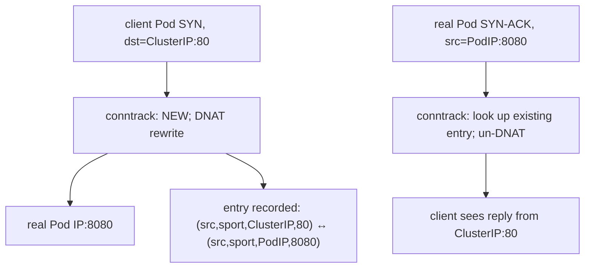

_Figure B. A Kubernetes request still traverses ordinary Linux networking mechanisms._

Debugging should follow the packet. Name resolution produces an address; routing selects an egress interface and next hop; ARP or neighbor discovery resolves a local next hop; TCP establishes state; TLS authenticates and negotiates encryption; an HTTP request then reaches the application. NAT, conntrack, overlay encapsulation, service meshes and policy can add more state, but they do not replace those fundamentals.

**Host commands: trace the network path**

```bash
# Name resolution and route decision
dig +trace example.internal
getent ahostsv4 example.internal
ip route get 10.20.30.40
ip neigh show

# Socket and TCP state
ss -lntp
ss -s
ss -tan state syn-sent

# Packet evidence
sudo tcpdump -ni any host 10.20.30.40 and port 443

# Conntrack / firewall state (tooling varies by distro)
sudo conntrack -S
sudo nft list ruleset
```

➕ **Name resolution and route decision, annotated:**
```text
$ dig +trace example.internal
.                    518400 IN NS a.root-servers.net.
internal.            172800 IN NS ns1.internal.
example.internal.        300 IN A  10.20.30.40
```
`+trace` walks the *full* delegation chain, one hop at a time, starting from the root — unlike a plain `dig`, which only shows the final answer from whichever resolver you're configured to use. Use `+trace` specifically when you need to know *which* server in the chain is returning a wrong or stale answer, not just what the final answer is.
```text
$ getent ahostsv4 example.internal
10.20.30.40  STREAM example.internal
```
`getent` resolves through the same NSS path (`/etc/nsswitch.conf`, `/etc/hosts`, then DNS) that the application's own libc would use — this is the "does the app see what I see" check. `dig` talks to DNS directly and bypasses NSS entirely, so `dig` and `getent` can legitimately disagree if `/etc/hosts` or NSS config differs from what a raw DNS query alone would show.
```text
$ ip route get 10.20.30.40
10.20.30.40 via 10.20.0.1 dev eth0 src 10.20.30.5 uid 0
```
This doesn't just print a routing-table entry — it shows which route actually *wins* for this specific destination, including the source IP the kernel would use for it. Chapter 4 already names this as the fastest way to prove a packet would even leave via the interface you expect, before reaching for `tcpdump`.
```text
$ ip neigh show
10.20.0.1   dev eth0 lladdr aa:bb:cc:dd:ee:01 REACHABLE
10.20.30.6  dev eth0 lladdr aa:bb:cc:dd:ee:02 STALE
```
This is the ARP/neighbor cache. `REACHABLE` means the kernel recently confirmed that MAC address; `STALE` means it hasn't re-verified recently but isn't necessarily wrong. A same-subnet destination with **no entry at all** has simply never been ARP-resolved — from the application's point of view that fails identically to a routing misconfiguration, so it's worth ruling out before assuming the route table is the problem.

➕ **Socket and TCP state, annotated:**
```text
$ ss -lntp
State  Recv-Q Send-Q Local Address:Port  Peer Address:Port  Process
LISTEN 0      128    0.0.0.0:8080       0.0.0.0:*           users:(("python3",pid=8842,fd=5))
```
`-l` = listening sockets only, `-n` = numeric (skips slow reverse-DNS lookups), `-t` = TCP, `-p` = show the owning process. This is the fastest way to confirm something is actually listening on the port you expect, and that it's the process you think it is, before blaming the network at all.
```text
$ ss -s
Total: 812 (kernel 0)
TCP:   634 (estab 210, closed 380, orphaned 0, timewait 372)
```
`-s` is summary mode — one line that tells you whether you have a `TIME_WAIT` pileup (372 timewait against 210 established here is a lot) before you go grepping through individual connections.
```text
$ ss -tan state syn-sent
State     Recv-Q Send-Q  Local Address:Port   Peer Address:Port
SYN-SENT  0      1        10.20.30.5:51322     10.20.99.9:443
```
Filtering to `SYN-SENT` finds connections stuck mid-handshake. A healthy connection never sits in `SYN-SENT` for more than milliseconds — a pile of them means the destination isn't responding to the SYN at all. That specifically points at a silent firewall drop, not a TCP-level rejection (a rejection would show up as the connection failing fast with `RST`, never lingering in `SYN-SENT`).

➕ **Packet evidence and conntrack/firewall state, annotated:**
```text
$ sudo tcpdump -ni any host 10.20.30.40 and port 443
14:02:11.884213 IP 10.20.30.5.51322 > 10.20.30.40.443: Flags [S], seq 123456789, win 64240
```
`-n` skips hostname resolution (faster, and avoids depending on DNS while you're debugging a DNS-adjacent problem). `-i any` captures on every interface at once. Seeing the outbound SYN here but never a reply SYN-ACK confirms the packet actually left the host — the problem is downstream (network path, a firewall, or the destination itself), not local socket or routing configuration.
```text
$ sudo conntrack -S
cpu=0  found=182332 invalid=421 insert=0 insert_failed=0 drop=1204 early_drop=0 error=0
```
A climbing `drop` counter here is the conntrack-table-exhaustion signature this Deep Dive's addendum names below — it's only visible in this command, not in `ss`, not in the application's own logs, and it produces the exact same client-side symptom ("new connections failing under load") as a completely different problem (`TIME_WAIT` pileup) — see the comparison table below.
```text
$ sudo nft list ruleset
table inet filter {
    chain input {
        type filter hook input priority 0;
        tcp dport 443 accept
    }
}
```
This dumps the live firewall ruleset exactly as the kernel is enforcing it right now — use it to confirm a `drop`/`reject` rule actually exists and matches, instead of trusting memory or documentation about what the policy is supposed to be.

For RDMA or GPU fabrics, these fundamentals remain useful because management traffic, discovery, DNS, control planes and many data services still use normal IP/TCP. RoCE adds lossless/congestion requirements and bypasses the TCP transport path for RDMA verbs, but you still need to understand interfaces, routing, MTU, VLANs and NIC topology.

## ➕ Senior addendum

*(extends Chapter 4, which now covers the longest-prefix-match, TCP-state and curl-phase mechanisms in depth. This Deep Dive's genuinely new material beyond that chapter is conntrack, named above but worth fixing in memory with a table.)*

➕ **conntrack — the piece this Deep Dive names but a table helps fix in memory (NAT's hidden state table):**
```bash
conntrack -L | wc -l              # current tracked connections
cat /proc/sys/net/netfilter/nf_conntrack_max   # the ceiling
```
Every NAT'd connection (which, per Chapter 4, is *every* Service-routed connection in the default kube-proxy iptables mode) gets an entry here. **Table exhaustion is a real, distinct failure mode** from TIME_WAIT pileup (Ch4.2) — symptom looks similar (new connections failing under load) but the fix is different (raise `nf_conntrack_max` / reduce connection churn, not application-level pooling alone). Worth being able to name both failure modes and explain why they look alike but aren't.

➕ **Diagram: one packet, one conntrack entry, both directions of a Service call**

Every one of these entries persists in the conntrack table for the connection's lifetime (plus a timeout after close) — this is the hidden per-connection state Kubernetes iptables-mode NAT relies on, and it is a finite table (`nf_conntrack_max`), unlike the ClusterIP abstraction itself which looks stateless from the application's point of view.

➕ **Two failure modes that look identical from the client, but aren't** — both present as "new connections start failing under load":

| | TIME_WAIT pileup | conntrack table full |
|---|---|---|
| Where it happens | Client side | Node (NAT gateway / kube-proxy path) |
| What's exhausted | The client's ephemeral port range | `nf_conntrack_max` |
| Fix | Reuse connections / connection pooling | Raise `nf_conntrack_max`, or reduce connection churn cluster-wide |
| Evidence | `ss -tan \| grep TIME-WAIT` | `conntrack -S`'s `drop` counter climbing |

Same client-visible symptom, two completely different tables filling up in two different places — naming both, and the one-line evidence that tells them apart, is the actual senior-level answer here, not just "check the connection count."
