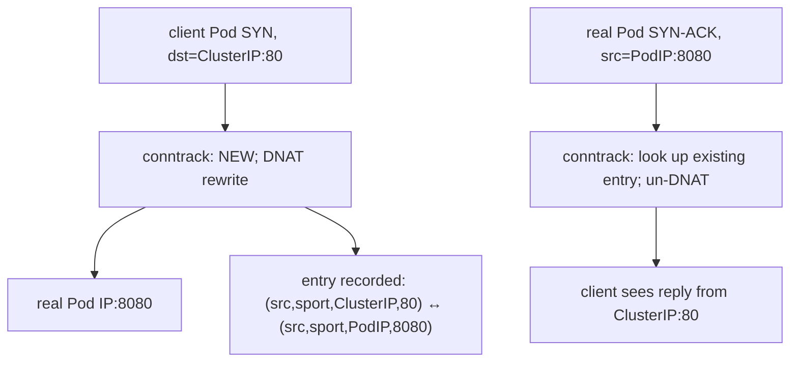

_Figure B. A Kubernetes request still traverses ordinary Linux networking mechanisms._

Debugging should follow the packet. Name resolution produces an address; routing selects an egress interface and next hop; ARP or neighbor discovery resolves a local next hop; TCP establishes state; TLS authenticates and negotiates encryption; an HTTP request then reaches the application. NAT, conntrack, overlay encapsulation, service meshes and policy can add more state, but they do not replace those fundamentals.

**Host commands: trace the network path**

\# Name resolution and route decision
dig +trace example.internal
getent ahostsv4 example.internal
ip route get 10.20.30.40
ip neigh show

# Socket and TCP state
ss -lntp
ss -s
ss -tan state syn-sent

# Packet evidence
sudo tcpdump -ni any host 10.20.30.40 and port 443

# Conntrack / firewall state (tooling varies by distro)
sudo conntrack -S
sudo nft list ruleset

For RDMA or GPU fabrics, these fundamentals remain useful because management traffic, discovery, DNS, control planes and many data services still use normal IP/TCP. RoCE adds lossless/congestion requirements and bypasses the TCP transport path for RDMA verbs, but you still need to understand interfaces, routing, MTU, VLANs and NIC topology.

## ➕ Senior addendum

*(extends Chapter 4, which now covers the longest-prefix-match, TCP-state and curl-phase mechanisms in depth. This Deep Dive's genuinely new material beyond that chapter is conntrack, named above but worth fixing in memory with a table.)*

➕ **conntrack — the piece this Deep Dive names but a table helps fix in memory (NAT's hidden state table):**
```bash
conntrack -L | wc -l              # current tracked connections
cat /proc/sys/net/netfilter/nf_conntrack_max   # the ceiling
```
Every NAT'd connection (which, per Chapter 4, is *every* Service-routed connection in the default kube-proxy iptables mode) gets an entry here. **Table exhaustion is a real, distinct failure mode** from TIME_WAIT pileup (Ch4.2) — symptom looks similar (new connections failing under load) but the fix is different (raise `nf_conntrack_max` / reduce connection churn, not application-level pooling alone). Worth being able to name both failure modes and explain why they look alike but aren't.

➕ **Diagram: one packet, one conntrack entry, both directions of a Service call**

Every one of these entries persists in the conntrack table for the connection's lifetime (plus a timeout after close) — this is the hidden per-connection state Kubernetes iptables-mode NAT relies on, and it is a finite table (`nf_conntrack_max`), unlike the ClusterIP abstraction itself which looks stateless from the application's point of view.

➕ **Diagram: two failure modes that look identical from the client, but aren't**
```text
'new connections start failing under load' — same symptom, two different tables
TIME_WAIT pileup conntrack table full
ephemeral port range exhausted nf_conntrack_max reached
on the CLIENT side on the NODE (NAT gateway/kube-proxy path)
fix: reuse connections / pooling fix: raise nf_conntrack_max, or
reduce connection churn cluster-wide
evidence: ss -tan | grep TIME-WAIT evidence: conntrack -S dropped counter climbing
```
