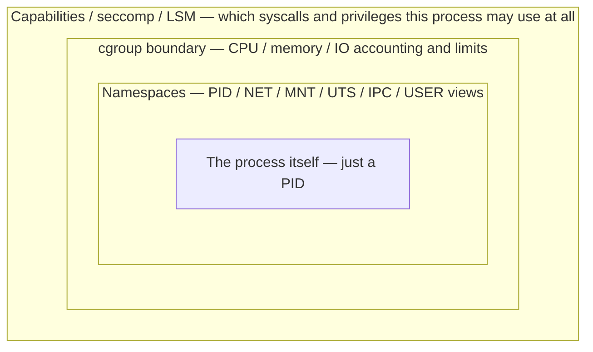
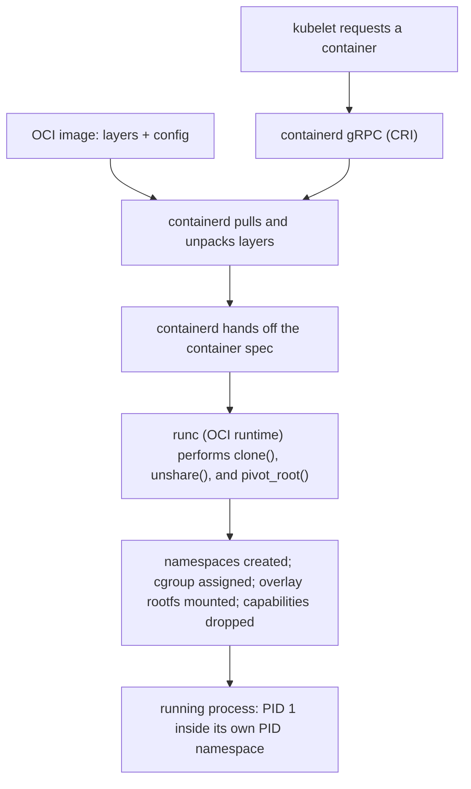

A container is a set of Linux processes constrained and isolated by kernel mechanisms. Namespaces provide views of resources; cgroups account and control resource consumption; capabilities and LSMs limit privilege; overlay filesystems build writable container roots from immutable image layers. containerd and an OCI runtime coordinate creation, but the kernel enforces the isolation.

**Host commands: inspect the kernel boundaries behind a container**

```bash
# See namespace identities for a process
lsns -p <PID>
readlink /proc/<PID>/ns/net
readlink /proc/<PID>/ns/mnt

# Enter a container's network namespace from the host
sudo nsenter -t <PID> -n ip addr
sudo nsenter -t <PID> -n ss -lntp

# Inspect cgroup placement and limits
cat /proc/<PID>/cgroup
cat /sys/fs/cgroup/<path>/memory.max
cat /sys/fs/cgroup/<path>/memory.events
```

➕ **`lsns` and `readlink .../ns/*`, annotated — proving namespace sharing, not assuming it:**
```text
$ lsns -p 8842
        NS TYPE   NPROCS   PID USER COMMAND
4026531840 mnt        42  8842 app  python3
4026532890 net          3  8842 app  python3
4026532891 pid          3  8842 app  python3
```
`NPROCS` is the count of processes *anywhere on the host* sharing that exact namespace. A `pid` namespace shared by only 3 processes (this container's own PID 1 and its children) confirms genuine PID isolation; a `mnt` namespace shared by 42 tells you mount visibility is broader — worth knowing which is which rather than assuming "it's a container, so everything is isolated."
```text
$ readlink /proc/8842/ns/net
net:[4026532890]
$ readlink /proc/9001/ns/net
net:[4026532890]
```
Two different PIDs resolving to the **identical namespace inode number** is the definitive proof they share that namespace — this is literally how you verify "these two containers are in the same Pod's network namespace" from the host, without guessing from Pod membership alone.

➕ **`nsenter`, annotated:**
```text
$ sudo nsenter -t 8842 -n ip addr show eth0
3: eth0: <BROADCAST,MULTICAST,UP,LOWER_UP> mtu 1500
    inet 10.244.1.7/24 scope global eth0
```
`-t &lt;PID&gt;` targets the namespaces of that specific process; `-n` selects *which* namespace to enter — network, in this case (`nsenter` can target mount, UTS, IPC, PID, or network namespaces independently, not all at once). This runs `ip addr` as if executing inside that container's network namespace, without actually `exec`-ing into the container itself — the same technique Chapter 5 uses to prove the pause container and its app containers share one live network namespace.

➕ **cgroup inspection, annotated — resolving the path before trusting any number in it:**
```text
$ cat /proc/8842/cgroup
0::/kubepods.slice/kubepods-burstable.slice/kubepods-burstable-podabc123.slice/cri-containerd-8842.scope
```
This one line is the actual path under `/sys/fs/cgroup` where every limit and stat for *this specific process* lives — the `memory.max`/`memory.events` reads below are meaningless without resolving this path first; guessing at a cgroup path is a common, avoidable mistake.
```text
$ cat /sys/fs/cgroup/kubepods.slice/.../cri-containerd-8842.scope/memory.max
2147483648
$ cat /sys/fs/cgroup/kubepods.slice/.../cri-containerd-8842.scope/memory.events
low 0
high 12
max 0
oom 0
oom_kill 0
```
`2147483648` bytes = a 2GiB hard limit. `high 12` with `max`/`oom`/`oom_kill` all still at `0` means this container has crossed its soft/throttle threshold 12 times but never actually breached the hard limit — Chapter 2's `memory.events` fields, now read from an actual container's cgroup, resolved via the path found above rather than assumed.

➕ **Diagram: a "container" is a process wrapped in independent kernel mechanisms, not one object**

Nesting is the point of this diagram, not decoration: each ring wraps the process independently, and each is independently inspectable *and* independently bypassable if misconfigured. A container with correctly isolated namespaces but an excess capability (`CAP_SYS_ADMIN`, for example) is not actually isolated in the way its "containerness" implies, no matter how clean its namespace boundary looks — which is exactly why `lsns`, `cat /proc/&lt;PID&gt;/cgroup`, and a capability check (`getpcaps &lt;PID&gt;` or the container spec's `securityContext`) are three separate checks, not one.

➕ **Diagram: image → running process, who does what**

`runc` is the only component in this chain that actually invokes the kernel primitives — containerd and kubelet are orchestration; the kernel enforcement happens at the `runc` → syscall boundary, which is the layer `nsenter`/`lsns` verify directly.

## ➕ Senior addendum

*(extends Chapter 5, which now covers the pause-container mechanism, user-namespace tradeoffs, requests-vs-limits enforcement split and the OverlayFS upperdir/lowerdir model in depth. This Deep Dive's genuinely new material beyond that chapter is the runtime-boundary framing below.)*

➕ For Deep Dive 5 specifically: the kernel mechanisms this Deep Dive lists (namespaces, cgroups, capabilities/LSMs, overlay filesystems) are exactly the "runtime chain" Chapter 5 traces from `kubelet → CRI → containerd/CRI-O → runc`, with the NVIDIA Container Toolkit's OCI prestart hook as the concrete place GPU device access is injected into that chain — worth citing this Deep Dive's `nsenter`/`lsns` commands as the verification step for that chain, not just the theory.
