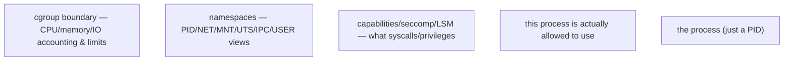
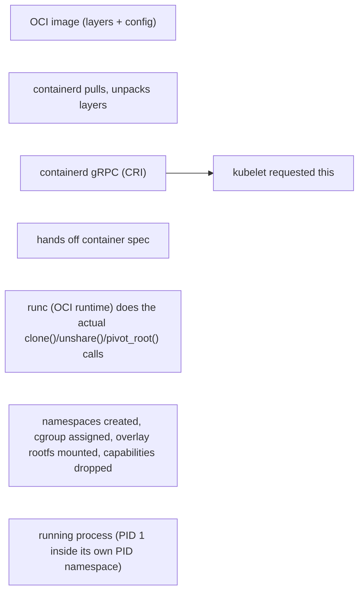

A container is a set of Linux processes constrained and isolated by kernel mechanisms. Namespaces provide views of resources; cgroups account and control resource consumption; capabilities and LSMs limit privilege; overlay filesystems build writable container roots from immutable image layers. containerd and an OCI runtime coordinate creation, but the kernel enforces the isolation.

**Host commands: inspect the kernel boundaries behind a container**

\# See namespace identities for a process
lsns -p &lt;PID>
readlink /proc/&lt;PID>/ns/net
readlink /proc/&lt;PID>/ns/mnt

# Enter a container's network namespace from the host
sudo nsenter -t &lt;PID> -n ip addr
sudo nsenter -t &lt;PID> -n ss -lntp

# Inspect cgroup placement and limits
cat /proc/&lt;PID>/cgroup
cat /sys/fs/cgroup/&lt;path>/memory.max
cat /sys/fs/cgroup/&lt;path>/memory.events

**Diagram: a "container" is a process wrapped in independent kernel mechanisms, not one object**

Each ring is independently inspectable and independently bypassable if misconfigured — a container with the right namespaces but excess capabilities (e.g. `CAP_SYS_ADMIN`) is not actually isolated in the way its "containerness" implies, which is why `lsns`/`cat /proc/<PID>/cgroup`/capability inspection are three separate checks, not one.

**Diagram: image → running process, who does what**

`runc` is the only component in this chain that actually invokes the kernel primitives — containerd and kubelet are orchestration; the kernel enforcement happens at the `runc` → syscall boundary, which is the layer `nsenter`/`lsns` verify directly.

## Senior addendum

For Deep Dive 5 specifically: the kernel mechanisms this chapter lists (namespaces, cgroups, capabilities/LSMs, overlay filesystems) are exactly the "runtime chain" Chapter 5 traces from `kubelet → CRI → containerd/CRI-O → runc`, with the NVIDIA Container Toolkit's OCI prestart hook as the concrete place GPU device access is injected into that chain — worth citing this chapter's `nsenter`/`lsns` commands as the verification step for that chain, not just the theory.
