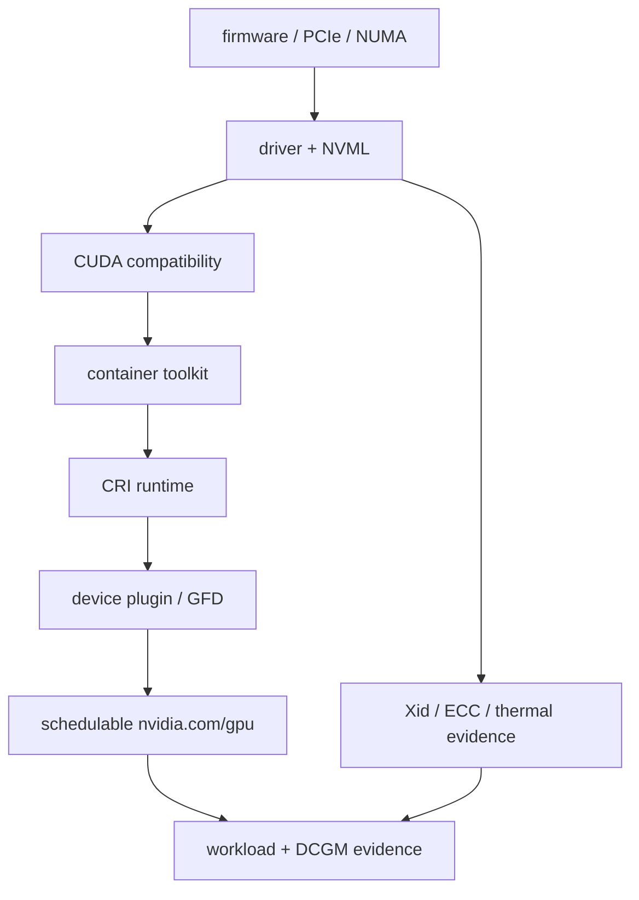

GPU nodes add a second dependency graph to the host: kernel version and modules, NVIDIA driver, device nodes, IOMMU/PCIe topology, container runtime integration, CUDA user-space compatibility, NIC/RDMA stack, firmware, time synchronization, storage mounts and Kubernetes operands. A node can be Ready in Kubernetes while being unusable for accelerated workloads.


&lt;!-- source-table:1 --&gt;

| Layer | Evidence | Common failure |
| --- | --- | --- |
| PCIe / device discovery | lspci -nn, nvidia-smi topo -m | device missing, link width/speed, bad topology |
| Driver | nvidia-smi, dmesg, lsmod | module mismatch, Xid, failed persistence/reset |
| Container runtime | nvidia-ctk, CDI specs, containerd config | GPU visible on host but not in container |
| RDMA | ibv_devinfo, rdma link, ethtool | wrong NIC/NUMA, MTU/QoS, driver mismatch |
| Kubernetes | node labels, device resources, operator pods | plugin/operator unhealthy, stale labels |

➕ **Every row in that table, run for real, annotated bottom-to-top exactly as the dependency chain below reads:**

```bash
# PCIe / device discovery
lspci -nn | grep -i nvidia
nvidia-smi topo -m

# Driver
nvidia-smi
dmesg -T | grep -i -E 'nvidia|xid'
lsmod | grep nvidia

# Container runtime
nvidia-ctk cdi list

# RDMA
ibv_devinfo
rdma link

# Kubernetes
kubectl get node <node> -o json | jq '.status.allocatable."nvidia.com/gpu"'
kubectl -n gpu-operator get pods -o wide
```

```text
$ lspci -nn | grep -i nvidia
17:00.0 3D controller [0302]: NVIDIA Corporation Device [10de:2330]
```
This proves PCIe enumeration only — the kernel sees a device at this bus address. It says nothing about the driver, and this is the layer to check first precisely because every layer above it is meaningless if this one fails (a missing PCIe entry means reseat/firmware/riser investigation, not a driver reinstall).
```text
$ nvidia-smi topo -m
        GPU0    GPU1    NIC0    CPU Affinity
GPU0     X      NV12    PHB     0-31
GPU1    NV12     X      SYS     32-63
```
`NV12` = NVLink (fastest). `PHB` = same PCIe host bridge (fine). `SYS` = crosses the NUMA/CPU-socket boundary (slowest, real cost) — this is Deep Dive 2's NUMA-locality point, applied to the NIC specifically: GPU1-to-NIC0 traffic here pays the cross-node tax on every transfer, invisible to `nvidia-smi`'s utilization numbers.
```text
$ nvidia-smi
NVIDIA-SMI 550.90.07   Driver Version: 550.90.07   CUDA Version: 12.4
```
Confirms the driver loaded and can enumerate the device. The "CUDA Version" field is the driver's *maximum supported* CUDA version, not what's actually installed in any given container — don't read it as a container compatibility guarantee.
```text
$ dmesg -T | grep -i -E 'nvidia|xid'
[Wed Jul 30 02:14:11 2026] NVRM: Xid (PCI:0000:17:00): 79, GPU has fallen off the bus
```
An Xid entry in the kernel log is the driver reporting a hardware/GPU-level fault by number — Xid 79 specifically means the GPU stopped responding on the bus entirely, a strong hardware-escalation signal, not something a pod restart fixes.
```text
$ lsmod | grep nvidia
nvidia_uvm             1234567  0
nvidia_drm                61440  2
nvidia_modeset           1204224  1 nvidia_drm
nvidia                 56623104  86 nvidia_uvm,nvidia_modeset
```
This confirms the driver's kernel modules are actually *loaded*, not merely installed as a package — a package can be present while the module fails to load (a common cause: Secure Boot rejecting an unsigned module), and that failure mode looks identical to "no driver installed" from `nvidia-smi` alone (`nvidia-smi` fails either way) unless you check `lsmod` directly.
```text
$ nvidia-ctk cdi list
INFO: Found 1 CDI devices
nvidia.com/gpu=0
```
This is the layer between "host driver works" and "a container can see the GPU": it confirms the NVIDIA Container Toolkit actually generated a CDI device spec the container runtime can inject. A host with a perfectly healthy driver but no CDI spec here produces exactly Volume 4's "host `nvidia-smi` works, container sees nothing" symptom.
```text
$ ibv_devinfo
hca_id: mlx5_0
    transport:          InfiniBand
    fw_ver:              28.36.1010
    state:               PORT_ACTIVE (4)
$ rdma link
link mlx5_0/1 state ACTIVE physical_state LINK_UP
```
`state PORT_ACTIVE` / `LINK_UP` confirms the RDMA NIC's physical link is up — this is the RDMA-specific equivalent of `lspci` for GPUs: it proves the link exists and is live, and nothing more. It doesn't confirm NUMA placement (cross-check against `nvidia-smi topo -m`'s NIC column above) or that RoCE congestion control is correctly configured, if this is Ethernet rather than native InfiniBand.
```text
$ kubectl get node gpu-node-07 -o json | jq '.status.allocatable."nvidia.com/gpu"'
"8"
$ kubectl -n gpu-operator get pods -o wide | grep gpu-node-07
nvidia-device-plugin-daemonset-x9k2p   1/1   Running   0   gpu-node-07
```
The final layer: the node advertising `8` GPUs allocatable, and the device-plugin pod itself `Running` and healthy on that node. This is the layer Kubernetes actually schedules against — everything above it can be perfectly healthy and a workload still won't land if this specific check fails.

## ➕ Senior addendum

*(this Deep Dive is new ground rather than an extension of Chapters 1-6 — it's the closest thing in the volume to a pre-flight checklist for the actual job, per the cross-reference table below.)*

➕ **Quick cross-reference note:** Deep Dive 6's driver/toolkit/operator readiness checklist above is what the earlier chapters and Deep Dives build toward — a node can pass every Chapter 1-5 mechanism check (CPU not throttled, memory not OOMing, filesystem healthy, network reachable, container runtime sane) and still be unusable for accelerated workloads if any single row in the table above (PCIe topology, driver/Xid state, CRI GPU visibility, RDMA NIC/NUMA match, or Kubernetes device-plugin health) fails. Treat this table as the layer to check *in addition to*, never instead of, the host-mechanism checks from Chapters 1-5.

➕ **Visual model — GPU node readiness is a dependency chain, not a checklist of interchangeable green ticks:**

**Memory hook:** *"Physical → driver → runtime → scheduler → workload."* A check lower in the chain cannot prove an upstream layer is healthy: a Pod can be Running while the GPU is absent, and a visible GPU can still be topologically wrong for its NIC.
