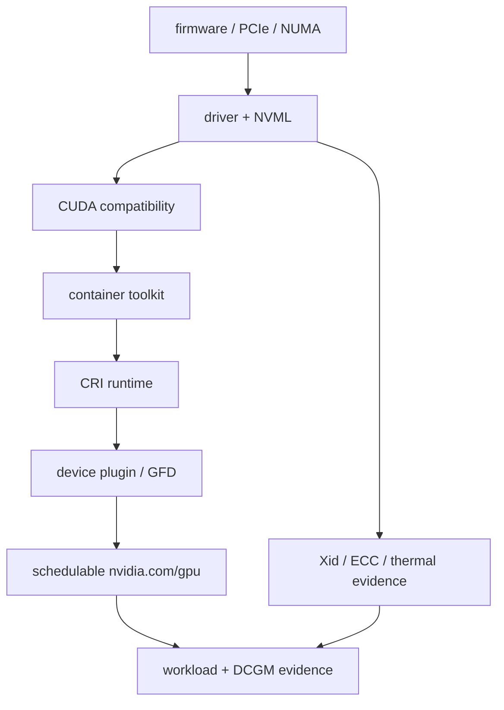

GPU nodes add a second dependency graph to the host: kernel version and modules, NVIDIA driver, device nodes, IOMMU/PCIe topology, container runtime integration, CUDA user-space compatibility, NIC/RDMA stack, firmware, time synchronization, storage mounts and Kubernetes operands. A node can be Ready in Kubernetes while being unusable for accelerated workloads.

<!-- source-table:1 -->

| Layer | Evidence | Common failure |
| --- | --- | --- |
| PCIe / device discovery | lspci -nn, nvidia-smi topo -m | device missing, link width/speed, bad topology |
| Driver | nvidia-smi, dmesg, lsmod | module mismatch, Xid, failed persistence/reset |
| Container runtime | nvidia-ctk, CDI specs, containerd config | GPU visible on host but not in container |
| RDMA | ibv_devinfo, rdma link, ethtool | wrong NIC/NUMA, MTU/QoS, driver mismatch |
| Kubernetes | node labels, device resources, operator pods | plugin/operator unhealthy, stale labels |

## ➕ Senior addendum

*(this Deep Dive is new ground rather than an extension of Chapters 1-6 — it's the closest thing in the volume to a pre-flight checklist for the actual job, per the cross-reference table below.)*

➕ **Quick cross-reference note:** Deep Dive 6's driver/toolkit/operator readiness checklist above is what the earlier chapters and Deep Dives build toward — a node can pass every Chapter 1-5 mechanism check (CPU not throttled, memory not OOMing, filesystem healthy, network reachable, container runtime sane) and still be unusable for accelerated workloads if any single row in the table above (PCIe topology, driver/Xid state, CRI GPU visibility, RDMA NIC/NUMA match, or Kubernetes device-plugin health) fails. Treat this table as the layer to check *in addition to*, never instead of, the host-mechanism checks from Chapters 1-5.

➕ **Visual model — GPU node readiness is a dependency chain, not a checklist of interchangeable green ticks:**

**Memory hook:** *"Physical → driver → runtime → scheduler → workload."* A check lower in the chain cannot prove an upstream layer is healthy: a Pod can be Running while the GPU is absent, and a visible GPU can still be topologically wrong for its NIC.
