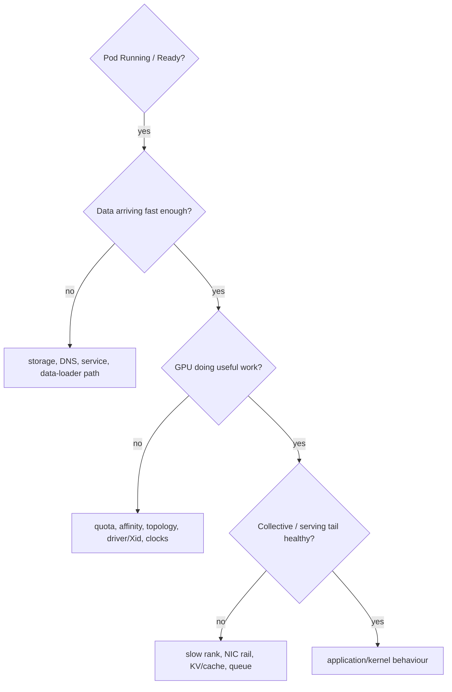

Scenario: a distributed training job runs 35% slower after a node pool refresh. Pods are Running, GPU utilization averages 70%, and no Kubernetes events show errors. A senior investigation does not restart the job first. Establish whether the slowdown is reproducible on specific nodes; compare GPU/NIC topology, CPU NUMA placement, driver versions, NVLink state, RDMA counters, storage throughput and CPU throttling. The goal is to isolate the changed layer before changing configuration.

**•** Scope: is every rank slow, only ranks on one node, or only communication-heavy phases?

**•** Baseline: compare known-good node firmware, driver, kernel, NIC and topology outputs.

**•** Host evidence: CPU throttling, memory PSI, NUMA misses, block latency, softirq saturation.

**•** GPU evidence: clocks, power, thermals, ECC/Xid, NVLink health, per-process utilization.

**•** Network evidence: link speed, RDMA errors/retries, congestion counters and NCCL topology.

**•** Validation: change one variable or move one rank; prove that performance follows the suspected layer.

## Targeted references and reinforcement

**Vishakha Sadhwani — Kubernetes networking traffic flow:** [https://www.linkedin.com/in/vsadhwani](https://www.linkedin.com/in/vsadhwani) — Practitioner framing: Kubernetes networking is Linux networking plus abstractions; trace the traffic path.

**Udemy — Complete Linux Troubleshooting Course:** [https://www.udemy.com/course/linux-troubleshooting-course](https://www.udemy.com/course/linux-troubleshooting-course) — Target lectures: Server is Not Reachable (~14m), Running Out of Memory (~32m), IP Assigned but not Reachable (~21m), System is Running Slow (~34m).

**NVIDIA GPU Operator docs:** [https://docs.nvidia.com/datacenter/cloud-native/gpu-operator/latest/index.html](https://docs.nvidia.com/datacenter/cloud-native/gpu-operator/latest/index.html) — Host prerequisites and the GPU software lifecycle managed on Kubernetes nodes.

## ➕ Senior addendum

*(this exercise is well-designed already — it's the correct capstone, forcing the "host mechanism, not Kubernetes object state" instinct the whole volume builds. One addition: a mnemonic for the whole arc, and a generalizable checklist you can carry into any similar interview question.)*

➕ **Mnemonic for the whole Deep-Dive-1-through-6 arc, tying back to the "senior troubleshooting moves from symptom to mechanism" figure (Figure A, end of Chapter 6):**
*"Every symptom lives at a layer — don't fix the symptom's layer, fix the mechanism's layer."* CPU-looks-idle-but-slow → check throttling (mechanism, not the symptom's CPU-graph layer). DNS-resolves-but-times-out → check routing/NAT/TLS (mechanism), not DNS (symptom's layer). This one sentence is a legitimate answer to "how do you approach troubleshooting" as an opener, before you even get into specific tools.

➕ **The generalizable checklist version, worth having as your own mental template for any "X looks healthy but Y is slow" question in the actual interview:**
```text
1. Confirm the K8s object state really is healthy (Running, no OOMKilled, no throttling in cpu.stat)
— this rules out the Volume-1-Ch1/2/5 mechanisms explicitly, don't skip it
2. Follow the data path the workload actually uses (Ch3's AI data-path chain: disk
page cache
pinned memory
PCIe
GPU HBM) and instrument each hop
3. Check the resource plane Kubernetes doesn't account for at all: GPU memory/utilization via
nvidia-smi/DCGM (Ch2's CUDA-OOM-vs-cgroup-OOM distinction), NUMA locality (Deep Dive 2)
4. Only after 1-3 are exonerated, suspect the workload's own code/framework behavior
```
This ordering — K8s object state → data path → GPU-specific plane → application code — is the generalized version of the specific exercise above, and it's the shape almost every "why is my GPU workload underperforming" interview question takes.

➕ **Visual triage router — "healthy Kubernetes" is only the first gate:**

**Memory hook:** *"Ready is admission evidence, not performance evidence."* Each arrow is a different owner and a different proof source.
