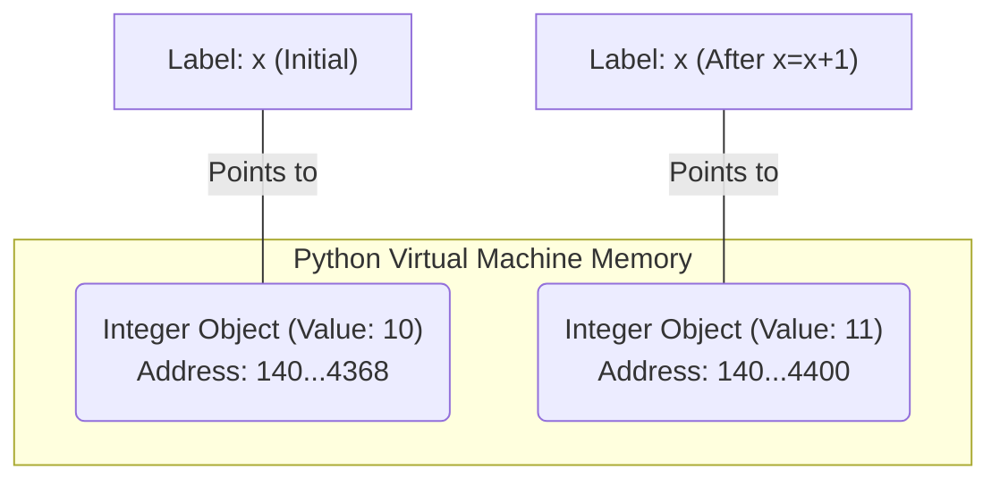
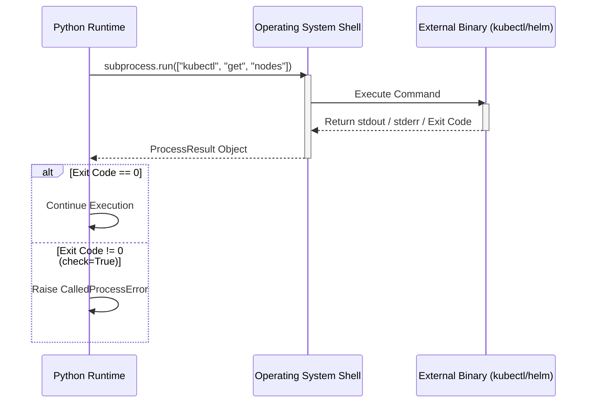
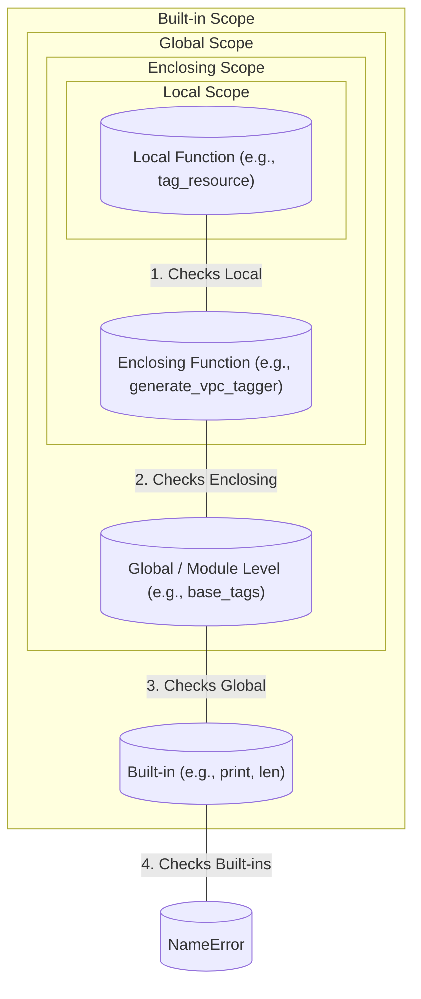
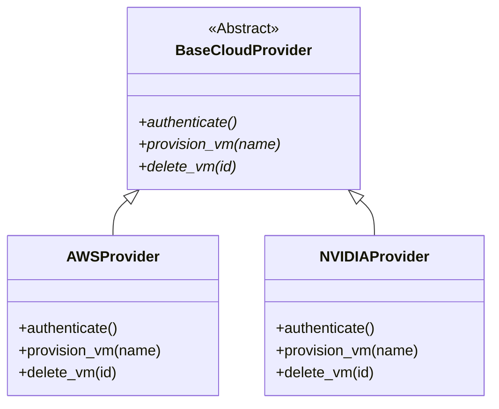
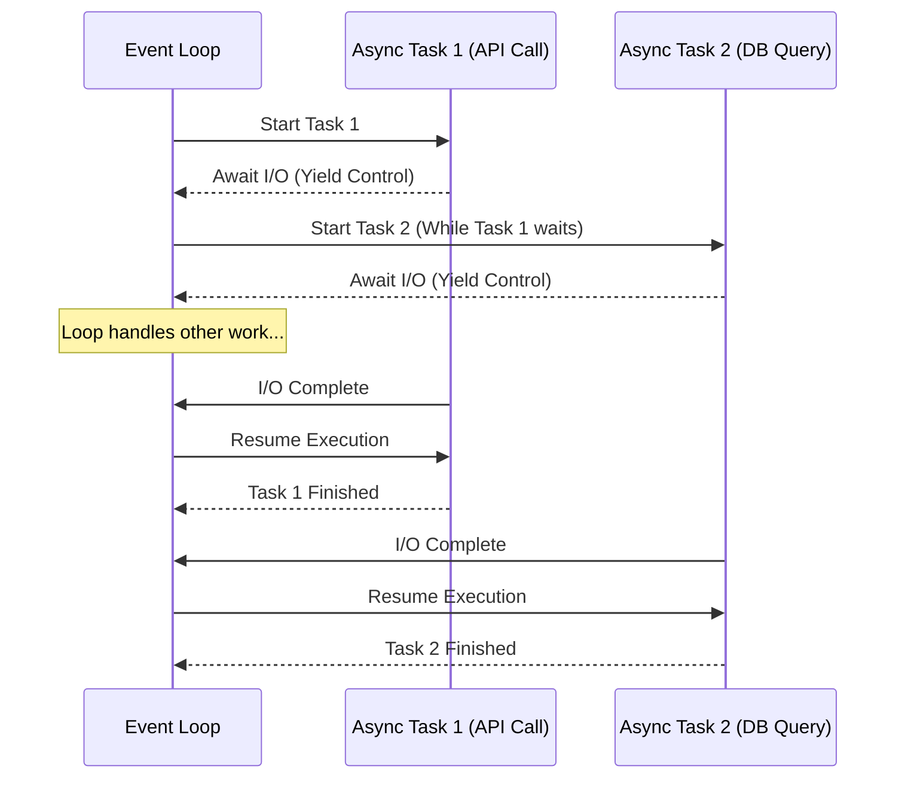

# Python Fundamentals for Infrastructure Masterclass

## The Problem Statement

Infrastructure is no longer managed through static configuration files, localized shell scripts, or manual GUI click-ops. Modern infrastructure is heavily dynamic, distributed, and strictly requires deterministic orchestration. As an infrastructure engineer, platform engineer, or SRE, your primary interaction with systems like Kubernetes, AWS, NVIDIA GPU clusters, and CI/CD pipelines will be through code.

Python has become the lingua franca of infrastructure for several reasons:
- **Extensive Standard Library:** Built-in modules for OS interaction, network programming, and file manipulation.
- **Ecosystem:** First-class SDKs for AWS (`boto3`), GCP, Azure, Kubernetes, and NVIDIA utilities.
- **Readability:** Clean syntax that prioritizes developer velocity and maintainability in large platform teams.

This masterclass is not a generic programming introduction. It is a strictly architecture-first deep dive into Python specifically tailored for the realities of production infrastructure. We will cover only what you need to build robust, concurrent, and scalable automation, bypassing web development and data science patterns in favor of system-level paradigms.

## Mandatory Prerequisites
- Basic understanding of POSIX systems.
- Familiarity with shell scripting (Bash).
- Understanding of basic infrastructure concepts (servers, network, storage).

**Estimated Reading Time:** 120 minutes.
**Difficulty:** Intermediate to Advanced.

---

## Phase 1: Core Fundamentals & The Mutability Trap

Before we can orchestrate clusters, we must understand how Python handles data and memory. Python is strongly, dynamically typed. Everything in Python is an object, including primitive types.

### 1.1 Variables, Data Types, and Memory

:::info Memory Management Paradigm
In C or Go, a variable represents a specific location in memory. In Python, variables are **labels** (or references) attached to objects in memory. This distinction is critical when dealing with stateful infrastructure configurations.
:::



```python
# An integer is immutable.
# When we 'change' x, we actually point the label 'x' to a new integer object.
x = 10
print(id(x))  # Example: 140733979404368

x = x + 1
print(id(x))  # Example: 140733979404400 (Memory address changed!)
```

#### The Default Mutable Argument Trap (Solutions Architect Scenario)

:::warning Critical Operational Risk
One of the most common causes of state bleeding in long-running Kubernetes operators or Lambda functions is the mutable default argument trap.
:::

**The Anti-Pattern:**
```python
# BAD PRACTICE: Do not use mutable defaults (lists, dicts, sets).
def add_node_to_cluster(node_ip, cluster_nodes=[]):
    """
    Attempts to add a node to a list of existing cluster nodes.
    """
    cluster_nodes.append(node_ip)
    return cluster_nodes

# Execution 1: Expected behavior
print(add_node_to_cluster("10.0.0.1")) 
# Output: ['10.0.0.1']

# Execution 2: State Bleeding!
# The default list object is created ONLY ONCE when the function is defined.
# Subsequent calls share the same exact list object in memory.
print(add_node_to_cluster("10.0.0.2")) 
# Output: ['10.0.0.1', '10.0.0.2'] - We inherited state from a previous run!
```

**The Production Fix:**
```python
# GOOD PRACTICE: Use None and instantiate locally.
def add_node_to_cluster_safe(node_ip, cluster_nodes=None):
    if cluster_nodes is None:
        cluster_nodes = []
    cluster_nodes.append(node_ip)
    return cluster_nodes
```

### 1.2 Infrastructure Control Flow

Infrastructure code is heavily conditional. We constantly check states: *Is the pod running? Did the API return a 200? Is the disk full?*

#### Conditional Assignments (Ternary Operator)
In infrastructure code, we often fall back to defaults.
```python
# Explicit (Verbous)
env = os.getenv("APP_ENV")
if env:
    target_cluster = env
else:
    target_cluster = "staging"

# Pythonic (Idiomatic)
target_cluster = os.getenv("APP_ENV") or "staging"

# Ternary equivalent
target_cluster = "prod" if os.getenv("IS_PROD") == "true" else "staging"
```

#### Iterating Over Infrastructure State (Generators)
When querying thousands of cloud resources (e.g., listing all objects in an S3 bucket), loading everything into a list will OOM (Out of Memory) your worker node. Always prefer iteration via generators.

```python
# Generator function (yields one item at a time, suspending state)
def fetch_logs(file_path):
    """
    Reads a massive log file line-by-line without loading it into RAM.
    """
    with open(file_path, 'r') as f:
        for line in f:
            yield line.strip()

# The event loop is blocked here only for the current line.
for log_entry in fetch_logs("/var/log/syslog"):
    if "ERROR" in log_entry:
        print(f"Found error: {log_entry}")
```

---

## Phase 2: Interacting with the Host System

Infrastructure engineers live and breathe the file system, processes, and network. Python's standard library provides rigorous tools for these interactions.

### 2.1 Modern Path Manipulation with `pathlib`
Historically, `os.path` was used. Modern Python (3.4+) strictly prefers `pathlib`, which provides an Object-Oriented interface for filesystem paths, drastically reducing string manipulation bugs.

```python
from pathlib import Path

# Constructing paths safely across OS types (Linux vs Windows)
base_dir = Path("/etc/kubernetes")
manifest_dir = base_dir / "manifests"

# Ensure directory exists (mkdir -p equivalent)
manifest_dir.mkdir(parents=True, exist_ok=True)

# Globbing: Find all yaml files recursively
for yaml_file in manifest_dir.rglob("*.yaml"):
    print(f"Applying {yaml_file.name}...")
    # Note: yaml_file is a Path object, not a string.
    # To read it: yaml_file.read_text()
```

### 2.2 System Execution with `subprocess`

:::warning Security Notice
`os.system()` is fundamentally unsafe and deprecated. For executing shell commands (like `kubectl`, `aws`, or `helm`), use `subprocess.run`.
:::



```python
import subprocess
import sys

def execute_infra_command(cmd_list):
    """
    Executes a shell command safely, capturing output and checking return codes.
    """
    try:
        # check=True raises CalledProcessError on non-zero exit
        # text=True decodes bytes to string
        result = subprocess.run(
            cmd_list,
            stdout=subprocess.PIPE,
            stderr=subprocess.PIPE,
            text=True,
            check=True 
        )
        print(f"Success: {result.stdout.strip()}")
        return result.stdout
    except subprocess.CalledProcessError as e:
        # Critical for CI/CD pipelines to log stderr
        print(f"Command failed with exit code {e.returncode}")
        print(f"Error output: {e.stderr.strip()}", file=sys.stderr)
        sys.exit(1) # Fail the CI pipeline

# Usage (Note passing arguments as a list prevents shell injection vulnerabilities)
execute_infra_command(["kubectl", "get", "nodes", "-o", "json"])
```

### 2.3 Advanced File Operations with `shutil`
When `os` and `pathlib` aren't enough (e.g., copying entire directory trees, archiving), `shutil` is required.

```python
import shutil
from pathlib import Path

def backup_etcd_certs(source_dir, backup_dir):
    """
    Creates a compressed tarball backup of a directory.
    """
    src = Path(source_dir)
    if not src.exists():
        raise FileNotFoundError(f"Source {src} does not exist.")
    
    # shutil.make_archive(base_name, format, root_dir)
    archive_path = shutil.make_archive(
        base_name=f"{backup_dir}/etcd_backup",
        format="gztar",
        root_dir=source_dir
    )
    print(f"Backup created at: {archive_path}")

# Example: Check disk space before backup
total, used, free = shutil.disk_usage("/")
free_gb = free // (2**30)
print(f"Free space: {free_gb} GB")
```

---

## Phase 3: Functions, Scopes, and Higher-Order Patterns

As your infrastructure scales, repetition is fatal. Functions are the building blocks, but Higher-Order functions (functions that take or return other functions) enable powerful paradigms like decorators.

### 3.1 Scopes and Closures
Python resolves variables using the LEGB rule: **L**ocal, **E**nclosing, **G**lobal, **B**uilt-in.



A **closure** is a function that remembers the state of its enclosing environment even after the outer function has finished executing.

```python
def generate_vpc_tagger(vpc_id):
    """
    Outer function defining the environment (VPC ID).
    """
    # Enclosing scope variable
    base_tags = {"managed_by": "terraform", "vpc_id": vpc_id}

    def tag_resource(resource_id, custom_tags):
        """
        Inner function (Closure) that remembers base_tags and vpc_id.
        """
        # Merge dictionaries (Python 3.9+)
        final_tags = base_tags | custom_tags
        print(f"Tagging {resource_id} with {final_tags}")
        return final_tags
        
    return tag_resource

# We create a configured function tailored to VPC-123
prod_vpc_tagger = generate_vpc_tagger("vpc-123")

# We can now use it without repeatedly passing the VPC ID
prod_vpc_tagger("i-0abcd1234", {"role": "web-server"})
prod_vpc_tagger("i-0efgh5678", {"role": "db-server"})
```

### 3.2 Decorators in Infrastructure (`@retry`, `@timer`)
Decorators are syntactical sugar for closures. They wrap a function, allowing you to execute code before or after the target function runs. They are heavily used for Logging, Retries (handling API rate limits), and Access Control.

#### The `@timer` Decorator
```python
import time
from functools import wraps

def timer(func):
    """
    Logs the execution time of any function it decorates.
    """
    @wraps(func) # Preserves the original function's name and docstring
    def wrapper(*args, **kwargs):
        start_time = time.perf_counter()
        result = func(*args, **kwargs)
        end_time = time.perf_counter()
        print(f"[METRIC] {func.__name__} took {end_time - start_time:.4f} seconds")
        return result
    return wrapper

@timer
def provision_s3_bucket(bucket_name):
    time.sleep(1.5) # Simulate network call
    return f"Bucket {bucket_name} created."

provision_s3_bucket("my-tf-state-bucket")
```

#### The `@retry` Decorator (Crucial for API stability)
When calling cloud APIs (AWS, Kubernetes), transient network failures or rate limits (HTTP 429) are guaranteed. A robust retry decorator is mandatory.

```python
import time
from functools import wraps
import logging

def retry(max_attempts=3, delay=2, backoff=2, exceptions=(Exception,)):
    """
    Retries a function upon failure with exponential backoff.
    
    :param max_attempts: Maximum number of retries.
    :param delay: Initial delay between retries in seconds.
    :param backoff: Multiplier applied to delay after each retry.
    :param exceptions: Tuple of exceptions that trigger a retry.
    """
    def decorator(func):
        @wraps(func)
        def wrapper(*args, **kwargs):
            current_delay = delay
            for attempt in range(1, max_attempts + 1):
                try:
                    return func(*args, **kwargs)
                except exceptions as e:
                    if attempt == max_attempts:
                        logging.error(f"Final attempt failed for {func.__name__}: {e}")
                        raise
                    logging.warning(f"Attempt {attempt}/{max_attempts} failed: {e}. Retrying in {current_delay}s...")
                    time.sleep(current_delay)
                    current_delay *= backoff
        return wrapper
    return decorator

# Simulate an API that fails twice before succeeding
api_calls = 0
@retry(max_attempts=4, delay=1, exceptions=(ConnectionError,))
def fetch_cluster_state():
    global api_calls
    api_calls += 1
    if api_calls < 3:
        raise ConnectionError("API Rate Limited (HTTP 429)")
    return {"status": "HEALTHY"}

print(fetch_cluster_state())
```

---

## Phase 4: Object-Oriented Infrastructure & Polymorphism

Procedural scripts (a long list of functions) fail to scale when building complex platforms (like an internal developer platform that must support AWS, GCP, and Azure simultaneously). Object-Oriented Programming (OOP) provides encapsulation and Polymorphism.

### 4.1 The Abstract Base Class (ABC)
We define a strict contract that all Cloud Providers must adhere to. This prevents runtime errors where a developer forgot to implement a required method.



### 4.2 Implementation: Polymorphic Cloud Abstraction

```python
from abc import ABC, abstractmethod
import uuid

# 1. Define the Abstract Contract
class BaseCloudProvider(ABC):
    
    @abstractmethod
    def authenticate(self):
        pass

    @abstractmethod
    def provision_vm(self, name: str, size: str) -> dict:
        pass

# 2. Implement AWS Specifics
class AWSProvider(BaseCloudProvider):
    def __init__(self, region: str):
        self.region = region
        self.client = None
        
    def authenticate(self):
        print(f"[AWS] Authenticating to region {self.region} via IAM...")
        self.client = "boto3_session_mock"
        
    def provision_vm(self, name: str, size: str) -> dict:
        if not self.client:
            raise RuntimeError("Must authenticate before provisioning.")
        instance_id = f"i-{uuid.uuid4().hex[:8]}"
        print(f"[AWS] Provisioning EC2 {size} named {name} -> {instance_id}")
        return {"provider": "aws", "id": instance_id, "status": "running"}

# 3. Implement NVIDIA Specifics
class NVIDIAProvider(BaseCloudProvider):
    def __init__(self, endpoint: str):
        self.endpoint = endpoint
        self.token = None
        
    def authenticate(self):
        print(f"[NVIDIA] Authenticating against API {self.endpoint}...")
        self.token = "nv_api_token_mock"
        
    def provision_vm(self, name: str, size: str) -> dict:
        if not self.token:
            raise RuntimeError("Must authenticate before provisioning.")
        node_id = f"dgx-{uuid.uuid4().hex[:8]}"
        print(f"[NVIDIA] Provisioning DGX Node {size} named {name} -> {node_id}")
        return {"provider": "nvidia", "id": node_id, "status": "allocating"}

# 4. Dependency Injection / Polymorphic Execution
# The platform orchestration logic does not care WHICH provider it is using.
def deploy_app_stack(provider: BaseCloudProvider, app_name: str):
    provider.authenticate()
    vm = provider.provision_vm(name=f"{app_name}-web", size="large")
    print(f"Successfully deployed stack. VM State: {vm}")

# Execution
aws_cloud = AWSProvider(region="us-east-1")
nv_cloud = NVIDIAProvider(endpoint="api.ngc.nvidia.com")

print("Deploying to AWS:")
deploy_app_stack(aws_cloud, "frontend")

print("Deploying to NVIDIA Cloud:")
deploy_app_stack(nv_cloud, "ai-workload")
```

---

## Phase 5: Concurrency - Threading vs AsyncIO

In modern infrastructure, latency is primarily I/O bound (waiting for API responses, waiting for SSH execution, waiting for database queries). CPU-bound latency (data processing, rendering) is secondary in control planes.

### 5.1 The Global Interpreter Lock (GIL)
CPython (the standard Python runtime) has a Global Interpreter Lock. This means **only one thread can execute Python bytecode at a time**, even on a 64-core machine.
- **Multithreading** in Python is *only* good for I/O bound tasks (like multiple network requests), as the GIL is released during I/O waits.
- **Multiprocessing** creates entirely new OS processes (bypassing the GIL), but consumes heavy memory. Good for CPU-bound tasks.
- **AsyncIO** uses a single thread and an Event Loop to manage thousands of concurrent I/O operations cooperatively. It is the modern standard for fast networking.

### 5.2 AsyncIO and the Event Loop



### 5.3 Building an Async API Health Checker
When validating infrastructure rollouts, you may need to check the health of 500 microservices simultaneously. Doing this synchronously takes `500 * (latency)`. Doing it asynchronously takes `max(latency)`.

```python
import asyncio
import time

async def check_endpoint(service_name: str, delay: int):
    """
    Simulates an asynchronous HTTP request to a service.
    Note the use of 'await' which yields control back to the event loop.
    """
    print(f"[{time.strftime('%X')}] Starting health check for {service_name}...")
    # Await simulates I/O (network wait). asyncio.sleep is non-blocking.
    # DO NOT use time.sleep() in async functions! It blocks the entire thread.
    await asyncio.sleep(delay) 
    print(f"[{time.strftime('%X')}] {service_name} is UP!")
    return f"{service_name}: OK"

async def main_health_check():
    # Schedule tasks to run concurrently
    # asyncio.gather runs awaitables concurrently and waits for all to finish.
    start_time = time.perf_counter()
    
    results = await asyncio.gather(
        check_endpoint("AuthService", 2),
        check_endpoint("PaymentService", 3),
        check_endpoint("GPU-Scheduler", 1),
        check_endpoint("LogAggregator", 2)
    )
    
    end_time = time.perf_counter()
    print(f"All checks completed in {end_time - start_time:.2f} seconds.")
    print(f"Results: {results}")

# To run this in a script:
# asyncio.run(main_health_check())
```
### 5.4 The "Blocked Event Loop" Scenario (Troubleshooting)

:::warning Incident Response Scenario
**The Problem:** You deployed a new Async FastAPI microservice for managing infrastructure state, but during load testing, latency spikes unpredictably, and concurrent requests timeout.

**The Diagnosis:** Someone used a synchronous, blocking function inside an `async` function. 
:::

```python
import time
import asyncio

async def bad_handler():
    # DISASTER! time.sleep() blocks the OS thread.
    # The Event Loop STOPS. No other async tasks can progress until this finishes.
    time.sleep(5) 
    return "Done"
```

**The Fix:**
If you MUST use a blocking library (e.g., an older DB driver or SDK that doesn't support async), offload it to a thread pool via `run_in_executor`:

def legacy_blocking_task():
    # Some legacy boto3 or requests call
    time.sleep(5)
    return "Legacy Done"

async def good_handler():
    loop = asyncio.get_running_loop()
    # Offloads the blocking call to a worker thread, freeing the event loop
    result = await loop.run_in_executor(None, legacy_blocking_task)
    return result
```

---

## Phase 6: Solutions Architect Technical Scenarios

To evaluate senior engineering candidates, NVIDIA and other top-tier organizations focus on edge cases and operational realities.

### Scenario 1: The Out-of-Memory (OOM) JSON Parser
**Question:** "Your Python script reads a 50GB Kubernetes audit log in JSON format from S3 and extracts all occurrences of a specific unauthorized IAM role. The script keeps getting killed by the OOM killer on our 8GB RAM worker nodes. How do you fix it?"

**Answer:** The candidate should immediately identify that `json.load()` or `json.loads()` on a massive string reads the entire payload into RAM. The solution is streaming JSON parsing using a library like `ijson`, or if it's JSON Lines (NDJSON), reading line-by-line using a generator (`yield`).

```python
# Poor Implementation (OOMs)
def parse_logs_bad(file_path):
    import json
    with open(file_path, 'r') as f:
        data = json.load(f) # Loads 50GB into RAM -> KILLED
        for event in data:
            process(event)

# Correct Implementation (Line-by-line processing)
def parse_logs_good(file_path):
    import json
    with open(file_path, 'r') as f:
        for line in f: # Reads exactly one line into memory at a time
            event = json.loads(line)
            if event.get("role") == "unauthorized_role":
                yield event
```

### Scenario 2: Orphaned Subprocesses
**Question:** "A Python orchestration script uses `subprocess.Popen` to kick off long-running Terraform applies. If the Python script receives a SIGTERM (e.g., during a CI/CD pipeline abort), the Terraform process keeps running in the background, locking the state file. How do you handle this?"

**Answer:** The script needs to handle signals (using the `signal` module) to gracefully propagate termination, or use Process Groups.
```python
import subprocess
import signal
import os
import sys

# Start Terraform in a new session / process group
process = subprocess.Popen(
    ["terraform", "apply", "-auto-approve"],
    preexec_fn=os.setsid 
)

def signal_handler(signum, frame):
    print("Received termination signal, killing child processes...")
    # Kill the entire process group
    os.killpg(os.getpgid(process.pid), signal.SIGTERM)
    sys.exit(1)

signal.signal(signal.SIGINT, signal_handler)
signal.signal(signal.SIGTERM, signal_handler)

process.wait()
```

### Scenario 3: Secrets in Memory
**Question:** "You are retrieving a plaintext database password via a Python script to inject into a container. Is there a security risk related to how Python handles strings in memory?"

**Answer:** Yes. Strings in Python are immutable. If you concatenate or modify a string holding a password (e.g., `password = raw_password + "!@#"`), the original string remains in memory until garbage collected, which is non-deterministic. In highly secure environments, secrets should be passed via memory-mapped files (tmpfs) or securely wiped byte arrays (using `ctypes`), though practically, in standard platform engineering, we minimize exposure time and avoid logging them.

---

## Phase 7: Deep Dive into Context Managers

Resource leakage (open file descriptors, unclosed database connections, dangling network sockets) is a primary cause of silent infrastructure failures. Python solves this via the Context Manager protocol (`__enter__` and `__exit__`).

### 7.1 The `with` Statement
Any object that implements the context management protocol can be used with `with`. The guarantee is that the `__exit__` method will **always** be called, even if an exception occurs inside the block.

```python
# Standard usage: Safe File Handling
def write_kubeconfig(data):
    # f.__exit__() is called automatically, flushing buffers and releasing the file lock.
    with open('/tmp/kubeconfig.yaml', 'w') as f:
        f.write(data)
        # If an exception happens here, the file is STILL closed properly.
```

### 7.2 Creating Custom Context Managers
You can build context managers for custom infrastructure tasks, such as acquiring a distributed lock in Redis or temporarily changing directories.

#### Using Classes (`__enter__` and `__exit__`)
```python
import os

class ChangeDirectory:
    """
    Context manager to temporarily change the working directory.
    """
    def __init__(self, target_path):
        self.target_path = target_path
        self.original_path = os.getcwd()

    def __enter__(self):
        print(f"Moving to {self.target_path}...")
        os.chdir(self.target_path)
        return self # Can be accessed via 'as' keyword

    def __exit__(self, exc_type, exc_val, exc_tb):
        print(f"Returning to {self.original_path}...")
        os.chdir(self.original_path)
        # If we return True here, it suppresses any exceptions that occurred inside the block.
        return False 

# Usage
# Initial directory is /home/user
# with ChangeDirectory("/var/log"):
#     print(f"Current Dir: {os.getcwd()}") 
#     # Perform log analysis here...
```

#### Using `@contextmanager` Generator
For simpler context managers, the `contextlib` module provides a cleaner, generator-based syntax.

```python
from contextlib import contextmanager
import subprocess

@contextmanager
def manage_k8s_port_forward(namespace, pod, port):
    """
    Temporarily starts a kubectl port-forward and ensures it is killed.
    """
    print(f"Starting port-forward to {pod} on port {port}...")
    process = subprocess.Popen(
        ["kubectl", "port-forward", "-n", namespace, pod, port],
        stdout=subprocess.DEVNULL,
        stderr=subprocess.DEVNULL
    )
    
    try:
        # Yield control back to the 'with' block
        yield process
    finally:
        # This is the __exit__ equivalent. Always runs.
        print(f"Terminating port-forward for {pod}...")
        process.terminate()
        process.wait()
```

---

## Phase 8: Data Classes and Configuration Management

When building infrastructure tools, you frequently pass around configuration state (e.g., Cluster Configs, Node Pools). Passing plain dictionaries is error-prone due to missing keys and lack of dot-notation.

Introduced in Python 3.7, `dataclasses` auto-generate boilerplate code.

### 8.1 Implementing a Cluster Configuration
```python
from dataclasses import dataclass, field
from typing import List, Dict

@dataclass
class NodePoolConfig:
    name: str
    instance_type: str
    min_nodes: int = 1
    max_nodes: int = 5
    labels: Dict[str, str] = field(default_factory=dict) # Prevents mutability trap!

@dataclass
class KubernetesClusterConfig:
    cluster_name: str
    region: str
    version: str
    node_pools: List[NodePoolConfig] = field(default_factory=list)

gpu_pool = NodePoolConfig(
    name="gpu-workload",
    instance_type="p4d.24xlarge",
    labels={"accelerator": "nvidia-a100"}
)

cluster = KubernetesClusterConfig(
    cluster_name="ai-prod-01",
    region="us-west-2",
    version="1.28",
    node_pools=[gpu_pool]
)

print(f"Deploying cluster {cluster.cluster_name} in {cluster.region}...")
```

### 8.2 Validating State with `__post_init__`
Dataclasses allow a `__post_init__` method to perform validation immediately after instantiation.

```python
@dataclass
class IPAllocation:
    cidr_block: str
    
    def __post_init__(self):
        if not self.cidr_block.startswith("10.") and not self.cidr_block.startswith("192."):
            raise ValueError(f"Invalid private CIDR block: {self.cidr_block}")
```

---

## Phase 9: Error Handling & Fault Tolerance

### 9.1 Exception Hierarchies
Never use a bare `except:`. It catches `SystemExit` and `KeyboardInterrupt`, making your script impossible to kill via `Ctrl+C`.

```python
import requests

try:
    response = requests.get("https://api.internal.corp/status", timeout=5)
    response.raise_for_status()
except requests.exceptions.Timeout:
    print("API timed out. Triggering fallback...")
except requests.exceptions.HTTPError as e:
    print(f"API returned an error code: {e}")
except Exception as e:
    print(f"An unexpected application error occurred: {e}")
```

### 9.2 The `else` and `finally` Blocks
- `else`: Executes ONLY if the `try` block succeeds.
- `finally`: Executes ALWAYS.

```python
def update_database_record(record_id, data):
    db_connection = "db_conn_mock"
    try:
        print(f"Updating {record_id}...")
    except Exception as e:
        print(f"Failed: {e}")
    else:
        print("Update successful. Committing...")
    finally:
        print("Closing database connection.")
```

### Pattern 2: Operational Checklist and Validation


---

## Summary and Further Reading

**Authoritative Resources:**
- [Python Official Documentation](https://docs.python.org/3/)
- [PEP 8 – Style Guide](https://peps.python.org/pep-0008/)
