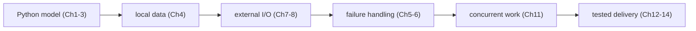

**VOLUME 2**

**Python for Production Infrastructure**

From scripting syntax to reliable infrastructure tooling

> **Prerequisite check:** If variables, `if`, loops, functions, tracebacks, JSON files, the main guard, or exit codes are not yet comfortable, work through the **Foundations** section at the top of Chapter 1 first — it builds a complete health-check program, one small stage at a time, from bare variables through JSON input, the main guard, and a documented exit-code contract. This volume should deepen a working beginner model, not force you to learn syntax and production design simultaneously.

## A gentler three-stage route

### Stage 1 — become comfortable writing small programs

Work through Chapter 1's Foundations section, then Chapters 1–4. Run every example and change one input. Your goal is to predict behavior, read errors, and separate data from decisions—not to memorize Python terminology.

**Gate:** Build a script that reads a JSON inventory, classifies each node, prints a result, and returns a documented exit code.

### Stage 2 — cross operational boundaries safely

Study Chapters 5–8: exceptions, resource cleanup, logging, subprocess, and HTTP. These chapters teach what happens when code touches files, processes, networks, credentials, and unreliable external systems.

**Gate:** For each external operation, identify timeout, expected failure types, retry policy, sensitive data, observable log fields, and exit behavior.

### Stage 3 — make the tool maintainable and production-ready

Study Chapters 9–14, then the capstone. Classes, generators, decorators, concurrency, typing, tests, packaging, and CI/CD are introduced because the tool now has enough complexity to need them. Do not add them merely to appear advanced.

**Gate:** Another engineer can install the tool, understand its CLI, run tests, diagnose a failure from logs, and modify one rule without invoking a real cluster.

&lt;!-- source-table:1 --&gt;

> Fourth Edition - Rebuilt as a teaching text, not an annotated checklist

Independent study guide based on public documentation and public practitioner material. Not an NVIDIA publication.

&lt;!-- source-table:2 --&gt;

> How to use this volume Read a chapter as a study block. Run the code. Change it. Break it. When you can explain why the broken version fails, move to the scenario and exercises. The tutor should quiz you only after you have studied the block.

&lt;!-- source-table:3 --&gt;

| Part | What you learn | What you build |
| --- | --- | --- |
| 0. Beginner bridge | values, decisions, loops, functions, files, tracebacks, tests | one safe node-health script |
| I. Python mental model | references, mutability, execution, functions | small inventory and log tools |
| II. Infrastructure I/O | files, regex, JSON/YAML, environment, subprocess | config reader and diagnostics runner |
| III. Reliability | exceptions, logging, APIs, retries | resilient API client |
| IV. Design | OOP, generators, decorators, typing, concurrency | maintainable automation library |
| V. Quality & delivery | pytest, mocking, packaging, CLI, CI/CD | production-style diagnostic CLI |

➕ **Visual map — the volume grows one operational boundary at a time:**

**Memory hook:** *"Make it correct, make it resilient, then make it operable."* Every later chapter adds a boundary around the code from the earlier one.
