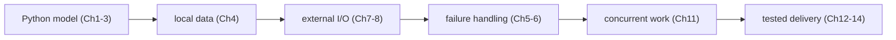

## Guided progression from script to tool

1. hard-coded values and pure decision;
2. JSON/file input with validation;
3. clear errors and exit codes;
4. structured logging;
5. one HTTP/subprocess adapter with timeout;
6. unit tests around decisions and boundary tests around effects;
7. CLI arguments and project packaging;
8. bounded concurrency only after the sequential path works;
9. CI checks and artifact/version release.

The local SRE repository contains useful progressive exercises in `interview-prep/hands-on-labs/python/`; the Staff guide's `scripting-python_consolidated.md` provides broader operational patterns. Use them as practice after the mechanism is understood.

## A practical reading method for every code block

For each unfamiliar example, annotate it yourself:

1. What enters this line?
2. What type and value leave it?
3. Is it a decision, a record, or an external effect?
4. What fails, and does the caller see the failure?
5. Could the code be tested without a live cluster?

Then run the smallest example locally, change one input, and predict the output before executing it. This turns syntax into a working model.

**VOLUME 2**

**Python for Production Infrastructure**

From scripting syntax to reliable infrastructure tooling

> **Start here:** If variables, `if`, loops, functions, tracebacks, JSON files, the main guard, or exit codes are unfamiliar, begin with Chapter 1. Its guided health-check lab is now part of the chapter, so you can learn the syntax and immediately run it.

## How to study this volume

Begin with Chapter 1 and run every example. Chapters 1–4 establish values, control flow, data structures, functions, files, and parsing; build a small JSON inventory checker before moving on. Chapters 5–8 then add the boundaries that make automation real—exceptions, cleanup, logs, subprocesses, HTTP, credentials, timeouts, and retries. Chapters 9–14 introduce classes, generators, decorators, concurrency, typing, tests, packaging, CI/CD, and the cluster-diagnostics capstone only after those boundaries give the code enough complexity to justify them.

At each step, change an input, predict the result, and deliberately break one assumption. Move on when you can explain the failure, return a useful exit code, and keep the next chapter's example small enough to test without a cluster.

<!-- source-table:1 -->

> Fourth Edition - Rebuilt as a teaching text, not an annotated checklist

Independent study guide based on public documentation and public practitioner material. Not an NVIDIA publication.

<!-- source-table:2 -->

> How to use this volume Read a chapter as a study block. Run the code. Change it. Break it. When you can explain why the broken version fails, move to the scenario and exercises. The tutor should quiz you only after you have studied the block.

<!-- source-table:3 -->

| Part | What you learn | What you build |
| --- | --- | --- |
| 0. Getting started | values, decisions, loops, functions, files, tracebacks, tests | one safe node-health script |
| I. Python execution and design | references, mutability, execution, functions | small inventory and log tools |
| II. Infrastructure I/O | files, regex, JSON/YAML, environment, subprocess | config reader and diagnostics runner |
| III. Reliability | exceptions, logging, APIs, retries | resilient API client |
| IV. Design | OOP, generators, decorators, typing, concurrency | maintainable automation library |
| V. Quality & delivery | pytest, mocking, packaging, CLI, CI/CD | production-style diagnostic CLI |

**Visual map — the volume grows one operational boundary at a time:**

**Key takeaway:** *"Make it correct, make it resilient, then make it operable."* Every later chapter adds a boundary around the code from the earlier one.
