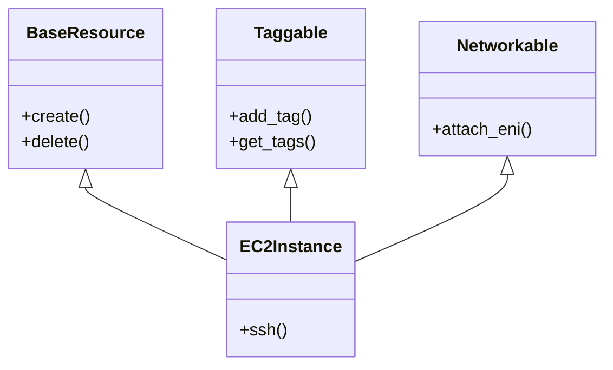
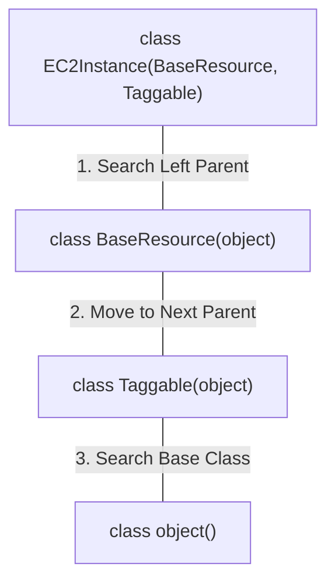
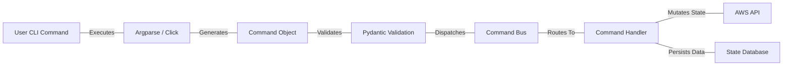

# Python Core & OOP Masterclass for Infrastructure Engineering

Welcome to the Python Core and Object-Oriented Programming (OOP) Masterclass, tailored specifically for Senior Solutions Architects, DevOps, SRE, and Infrastructure Engineers.

## 1. Introduction: The Infrastructure Engineer's Python

Python is the lingua franca of modern infrastructure, orchestration, and AI operations. It bridges the gap between raw shell scripts and compiled system-level languages. However, as an infrastructure engineer, your concerns extend beyond merely making code work. You care about **reliability, testability, memory management, configuration validation, and architectural design**.

This masterclass is designed not to teach you what a `for` loop is, but how Python executes code under the hood, how mutability can crash your pipelines, why configuration should be treated as an API, and how to use OOP to design maintainable infrastructure tooling.

### 1.1 The Shift from Scripting to Software Engineering

Infrastructure as Code (IaC) is software engineering. Writing a 5,000-line Python script with global state and deeply nested dictionaries is a recipe for disaster in production. We must apply rigorous software engineering principles—typing, abstraction, interfaces, and modularity—to our infrastructure automation.

---

## 2. How Python Actually Executes Your Infrastructure Script

Before diving into data structures and OOP, we must understand the Python execution model. Python is often described as an interpreted language, but this is a half-truth. CPython (the reference implementation) compiles your source code into **bytecode** before interpreting it on a virtual machine.

### 2.1 The Python Execution Model


When you execute `python deploy_cluster.py`:
1. **Parsing:** The CPython parser converts text into an Abstract Syntax Tree (AST).
2. **Compilation:** The AST is compiled into bytecode.
3. **Execution:** The Python Virtual Machine (PVM) interprets the bytecode instructions.

### 2.2 Bytecode Inspection in Action

Understanding bytecode helps demystify performance and scoping rules. Let's look at the `dis` module.

```python
import dis

def setup_networking(vpc_id, subnets):
    config = {"vpc": vpc_id, "subnets": subnets}
    return config

print("Bytecode for setup_networking:")
dis.dis(setup_networking)
```

**Output Analysis:**
```text
  4           0 BUILD_MAP                2
              2 LOAD_FAST                0 (vpc_id)
              4 LOAD_FAST                1 (subnets)
              6 STORE_FAST               2 (config)
              8 LOAD_FAST                2 (config)
             10 RETURN_VALUE
```
Notice `LOAD_FAST` for local variables. Python optimizes local variable access. This is why global variables are slower to access in Python—they use `LOAD_GLOBAL`, requiring a dictionary lookup in the `globals()` dictionary.

### 2.3 Memory Management and the GIL

CPython uses **reference counting** mixed with a generational garbage collector to manage memory.
The **Global Interpreter Lock (GIL)** ensures only one OS thread executes Python bytecode at a time. This simplifies memory management for C extensions but limits CPU-bound concurrency.

:::tip Infrastructure Implication
For network-bound tasks (API calls to AWS, GCP, NVIDIA APIs), multithreading (`concurrent.futures.ThreadPoolExecutor`) is highly effective because threads release the GIL during I/O operations. For CPU-bound tasks (data processing, serialization of massive JSON payloads), you must use multiprocessing (`ProcessPoolExecutor`) or native extensions.
:::

---

## 3. The Python Object Model, Mutability, and References

In Python, **everything is an object**, and **variables are just labels (references)** pointing to those objects. This is a critical concept that causes subtle bugs in infrastructure code.

### 3.1 Mutability and Immutability

*   **Immutable types:** `int`, `float`, `bool`, `str`, `tuple`, `frozenset`. Once created, their value cannot change.
*   **Mutable types:** `list`, `dict`, `set`, custom classes. Their contents can change in-place.

#### The "Default Mutable Argument" Bug

:::warning Common Pitfall
This is the most common bug in Python automation. A mutable default argument is evaluated only once when the function is defined, leading to shared state across all calls.
:::

```python
# BAD PRACTICE
def add_node_to_cluster(node_ip, cluster_nodes=[]):
    # Adds a node to the cluster list.
    cluster_nodes.append(node_ip)
    return cluster_nodes

print(add_node_to_cluster("10.0.0.1")) # ['10.0.0.1']
print(add_node_to_cluster("10.0.0.2")) # ['10.0.0.1', '10.0.0.2'] - WAIT, WHY?
```

**Why this happens:** The `cluster_nodes=[]` list is created **once** when the `def` statement is evaluated (during module import/parsing), not every time the function is called.

**The Fix:**
```python
# GOOD PRACTICE
def add_node_to_cluster(node_ip: str, cluster_nodes: list[str] | None = None) -> list[str]:
    if cluster_nodes is None:
        cluster_nodes = []
    cluster_nodes.append(node_ip)
    return cluster_nodes
```

### 3.2 Deep vs. Shallow Copies in Configuration Dictionaries

When merging configuration dictionaries for deployments, shallow copies can ruin your day.

```python
import copy

base_config = {
    "region": "us-east-1",
    "tags": ["prod", "web"]
}

# Shallow copy via dict() or .copy()
new_config = dict(base_config)
new_config["region"] = "us-west-2"
new_config["tags"].append("gpu-enabled")

print(base_config["tags"]) # Output: ['prod', 'web', 'gpu-enabled'] - Mutated!
```

Because `tags` is a list (mutable), the shallow copy only copied the *reference* to the list.
Use `copy.deepcopy(base_config)` when working with nested mutable structures.

---

## 4. Choosing Data Structures by the Problem, Not by Habit

Infrastructure state is often represented as data structures. Choosing the right one impacts performance, memory, and code clarity.

### 4.1 Lists vs. Sets for Membership Testing

Checking if a resource exists in a list of 100,000 items is $O(N)$. Checking in a set is $O(1)$.

```python
import time

# Simulating 1 million active IP addresses
active_ips_list = [f"10.0.0.{i}" for i in range(1_000_000)]
active_ips_set = set(active_ips_list)

target_ip = "10.0.0.999999"

# List membership test
start = time.perf_counter()
_ = target_ip in active_ips_list
print(f"List check took: {time.perf_counter() - start:.6f} seconds")

# Set membership test
start = time.perf_counter()
_ = target_ip in active_ips_set
print(f"Set check took: {time.perf_counter() - start:.6f} seconds")
```
Always use `set` or `frozenset` for filtering, intersection, and membership testing.

### 4.2 Dictionaries and Memory Profiling

Dictionaries are highly optimized hash tables in Python. In Python 3.6+, dictionaries maintain insertion order and are more memory-efficient.

However, loading massive JSON responses (e.g., describing all resources in an AWS account) into a dictionary can cause memory bloat.

#### Memory Profiling Example

```python
import sys

def analyze_memory():
    small_dict = {f"key{i}": f"value{i}" for i in range(10)}
    large_dict = {f"key{i}": f"value{i}" for i in range(100000)}
    
    print(f"Small dict size: {sys.getsizeof(small_dict)} bytes")
    print(f"Large dict size: {sys.getsizeof(large_dict)} bytes")

# For true deep memory analysis, use external libraries like Pympler or memory_profiler.
```
When dealing with millions of records (e.g., log processing), use **generators** instead of loading everything into a list or dictionary simultaneously.

---

## 5. Functions: Turning Scripts into Testable Decisions

A raw script executes top-to-bottom. It's hard to test a specific part without running the whole thing. Functions introduce boundaries, state isolation, and testability.

### 5.1 First-Class Functions and High-Order Functions

In Python, functions are first-class citizens. They can be passed around like variables. This is useful for building flexible infrastructure pipelines (e.g., retries, decorators).

```python
import time
from typing import Callable, Any

def retry_api_call(func: Callable, max_retries: int = 3, backoff: int = 2) -> Any:
    # A generic retry wrapper for flaky API calls.
    for attempt in range(max_retries):
        try:
            return func()
        except Exception as e:
            print(f"Attempt {attempt + 1} failed: {e}")
            if attempt == max_retries - 1:
                raise
            time.sleep(backoff ** attempt)

def simulate_flaky_aws_call():
    import random
    if random.random() < 0.7:
        raise ConnectionError("Rate limit exceeded")
    return "Success: Node provisioned"

# Usage:
# result = retry_api_call(simulate_flaky_aws_call)
```

### 5.2 Type Hinting for Safety

Dynamic typing is great for prototyping, but terrible for massive codebases. Type hints do not affect runtime (they are ignored by the Python interpreter), but they power static analyzers like `mypy` and `pyright`.

```python
from typing import Dict, List, Optional, Any
from dataclasses import dataclass

@dataclass
class NodePool:
    name: str
    instance_type: str
    min_size: int
    max_size: int
    labels: Dict[str, str]

def scale_node_pool(pool: NodePool, target_size: int) -> bool:
    if not (pool.min_size <= target_size <= pool.max_size):
        raise ValueError(f"Target size {target_size} out of bounds for pool {pool.name}")
    print(f"Scaling {pool.name} to {target_size}")
    return True
```

---

## 6. Object-Oriented Programming (OOP) for Infrastructure Code

When should an infrastructure engineer use OOP?
- When managing **state** (e.g., a connection pool, an API client with tokens).
- When standardizing interfaces (e.g., wrapping different Cloud Providers behind a common API).
- When encapsulating complex logic that shouldn't leak to the caller.

### 6.1 Abstract Base Classes (ABCs) for Provider Interfaces

If you are writing an internal tool that provisions VMs on AWS, GCP, and vSphere, you want a uniform interface. Python's `abc` module enforces this.

```python
from abc import ABC, abstractmethod
from dataclasses import dataclass

@dataclass
class VMConfig:
    hostname: str
    cpus: int
    memory_gb: int

class CloudProvider(ABC):
    
    @abstractmethod
    def provision_vm(self, config: VMConfig) -> str:
        # Provisions a VM and returns the IP address.
        pass
        
    @abstractmethod
    def terminate_vm(self, instance_id: str) -> bool:
        # Terminates a VM.
        pass

class AWSProvider(CloudProvider):
    def __init__(self, region: str):
        self.region = region
        # self.client = boto3.client('ec2', region_name=region)
        
    def provision_vm(self, config: VMConfig) -> str:
        print(f"AWS: Provisioning {config.hostname} with {config.cpus} CPUs in {self.region}")
        return "10.0.1.55"
        
    def terminate_vm(self, instance_id: str) -> bool:
        print(f"AWS: Terminating {instance_id}")
        return True

class GCPProvider(CloudProvider):
    def provision_vm(self, config: VMConfig) -> str:
        print(f"GCP: Creating compute instance {config.hostname}")
        return "10.128.0.2"
        
    def terminate_vm(self, instance_id: str) -> bool:
        return True

# Factory pattern
def get_provider(name: str) -> CloudProvider:
    if name == "aws":
        return AWSProvider("us-east-1")
    elif name == "gcp":
        return GCPProvider()
    raise ValueError("Unknown provider")
```

### 6.2 Method Resolution Order (MRO) and Multiple Inheritance

Python supports multiple inheritance. When a class inherits from multiple parents, Python uses the **C3 Linearization Algorithm** to determine the Method Resolution Order (MRO).





```python
class BaseResource:
    def describe(self): return "Base Resource"

class Taggable:
    def describe(self): return "Taggable Resource"

class EC2Instance(BaseResource, Taggable):
    pass

print(EC2Instance.mro())
# Output: [<class '__main__.EC2Instance'>, <class '__main__.BaseResource'>, <class '__main__.Taggable'>, <class 'object'>]
```
The order in the class definition `(BaseResource, Taggable)` dictates the resolution order. It searches left-to-right.

---

## 7. Configuration is an API: Validation, Secrets, and Precedence

In infrastructure, configuration dictates system state. A missing `prod` flag or a typo in a database URL can cause an outage. Configuration must be treated with the same rigor as an API contract.

### 7.1 The Configuration Hierarchy (Precedence)

A robust configuration system should resolve values in the following order (highest to lowest precedence):
1. **Command Line Arguments (CLI)** (`argparse`, `click`)
2. **Environment Variables** (OS environment)
3. **Local Configuration Files** (`.env`, `config.local.yaml`)
4. **Global Configuration Files** (`/etc/app/config.yaml`)
5. **Hardcoded Defaults** in the code

### 7.2 Strict Validation with Pydantic

Pydantic is the industry standard for data validation in Python. It enforces type hints at runtime and validates complex structures.

```python
import os
from pydantic import BaseModel, Field, SecretStr, field_validator
from typing import List

class DatabaseConfig(BaseModel):
    host: str
    port: int = Field(default=5432, ge=1, le=65535)
    username: str
    password: SecretStr # Prevents accidental logging of the password
    
    @field_validator('host')
    @classmethod
    def must_be_internal_dns(cls, v: str) -> str:
        if not v.endswith('.internal'):
            raise ValueError("Database host must be an internal DNS name")
        return v

class AppConfig(BaseModel):
    environment: str = Field(pattern="^(dev|staging|prod)$")
    database: DatabaseConfig
    allowed_ips: List[str]

# Example usage with simulated raw data (e.g., loaded from YAML)
raw_data = {
    "environment": "prod",
    "database": {
        "host": "db.prod.internal",
        "port": "5432", # Pydantic will coerce this string to an int
        "username": "admin",
        "password": "super_secret_password_123!"
    },
    "allowed_ips": ["10.0.0.0/8", "192.168.1.0/24"]
}

try:
    config = AppConfig(**raw_data)
    print("Configuration valid!")
    print(f"Connecting to {config.database.host} on port {config.database.port}")
    # print(config.database.password) # Output: ********** (SecretStr hides value)
    # print(config.database.password.get_secret_value()) # Actually retrieve it
except Exception as e:
    print(f"Configuration Validation Error: {e}")
```

### 7.3 Secrets Management

:::warning Security Critical
**Never hardcode secrets. Never commit `.env` files.**
Use `SecretStr` in Pydantic. Fetch secrets at runtime from AWS Secrets Manager, HashiCorp Vault, or environment variables mounted from Kubernetes Secrets.
:::

---

## 8. Files, Pathlib, Regex, JSON, and YAML

Infrastructure scripts spend 80% of their time interacting with the filesystem, reading configs, and parsing text.

### 8.1 Pathlib over os.path

`pathlib` is an object-oriented approach to paths. It prevents cross-platform slash issues (`/` vs `\`) and is far more readable.

```python
from pathlib import Path

# Create path object
config_dir = Path("/etc/myapp/conf.d")

# Iterate over all yaml files
if config_dir.exists() and config_dir.is_dir():
    for conf_file in config_dir.glob("*.yaml"):
        print(f"Reading: {conf_file.name}")
        # text_content = conf_file.read_text()
        
# Building paths
log_path = Path("/var/log") / "myapp" / "error.log"
```

### 8.2 JSON and YAML Parsing

Use standard `json` and third-party `pyyaml` (or `ruamel.yaml` if you need to preserve comments).

```python
import json
import yaml
from pathlib import Path

def process_configs():
    # JSON Parsing
    json_str = '{"cluster_name": "prod-k8s", "nodes": 5}'
    data = json.loads(json_str)
    
    # Writing YAML
    yaml_path = Path("/tmp/output.yaml")
    with yaml_path.open("w") as f:
        yaml.dump(data, f, default_flow_style=False)
```

---

## 9. Exceptions and Error Handling in Infrastructure Operations

Unhandled exceptions crash pipelines. Broad exception handling (`except Exception: pass`) hides critical failures.

### 9.1 The Hierarchy of Exceptions

Catch specific exceptions. If an API call fails due to a timeout, you want to retry. If it fails due to authentication, retrying is useless; you need to alert.

```python
import requests
from requests.exceptions import Timeout, RequestException

def fetch_health_status(url: str):
    try:
        response = requests.get(url, timeout=5)
        response.raise_for_status() # Raises HTTPError for bad responses (4xx, 5xx)
        return response.json()
    except Timeout:
        print(f"Error: Connection to {url} timed out. Retrying might help.")
        raise
    except requests.exceptions.HTTPError as err:
        print(f"HTTP Error occurred: {err}")
        # Stop and alert, do not retry blindly
        raise
    except RequestException as e:
        print(f"Fatal network error: {e}")
        raise
```

### 9.2 Creating Custom Exceptions

For internal libraries, create a custom exception hierarchy.

```python
class InfrastructureError(Exception):
    # Base class for all infra exceptions.
    pass

class ProvisioningFailedError(InfrastructureError):
    pass

class ConfigurationValidationError(InfrastructureError):
    pass

def provision_db():
    raise ProvisioningFailedError("Failed to acquire IP from IPAM")
```
This allows callers to handle `InfrastructureError` cleanly, knowing it originated from your module, rather than catching generic `RuntimeError`s.

---

## 10. Senior Solutions Architect Troubleshooting & Interview Scenarios

### Scenario 1: The Memory Leak in the Data Pipeline

**The Problem:** A Python script runs nightly to ingest millions of log lines from S3, parse them, and upload them to a data warehouse. The script gets OOMKilled by Kubernetes after 45 minutes.

**The Cause:** The engineer is reading the entire file into a massive list of strings or dictionaries using `.read()` or `.readlines()`, exhausting the container's RAM.

**The Solution:** Use Generators (`yield`) and iterative processing.

```python
# BAD
def process_logs_bad(file_path):
    with open(file_path, 'r') as f:
        all_lines = f.readlines() # Memory spike!
    
    results = []
    for line in all_lines:
        results.append(line.strip().upper())
    return results

# GOOD: Constant memory usage
def process_logs_good(file_path):
    with open(file_path, 'r') as f:
        for line in f: # Reads one line at a time
            yield line.strip().upper()

# Usage:
# for processed_line in process_logs_good('massive.log'):
#     upload_to_db(processed_line)
```

### Scenario 2: The Mutability Bug in Deployment Configs

**The Problem:** A deployment script takes a base dictionary, updates a few keys for the `prod` environment, and deploys. Suddenly, the `dev` environment receives `prod` configurations.

**The Cause:** A shallow copy was used, or the base configuration dictionary was mutated in-place by a function.

**The Solution:** Immutability by default. Use `copy.deepcopy()` or, better yet, use Pydantic models with `.model_copy(update={"env": "prod"})` which returns a completely new instance.

### Scenario 3: Zombie Processes in Multiprocessing

**The Problem:** A Python script spawns multiple processes to parallelize API requests. If the main script is interrupted (SIGINT / Ctrl+C), child processes continue running as orphans.

**The Cause:** The `multiprocessing` library does not automatically terminate child processes if the parent dies ungracefully, unless specifically configured or handled via signal trapping.

**The Solution:** Use Context Managers (`with Pool() as p:`) or explicitly handle termination in a `try...finally` block.

---

## 11. Advanced Design Pattern: The Infrastructure Command Bus

Instead of spaghetti scripts, modern infrastructure tooling often uses the Command Pattern or an Event Bus.



This decoupling allows you to test handlers purely by passing them Command objects, mocking out the CLI and the APIs completely.

---

## 12. Conclusion and Next Steps

We have covered the foundational elements that separate quick-and-dirty Python scripts from production-grade infrastructure software. By understanding Python's execution model, leveraging proper data structures, embracing OOP for interfaces, and enforcing strict configuration validation, you can build automation that is predictable, scalable, and safe.

**Key Takeaways:**
1. **Mutability is dangerous:** Understand references, deep copies, and default arguments.
2. **Validate at the edge:** Use Pydantic to ensure configuration is valid before executing state-changing APIs.
3. **Use the right abstractions:** ABCs enforce contracts across different cloud providers.
4. **Control memory:** Use generators for large datasets.

Proceed to the next chapter to dive deeper into testing these robust architectures.

---

## Appendix A: Deep Dive into Metaclasses and `__new__`

While ABCs provide abstract interfaces, metaclasses allow you to hook into the class creation process itself. This is rarely needed in standard infrastructure code, but extremely common in frameworks like Django ORM or Pydantic itself.

### A.1 Understanding `type`

In Python, classes are objects too. They are instances of `type`.

```python
MyClass = type('MyClass', (object,), {'x': 5})
obj = MyClass()
print(obj.x) # 5
```

### A.2 A Singleton Configuration Metaclass

A common anti-pattern in infrastructure is reloading configuration files multiple times. A Singleton ensures only one instance of the configuration exists.

```python
class SingletonMeta(type):
    _instances = {}

    def __call__(cls, *args, **kwargs):
        if cls not in cls._instances:
            # Actually create the object
            instance = super().__call__(*args, **kwargs)
            cls._instances[cls] = instance
        return cls._instances[cls]

class GlobalConfig(metaclass=SingletonMeta):
    def __init__(self):
        print("Loading heavy configuration from disk/API...")
        self.settings = {"region": "us-east-1"}

# Usage:
config1 = GlobalConfig()
config2 = GlobalConfig()
print(config1 is config2) # True, only loaded once
```

## Appendix B: The Context Manager Protocol (`__enter__` and `__exit__`)

Context managers (`with` statements) guarantee cleanup. They are essential for file handling, database connections, and managing temporary cloud resources during tests.

### B.1 Creating a Temporary Cloud Resource

Imagine a test that creates an S3 bucket and MUST delete it afterward, even if the test fails.

```python
import time

class TemporaryBucket:
    def __init__(self, bucket_name: str):
        self.bucket_name = bucket_name
        
    def __enter__(self):
        print(f"Creating temporary bucket: {self.bucket_name}")
        # boto3.client('s3').create_bucket(Bucket=self.bucket_name)
        return self
        
    def __exit__(self, exc_type, exc_val, exc_tb):
        print(f"Cleaning up bucket: {self.bucket_name}")
        # boto3.client('s3').delete_bucket(Bucket=self.bucket_name)
        if exc_type:
            print(f"An exception occurred during execution: {exc_val}")
        # Return False to propagate exceptions, True to swallow them
        return False

# Usage:
try:
    with TemporaryBucket("test-bucket-12345") as bucket:
        print("Running tests against bucket...")
        raise ValueError("Simulated test failure")
except ValueError:
    print("Caught the failure, but bucket cleanup was guaranteed.")
```

## Appendix C: Advanced Decorators for Infrastructure

Decorators allow you to modify function behavior transparently. They are heavily used for logging, retries, and access control.

### C.1 A Parameterized Retry Decorator

```python
import time
from functools import wraps

def with_retry(max_attempts=3, delay_seconds=2, exceptions=(Exception,)):
    def decorator(func):
        @wraps(func)
        def wrapper(*args, **kwargs):
            attempts = 0
            while attempts < max_attempts:
                try:
                    return func(*args, **kwargs)
                except exceptions as e:
                    attempts += 1
                    print(f"Attempt {attempts} failed: {e}. Retrying in {delay_seconds}s...")
                    if attempts == max_attempts:
                        raise
                    time.sleep(delay_seconds)
        return wrapper
    return decorator

@with_retry(max_attempts=5, delay_seconds=1, exceptions=(ConnectionError,))
def connect_to_database():
    print("Attempting to connect...")
    raise ConnectionError("Network partitioned")

# connect_to_database() # Will retry 5 times before failing
```

## Appendix D: Profiling and Optimization Techniques

When Python scripts become slow, you need data, not intuition.

### D.1 Using cProfile

`cProfile` is a built-in C-extension for profiling Python code.

```bash
# Profile an entire script and output to binary file
python -m cProfile -o script_profile.prof my_infra_script.py

# Read and analyze the profile using the 'pstats' module or tools like SnakeViz
python -c "import pstats; p = pstats.Stats('script_profile.prof'); p.sort_stats('cumulative').print_stats(10)"
```

### D.2 Multiprocessing vs. Threading for APIs

If you need to make 10,000 HTTP requests to an API, `threading` or `asyncio` is the right choice because the bottleneck is I/O latency, not CPU computation.

```python
import concurrent.futures
import time

def fetch_resource(resource_id):
    # Simulate network latency
    time.sleep(0.1)
    return f"Resource-{resource_id}-Data"

def fetch_all_sync(ids):
    return [fetch_resource(i) for i in ids]

def fetch_all_threaded(ids):
    results = []
    with concurrent.futures.ThreadPoolExecutor(max_workers=50) as executor:
        # Map blocks until all are complete and returns in order
        results = list(executor.map(fetch_resource, ids))
    return results

ids = list(range(100))

start = time.perf_counter()
fetch_all_sync(ids)
print(f"Sync time: {time.perf_counter() - start:.2f}s") # ~10 seconds

start = time.perf_counter()
fetch_all_threaded(ids)
print(f"Threaded time: {time.perf_counter() - start:.2f}s") # ~0.2 seconds
```

## Appendix E: Deep Dive into Iterators and Generators

### E.1 The Iterator Protocol
Any object that implements `__iter__` and `__next__` is an iterator.

```python
class IPNetworkRange:
    # A naive IP range iterator for demonstration.
    def __init__(self, base_ip, count):
        self.base_parts = [int(p) for p in base_ip.split('.')]
        self.count = count
        self.current = 0
        
    def __iter__(self):
        return self
        
    def __next__(self):
        if self.current >= self.count:
            raise StopIteration
            
        # Simplified logic, assumes only last octet increments for demo
        result = f"{self.base_parts[0]}.{self.base_parts[1]}.{self.base_parts[2]}.{self.base_parts[3] + self.current}"
        self.current += 1
        return result

# Memory efficient: generates strings on the fly
# for ip in IPNetworkRange("192.168.1.1", 5):
#     print(ip)
```

### E.2 The `yield` Keyword
Generators use `yield` to pause execution and return a value, maintaining local state between calls.

```python
def ip_generator(base_ip, count):
    parts = [int(p) for p in base_ip.split('.')]
    for i in range(count):
        yield f"{parts[0]}.{parts[1]}.{parts[2]}.{parts[3] + i}"
```

## Appendix F: Subprocess and System Integration

Often, Python is used to glue together command-line tools like `kubectl`, `terraform`, or `ansible`.

### F.1 Safe Subprocess Execution

Never use `os.system`. Use `subprocess.run` with proper error handling and shell sanitization.

```python
import subprocess
import shlex

def run_kubectl_get_pods(namespace="default"):
    # Avoid shell=True for security against command injection
    cmd = ["kubectl", "get", "pods", "-n", namespace, "-o", "json"]
    
    try:
        # capture_output=True captures stdout and stderr
        # check=True raises CalledProcessError if return code != 0
        # text=True returns strings instead of bytes
        result = subprocess.run(cmd, capture_output=True, text=True, check=True)
        return result.stdout
    except subprocess.CalledProcessError as e:
        print(f"Command failed with exit code {e.returncode}")
        print(f"Stderr: {e.stderr}")
        raise
    except FileNotFoundError:
        print("kubectl command not found. Is it installed and in PATH?")
        raise
```

## Appendix G: Asynchronous Python (`asyncio`)

For massively concurrent I/O operations (e.g., polling thousands of server statuses), `asyncio` is highly efficient, running on a single thread using an event loop.

```python
import asyncio
import time

async def async_fetch(resource_id):
    # await asyncio.sleep(0.1) simulates non-blocking I/O
    await asyncio.sleep(0.1) 
    return f"Data-{resource_id}"

async def main_async():
    tasks = [async_fetch(i) for i in range(100)]
    # Gather runs all awaitables concurrently
    results = await asyncio.gather(*tasks)
    return results

# To run:
# start = time.perf_counter()
# asyncio.run(main_async())
# print(f"Async time: {time.perf_counter() - start:.2f}s")
```

## Appendix H: Design Patterns in Python Infrastructure

### H.1 The Factory Pattern
Used to abstract object creation. We saw this briefly with CloudProviders.

### H.2 The Strategy Pattern
Allows swapping algorithms or behaviors at runtime. Useful for deployment strategies (Blue/Green vs. Canary).

```python
from abc import ABC, abstractmethod

class DeploymentStrategy(ABC):
    @abstractmethod
    def deploy(self, service_name: str, version: str):
        pass

class BlueGreenDeployment(DeploymentStrategy):
    def deploy(self, service_name: str, version: str):
        print(f"Executing Blue/Green deployment for {service_name}:{version}")
        # Logic to spin up new cluster, switch traffic, tear down old

class CanaryDeployment(DeploymentStrategy):
    def deploy(self, service_name: str, version: str):
        print(f"Executing Canary deployment for {service_name}:{version} (10% traffic)")
        # Logic to route fractional traffic

class Deployer:
    def __init__(self, strategy: DeploymentStrategy):
        self.strategy = strategy
        
    def execute(self, service_name: str, version: str):
        self.strategy.deploy(service_name, version)

# Usage
# deployer = Deployer(CanaryDeployment())
# deployer.execute("auth-service", "v2.1.0")
```

## Appendix I: Type Hinting Deep Dive (Python 3.10+)

Modern Python typing has evolved significantly.

```python
from typing import Literal, TypedDict, Callable, Any

# Literal for exact string matching
Environment = Literal["dev", "staging", "prod"]

def set_environment(env: Environment):
    print(f"Setting env to {env}")
    
# set_environment("test") # Type checker (mypy) will flag this error!

# TypedDict for structured dictionary data (when you don't want full Pydantic models)
class APIResponse(TypedDict):
    status_code: int
    data: list[str]
    error: str | None # Union operator (Python 3.10+)

def handle_response(resp: APIResponse):
    print(resp["status_code"])
```


## Extended Scenario Module 1

### Deep Dive: Memory Profiling Part 1
Memory issues in Python infrastructure are notoriously hard to debug. In this extended scenario, we look at how to tackle them when parsing extremely large log files or JSON objects. A common mistake is reading the entire file into a dictionary or list, which can lead to Out-Of-Memory (OOM) errors in containerized environments. By adopting streaming approaches or utilizing external libraries like memory_profiler, we can maintain a constant memory footprint.

Here's an illustration of how you might use generators to process streams of data efficiently. This technique ensures that your memory usage remains flat regardless of the input size, allowing infrastructure tooling to scale gracefully.

```python
# A generator to lazily process items
def lazy_process_data_stream_part_1(stream):
    for record in stream:
        if record.get('status') == 'error':
            yield record

# Process in chunks to prevent memory blowup
def consume_data_part_1():
    data_stream = ({"id": j, "status": "error" if j % 2 == 0 else "ok"} for j in range(10000))
    for error_record in lazy_process_data_stream_part_1(data_stream):
        # Do something with the error record
        pass
```

Understanding this pattern is crucial for data engineering, logging, and general infrastructure automation. In the context of MLOps or DevOps, data is the foundation, and managing it efficiently is paramount to building reliable systems. The concepts here echo the importance of Python's execution model and memory management, as discussed earlier. Ensure you apply these principles when dealing with APIs that return paginated or massive responses.

## Extended Scenario Module 2

## Extended Scenario Module 3

## Extended Scenario Module 4

