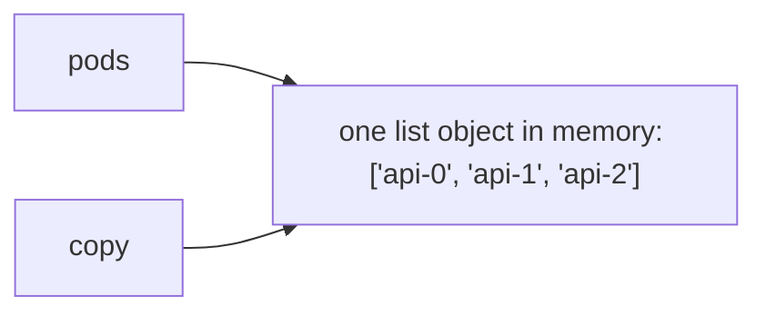
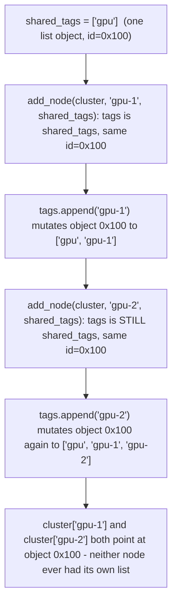

## Foundations: start here if Python syntax isn't yet comfortable

### Why start with plain Python

This section is not about infrastructure, GPUs, or clusters — it's about Python itself, from true basics. Everything after "With that syntax comfortable..." below assumes you can already write and read a simple function, and that's a fair thing to feel shaky on if Python isn't a language you use daily.

This section won't teach regular expressions, dataclasses, decorators, or list comprehensions — those are deliberately left for the [hands-on labs](/labs) to teach, in context, exactly when a given exercise needs them. Its only job here is to get you comfortable with: values and types, lists and dicts, `if`/`elif`/`else`, `for` loops, functions, and basic exception handling — the small set of building blocks that almost every lab, and the rest of this chapter, is built out of. Every concept below comes with a short, complete snippet you can actually type into a Python file and run yourself. Doing that, rather than only reading it, is the point. If you're already comfortable with all of this, skip straight to "With that syntax comfortable..." further down.

You'll need Python 3.10 or newer. To check what you have:

```bash
python3 --version
```

### Variables: a name pointing at a value

#### The problem

A program needs a way to hold onto a piece of information — a number, a bit of text — so it can use it again later, under a short, memorable name, instead of retyping the literal value everywhere.

#### The concept

A **variable** is a name that points at a value. Writing `gpu_count = 8` doesn't "store 8 inside the name gpu_count" in some mysterious box — it makes the name `gpu_count` point at the value `8`, so that anywhere you write `gpu_count` afterward, Python substitutes in `8`.

#### Basic types

Every value in Python has a **type** — a category describing what kind of value it is and what you can do with it. The four you'll see constantly:

- `str` (string) — text, written in quotes: `"gpu-node-01"`
- `int` — a whole number: `8`
- `float` — a number with a decimal point: `54.5`
- `bool` — exactly one of two values: `True` or `False`

There's also a special value, `None`, which means "no value here" — it's Python's explicit way of saying "this exists as a placeholder, but there is genuinely nothing meaningful assigned yet," which is different from `0`, `""`, or `False` (all of which are real, specific values — `None` is the *absence* of one).

#### First example

```python
node_name = "gpu-node-01"
gpu_count = 8
temperature_c = 54.5
healthy = True
last_error = None

print(node_name)
print(gpu_count)
print(type(node_name))
print(type(gpu_count))
print(type(temperature_c))
print(type(healthy))
print(last_error)
```

Output:

```text
gpu-node-01
8
<class 'str'>
<class 'int'>
<class 'float'>
<class 'bool'>
None
```

#### Mixing types doesn't get guessed for you

Python won't quietly convert between types just because an operation looks like it should work. Concatenating a string and a number directly raises an error rather than Python guessing what you meant:

```python
gpu_count = 8
label = "GPU count: " + gpu_count
```

Raises:

```text
Traceback (most recent call last):
  ...
TypeError: can only concatenate str (not "int") to str
```

Python calls automatic type conversion **coercion**, and it only ever happens between compatible numeric types — an `int` and a `float` combine cleanly in an expression like `3 + 4.5` — never between a number and a string. If you want `gpu_count` inside a message, convert it explicitly: `"GPU count: " + str(gpu_count)`, or use an f-string as shown above. A `TypeError` here is Python protecting you from silently building the wrong string; treat it as useful signal, not a nuisance.

#### Check your understanding

**Q1: What is the actual difference between `None` and `0`?**
A: `0` is a real, specific numeric value (zero of something). `None` means "no value has been assigned here at all" — it's used when there genuinely isn't a meaningful value yet, not when the value happens to be zero.

**Q2: If you write `status = "OK"` and then later `status = "CRITICAL"`, what happened to the string `"OK"`?**
A: The name `status` now points at `"CRITICAL"` instead. The variable is just a name; reassigning it makes it point somewhere else. It didn't "change" the old value — it stopped pointing at it.

### Lists: an ordered collection

#### The problem

You often have many values of the same kind — say, several node names — and want to keep them together, in order, under one name, rather than one variable per value.

#### The concept

A **list** is an ordered collection of values, written with square brackets. You access an item by its position (its **index**), and positions start counting from `0`, not `1` — the first item is at index `0`.

#### The single most common operation: indexing and appending

```python
nodes = ["gpu-01", "gpu-02", "gpu-03"]

print(nodes[0])          # first item
print(nodes[2])          # third item
print(len(nodes))        # how many items

nodes.append("gpu-04")   # add a new item to the end
print(nodes)
```

Output:

```text
gpu-01
gpu-03
3
['gpu-01', 'gpu-02', 'gpu-03', 'gpu-04']
```

#### Check your understanding

**Q1: If `nodes = ["a", "b", "c"]`, what is `nodes[1]`?**
A: `"b"` — indexing starts at 0, so index 1 is the second item.

**Q2: What does `.append(...)` do to a list?**
A: It adds a new item to the end of the list, increasing its length by one.

### Dicts: a mapping from keys to values

#### The problem

Sometimes position isn't the natural way to look something up — you want to find a value by a meaningful name (a "key"), like looking up a node's temperature by the node's name, rather than by remembering it's the third item in some list.

#### The concept

A **dict** (dictionary) maps keys to values, written with curly braces. You look up a value using its key, in square brackets, rather than by position.

#### The single most common operation: key lookup

```python
node = {"name": "gpu-01", "gpus": 8, "temperature_c": 54}

print(node["name"])
print(node["temperature_c"])

node["temperature_c"] = 61   # update an existing key's value
print(node)
```

Output:

```text
gpu-01
54
{'name': 'gpu-01', 'gpus': 8, 'temperature_c': 61}
```

#### Check your understanding

**Q1: What's the practical difference between a list and a dict?**
A: A list holds values in order and you look them up by position (index). A dict holds values under named keys and you look them up by that key, not by position.

**Q2: If `node = {"gpus": 8}`, what does `node["gpus"]` return? What would `node["temperature_c"]` do?**
A: `node["gpus"]` returns `8`. `node["temperature_c"]` would raise an error (`KeyError`), because that key doesn't exist in the dict — Python doesn't guess or return a default; it tells you the key is missing.

### Making decisions: `if` / `elif` / `else`

#### The problem

A program often needs to do different things depending on the value of something it's checking — not just run the same fixed steps every time.

#### The concept

An **`if`/`elif`/`else` block** lets a program choose which piece of code to run based on a condition. Python checks each condition from top to bottom and runs the code under the *first* one that's true, then skips the rest — order matters.

#### First example

```python
temperature_c = 78

if temperature_c >= 85:
    status = "CRITICAL"
elif temperature_c >= 75:
    status = "WARNING"
else:
    status = "OK"

print(status)
```

Output:

```text
WARNING
```

Try changing `temperature_c` to `54` and predict the output before running it again — that's a habit worth building for every snippet in this section.

#### Check your understanding

**Q1: If `temperature_c = 90`, which branch runs, and why not a later one even though it might also be true?**
A: The `CRITICAL` branch runs, because `90 >= 85` is checked first and is true. Python stops at the first true condition and never evaluates the remaining `elif`/`else` — this is why order matters when the conditions overlap.

**Q2: What does `else` mean here?**
A: "None of the conditions above were true — run this instead." It's the fallback, and it always runs if nothing earlier matched.

### Repeating work: `for` loops

#### The problem

You often need to do the same thing to every item in a collection — checking every node's temperature, for example — without writing out the same code once per item by hand.

#### The concept

A **`for` loop** repeats a block of code once for each item in something. The two shapes you'll see constantly: looping over a list of actual values, and looping over a range of numbers (a count) when you just need to repeat something a certain number of times rather than process specific values.

#### First example: looping over a list of values

```python
nodes = ["gpu-01", "gpu-02", "gpu-03"]

for node in nodes:
    print(f"checking {node}")
```

Output:

```text
checking gpu-01
checking gpu-02
checking gpu-03
```

#### Second example: looping over a range of numbers

```python
for i in range(3):
    print(f"attempt number {i}")
```

Output:

```text
attempt number 0
attempt number 1
attempt number 2
```

Note `range(3)` produces `0, 1, 2` — three numbers, starting at 0 — not `1, 2, 3`. This trips people up constantly; it's worth deliberately noticing.

#### A combined example, closer to what the labs look like

```python
nodes = [
    {"name": "gpu-01", "temperature_c": 54},
    {"name": "gpu-02", "temperature_c": 82},
]

for node in nodes:
    if node["temperature_c"] >= 75:
        status = "WARNING"
    else:
        status = "OK"
    print(f'{node["name"]}: {status}')
```

Output:

```text
gpu-01: OK
gpu-02: WARNING
```

#### Check your understanding

**Q1: What's the difference between `for node in nodes:` and `for i in range(len(nodes)):`?**
A: `for node in nodes:` gives you each actual value from the list directly. `for i in range(len(nodes)):` gives you the index numbers instead, and you'd need `nodes[i]` to get the value — usually the first form is simpler when you just need the values themselves.

**Q2: What does `range(3)` actually produce?**
A: The numbers `0`, `1`, `2` — three numbers total, starting from zero, not from one.

### Functions: giving a piece of code a name

#### The problem

As soon as you have logic worth using more than once — or logic you want to check works correctly on its own, separate from the rest of the program — writing it inline, repeated everywhere it's needed, becomes a liability: fix a bug in one copy and forget the others, and you have two different behaviors where you meant to have one.

#### The concept

A **function** is a named, reusable block of code that takes some inputs (called **arguments** or **parameters**), does something with them, and can give back a result (using `return`). Defining a function doesn't run it — calling it by name does.

Two reasons functions matter here specifically: **reuse** (write the logic once, call it from anywhere), and **testability** — this is the important one for the labs ahead. A function that takes plain inputs and returns a plain result, without printing anything or touching the outside world, is easy to check automatically: call it with known inputs, and assert the result is what you expect. Every lab on the labs page is built around exactly this shape — a small function you can call with test inputs and check the output of.

#### First example

```python
def classify_node(temperature_c: float) -> str:
    if temperature_c >= 85:
        return "CRITICAL"
    if temperature_c >= 75:
        return "WARNING"
    return "OK"

print(classify_node(54))
print(classify_node(78))
print(classify_node(90))
```

Output:

```text
OK
WARNING
CRITICAL
```

The `: float` and `-> str` are **type hints** — plain-language labels saying "this argument should be a float" and "this function returns a str." Python doesn't enforce them at runtime by itself, but they document intent clearly, which is why the labs use them throughout.

#### Why this shape is testable

Because `classify_node` only looks at its input and returns a value — it doesn't print, doesn't read a file, doesn't depend on anything outside itself — you can check it mechanically:

```python
assert classify_node(54) == "OK"
assert classify_node(78) == "WARNING"
assert classify_node(90) == "CRITICAL"
print("all checks passed")
```

Output:

```text
all checks passed
```

`assert` is a plain statement meaning "if this condition is false, stop the program immediately and report an error here" — it's the simplest possible way to check that something is true, and it's the same idea the labs' "Run tests" button is built on, just automated and reported back to you visually instead of via a crash.

#### Check your understanding

**Q1: Why does it matter that `classify_node` doesn't print anything itself, just returns a value?**
A: Because returning a plain value (instead of printing) means the function's result can be captured and checked automatically by other code — like a test — without needing to parse printed text. Printing ties the logic to the screen; returning keeps the logic reusable and checkable.

**Q2: What does `assert classify_node(54) == "OK"` actually do?**
A: It calls the function with `54`, compares the result to `"OK"`, and does nothing if they match — but stops the program with an error if they don't. It's a machine-checkable way of saying "I expect this to be true," which is the same idea behind the labs' test-checking.

### Handling failure: `try` / `except`

#### The problem

Some operations can fail in predictable ways — a file might not exist, a piece of text might not be valid data, a required key might be missing from a dict. Left unhandled, that failure crashes the whole program at that exact line. Sometimes that's the right behavior (don't hide a real bug); sometimes you specifically want to say "if this particular kind of failure happens, do something sensible instead of crashing."

#### The concept

An **exception** is Python's way of signaling that something went wrong, at the point it went wrong. A **`try`/`except` block** lets you say "attempt this code, and if it fails in this specific way, run this other code instead" — rather than the program simply crashing at that point.

#### First example

```python
node = {"name": "gpu-01", "gpus": 8}

try:
    temperature = node["temperature_c"]
    print(f"temperature is {temperature}")
except KeyError:
    print("temperature_c is missing from this node record")
```

Output:

```text
temperature_c is missing from this node record
```

Without the `try`/`except`, this same missing key would crash the program with a `KeyError` traceback instead of printing a controlled message.

#### An important discipline

Only catch the specific kind of failure you actually expect and know how to handle (`except KeyError`, in the example above) — not a bare `except:` that silently swallows every possible error, including ones you didn't anticipate and that indicate a real bug. Catching everything indiscriminately hides problems instead of handling them; several labs specifically test that you're catching the right, specific exception type.

#### `else` and `finally`: two more pieces worth knowing

A `try` block can also carry an `else` clause (runs only if nothing in `try` raised) and a `finally` clause (runs no matter what — exception or not, caught or not). This matters operationally because cleanup work — closing a connection, releasing a lock, logging that a check finished — often needs to happen whether the check succeeded or failed:

```python
def check_node(temperature_c):
    try:
        if temperature_c is None:
            raise ValueError("no reading available")
        status = "WARNING" if temperature_c >= 75 else "OK"
    except ValueError as e:
        print(f"could not classify node: {e}")
    else:
        print(f"classification succeeded: {status}")
    finally:
        print("check_node finished")

check_node(82)
check_node(None)
```

Output:

```text
classification succeeded: WARNING
check_node finished
could not classify node: no reading available
check_node finished
```

`else` here only prints when `status` was actually set successfully — it's a clean way to say "and if none of that failed, do this" without stuffing more logic inside the `try` itself, where an unrelated bug could get misattributed to the wrong `except`. `finally` runs after every single call regardless of which branch fired above it, which is exactly the shape you want for a line that must always execute, like closing a file or recording that a check completed.

#### Check your understanding

**Q1: What does `try`/`except` let you do that you couldn't do otherwise?**
A: It lets you say "if this specific operation fails in this specific way, run this alternative code" instead of letting the failure crash the whole program at that line.

**Q2: Why is `except KeyError:` generally better than a bare `except:`?**
A: `except KeyError:` only catches the specific failure you expected and planned for (a missing dict key), letting any other, unexpected kind of error still surface as a crash you'd want to know about. A bare `except:` hides every possible error indiscriminately, including real bugs you didn't anticipate.

### The bridge: what the labs page actually asks you to do

The labs page presents a series of small, independent challenges. Each one gives you:

- A **prompt** — a short description of the problem the function needs to solve, and why it matters operationally (most labs are framed around a real infrastructure scenario, like parsing a log line or classifying a GPU fault).
- A **starter** — an incomplete function body you edit directly in the browser. You're not writing a program from scratch; you're filling in or fixing the logic inside a function whose name and inputs are already given.
- A **Run** button — runs your code as written, so you can see it execute and check your own output against what's expected.
- A **Run tests** button — runs a small set of `assert`-style checks (exactly the pattern you just saw above) against your function, and tells you whether your function's behavior actually matches what's required — not just whether it runs without crashing.
- A **Hint**, shown collapsed above the solution — read this before the solution if you're stuck; it's meant to nudge, not spoil.
- A **Solution**, with an explanation — a complete reference implementation plus reasoning for why it's built that way, available whenever you want to check your work or stop guessing.

Every lab also includes an exact ChatGPT coaching prompt built for that specific exercise. That prompt exists precisely so you can get unstuck by asking questions, in your own words, about the part that isn't clicking — using it early, and using it often, is exactly what it's there for, not a shortcut you should feel bad about reaching for. Getting stuck on unfamiliar syntax was never the point of these labs; the point is the decision logic each function encodes.

You now have every basic building block — variables, types, lists, dicts, conditionals, loops, functions, and exception handling — that the easiest lab needs. The labs will introduce a few new, more specific tools (regular expressions for parsing text, `dataclass` for structured records, and similar) exactly when a given lab needs them, in context, rather than as a wall of syntax up front.

### Glossary

- **Variable** — a name that points at a value.
- **Type** — the category of a value (e.g., `str`, `int`, `float`, `bool`) that determines what operations make sense on it.
- **`None`** — the specific value meaning "no value has been assigned here."
- **List** — an ordered collection of values, accessed by numeric position (index), starting at 0.
- **Dict (dictionary)** — a collection mapping keys to values, accessed by key rather than position.
- **`if`/`elif`/`else`** — a block that runs different code depending on which condition is true first, checked top to bottom.
- **`for` loop** — a block that repeats code once per item in a collection, or once per number in a range.
- **Function** — a named, reusable block of code that takes inputs and can return a result.
- **`return`** — the keyword that sends a value back out of a function as its result.
- **Type hint** — an annotation (like `: float` or `-> str`) documenting what type a function expects or returns, without Python enforcing it automatically.
- **`assert`** — a statement that stops the program with an error if a given condition is false; the basis of automated test-checking.
- **Exception** — Python's mechanism for signaling that an operation failed, at the point it failed.
- **`try`/`except`** — a block that attempts code and runs alternate code only if a specific, expected kind of failure occurs.

### Before you go deeper, make sure you can...

- Write a function that takes an argument and returns a value.
- Use an `if`/`elif`/`else` block to make a decision inside a function, based on its input.
- Write a `for` loop that checks something for every item in a list.
- Look up and update a value in a dict by its key, and explain what happens if the key doesn't exist.
- Explain what a `try`/`except KeyError:` block does, and why catching a specific exception type is better than catching everything.
- Explain what a lab's "Run tests" button is actually checking, in terms of `assert` statements comparing your function's return value to an expected one.

For guided practice on exactly these fundamentals, see the [Python foundation lab](/curriculum/intro/python-foundation-lab), which builds one complete health-check program step by step.

With that syntax comfortable, here's why Python's object model matters in production.

*(original text preserved in full; ➕ marks additions)*

> After this chapter you should be able to: Explain references, mutability, module execution, the main guard, and why state bugs appear in automation.

Python feels simple because the syntax hides machinery. For production automation, you need a correct mental model of that machinery: a variable name refers to an object; objects have types and identity; functions create local namespaces; importing a file executes its top-level statements; and mutable objects can be shared by several names. These facts explain many bugs that look mysterious when you only think in terms of "boxes holding values."


Figure 1. Two names can point at the same mutable object. Mutation through either name changes the same object.

**Try it: aliasing a mutable list**
```python
pods = ["api-0", "api-1"]
copy = pods
copy.append("api-2")

print(pods)  # ['api-0', 'api-1', 'api-2']
print(copy)  # same object
print(id(pods) == id(copy))  # True
```
The important operation above is not assignment of list contents. The assignment `copy = pods` binds a second name to the existing list object. If you need an independent shallow copy, use `pods.copy()` or `list(pods)`. If nested mutable objects exist, a shallow copy still shares those nested objects; that is when `copy.deepcopy()` becomes relevant.

➕ **Diagram: two names, one object**

`copy.append("api-2")` mutates the object both names point at — `pods` and `copy` were never two separate lists, so `id(pods) == id(copy)` evaluates to `True`.
Neither name "owns" the list more than the other; both are equally valid references to the same object, which is why mutating through either one is visible through both.

➕ **The trap this actually causes in production, with output:**
```python
def add_node(nodes, name, tags=None):
    if tags is None:
        tags = []
    tags.append(name)          # looks safe...
    nodes[name] = tags
    return tags

cluster = {}
shared_tags = ["gpu"]
add_node(cluster, "gpu-1", shared_tags)
add_node(cluster, "gpu-2", shared_tags)   # passed the SAME list both times
print(cluster)
# {'gpu-1': ['gpu', 'gpu-1', 'gpu-2'], 'gpu-2': ['gpu', 'gpu-1', 'gpu-2']}  ← both nodes share one list!
```
The caller passing the same mutable object to two calls is the real-world version of the aliasing bug — the function itself did nothing wrong. **Interview framing:** "the bug isn't in the function, it's in the assumption that passing a reference means passing a copy — Python never copies on assignment or on function call."

➕ **Diagram: the shared-list trap over time**

The timeline makes the bug's timing obvious: the second call doesn't create a second list, it mutates the same object the first call already mutated.

## Module execution and \_\_name\_\_
```python
# healthcheck.py
def check_disk() -> bool:
    print("checking disk")
    return True

def main() -> int:
    ok = check_disk()
    return 0 if ok else 2

if __name__ == "__main__":
    raise SystemExit(main())
```
When you run `python healthcheck.py`, Python sets `__name__` to `"__main__"` and executes `main()`. When another module imports `healthcheck`, Python sets `__name__` to the module name, so the CLI entry point does not run. This lets one file contain reusable functions and an executable command without causing side effects during import.

**Memory hook:** Think of import as "load the toolbox," and the main guard as "only start the machine when this file is the program, not when someone opens the toolbox."

➕ **Shortcut — prove it to yourself in 10 seconds:**
```bash
$ python -c "import healthcheck"    # prints nothing — check_disk() never ran
$ python healthcheck.py             # prints "checking disk" — main() ran
```
If your unit test suite ever prints unexpected output or makes real network calls the moment `import` runs (before any test function executes), this main-guard omission is the first thing to check — it's the single most common reason "importing a module for testing" accidentally executes production behavior.

## Work the scenario step by step
**Scenario:** A unit test imports your disk checker and unexpectedly starts calling real system commands before the test begins.

1. Ask what executes at import time. Look for function calls, network requests, argparse parsing, environment validation, or subprocess calls at module scope.
2. Move executable behavior into functions. Keep module scope for constants, type definitions, and function/class definitions.
3. Use a main() function and guard it with `if __name__ == "__main__"`.
4. Test the pure functions separately from the CLI adapter.

**Reasoned conclusion:** The bug is architectural: import should define reusable behavior, not launch production behavior.

## Practice before moving on
1. Predict the result when two variables reference the same dictionary and one changes a nested list.
2. Write a module with main() that exits 0 on success and 2 on a failed health check. Import it from another file and prove the health check does not run.
3. Explain the difference between == and is using an infrastructure example.

➕ 4. Fix the `add_node` bug above two ways: (a) create a new list inside the function instead of mutating the passed-in one, (b) have the caller pass `list(shared_tags)` at the call site. Explain which fix you'd actually ship and why (hint: defense should live at the boundary most likely to be reused carelessly).

## Targeted references
[Python documentation: Data model](https://docs.python.org/3/reference/datamodel.html) - Use this when you need exact behavior for identity, types, attributes, and special methods.
[Udemy - Python for DevOps: Mastering Real-World Automation](https://www.udemy.com/course/python-devops) - Relevant lessons: Writing and running Python files; Variables; Lists; Dictionaries; Introduction to functions.
