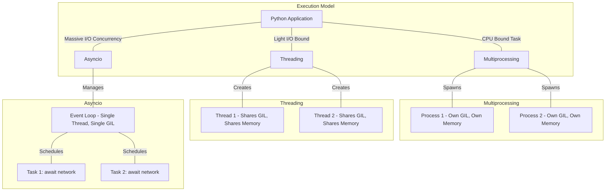
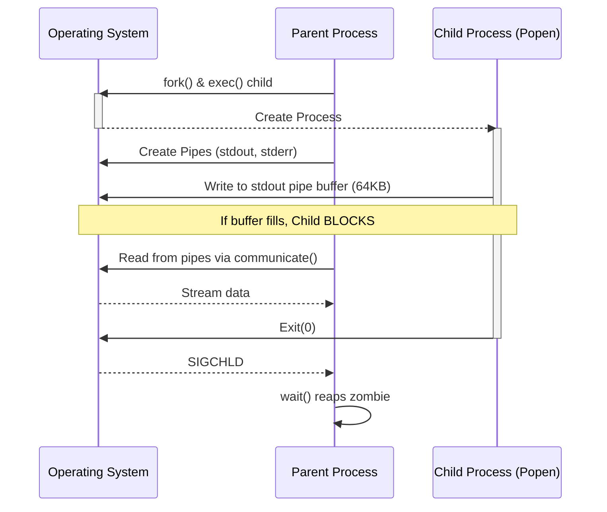

# Python Systems & Concurrency Masterclass for Infrastructure Engineers

## 1. Introduction: The Infrastructure Concurrency Crisis

Infrastructure scaling inevitably hits a bottleneck: I/O. When you are interacting with tens, hundreds, or thousands of external systems—Baseboard Management Controllers (BMCs), Kubernetes API servers, Network Switches, or GPU clusters—sequential execution is no longer viable. 

A simple API call that takes 100ms executed sequentially across 10,000 servers will take **16.6 minutes**. Executed concurrently, it can take less than a second, provided your network switch backplane and the target services can handle the load.

This masterclass dissects the core pillars of Python systems engineering and concurrency. We will move beyond script-kiddie `subprocess.run` and naive `print` debugging, diving deep into advanced `asyncio` event loops, `ThreadPoolExecutors`, structural JSON logging, HTTP retries with exponential backoff, and functional generators.

### 1.1 The Senior DevOps Context

In a senior operations context, an engineer doesn't just "run commands in Python." A Principal Solutions Architect must ask:
- **What happens when the API server drops packets?** (We need retries with jitter).
- **What happens if a child process hangs waiting for stdin?** (We need strict subprocess timeouts and pipe management).
- **How do we debug a failure at 3:00 AM across 5,000 nodes?** (We need structured JSON logging with correlation IDs).
- **How do we prevent our orchestration tool from DDOSing our own infrastructure?** (We need connection pooling and semaphores for backpressure).

---

## 2. The Python Concurrency Model: Threads, Asyncio, and Multiprocessing

Before diving into code, we must fundamentally understand how Python approaches concurrency, governed primarily by the Global Interpreter Lock (GIL).

### 2.1 The Global Interpreter Lock (GIL)

In CPython (the standard Python implementation), the GIL is a mutex that protects access to Python objects, preventing multiple threads from executing Python bytecodes at once.

**Crucial Insight:** 
- The GIL makes **Multithreading** in Python useless for *CPU-bound* tasks (like matrix multiplication).
- The GIL is released during **I/O operations** (like waiting for a network socket or file write). Therefore, multithreading *is* effective for I/O-bound tasks.

### 2.2 Concurrency Architecture Diagram



### 2.3 When to use what?

| Workload Type | Optimal Approach | Example | Why? |
| :--- | :--- | :--- | :--- |
| **CPU Bound** | `multiprocessing` | Data crunching, ML tensor ops (if not in C) | Bypasses GIL by creating separate OS processes. High memory overhead. |
| **Light I/O Bound** | `threading` | Fetching 50 web pages | OS preemption handles switching. Easy to write, but thread overhead scales poorly past ~1,000 threads. |
| **Heavy I/O Bound** | `asyncio` | 10,000 concurrent websocket connections | Cooperative multitasking in a single thread. Minimal memory overhead per task. |
| **Subprocess Execution** | `subprocess` + `asyncio/threading` | Running `kubectl` or `ipmitool` commands | OS manages the child process execution; Python just waits for the pipe. |

---

## 3. Subprocess: It's a Process API, Not a Shell Shortcut

The `subprocess` module is arguably the most misused module by system administrators transitioning to Python. 

### 3.1 The Danger of `os.system` and `shell=True`

:::warning Security Vulnerability: Shell Injection
Let's begin with what **NOT** to do. Using `os.system()` or `shell=True` with unvalidated input allows attackers to execute arbitrary commands.
:::

```python
import os

# DO NOT DO THIS
ip = input("Enter IP to ping: ")
os.system(f"ping -c 4 {ip}")
```

If a user enters `8.8.8.8; rm -rf /`, the shell executes the ping, and then destroys your filesystem. This is a classic shell injection attack.

Even in `subprocess`, using `shell=True` is an anti-pattern unless absolutely required for shell built-ins (like `source` or `type`).

### 3.2 The Modern Approach: `subprocess.run`

`subprocess.run` is the recommended approach for most use cases in modern Python (3.5+).

```python
import subprocess
import logging

logging.basicConfig(level=logging.INFO)
logger = logging.getLogger(__name__)

def safely_run_command(command: list[str]) -> str:
    """
    Executes a shell command safely, preventing shell injection and zombie hangs.
    """
    try:
        # shell=False (default) forces the command to be executed directly, bypassing the shell.
        # capture_output=True captures stdout and stderr.
        # text=True decodes bytes to strings using the default encoding (usually UTF-8).
        # timeout=15 prevents infinite hangs if the subprocess gets stuck waiting for I/O.
        
        logger.info(f"Executing: {' '.join(command)}")
        
        result = subprocess.run(
            command,
            shell=False,
            capture_output=True,
            text=True,
            timeout=15,
            check=True # Raises CalledProcessError if return code is non-zero
        )
        
        logger.info("Command succeeded.")
        return result.stdout.strip()
        
    except subprocess.TimeoutExpired as e:
        logger.error(f"Command timed out after 15s: {e}")
        raise
    except subprocess.CalledProcessError as e:
        logger.error(f"Command failed with RC {e.returncode}. Stderr: {e.stderr}")
        raise

# Example usage
try:
    # Notice the command is a LIST of strings, not a single string.
    output = safely_run_command(["ls", "-la", "/tmp"])
    print(output)
except Exception as e:
    print(f"Failed to execute: {e}")
```

### 3.3 Deep Dive: `subprocess.Popen` and Zombie Deadlocks

When `subprocess.run` isn't enough (e.g., you need to stream output dynamically or interact with `stdin`), you must drop down to `subprocess.Popen`. This is where senior engineers separate themselves from juniors.

#### The Pipe Deadlock Scenario

When you use `subprocess.Popen(..., stdout=subprocess.PIPE, stderr=subprocess.PIPE)`, Python creates OS-level pipes to connect the child process to the parent. OS pipes have finite buffer sizes (typically 64KB on Linux).

If the child process outputs more than 64KB to `stdout`, and the parent process is currently blocked waiting for `stderr` (or just `wait()`ing), the child process will **block indefinitely** trying to write to the full `stdout` pipe. The parent is waiting for the child to finish; the child is waiting for the parent to read the pipe. **Deadlock.**

#### How to fix Deadlock

Always use `communicate()` to read pipes safely, as it uses background threads or asynchronous I/O (depending on implementation/OS) to read both pipes concurrently.

```python
import subprocess
import time

def stream_and_prevent_deadlock():
    # Command that generates a massive amount of output to stdout and some to stderr
    # Using 'dd' to generate 10MB of null bytes encoded in base64
    cmd = ["dd", "if=/dev/urandom", "bs=1M", "count=10"]
    
    # Start the process
    process = subprocess.Popen(
        cmd,
        stdout=subprocess.PIPE,
        stderr=subprocess.PIPE,
        text=False # Keep as bytes for binary data
    )
    
    # ❌ WRONG WAY (Deadlock prone)
    # process.wait() # <--- If stdout fills the 64KB buffer, wait() will hang forever!
    # stdout_data = process.stdout.read() 
    
    # ✅ CORRECT WAY
    try:
        # communicate() reads both pipes concurrently until EOF, then waits for the process to exit.
        stdout_data, stderr_data = process.communicate(timeout=10)
        
        print(f"Successfully read {len(stdout_data)} bytes from stdout.")
        print(f"Process exited with: {process.returncode}")
        
    except subprocess.TimeoutExpired:
        print("Process timed out! Killing it...")
        process.kill()
        # MUST call communicate again after kill to read remaining pipe data and reap the zombie!
        stdout_data, stderr_data = process.communicate() 
        print(f"Killed process. Recovered {len(stdout_data)} bytes.")

stream_and_prevent_deadlock()
```

### 3.4 Subprocess Architecture Flow



---

## 4. Threads & ThreadPoolExecutor: The I/O Workhorse

While `asyncio` is the modern standard, `ThreadPoolExecutor` (from `concurrent.futures`) is often the most pragmatic choice when dealing with blocking libraries (like the standard `requests` library) that are not natively asynchronous.

### 4.1 The Power of ThreadPoolExecutor

Managing threads manually via `threading.Thread` is tedious and error-prone (managing joins, queues, etc.). `ThreadPoolExecutor` abstracts this away by managing a pool of worker threads.

```python
import concurrent.futures
import time
import random

def mock_network_call(server_id: int) -> str:
    """Simulates a blocking network call with random latency."""
    latency = random.uniform(0.1, 0.5)
    time.sleep(latency) # This BLOCKS the thread, releasing the GIL
    
    if random.random() < 0.1: # 10% failure rate
        raise ConnectionError(f"Server {server_id} refused connection")
        
    return f"Server {server_id} OK (latency: {latency:.2f}s)"

def query_fleet_concurrently(server_count: int):
    results = {}
    errors = {}
    
    print(f"Starting query to {server_count} servers...")
    start_time = time.time()
    
    # We use ThreadPoolExecutor to bound concurrency.
    # Max workers = 50 means at most 50 threads will be active at once.
    with concurrent.futures.ThreadPoolExecutor(max_workers=50) as executor:
        # submit() schedules the callable to be executed and returns a Future object representing its execution.
        # We map futures to server IDs to keep track of which future belongs to which server.
        future_to_server = {
            executor.submit(mock_network_call, server_id): server_id 
            for server_id in range(server_count)
        }
        
        # as_completed yields futures as soon as they complete (regardless of submission order)
        for future in concurrent.futures.as_completed(future_to_server):
            server_id = future_to_server[future]
            try:
                # result() will raise any exception caught during thread execution
                data = future.result()
                results[server_id] = data
            except Exception as exc:
                errors[server_id] = exc
                
    end_time = time.time()
    print(f"Finished in {end_time - start_time:.2f} seconds.")
    print(f"Success: {len(results)}, Errors: {len(errors)}")

# Running sequentially would take ~30 seconds (100 * 0.3s avg latency)
# Concurrently with 50 threads, it takes ~0.6 seconds.
query_fleet_concurrently(100)
```

### 4.2 Backpressure in Thread Pools

What happens if you try to query 1,000,000 servers using the above code? 

`future_to_server = {executor.submit(...) for ... in range(1_000_000)}`

You will immediately generate 1,000,000 `Future` objects in memory. The `ThreadPoolExecutor` will only run 50 at a time, but the **queue** of pending tasks will consume gigabytes of RAM. This is a lack of backpressure.

**Solution:** Use an `itertools.islice` to feed the executor in chunks, or use a `queue.Queue` with a maximum size to block submission when the queue is full.

---

## 5. Asyncio: Massive Concurrency for Infrastructure

When dealing with 10,000+ connections, even thread pools fail. Context switching between 10,000 OS threads is incredibly expensive.

`asyncio` uses **cooperative multitasking**. There is only ONE thread, and ONE process. The "Event Loop" acts as a conductor. When a task hits an I/O boundary (like `await network_call`), it willingly yields control back to the event loop, allowing the loop to run another task.

### 5.1 Asyncio Core Concepts

- **Coroutine:** A function defined with `async def`. It does not execute immediately when called; it returns a coroutine object.
- **Await:** The keyword used to yield control back to the event loop while waiting for an I/O operation.
- **Event Loop:** The core engine that tracks all running tasks and resumes them when their I/O is ready.
- **Task:** A wrapper around a coroutine that schedules it on the event loop.

### 5.2 Asyncio Infrastructure Example: Managing BMC APIs

Let's build a robust asynchronous API scraper that implements semaphores (client-side throttling to prevent DDOSing the target) and gathers results efficiently.

```python
import asyncio
import random
import time

# In a real scenario, use `aiohttp` for async HTTP calls. We mock it here.
async def async_bmc_api_call(bmc_ip: str) -> dict:
    """Mock async API call to a Baseboard Management Controller."""
    # Simulate network latency (0.1s to 2s)
    latency = random.uniform(0.1, 2.0)
    
    # 'await asyncio.sleep' is the async equivalent of 'time.sleep'.
    # Crucially, it NON-BLOCKING. It tells the event loop: "I'm paused for 'latency' seconds, go do something else."
    await asyncio.sleep(latency)
    
    if random.random() < 0.05: # 5% failure
        raise TimeoutError(f"Connection to {bmc_ip} timed out")
        
    return {"ip": bmc_ip, "status": "OK", "power_state": "ON"}

async def bounded_fetch(bmc_ip: str, semaphore: asyncio.Semaphore) -> dict:
    """
    Wraps the API call in a Semaphore context manager.
    This strictly limits the number of concurrent executions.
    """
    async with semaphore:
        # We only enter this block if the semaphore has capacity.
        # Otherwise, the task suspends here until another task finishes.
        try:
            result = await async_bmc_api_call(bmc_ip)
            return result
        except Exception as e:
            # We return the exception rather than raising it to gather all results without crashing the loop.
            return {"ip": bmc_ip, "error": str(e)}

async def main_async_pipeline():
    start_time = time.perf_counter()
    
    # 5,000 BMCs to check
    bmc_ips = [f"10.0.{i//255}.{i%255}" for i in range(5000)]
    
    # WARNING: Do not blast 5000 connections instantly.
    # We use a Semaphore to restrict concurrency to 500 max active connections.
    concurrency_limit = 500
    semaphore = asyncio.Semaphore(concurrency_limit)
    
    print(f"Starting async collection of {len(bmc_ips)} endpoints with max concurrency {concurrency_limit}...")
    
    # Create a list of coroutines
    tasks = [bounded_fetch(ip, semaphore) for ip in bmc_ips]
    
    # asyncio.gather schedules them all on the event loop and waits for all to complete.
    # return_exceptions=True prevents one failing task from cancelling all others.
    results = await asyncio.gather(*tasks, return_exceptions=True)
    
    success_count = sum(1 for r in results if "error" not in r)
    error_count = len(results) - success_count
    
    elapsed = time.perf_counter() - start_time
    print(f"Completed in {elapsed:.2f} seconds.")
    print(f"Success: {success_count}, Errors: {error_count}")

# To run the async program, we must inject it into the event loop.
if __name__ == "__main__":
    # asyncio.run(main_async_pipeline()) # Uncomment to run
    pass
```

### 5.3 Troubleshooting Asyncio: Blocking the Loop

The most common mistake senior engineers see is **blocking the event loop**. If you call a synchronous, blocking function (like `time.sleep`, `requests.get`, or heavy CPU math) inside an `async def` function without `await`ing an async equivalent, the **entire event loop halts**. No other tasks can progress until that blocking call finishes.

**How to detect it:** Enable asyncio debug mode.
`PYTHONASYNCIODEBUG=1 python script.py`
This will log warnings like: `Executing <Task ...> took 2.400 seconds`, identifying the exact line of code that blocked the loop.

---

## 6. HTTP APIs, Retries, and Exponential Backoff

In distributed systems, network failure is guaranteed. When your Python script hits an API, it must expect timeouts, 502 Bad Gateways, and 429 Too Many Requests.

### 6.1 The Standard: `requests` with Adapters

Most scripts start with `requests.get(url)`. This is fatal in production if it hangs forever.
Every HTTP request must have a `timeout`.

To implement robust retries, we use `urllib3`'s `Retry` adapter attached to a `requests.Session`.

```python
import requests
from requests.adapters import HTTPAdapter
from urllib3.util.retry import Retry

def create_resilient_session() -> requests.Session:
    """
    Creates a requests.Session pre-configured with exponential backoff retries.
    """
    session = requests.Session()
    
    # Define retry strategy
    # Total retries: 5
    # Backoff factor: 1 (sleeps for [0, 2, 4, 8, 16] seconds between retries)
    # Status forcelist: Retry on 429 (Rate Limit) and 5xx (Server Errors)
    retry_strategy = Retry(
        total=5,
        backoff_factor=1,
        status_forcelist=[429, 500, 502, 503, 504],
        allowed_methods=["HEAD", "GET", "OPTIONS", "POST"] # Carefully consider if POST is idempotent
    )
    
    # Create an adapter with the retry strategy
    adapter = HTTPAdapter(max_retries=retry_strategy)
    
    # Mount the adapter for both HTTP and HTTPS
    session.mount("http://", adapter)
    session.mount("https://", adapter)
    
    return session

def fetch_data():
    session = create_resilient_session()
    
    try:
        # ALWAYS include a timeout. Timeout is a tuple: (connect_timeout, read_timeout)
        response = session.get("https://httpstat.us/503", timeout=(3.0, 10.0))
        response.raise_for_status() # Raises HTTPError for bad responses (4xx, 5xx) that exhaust retries
        return response.json()
    except requests.exceptions.RequestException as e:
        print(f"Critical API failure after retries: {e}")

# fetch_data() # Uncomment to test backoff behavior
```

### 6.2 The Importance of Jitter

:::tip Operations Principle: Jitter
When a massive fleet of agents tries to hit an API server that just rebooted, they might all retry at the exact same intervals (e.g., all wait 2 seconds, all hit the server, all fail, all wait 4 seconds...). This creates a **thundering herd problem** that will repeatedly crash the recovering server. Adding jitter (randomness) prevents this.
:::

**Jitter** adds randomness to the backoff interval, spreading out the retries and allowing the server to recover. `urllib3` does not add jitter by default; for advanced use cases, the `tenacity` library is highly recommended.

---

## 7. Structured Logging for Operations

`print("Script failed")` is unacceptable in infrastructure engineering. When a script runs on 10,000 servers and ships logs to Splunk, Datadog, or ELK, you need **structured, searchable JSON logs**, injected with context (Correlation IDs, Hostnames).

### 7.1 Python `logging` to JSON

Instead of regex-parsing plain text logs, emit logs where variables are distinct JSON fields.

```python
import logging
import json
import datetime
import uuid
import sys

class JSONFormatter(logging.Formatter):
    """Custom JSON formatter for production logs."""
    def format(self, record):
        log_record = {
            "timestamp": datetime.datetime.utcnow().isoformat() + "Z",
            "level": record.levelname,
            "name": record.name,
            "message": record.getMessage(),
            # Include exception traceback if present
            "exception": self.formatException(record.exc_info) if record.exc_info else None,
        }
        
        # Merge any extra contextual dictionary passed into the logger
        if hasattr(record, "extra_ctx"):
            log_record.update(record.extra_ctx)
            
        return json.dumps(log_record)

def setup_json_logger(name: str):
    logger = logging.getLogger(name)
    logger.setLevel(logging.INFO)
    
    # Prevent log propagation to root logger (avoid double logging)
    logger.propagate = False 
    
    handler = logging.StreamHandler(sys.stdout)
    handler.setFormatter(JSONFormatter())
    logger.addHandler(handler)
    
    return logger

# Example usage
prod_logger = setup_json_logger("infrastructure_agent")

def provision_node(node_id: str):
    # We generate a Correlation ID for this specific transaction
    # Every log related to this provisioning will carry this ID
    corr_id = str(uuid.uuid4())
    context = {"node_id": node_id, "correlation_id": corr_id, "region": "us-east-1"}
    
    prod_logger.info(f"Starting provisioning for {node_id}", extra={"extra_ctx": context})
    
    try:
        # Simulate a failure
        raise ValueError("Invalid firmware version detected.")
    except Exception as e:
        context["error_code"] = "FW_ERR_001"
        # exc_info=True automatically attaches the stack trace to the JSON log
        prod_logger.error("Provisioning failed", extra={"extra_ctx": context}, exc_info=True)

provision_node("srv-db-001")
```

The output is now easily parsed by any modern observability tool:
```json
{"timestamp": "2023-10-27T10:00:00Z", "level": "INFO", "name": "infrastructure_agent", "message": "Starting provisioning for srv-db-001", "exception": null, "node_id": "srv-db-001", "correlation_id": "a1b2...", "region": "us-east-1"}
```

---

## 8. Advanced Patterns: Generators & Decorators Without Magic

When parsing massive operational files (e.g., a 10GB switch syslog file) or wrapping network calls, we need efficient, reusable abstractions.

### 8.1 Generators for Memory Efficiency

Reading a 10GB file into memory with `f.readlines()` will OOM (Out of Memory) your script.
**Generators** yield one item at a time, keeping memory usage constant regardless of data size.

```python
def parse_huge_log(file_path: str):
    """
    A generator that lazily yields parsed log lines.
    Memory footprint remains ~0MB regardless of file size.
    """
    try:
        with open(file_path, 'r') as f:
            for line in f:
                # We yield control back to the caller for each line
                if "CRITICAL" in line:
                    yield {"status": "critical", "raw": line.strip()}
    except FileNotFoundError:
        pass # Handle appropriately

# The file is processed streamingly.
# for critical_event in parse_huge_log("/var/log/syslog"):
#     alert_ops(critical_event)
```

### 8.2 Decorators for Operational Concerns

A **decorator** is a function that takes another function and extends its behavior without explicitly modifying it. They are perfect for cross-cutting concerns like retries, logging, or timing.

```python
from functools import wraps
import time

def timing_decorator(func):
    """Decorates a function to log its execution time."""
    @wraps(func) # @wraps preserves the original function's name and docstring
    def wrapper(*args, **kwargs):
        start = time.perf_counter()
        
        # Execute the original function
        result = func(*args, **kwargs)
        
        elapsed = time.perf_counter() - start
        print(f"[TIMING] {func.__name__} took {elapsed:.4f} seconds to execute.")
        
        return result
    return wrapper

@timing_decorator
def complex_infrastructure_task():
    """Simulates a complex task."""
    time.sleep(0.5)
    return "Done"

# When called, it automatically logs the timing.
# complex_infrastructure_task()
```

---

## 9. Senior Solutions Architect Scenarios

### Scenario 1: The Zombie Outbreak
**Symptom:** A cronjob runs a Python script every 5 minutes. After 3 days, the server crashes due to hitting the process limit. `htop` shows 1,500 `[python] <defunct>` processes.
**Analysis:** The script is spawning child processes using `subprocess.Popen` but is failing to call `wait()` or `communicate()` on them, leaving them as zombies when they terminate. Or, the parent process is crashing without cleaning up its children.
**Solution:** Ensure all subprocesses are launched within a context manager `with subprocess.Popen(...) as p:` or rigorously implement `p.communicate()` with timeouts inside `try/finally` blocks.

### Scenario 2: The Silent Async Hang
**Symptom:** An `asyncio` script designed to poll 100 switches concurrently hangs indefinitely after 10 minutes. No errors, CPU is idle.
**Analysis:** A task inside the event loop called a synchronous blocking function (e.g., `requests.get` instead of `aiohttp.ClientSession.get`, or a `subprocess.run` without offloading to a thread pool). Or, a lock was acquired and never released.
**Solution:** Run with `PYTHONASYNCIODEBUG=1`. Utilize `asyncio.wait_for` to wrap all network coroutines with strict timeouts.

### Scenario 3: The Thread Pool OOM
**Symptom:** A script using `ThreadPoolExecutor` is tasked with processing a list of 10,000,000 S3 objects. The script consumes 32GB of RAM and is killed by the OOM-killer before it even starts downloading.
**Analysis:** The script iterated over the 10,000,000 objects and instantly created 10,000,000 `Future` objects via `executor.submit()`, storing them all in memory in a massive dictionary/list.
**Solution:** Implement backpressure. Use an iterator pattern and a bounded queue to submit tasks to the executor in chunks (e.g., 10,000 at a time), only submitting more when the previous chunk completes.

---

## 10. Summary & Production Checklist

Before deploying any Python infrastructure automation to production, a Senior Engineer must verify:

1. [ ] **Timeouts:** Are there explicit timeouts on *every* network call and subprocess execution?
2. [ ] **Retries:** Are transient errors handled with exponential backoff and jitter?
3. [ ] **Logging:** Is logging structured (JSON), capturing tracebacks, and utilizing correlation IDs?
4. [ ] **Concurrency Limit:** If using `asyncio` or `threading`, is there a bound (Semaphore/Max Workers) to prevent resource exhaustion or self-DDOS?
5. [ ] **Resource Cleanup:** Are context managers (`with ...`) used for all files, network sessions, and subprocesses to guarantee closure upon exception?
6. [ ] **Error Propagation:** Are exceptions caught contextually and wrapped with meaningful operational context, rather than swallowed by a bare `except:`?

Mastering these paradigms shifts Python from a simple scripting language into a robust systems engineering tool capable of managing hyperscale infrastructure.

---

## Appendix A: Exhaustive Code Reference Library

For the working engineer, this section provides copy-pasteable, production-ready templates for the most common infrastructure patterns.

### A.1 The Ultimate Asyncio Worker Pool Template

This template demonstrates a production-grade worker pool utilizing `asyncio.Queue` for passing work between a producer and multiple consumer workers. It includes graceful shutdown handling for SIGINT (Ctrl+C).

```python
import asyncio
import signal
import logging
from typing import Any

logging.basicConfig(level=logging.INFO, format="%(asctime)s [%(levelname)s] %(message)s")
logger = logging.getLogger(__name__)

async def worker(name: str, queue: asyncio.Queue, shutdown_event: asyncio.Event):
    """Consumer worker that processes items from the queue."""
    logger.info(f"Worker {name} started.")
    while not shutdown_event.is_set():
        try:
            # wait_for allows us to periodically check the shutdown event
            # if the queue is empty, rather than blocking forever.
            item = await asyncio.wait_for(queue.get(), timeout=1.0)
            
            # Simulate work
            logger.info(f"Worker {name} processing {item}...")
            await asyncio.sleep(0.5)
            
            # Mark the item as done
            queue.task_done()
            logger.info(f"Worker {name} finished {item}.")
            
        except asyncio.TimeoutError:
            # Expected if the queue is empty, just loop and check shutdown_event again
            continue
        except asyncio.CancelledError:
            logger.warning(f"Worker {name} cancelled.")
            break
        except Exception as e:
            logger.error(f"Worker {name} encountered error: {e}")
            
    logger.info(f"Worker {name} shutting down gracefully.")

async def producer(queue: asyncio.Queue, num_items: int):
    """Produces items and puts them into the queue."""
    for i in range(num_items):
        item = f"task-{i}"
        await queue.put(item)
        logger.info(f"Producer enqueued {item}")
        await asyncio.sleep(0.1) # Simulate production delay

async def main():
    # Setup graceful shutdown event
    shutdown_event = asyncio.Event()
    
    def signal_handler():
        logger.warning("Received shutdown signal. Initiating graceful shutdown...")
        shutdown_event.set()

    # Register signal handlers for graceful exit (Linux/macOS)
    loop = asyncio.get_running_loop()
    for sig in (signal.SIGINT, signal.SIGTERM):
        try:
            loop.add_signal_handler(sig, signal_handler)
        except NotImplementedError:
            # Windows does not support add_signal_handler for all signals
            pass
            
    # Initialize the work queue (bounded to prevent infinite memory growth)
    queue = asyncio.Queue(maxsize=100)
    
    # Start the workers
    num_workers = 5
    workers = [
        asyncio.create_task(worker(f"W{i}", queue, shutdown_event))
        for i in range(num_workers)
    ]
    
    # Start the producer
    prod_task = asyncio.create_task(producer(queue, 50))
    
    # Wait for the producer to finish generating all items
    await prod_task
    
    # Wait for the queue to be fully processed by the workers
    # We only wait if shutdown hasn't been triggered
    if not shutdown_event.is_set():
        logger.info("Producer finished. Waiting for queue to drain...")
        await queue.join()
        logger.info("Queue is empty. Signaling workers to stop.")
        shutdown_event.set()
        
    # Wait for all workers to shut down cleanly
    await asyncio.gather(*workers)
    logger.info("All components shut down successfully.")

# if __name__ == '__main__':
#     try:
#         asyncio.run(main())
#     except KeyboardInterrupt:
#         logger.info("Process interrupted by user.")
```

### A.2 The Thread-Safe Singleton Pattern

In infrastructure code, you often need exactly one instance of a configuration manager, a database connection pool, or a metrics registry. Implementing a Singleton in Python requires thread-safety locks to prevent race conditions during initialization.

```python
import threading
from typing import Any

class ThreadSafeSingletonMeta(type):
    """
    A thread-safe implementation of Singleton using a metaclass.
    Any class utilizing this metaclass will act as a Singleton.
    """
    _instances = {}
    _lock = threading.Lock()

    def __call__(cls, *args, **kwargs) -> Any:
        # First check (without lock) for performance
        if cls not in cls._instances:
            # Second check (with lock) for thread safety during creation
            with cls._lock:
                if cls not in cls._instances:
                    # Create the instance
                    instance = super().__call__(*args, **kwargs)
                    cls._instances[cls] = instance
        return cls._instances[cls]

class GlobalMetricsRegistry(metaclass=ThreadSafeSingletonMeta):
    """
    A globally accessible, thread-safe metrics registry.
    """
    def __init__(self):
        self._counters = {}
        self._lock = threading.Lock() # Lock for mutating the internal dictionary
        print("Initializing GlobalMetricsRegistry (Should only happen once)")

    def increment(self, metric_name: str, value: int = 1):
        with self._lock:
            if metric_name not in self._counters:
                self._counters[metric_name] = 0
            self._counters[metric_name] += value

    def get_snapshot(self) -> dict:
        with self._lock:
            # Return a copy to avoid exposing mutable internal state
            return dict(self._counters)

# Usage demonstration:
# registry1 = GlobalMetricsRegistry()
# registry2 = GlobalMetricsRegistry()
# assert registry1 is registry2  # True
# registry1.increment("api_requests")
# print(registry2.get_snapshot())  # {'api_requests': 1}
```

### A.3 Robust Multiprocessing for Heavy Data Pipelines

When you must process terabytes of data (e.g., gzip uncompression, JSON parsing, and transformation) where the CPU is the bottleneck, `multiprocessing` is required to bypass the GIL.

```python
import multiprocessing
import os
import time

def cpu_intensive_processor(data_chunk: list[int]) -> int:
    """
    Simulates heavy CPU computation (e.g., cryptographic hashing, image processing).
    """
    print(f"Process {os.getpid()} starting chunk processing...")
    result = 0
    # Pointless heavy math to simulate CPU load
    for number in data_chunk:
        result += (number ** 2) % 99999
    return result

def run_multiprocessing_pipeline():
    """
    Demonstrates using a ProcessPoolExecutor for CPU-bound tasks.
    """
    from concurrent.futures import ProcessPoolExecutor, as_completed
    
    # Generate mock dataset (100 chunks of data)
    dataset = [list(range(10000)) for _ in range(100)]
    
    print(f"Starting pipeline on {multiprocessing.cpu_count()} CPU cores...")
    start = time.perf_counter()
    
    total_result = 0
    
    # Use ProcessPoolExecutor to map data chunks to CPU cores
    with ProcessPoolExecutor(max_workers=multiprocessing.cpu_count()) as executor:
        # submit tasks to the pool
        futures = [executor.submit(cpu_intensive_processor, chunk) for chunk in dataset]
        
        # Gather results as they complete
        for future in as_completed(futures):
            try:
                chunk_result = future.result()
                total_result += chunk_result
            except Exception as e:
                print(f"Chunk processing failed: {e}")
                
    elapsed = time.perf_counter() - start
    print(f"Pipeline finished in {elapsed:.2f} seconds. Result: {total_result}")

# if __name__ == '__main__':
#    run_multiprocessing_pipeline()
```

### A.4 Custom Exception Hierarchies

A hallmark of senior Python code is the use of structured, hierarchical custom exceptions, rather than relying on generic `Exception` or `ValueError`. This allows callers to precisely handle different failure domains (Network vs Auth vs Validation).

```python
class InfrastructureError(Exception):
    """Base exception for all infrastructure automation errors."""
    def __init__(self, message: str, node_id: str = None):
        super().__init__(message)
        self.node_id = node_id

class ConnectivityError(InfrastructureError):
    """Raised when a node cannot be reached over the network."""
    pass

class AuthenticationError(InfrastructureError):
    """Raised when SSH/API authentication fails."""
    pass

class ConfigurationError(InfrastructureError):
    """Raised when a node's configuration state is invalid."""
    def __init__(self, message: str, node_id: str = None, missing_keys: list = None):
        super().__init__(message, node_id)
        self.missing_keys = missing_keys or []

def validate_node(node_config: dict):
    node_id = node_config.get("id", "UNKNOWN")
    
    if "ip" not in node_config:
        raise ConfigurationError("Missing IP address", node_id=node_id, missing_keys=["ip"])
        
    if node_config.get("auth") == "failed":
        raise AuthenticationError("Invalid SSH key", node_id=node_id)
        
    return True

# Usage pattern:
# try:
#     validate_node({"id": "srv1", "auth": "failed"})
# except AuthenticationError as e:
#     print(f"Alert Security: {e.node_id} auth failed.")
# except ConfigurationError as e:
#     print(f"Alert Provisioning: {e.node_id} missing {e.missing_keys}")
# except InfrastructureError as e:
#     print(f"Generic infrastructure failure: {e}")
```

### A.5 The Tenacity Library: Advanced Retries

While we showed `urllib3` retries earlier, the `tenacity` library is the industry standard for general-purpose retry logic in Python. It can retry any function, not just HTTP calls.

```python
import random
from tenacity import retry, stop_after_attempt, wait_exponential, retry_if_exception_type, before_sleep_log
import logging

# Retry configuration:
# 1. Stop trying after 5 total attempts.
# 2. Wait exponentially between attempts: 2^x * 1 second (1s, 2s, 4s, 8s). Max wait = 10s.
# 3. Only retry if the exception is a ConnectionError or TimeoutError.
# 4. Log a warning before sleeping between retries.
@retry(
    stop=stop_after_attempt(5),
    wait=wait_exponential(multiplier=1, min=1, max=10),
    retry=retry_if_exception_type((ConnectionError, TimeoutError)),
    before_sleep=before_sleep_log(logger, logging.WARNING)
)
def unreliable_rpc_call():
    """Simulates a highly flaky RPC call."""
    chance = random.random()
    if chance < 0.7:
        raise ConnectionError("Connection dropped unexpectedly.")
    elif chance < 0.9:
        raise ValueError("Invalid payload received.") # Will NOT be retried due to retry_if_exception_type
    
    return "RPC Success"

# try:
#     result = unreliable_rpc_call()
#     print(result)
# except Exception as e:
#     print(f"Call definitively failed: {e}")
```

## Appendix B: Network Tooling Automation Masterclass

Infrastructure heavily relies on network tooling. Wrapping binaries like `nmap`, `ipmitool`, or `kubectl` requires specialized handling.

### B.1 Wrapping `kubectl` with Subprocess

```python
import subprocess
import json
from typing import Dict, Any, List

def kubectl_get_pods(namespace: str = "default") -> List[Dict[Any, Any]]:
    """
    Executes 'kubectl get pods -n <namespace> -o json' and parses the output.
    """
    cmd = ["kubectl", "get", "pods", "-n", namespace, "-o", "json"]
    
    try:
        result = subprocess.run(
            cmd,
            check=True,
            capture_output=True,
            text=True,
            timeout=10 # Avoid hangs if kube-apiserver is unresponsive
        )
        
        # Parse the JSON output strictly
        parsed_data = json.loads(result.stdout)
        
        # Validate the expected structure exists before returning
        if "items" not in parsed_data:
             raise ValueError("Unexpected kubectl JSON structure: missing 'items'")
             
        return parsed_data["items"]
        
    except subprocess.TimeoutExpired:
        raise TimeoutError(f"kubectl timed out after 10s for namespace {namespace}")
    except subprocess.CalledProcessError as e:
        raise RuntimeError(f"kubectl failed (RC {e.returncode}): {e.stderr.strip()}")
    except json.JSONDecodeError as e:
        raise ValueError(f"Failed to parse kubectl JSON output: {e}")

# Example processing:
# pods = kubectl_get_pods("kube-system")
# for pod in pods:
#     name = pod["metadata"]["name"]
#     phase = pod["status"]["phase"]
#     print(f"{name}: {phase}")
```

### B.2 Advanced Asyncio Subprocess for Parallel Execution

If you need to run `ping` against 1,000 IP addresses simultaneously, `ThreadPoolExecutor` + `subprocess.run` will require 1,000 threads. This is inefficient. 
Instead, we use `asyncio.create_subprocess_exec` to spawn 1,000 processes managed entirely by a single Python event loop thread!

```python
import asyncio
import sys

async def async_ping(ip: str) -> bool:
    """
    Asynchronously executes the ping command and returns True if successful.
    """
    # Define platform-specific ping arguments
    if sys.platform == "win32":
        cmd = ["ping", "-n", "1", "-w", "1000", ip]
    else:
        cmd = ["ping", "-c", "1", "-W", "1", ip]
        
    try:
        # Launch the child process asynchronously
        process = await asyncio.create_subprocess_exec(
            *cmd,
            stdout=asyncio.subprocess.PIPE,
            stderr=asyncio.subprocess.PIPE
        )
        
        # Wait for the process to complete and capture output
        stdout, stderr = await process.communicate()
        
        # Return True if exit code is 0 (Success)
        return process.returncode == 0
        
    except Exception as e:
        print(f"Error pinging {ip}: {e}")
        return False

async def parallel_ping_sweep(subnet: str):
    """
    Pings 254 addresses in a /24 subnet simultaneously.
    """
    base_ip = subnet.rsplit('.', 1)[0]
    ips = [f"{base_ip}.{i}" for i in range(1, 255)]
    
    print(f"Starting parallel ping sweep on {base_ip}.0/24...")
    
    # Create coroutines for all 254 IPs
    tasks = [async_ping(ip) for ip in ips]
    
    # Execute them concurrently
    results = await asyncio.gather(*tasks)
    
    # Analyze results
    alive_hosts = [ip for ip, is_alive in zip(ips, results) if is_alive]
    print(f"Found {len(alive_hosts)} alive hosts: {alive_hosts}")

# asyncio.run(parallel_ping_sweep("192.168.1.0"))
```

## Appendix C: Design Patterns for API Clients

When writing Python libraries intended for other teams to use (e.g., an internal SDK for your company's proprietary switch OS), API design is critical.

### C.1 Context Managers for Session Cleanup

Always design clients that manage resources (TCP sockets) using context managers (`__enter__` and `__exit__`).

```python
import requests

class SwitchAPIClient:
    """
    A client for a hypothetical Network Switch REST API.
    Designed to be used exclusively as a Context Manager to ensure session cleanup.
    """
    def __init__(self, host: str, token: str):
        self.host = host
        self.token = token
        self.session = None
        
    def __enter__(self):
        """Initializes the session when entering a 'with' block."""
        self.session = requests.Session()
        self.session.headers.update({
            "Authorization": f"Bearer {self.token}",
            "Accept": "application/json"
        })
        return self # Returns the client instance to the 'as' variable
        
    def __exit__(self, exc_type, exc_val, exc_tb):
        """Cleans up the session when exiting the 'with' block, even on exceptions."""
        if self.session:
            self.session.close()
            
    def get_port_status(self, port_id: str) -> dict:
        if not self.session:
            raise RuntimeError("Client must be used within a context manager.")
            
        url = f"https://{self.host}/api/v1/ports/{port_id}"
        response = self.session.get(url, timeout=5.0)
        response.raise_for_status()
        return response.json()

# Proper Usage:
# with SwitchAPIClient("10.0.0.1", "secret123") as client:
#     status = client.get_port_status("eth0")
#     print(status)
#
# Improper Usage (will raise RuntimeError):
# client = SwitchAPIClient("10.0.0.1", "secret123")
# client.get_port_status("eth0") 
```

## Final Thoughts
This concludes the masterclass. Operations at scale require defensive programming. Assume the network is hostile, dependencies will stall, and file systems will fill up. Use `asyncio` for mass concurrency, `ThreadPoolExecutor` for blocking legacy libraries, structural JSON logging for observability, and rigorous context managers to prevent resource leaks. 
