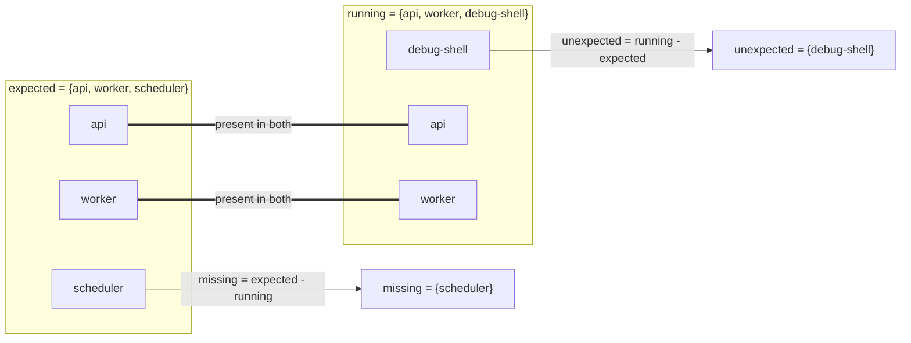
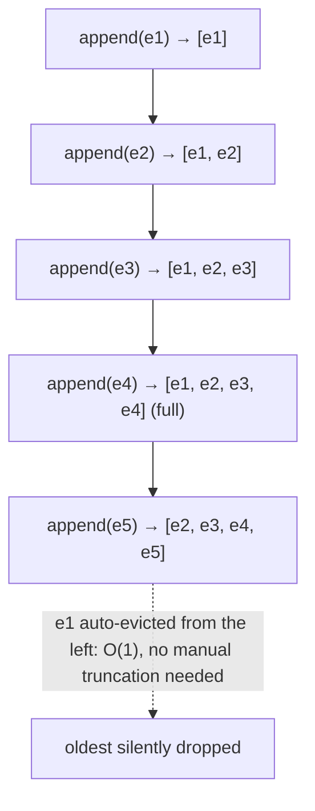

## Step 3 — collections and loops

A list holds an ordered collection. A dictionary maps keys to values:

```python
nodes = [
    {"name": "gpu-01", "gpus": 8, "temperature_c": 54},
    {"name": "gpu-02", "gpus": 7, "temperature_c": 61},
    {"name": "gpu-03", "gpus": 8, "temperature_c": 82},
]

for node in nodes:
    if node["gpus"] != 8:
        status = "CRITICAL"
    elif node["temperature_c"] >= 75:
        status = "WARNING"
    else:
        status = "OK"

    print(f'{node["name"]}: {status}')
```

Expected output:

```text
gpu-01: OK
gpu-02: CRITICAL
gpu-03: WARNING
```

**Break it:** remove the `temperature_c` key from one node. The `KeyError` tells you a required field is absent. Later you will validate input explicitly; for now, understand the failure.

## Data structures by operational purpose

| Type | Use it when | Infrastructure example |
|---|---|---|
| `str` | text is meaningful as text | hostname, URL, log message |
| `int`/`float` | arithmetic or numeric comparison is required | retry count, temperature |
| `bool` | exactly true/false state | dry-run enabled |
| `list` | ordered items, duplicates allowed | ordered probe results |
| `tuple` | fixed record/immutable sequence semantics are useful | coordinate/version parts |
| `set` | uniqueness and fast membership matter | failed node names |
| `dict` | lookup by key | node name to health record |
| `None` | explicit absence of a value | metric not reported |

Do not convert every value to a string because input arrived as text. Parse at the boundary so decision code operates on meaningful types.

## Assignment, mutation and the first subtle bug

```python
expected = ["gpu-01", "gpu-02"]
selected = expected
selected.append("gpu-03")
print(expected)
```

Output:

```text
['gpu-01', 'gpu-02', 'gpu-03']
```

Both names refer to the same mutable list. Assignment did not copy it. Use `expected.copy()` when a separate shallow list is intended, and understand that nested objects can still be shared.

## Start with the basics

**The problem: not all ways of storing values are equal**

Every program needs to hold onto more than one value at a time — a list of pod names, a set of node IDs, a lookup table from hostname to IP address. Your first instinct might be "just put them in an array/list, I've done that since CS101." That instinct is exactly what this chapter argues against, and here's the plain-language reason why: how you organize values in memory determines which operations are fast and which are slow. There is no arrangement that makes everything fast — you always trade one kind of speed for another. That's the whole idea. This chapter's job is to help you consciously choose the trade-off instead of defaulting to whatever's most familiar.

**Analogy: papers in a stack vs. a phone book vs. a filing cabinet with labeled drawers**

Say you need to find "Chen, R." among 10,000 names.
- If the names are on loose papers dumped in a box, unsorted, you have to look at every single paper until you find it (or confirm it's not there). Double the papers, double the worst-case work.
- If the names are printed in a phone book, sorted alphabetically, you can jump straight to the "Ch" section and narrow down fast.
- If the names are pre-sorted into labeled drawers by first letter, and each drawer only ever has a handful of papers, finding "Chen, R." is close to instant regardless of how many total names exist — you go straight to drawer "C" and look at a tiny pile.

Those three setups are the same real difference formalized into "Big-O" terms:
- **O(n)** ("order n"): the unsorted box. Work grows in direct proportion to how many items there are. Double the items, double the time.
- **O(1)** ("order 1", "constant time"): the labeled drawer. The time barely depends on how many total items exist — it stays roughly the same whether there are 100 names or 10 million.
- Big-O isn't a stopwatch measurement — it's a rough shape of how work scales as the pile grows. That's genuinely all it means before anyone writes a formal definition at you.

**The four basic collection types — each is a different labeled drawer**

Before naming these, notice the everyday problems that motivate them:

1. **"I have a sequence of things in a specific order, and I might add more or change one"** — for example, the steps in a deployment pipeline. You want to keep the order, and you want to be able to change it. Python's answer: a **list** — an ordered, changeable sequence.

2. **"I have a fixed record and I never want it accidentally mutated"** — for example, a `(latitude, longitude)` coordinate, or a row you pulled from a database that should stay exactly as read. Python's answer: a **tuple** — an ordered, unchangeable sequence. "Unchangeable" (immutable) here means once created, you cannot add, remove, or replace an item in it — you'd have to build a new tuple.

3. **"I need to know whether something is in my collection, and I don't care about order or duplicates"** — for example, "which node names have I already seen?" Python's answer: a **set** — an unordered bag that automatically throws away duplicates and is built specifically to make "is X in here?" fast (that O(1) drawer, not the O(n) box).

4. **"I need to look things up by name, not by position"** — for example, "given a hostname, give me its IP." Python's answer: a **dict** (dictionary) — a table of key-to-value pairs, like the labeled-drawer cabinet: give it the label (the "key"), it hands you the contents (the "value") directly, without scanning everything else.

**Small runnable example**

```python
# list: ordered, changeable
pipeline_steps = ["build", "test"]
pipeline_steps.append("deploy")
print(pipeline_steps)          # ['build', 'test', 'deploy']

# tuple: ordered, unchangeable
coordinate = (37.7749, -122.4194)
# coordinate[0] = 40.0   # would raise: TypeError: 'tuple' object does not support item assignment

# set: unordered, no duplicates, fast membership
seen_nodes = {"gpu-1", "gpu-2"}
seen_nodes.add("gpu-1")        # adding a duplicate does nothing
print(seen_nodes)              # {'gpu-1', 'gpu-2'}
print("gpu-2" in seen_nodes)   # True — checked in ~constant time, not by scanning

# dict: keyed lookup table
ip_by_host = {"gpu-1": "10.0.0.1", "gpu-2": "10.0.0.2"}
print(ip_by_host["gpu-2"])     # 10.0.0.2 — direct lookup, no scanning
```

Trace it by hand: `pipeline_steps` starts as two items, `.append("deploy")` mutates it in place to three items — printing shows `['build', 'test', 'deploy']`. `seen_nodes` is a set built from two strings; adding `"gpu-1"` again changes nothing since sets silently drop duplicates, so it still prints as a two-element set. The membership check `"gpu-2" in seen_nodes` is `True` and, critically, doesn't need to inspect every other element to know that. `ip_by_host["gpu-2"]` goes directly to the "gpu-2" drawer and returns `"10.0.0.2"`.

**Check your understanding**

1. *Q: You need to store 3 million already-deduplicated event IDs and only ever ask "have I seen this ID before?" Which structure, and why?*
   A: A set. Membership checking (`in`) on a set is O(1) on average — roughly constant time regardless of how many IDs are stored — while checking membership in a list is O(n), meaning it gets proportionally slower as the list grows. With 3 million items the difference is the gap between "instant" and "noticeably slow."

2. *Q: Why can a tuple be used as a dict key, but a list cannot?*
   A: Dict keys must be hashable (able to be converted into a fixed-size lookup code that never changes for a given value), and Python only allows hashing on immutable objects — because if the object could change after being used as a key, its hash would go stale and the lookup table would break. Tuples are immutable (assuming their contents are too), so they're hashable; lists are mutable, so they're explicitly barred from being dict keys.

3. *Q: If O(1) means "constant time" and O(n) means "grows in proportion to n," which one would you rather have for an operation you're about to run inside a loop over a million items?*
   A: O(1) — because running it a million times keeps costing roughly the same per-call amount, versus O(n), where running it inside another loop of size n makes the whole thing O(n²) (n multiplied by n) — the classic "nested loop membership check" trap this chapter warns about directly.

With that working model in place — organizing choice is a trade-off, and Big-O is just the shape of how each choice scales — here's how the chapter turns that into concrete rules for picking lists, tuples, sets, and dicts by the operation your problem actually needs.

> After this chapter you should be able to: Select lists, tuples, sets, dictionaries, queues, and dataclasses based on access patterns and invariants.

Infrastructure scripts spend much of their time transforming collections: pod lists, node inventories, labels, API objects, log lines, metrics, and desired-state configuration. The useful question is not "which collection do I remember?" but "what operation dominates this problem?"

| Need | Structure | Reason |
|---|---|---|
| Preserve ordered items, allow duplicates | list | Indexing, append, iteration; O(n) membership search |
| Fixed record-like sequence | tuple | Signals "do not mutate"; hashable when contents are hashable |
| Membership / de-duplication | set | Average O(1) membership and set algebra |
| Keyed lookup / structured object | dict | Average O(1) lookup by key; natural fit for JSON |

**The complexity table, extended with what these volumes don't always spell out — the operations that are deceptively expensive:**
| Operation | list | dict | set |
|---|---|---|---|
| append/add | O(1) amortized | O(1) avg | O(1) avg |
| `x in collection` | **O(n)** ← the trap | O(1) avg | O(1) avg |
| `collection[i]` (index) | O(1) | O(1) by key | n/a |
| insert at front | O(n) — shifts everything | n/a | n/a |

The single most common performance bug in inventory-scanning scripts: `if pod_name in big_list:` inside a loop over another big list — that's O(n×m), and swapping `big_list` for a `set` turns it into O(n) total. This is exactly the reasoning the chapter's set-algebra example below demonstrates.

**Diagram: set difference as the membership answer**

The double lines mark names present in both sets — set difference just subtracts them out, leaving each side's leftovers.

**Set algebra turns inventory comparison into a direct expression of intent**
```python
expected = {"api", "worker", "scheduler"}
running = {"api", "worker", "debug-shell"}

missing = expected - running
unexpected = running - expected

print("missing:", missing)      # {'scheduler'}
print("unexpected:", unexpected)  # {'debug-shell'}
```

```python
nodes = [
    {"name": "gpu-1", "zone": "a", "gpus": 8},
    {"name": "gpu-2", "zone": "b", "gpus": 8},
    {"name": "cpu-1", "zone": "a", "gpus": 0},
]

gpu_by_name = {n["name"]: n for n in nodes if n["gpus"] > 0}
print(gpu_by_name["gpu-2"]["zone"])
```
The comprehension builds an index once. If you need repeated lookups by node name, this is better than scanning the list each time. In interviews, explain the algorithmic reason: build O(n), then average O(1) lookup, instead of O(n) for every query.

**`collections` module — the structures this chapter's table doesn't cover but a senior candidate should reach for:**
```python
from collections import defaultdict, Counter, deque

# defaultdict — eliminates the "if key not in dict: dict[key] = []" boilerplate
by_zone = defaultdict(list)
for n in nodes:
    by_zone[n["zone"]].append(n["name"])
# {'a': ['gpu-1', 'cpu-1'], 'b': ['gpu-2']}

# Counter — frequency counting in one line (e.g. "which error appears most in this log batch")
error_counts = Counter(log_line.split()[0] for log_line in error_lines)
print(error_counts.most_common(3))

# deque — O(1) append/pop from BOTH ends; a list is O(n) to pop from the front
recent_events = deque(maxlen=100)   # fixed-size ring buffer — perfect for "last N events" tailing
recent_events.append(new_event)     # oldest auto-evicted once full
```
`deque(maxlen=N)` specifically is worth knowing cold for any "keep the last N log lines / metric samples in memory" tooling question — it's the correct answer, not a manually-truncated list.

**Diagram: `deque(maxlen=N)` as a ring buffer**


## Work the scenario step by step
**Scenario:** You receive 50,000 pod names from two clusters and need to report names present in cluster A but absent in B.

1. Recognize that the dominant operation is membership comparison, not ordered presentation.
2. Convert names to sets.
3. Use set difference A - B.
4. Sort only when producing human-readable output, because sorting is an output concern rather than a membership concern.

**Reasoned conclusion:** A set makes the algorithm both clearer and faster than nested loops.

**Timed proof, worth running once so the complexity argument isn't just theoretical:**
```python
import time, random
a = [f"pod-{i}" for i in range(50000)]
b = [f"pod-{i}" for i in range(0, 50000, 2)]  # half overlap

start = time.perf_counter()
missing_slow = [x for x in a if x not in b]          # O(n*m) — list membership
print(f"list-based: {time.perf_counter()-start:.3f}s")

start = time.perf_counter()
missing_fast = set(a) - set(b)                        # O(n+m) — set difference
print(f"set-based:  {time.perf_counter()-start:.3f}s")
# list-based: ~4.200s   set-based: ~0.006s   — roughly 700x on this size
```

## Practice before moving on
1. Write a function that groups pods by namespace using dict[str, list[str]].
2. Find duplicate IP addresses in an inventory with a set.
3. Given a list of 100k log event IDs, explain when a list is acceptable and when a set is the right index.

4. Rewrite the namespace-grouping function from Practice #1 using `defaultdict(list)` instead of manual `if key not in dict` checks, and explain the readability/correctness tradeoff (fewer lines, but a `defaultdict` silently creates entries on any lookup — including typos — which can hide bugs a plain `dict.get()` would surface).

## Targeted references
[Udemy - Python for DevOps](https://www.udemy.com/course/python-devops) - Relevant lessons: Introduction to lists; Tuples; Set operations; Dictionaries; Server Inventory Reporter coding exercise.
