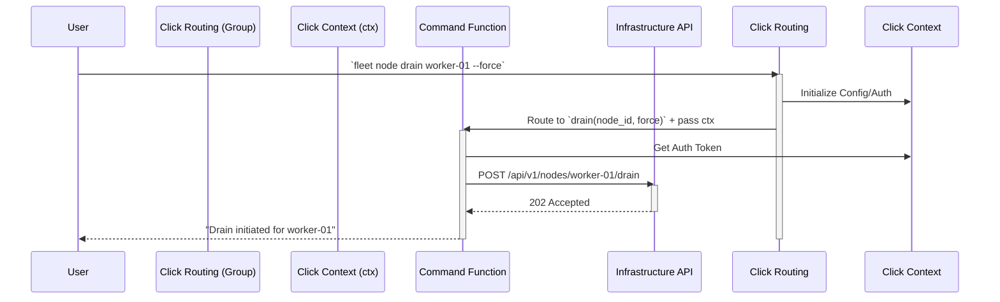
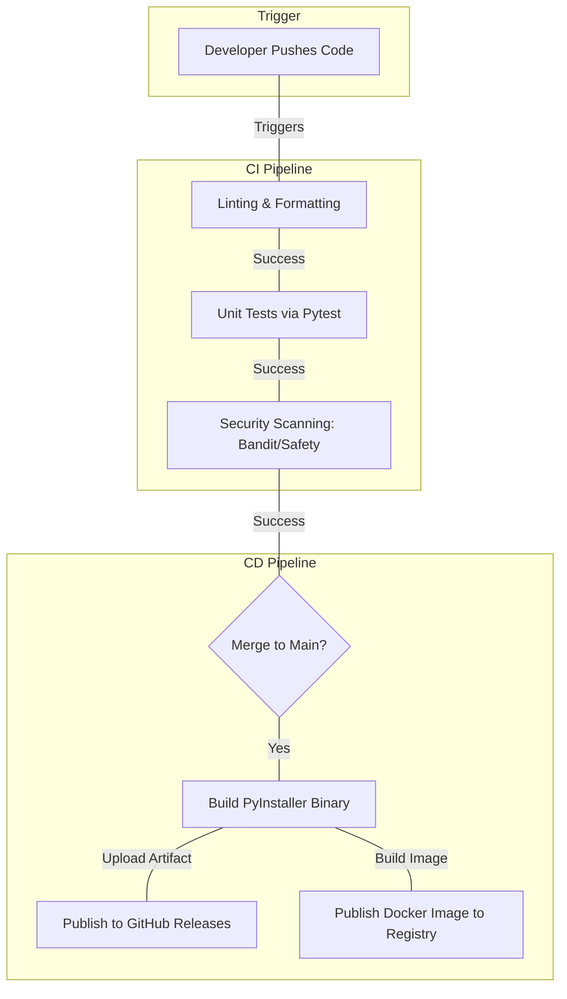

# Python Tooling and Operations Masterclass

## 1. Introduction: The Reality of Infrastructure Python

When Python is used for infrastructure engineering, DevOps, and Site Reliability Engineering (SRE), the requirements shift drastically from standard application development. A web service might crash and be restarted by Kubernetes; an infrastructure script that crashes halfway through a database migration or a multi-node GPU cluster update can leave the system in a corrupted, unrecoverable state.

In this masterclass, we will progress from basic CLI concepts to advanced infrastructure engineering operations, including building resilient API clients, implementing robust testing strategies with `pytest`, profiling performance bottlenecks, and deploying tools via CI/CD pipelines.

### The Shift in Mindset

1. **Idempotency is Mandatory:** Running a script twice should yield the same system state as running it once.
2. **Fail Fast and Loudly:** Silent failures in infrastructure lead to split-brain scenarios and data loss.
3. **Observability is First-Class:** You cannot SSH into 1,000 nodes to see why a script failed. It must log structured context.
4. **Resilience to Transients:** Network blips, API rate limits, and slow disks are expected, not exceptional.

---

## 2. Designing Robust CLI Applications

Command-Line Interfaces (CLIs) are the primary way operators interact with your infrastructure logic. A poorly designed CLI is dangerous; a well-designed CLI guides the user toward safe operations.

### 2.1 The Evolution: From `sys.argv` to `argparse`

Historically, Python developers started with `sys.argv`, which requires manual parsing, type conversion, and error handling. This quickly becomes unmaintainable. 

The standard library provides `argparse`. While robust, it can be verbose and hard to read for complex nested commands.

```python
# argparse_example.py
import argparse
import sys

def main():
    parser = argparse.ArgumentParser(description="Manage GPU Cluster Nodes.")
    subparsers = parser.add_subparsers(dest="command", help="Available commands")
    
    # Node Subparser
    node_parser = subparsers.add_parser("node", help="Node operations")
    node_subparsers = node_parser.add_subparsers(dest="node_action")
    
    # Cordon Action
    cordon_parser = node_subparsers.add_parser("cordon", help="Cordon a node")
    cordon_parser.add_argument("node_name", type=str, help="Name of the node")
    cordon_parser.add_argument("--reason", type=str, default="Maintenance", help="Reason for cordoning")
    
    args = parser.parse_args()
    
    if args.command == "node" and args.node_action == "cordon":
        print(f"Cordoning node {args.node_name} for reason: {args.reason}")
    else:
        parser.print_help()
        sys.exit(1)

if __name__ == "__main__":
    main()
```

While functional, `argparse` mixes routing logic with definition logic. For infrastructure tools, we need something better.

### 2.2 Advanced CLI Design with `Click`

`Click` is the industry standard for Python CLIs (used by Kubernetes tools, Flask, dbt, etc.). It uses decorators to map CLI commands directly to Python functions, naturally separating concerns.

#### Click Core Concepts
* **Commands:** The executable functions.
* **Groups:** Collections of commands (e.g., `fleet node cordon`, `fleet node drain`).
* **Options/Arguments:** Parameters passed to commands.
* **Contexts (`ctx`):** Shared state passed down the execution tree.

#### Architecture of a CLI Invocation



#### Extensive Click Implementation: The Fleet CLI

Let's build a multi-level CLI that uses Contexts to share API clients, ensuring we don't re-authenticate for every sub-command.

```python
# fleet_cli.py
import click
import logging
import sys

# Setup basic structured logging
logging.basicConfig(level=logging.INFO, format="%(asctime)s [%(levelname)s] %(message)s")
logger = logging.getLogger("fleet-cli")

class FleetContext:
    \"\"\"Shared context object passed across Click commands.\"\"\"
    def __init__(self):
        self.api_token = None
        self.endpoint = None
        self.debug = False

# Pass the context to subcommands using pass_obj
pass_ctx = click.make_pass_decorator(FleetContext, ensure=True)

@click.group()
@click.option('--endpoint', envvar='FLEET_API_ENDPOINT', default='https://api.internal.fleet.net', help='Fleet API Endpoint')
@click.option('--token', envvar='FLEET_API_TOKEN', required=True, help='Authentication token')
@click.option('--debug/--no-debug', default=False, help='Enable debug logging')
@pass_ctx
def cli(ctx: FleetContext, endpoint: str, token: str, debug: bool):
    \"\"\"Fleet Management CLI - Operations for GPU Clusters.\"\"\"
    ctx.api_token = token
    ctx.endpoint = endpoint
    ctx.debug = debug
    
    if debug:
        logger.setLevel(logging.DEBUG)
        logger.debug(f"Initialized Fleet CLI targeting {endpoint}")

@cli.group()
def node():
    \"\"\"Manage individual compute nodes.\"\"\"
    pass

@node.command("cordon")
@click.argument('node_id')
@click.option('--reason', default='Maintenance', help='Audit reason for cordoning.')
@pass_ctx
def node_cordon(ctx: FleetContext, node_id: str, reason: str):
    \"\"\"Mark a node as unschedulable.\"\"\"
    logger.info(f"Connecting to {ctx.endpoint} using provided token.")
    # In a real app, this calls your API client
    logger.info(f"Successfully cordoned {node_id}. Reason: {reason}")
    sys.exit(0)

@node.command("drain")
@click.argument('node_id')
@click.option('--force', is_flag=True, help='Force eviction of stateful workloads.')
@click.option('--grace-period', type=int, default=300, help='Grace period in seconds.')
@click.confirmation_option(prompt='Are you sure you want to drain this node? This will evict workloads.')
@pass_ctx
def node_drain(ctx: FleetContext, node_id: str, force: bool, grace_period: int):
    \"\"\"Safely evict all workloads from a node.\"\"\"
    logger.info(f"Initiating drain on {node_id} (Force: {force}, Grace: {grace_period}s)")
    # Logic to drain...
    logger.info("Drain complete.")

if __name__ == '__main__':
    cli()
```

**Deep Explanation:**
* `@click.group()` creates the root `cli` and the subcommand group `node`.
* `envvar='FLEET_API_TOKEN'` allows operators to export variables in their shell or CI/CD pipelines instead of passing secrets inline. This is a critical security practice.
* `@click.confirmation_option` is vital for destructive infrastructure actions (like `drain`). It prevents accidental outages caused by fat-fingering commands.
* The `FleetContext` object is injected into child commands via `@pass_ctx`. This prevents global variables and makes testing drastically easier.

---

## 3. Testing Infrastructure Code with Pytest

Testing infrastructure code is notoriously difficult because you are interacting with external state (APIs, SSH, databases, filesystems). Standard unit testing principles must be adapted: **Isolate decisions from effects.**

### 3.1 Pytest Fundamentals

Pytest is the standard. It leverages Python's `assert` statement and provides a powerful Dependency Injection framework via fixtures.

```python
# test_basics.py
import pytest

def categorize_gpu(memory_gb: int) -> str:
    if memory_gb >= 80:
        return "A100/H100 Class"
    elif memory_gb >= 24:
        return "Training Class"
    return "Inference Class"

def test_categorize_gpu():
    assert categorize_gpu(80) == "A100/H100 Class"
    assert categorize_gpu(24) == "Training Class"
    assert categorize_gpu(16) == "Inference Class"
```

### 3.2 Advanced Fixtures & Yielding (Teardown)

Fixtures provide setup and teardown for tests. In infrastructure, teardown is critical to prevent state leakage.

```python
# conftest.py (Automatically discovered by pytest)
import pytest
import os
import tempfile
import yaml

@pytest.fixture(scope="function")
def mock_kubeconfig():
    \"\"\"
    Creates a temporary valid kubeconfig file.
    Yields the path to the test.
    Cleans up the file after the test completes, even if it fails.
    \"\"\"
    config_data = {
        "apiVersion": "v1",
        "clusters": [{"cluster": {"server": "https://mock.k8s.local"}, "name": "mock-cluster"}],
        "contexts": [{"context": {"cluster": "mock-cluster", "user": "admin"}, "name": "mock-context"}],
        "current-context": "mock-context",
        "kind": "Config",
        "users": [{"name": "admin", "user": {"token": "fake-token"}}]
    }
    
    # Create temp file
    fd, path = tempfile.mkstemp(suffix=".yaml")
    with os.fdopen(fd, 'w') as f:
        yaml.dump(config_data, f)
        
    yield path  # Hand control to the test function
    
    # Teardown: executed after the test completes
    if os.path.exists(path):
        os.remove(path)

# test_k8s.py
def test_kube_client_initialization(mock_kubeconfig):
    # The fixture provides the path
    assert os.path.exists(mock_kubeconfig)
    with open(mock_kubeconfig, 'r') as f:
        content = yaml.safe_load(f)
        assert content['current-context'] == "mock-context"
```

### 3.3 Mocking External APIs Safely

Never hit live infrastructure in unit tests. We use libraries like `responses` or `unittest.mock` to intercept network calls.

```python
# test_api_client.py
import pytest
import requests
import responses

class NodeAPI:
    def __init__(self, endpoint, token):
        self.endpoint = endpoint
        self.session = requests.Session()
        self.session.headers.update({"Authorization": f"Bearer {token}"})
        
    def get_node_status(self, node_id: str) -> dict:
        resp = self.session.get(f"{self.endpoint}/api/v1/nodes/{node_id}")
        resp.raise_for_status()
        return resp.json()

@responses.activate
def test_get_node_status_success():
    # 1. Arrange: Mock the endpoint
    mock_endpoint = "https://api.fleet.local"
    node_id = "gpu-worker-05"
    
    responses.add(
        responses.GET,
        f"{mock_endpoint}/api/v1/nodes/{node_id}",
        json={"id": node_id, "status": "Ready", "gpu_utilization": 85},
        status=200
    )
    
    # 2. Act: Call the client
    client = NodeAPI(mock_endpoint, "fake_token")
    result = client.get_node_status(node_id)
    
    # 3. Assert: Validate the decision/mapping
    assert result["status"] == "Ready"
    assert result["gpu_utilization"] == 85
    assert len(responses.calls) == 1
    assert responses.calls[0].request.headers["Authorization"] == "Bearer fake_token"

@responses.activate
def test_get_node_status_http_error():
    mock_endpoint = "https://api.fleet.local"
    node_id = "gpu-worker-05"
    
    # Mock a 500 Internal Server Error
    responses.add(
        responses.GET,
        f"{mock_endpoint}/api/v1/nodes/{node_id}",
        json={"error": "Database connection failed"},
        status=500
    )
    
    client = NodeAPI(mock_endpoint, "fake_token")
    
    # Expect the client to raise an exception on 5xx
    with pytest.raises(requests.exceptions.HTTPError):
        client.get_node_status(node_id)
```

### 3.4 Senior Scenario: Leaking Test State

:::warning Test Isolation Failure
**The Problem:** You have 500 tests. Test #45 passes individually but fails when the whole suite is run. Test #45 asserts that if `AWS_REGION` is missing, an exception is thrown.
**The Cause:** Test #12 used `os.environ["AWS_REGION"] = "us-west-2"` to test a successful connection but forgot to clean it up. The state leaked.
**The Fix:** Use Pytest's built-in `monkeypatch` fixture. It automatically reverts environmental changes after the test.
:::

```python
# BAD
def test_aws_auth_bad():
    os.environ["AWS_REGION"] = "us-east-1"
    # test logic... (state is leaked!)

# GOOD
def test_aws_auth_good(monkeypatch):
    monkeypatch.setenv("AWS_REGION", "us-east-1")
    # test logic... (monkeypatch automatically unsets it afterwards)
```

---

## 4. Building Resilient Build/API Clients

Infrastructure scripts cannot assume the network is reliable. They must handle transient failures gracefully without manual intervention.

### 4.1 Retries and Backoff with Tenacity

`tenacity` is the premier library for retry logic in Python.

```python
# resilient_client.py
import requests
from requests.exceptions import ConnectionError, Timeout, HTTPError
from tenacity import retry, stop_after_attempt, wait_exponential, retry_if_exception_type
import logging

logger = logging.getLogger(__name__)

def is_retryable_exception(exception):
    \"\"\"Determine if we should retry based on the exception type.\"\"\"
    if isinstance(exception, (ConnectionError, Timeout)):
        return True
    if isinstance(exception, HTTPError):
        # Retry on 5xx server errors and 429 Rate Limit
        status = exception.response.status_code
        return status in [429, 500, 502, 503, 504]
    return False

class ResilientAPIClient:
    def __init__(self, endpoint: str):
        self.endpoint = endpoint
        self.session = requests.Session()
        # Set default timeouts for ALL requests to prevent indefinite hangs
        self.timeout = (3.0, 15.0) # (Connect timeout, Read timeout)

    @retry(
        stop=stop_after_attempt(5),
        wait=wait_exponential(multiplier=1, min=2, max=10), # 2s, 4s, 8s, 10s...
        retry=retry_if_exception_type(Exception),
        reraise=True
    )
    def resilient_get(self, path: str) -> dict:
        url = f"{self.endpoint}{path}"
        try:
            logger.debug(f"Attempting GET {url}")
            resp = self.session.get(url, timeout=self.timeout)
            resp.raise_for_status() # Raises HTTPError for bad responses
            return resp.json()
        except Exception as e:
            if is_retryable_exception(e):
                logger.warning(f"Transient error communicating with {url}: {e}. Retrying...")
                raise e # Triggers tenacity retry
            else:
                logger.error(f"Fatal error communicating with {url}: {e}.")
                raise e # Bypasses retry for 4xx errors (Auth failure, Not Found)
```

**Deep Explanation:**

:::info Networking Reality
* **Timeouts:** A missing timeout in `requests.get()` defaults to infinity. If the router drops the TCP connection silently, your script hangs forever. We enforce `(3.0, 15.0)` - 3 seconds to establish the TCP connection, 15 seconds waiting for the first byte of data.
* **Exponential Backoff:** `wait_exponential` prevents the "thundering herd" problem. If 1,000 CLI instances retry exactly 1 second after an API goes down, they will DDoS it when it recovers.
* **Discriminatory Retries:** We do NOT retry on HTTP 401 (Unauthorized) or 404 (Not Found). Retrying a bad password 5 times won't magically make it valid.
:::

---

## 5. CI/CD: Distributing Python CLIs to Ops Teams

Writing the code is only 50% of the job. Distributing Python tools to operators' laptops or Jenkins workers is notoriously difficult due to dependency conflicts.

### 5.1 Packaging Approaches

1.  **PyPI (pip install):** The standard. Requires the user to manage Virtual Environments (venv) or tools like `pipx`.
2.  **Containerization (Docker):** Wrap the CLI in a lightweight alpine container. Excellent for CI pipelines, cumbersome for local CLI usage.
3.  **Standalone Binaries (PyInstaller / PEX):** Packages the Python interpreter, your code, and all dependencies into a single executable binary. *This is the gold standard for distributing infra tools to end-users.*

### 5.2 CI/CD Pipeline Architecture



### 5.3 GitHub Actions YAML Example

```yaml
# .github/workflows/ci.yml
name: CLI CI/CD Pipeline

on:
  push:
    branches: [ "main" ]
  pull_request:
    branches: [ "main" ]

jobs:
  test:
    runs-on: ubuntu-latest
    steps:
    - uses: actions/checkout@v3
    
    - name: Set up Python 3.11
      uses: actions/setup-python@v4
      with:
        python-version: "3.11"
        cache: 'pip'
        
    - name: Install dependencies
      run: |
        python -m pip install --upgrade pip
        pip install -r requirements.txt
        pip install pytest pytest-cov black flake8 bandit
        
    - name: Format Check (Black)
      run: black --check .
      
    - name: Linting (Flake8)
      run: flake8 .
      
    - name: Security Scan
      run: bandit -r src/
      
    - name: Test with pytest
      run: pytest --cov=src --cov-fail-under=80 tests/

  build-binary:
    needs: test
    if: github.ref == 'refs/heads/main'
    runs-on: ubuntu-latest
    steps:
    - uses: actions/checkout@v3
    - uses: actions/setup-python@v4
      with:
        python-version: "3.11"
    - name: Build PyInstaller
      run: |
        pip install pyinstaller -r requirements.txt
        pyinstaller --onefile --name fleet-cli src/main.py
    - name: Upload Artifact
      uses: actions/upload-artifact@v3
      with:
        name: fleet-cli-linux
        path: dist/fleet-cli
```

---

## 6. Performance Profiling in Production

When an infrastructure tool scales from managing 10 nodes to 10,000 nodes, inefficiencies become critical failures. 

### 6.1 Identifying CPU Bottlenecks with `cProfile`

`cProfile` is a built-in C-extension that hooks into the Python interpreter to measure the execution time of every single function call.

```bash
# Run the script with the profiler and output to a binary file
python -m cProfile -o script.prof my_script.py --cluster-size 5000

# Analyze the results
python -m pstats script.prof
% sort cumtime
% stats 10
```

**Common Bottlenecks Revealed:**
*   Accidental O(N^2) complexity in nested loops comparing lists.
*   Excessive object instantiation inside a loop (e.g., re-compiling a regex 10,000 times instead of once).

### 6.2 Tracking Memory Leaks with `tracemalloc`

Python uses reference counting and a garbage collector. Memory leaks happen when you unintentionally hold references to large objects (e.g., appending API responses to a global list and never clearing it).

`tracemalloc` tracks memory allocation blocks.

```python
# memory_profiling.py
import tracemalloc
import time

def process_huge_cluster_state():
    state = []
    for i in range(1000000):
        # Simulating parsing a huge JSON payload
        state.append({"node_id": f"node-{i}", "metrics": {"cpu": 0.5, "mem": 0.2}})
    return state

if __name__ == "__main__":
    tracemalloc.start()
    
    # Capture snapshot 1
    snapshot1 = tracemalloc.take_snapshot()
    
    print("Processing...")
    data = process_huge_cluster_state()
    
    # Capture snapshot 2
    snapshot2 = tracemalloc.take_snapshot()
    
    # Compare
    top_stats = snapshot2.compare_to(snapshot1, 'lineno')
    
    print("[ Top 5 Memory Consumers ]")
    for stat in top_stats[:5]:
        print(stat)
```

### 6.3 Senior Scenario: High Latency in Production

**The Scenario:** An operator reports that `fleet node list` takes 2 seconds for a 50-node cluster, but 45 seconds for a 1,000-node cluster. The API team confirms the backend responds in < 1 second.
**The Investigation:** 
1. The SRE uses `cProfile` and identifies that `json.loads` is *not* the bottleneck.
2. The bottleneck is traced to a function `enrich_node_data()`, which calls a secondary API `GET /api/v1/metrics/{node_id}` iteratively in a `for` loop.
3. 1,000 nodes = 1,000 sequential HTTP requests. At 40ms network latency each, that's 40 seconds of pure I/O waiting.
**The Solution:** Refactor the Python CLI to use concurrency (`asyncio` and `aiohttp`, or `concurrent.futures.ThreadPoolExecutor`) to batch or parallelize the API requests, dropping execution time back to < 2 seconds.

---

## 7. Capstone Project: GPU Fleet Diagnostics CLI

We will now combine everything: Click, Pytest, Resilient APIs, and Profiling into a Capstone design.

### 7.1 Architecture

**Goal:** Create a `gpu-diag` tool that queries an inventory API, SSHs into nodes concurrently to run `nvidia-smi`, parses the output, and flags degraded hardware.

*   **UI Layer:** `Click` (Parses args, manages output formatting).
*   **API Layer:** `ResilientAPIClient` (Fetches inventory using `tenacity` retries).
*   **Execution Layer:** `concurrent.futures` (Parallel SSH execution).
*   **Testing:** `Pytest` + `responses` + `mock_ssh` fixtures.

### 7.2 Directory Structure

```text
gpu-diag/
├── .github/
│   └── workflows/
│       └── ci.yml
├── src/
│   ├── __init__.py
│   ├── cli.py             # Click logic
│   ├── client.py          # Resilient API
│   ├── executor.py        # SSH Concurrency
│   └── parsers.py         # nvidia-smi parsing
├── tests/
│   ├── conftest.py
│   ├── test_cli.py
│   ├── test_client.py
│   └── test_parsers.py
├── pyproject.toml
└── requirements.txt
```

### 7.3 Core Implementations

#### The Parser (`src/parsers.py`)

Infrastructure tools often scrape CLI output when APIs aren't available.

```python
# src/parsers.py
import re

def parse_smi_memory(smi_output: str) -> dict:
    \"\"\"
    Extracts memory usage from raw nvidia-smi text.
    Returns dict mapping GPU ID to memory utilization percentage.
    \"\"\"
    results = {}
    # Regex to capture GPU ID and Memory Usage (e.g., "0", "4056MiB / 40960MiB")
    pattern = re.compile(r"GPU\s+(\d+):.*?(\d+)MiB\s+/\s+(\d+)MiB", re.IGNORECASE)
    
    for match in pattern.finditer(smi_output):
        gpu_id = match.group(1)
        used = float(match.group(2))
        total = float(match.group(3))
        
        if total > 0:
            results[gpu_id] = (used / total) * 100
            
    return results
```

#### Testing the Parser (`tests/test_parsers.py`)

```python
# tests/test_parsers.py
from src.parsers import parse_smi_memory

def test_parse_smi_memory_standard():
    mock_output = \"\"\"
    GPU 0: NVIDIA A100-SXM4-40GB
    Memory Usage: 4000MiB / 40960MiB
    GPU 1: NVIDIA A100-SXM4-40GB
    Memory Usage: 40960MiB / 40960MiB
    \"\"\"
    
    result = parse_smi_memory(mock_output)
    
    assert "0" in result
    assert result["0"] == (4000 / 40960) * 100
    assert result["1"] == 100.0

def test_parse_smi_memory_empty():
    assert parse_smi_memory("No GPUs found") == {}
```

#### The Executor (`src/executor.py`)

Using ThreadPoolExecutor for concurrent I/O bounds tasks (SSH).

```python
# src/executor.py
import concurrent.futures
import subprocess
import logging

def run_remote_smi(node: str) -> tuple[str, str]:
    \"\"\"Runs nvidia-smi via SSH. Returns (node_name, output_or_error).\"\"\"
    command = ["ssh", "-o", "StrictHostKeyChecking=no", "-o", "BatchMode=yes", node, "nvidia-smi"]
    try:
        # 10 second timeout per node
        result = subprocess.run(command, capture_output=True, text=True, timeout=10)
        if result.returncode == 0:
            return (node, result.stdout)
        else:
            return (node, f"ERROR: {result.stderr.strip()}")
    except subprocess.TimeoutExpired:
        return (node, "TIMEOUT")
    except Exception as e:
        return (node, f"EXCEPTION: {str(e)}")

def scan_cluster_gpus(nodes: list[str], max_workers: int = 20) -> dict:
    \"\"\"Scans a list of nodes concurrently.\"\"\"
    results = {}
    with concurrent.futures.ThreadPoolExecutor(max_workers=max_workers) as executor:
        # Submit all tasks
        future_to_node = {executor.submit(run_remote_smi, node): node for node in nodes}
        
        # Process as they complete
        for future in concurrent.futures.as_completed(future_to_node):
            node = future_to_node[future]
            try:
                node_name, output = future.result()
                results[node_name] = output
            except Exception as exc:
                logger.error(f"Node {node} generated an exception: {exc}")
                results[node] = "FATAL_ERROR"
                
    return results
```

#### The CLI Entrypoint (`src/cli.py`)

```python
# src/cli.py
import click
from src.client import ResilientAPIClient
from src.executor import scan_cluster_gpus
from src.parsers import parse_smi_memory
import json

@click.group()
def cli():
    \"\"\"GPU Diagnostic Toolkit\"\"\"
    pass

@cli.command("health-check")
@click.option('--endpoint', required=True, help="Inventory API")
@click.option('--workers', default=10, help="Concurrent SSH sessions")
def health_check(endpoint: str, workers: int):
    \"\"\"Run a full cluster GPU health scan.\"\"\"
    click.echo("1. Fetching inventory...")
    client = ResilientAPIClient(endpoint)
    # Assume this returns {"nodes": ["worker-1", "worker-2"]}
    inventory = client.resilient_get("/api/nodes") 
    
    nodes = inventory.get("nodes", [])
    if not nodes:
        click.echo("No nodes found in inventory.")
        return
        
    click.echo(f"2. Scanning {len(nodes)} nodes concurrently...")
    raw_results = scan_cluster_gpus(nodes, max_workers=workers)
    
    click.echo("3. Analyzing results...")
    final_report = {}
    
    for node, output in raw_results.items():
        if "ERROR" in output or "TIMEOUT" in output:
            final_report[node] = {"status": "Unreachable", "reason": output}
        else:
            mem_data = parse_smi_memory(output)
            final_report[node] = {"status": "Healthy", "gpu_memory": mem_data}
            
    click.echo(json.dumps(final_report, indent=2))

if __name__ == '__main__':
    cli()
```

## 8. Conclusion

Writing Python for infrastructure operations is about designing for failure. By adopting `Click` for structured CLIs, `pytest` for rigorous dependency-isolated testing, `tenacity` for resilient API interactions, and proper profiling tools, you transition from writing "scripts" to engineering "operational software."

---

## 9. Advanced Senior Interview Scenarios

As a Senior Solutions Architect or Staff SRE, you must debug system-level interactions. Here are deep-dive scenarios frequently encountered in production.

### Scenario 1: The "Zombie" Subprocess Leak

**The Problem:**
You deployed a Python agent to every Kubernetes worker node. Its job is to periodically run a shell script (`bash /opt/collect_hw_metrics.sh`) using `subprocess.Popen()` and report results. After 48 hours, the node's memory is exhausted, and `ps aux` shows thousands of `<defunct>` zombie processes.

**The Diagnosis:**
When using `subprocess.Popen`, if the parent process (your Python agent) does not explicitly read the child's exit status by calling `wait()` or `communicate()`, the operating system keeps the child's process table entry around (a zombie) so the parent *can* eventually check it. If the parent loops endlessly firing off processes without waiting, zombies consume the process table limit (PID exhaustion) and memory.

**The Fix:**
Always use `subprocess.run()` (which implicitly waits) unless you absolutely need non-blocking IO. If you use `Popen`, you must ensure `process.wait()` or `process.communicate()` is called in a `finally` block or context manager.

```python
import subprocess
import time

def collect_metrics_bad():
    while True:
        # Firing and forgetting. The child dies, but its entry remains.
        subprocess.Popen(["ls", "-l"])
        time.sleep(10)

def collect_metrics_good():
    while True:
        # .run() blocks and cleans up automatically
        subprocess.run(["ls", "-l"], capture_output=True)
        time.sleep(10)
        
# ALSO GOOD (Async/Background)
def collect_metrics_background():
    while True:
        # Context manager ensures resources are managed
        with subprocess.Popen(["ls", "-l"], stdout=subprocess.PIPE) as proc:
            stdout, stderr = proc.communicate() # This waits and cleans up
        time.sleep(10)
```

### Scenario 2: The Silent API Pagination Trap

:::warning Critical Operational Bug
**The Problem:**
Your CLI tool deletes old GPU instances across the fleet. It fetches a list of instances: `instances = api.get("/instances")`. For months, it works perfectly. One day, the company scales up to 15,000 instances. Suddenly, the script only deletes a fraction of the expected instances, but reports no errors.

**The Diagnosis:**
The Cloud Provider API silently enforces pagination. The `/instances` endpoint defaults to returning a maximum of `1000` items per request. When the fleet was under 1,000 nodes, the script worked. At 15,000, the API returns the first 1,000 and a `next_page_token`. Because your script didn't check for this token, it silently ignored the remaining 14,000 nodes.
:::

**The Fix:**
Build a generator wrapper around the API client that automatically yields paginated results, abstracting the complexity from the business logic.

```python
def get_all_instances(api_client):
    \"\"\"Generator that handles API pagination transparently.\"\"\"
    url = "/api/v1/instances"
    params = {"limit": 1000}
    
    while True:
        response = api_client.resilient_get(url, params=params)
        
        # Yield each instance to the caller
        for instance in response.get("items", []):
            yield instance
            
        # Check for pagination cursor
        cursor = response.get("next_cursor")
        if not cursor:
            break
            
        params["cursor"] = cursor

# Usage in Business Logic
def delete_stale_instances(api_client):
    # This loop will now safely process all 15,000 items
    for instance in get_all_instances(api_client):
        if instance["status"] == "stale":
            api_client.resilient_delete(f"/api/v1/instances/{instance['id']}")
```

### Scenario 3: Race Conditions in File Operations

**The Problem:**
Two cron jobs execute your Python script simultaneously. Both scripts read a local JSON cache file, update it, and write it back. Frequently, the file ends up corrupted (empty, or containing invalid JSON).

**The Diagnosis:**
File operations are not inherently atomic. Script A opens the file for writing (truncating it), gets preempted by the OS scheduler, and then Script B tries to read the truncated (empty) file. When B tries to parse empty bytes as JSON, it crashes. Or worse, A and B interleave writes, resulting in garbage bytes.

**The Fix:**
Use atomic writes via the OS. Write the new data to a temporary file, then use `os.replace()` (which compiles to the atomic POSIX `rename` syscall) to overwrite the target file in one atomic operation. Also, use file locks (`fcntl` on Linux/macOS) for reading.

```python
import os
import tempfile
import json

def atomic_json_write(filepath, data):
    \"\"\"Writes JSON data atomically to prevent corruption.\"\"\"
    # Create a temporary file in the same directory to ensure they are on the same filesystem
    # (Cross-filesystem renames are not atomic)
    dirname = os.path.dirname(filepath)
    fd, temp_path = tempfile.mkstemp(dir=dirname)
    
    try:
        with os.fdopen(fd, 'w') as f:
            json.dump(data, f)
            # Ensure Python's internal buffer is written to the OS
            f.flush()
            # Ensure the OS writes its buffer to disk hardware
            os.fsync(f.fileno())
            
        # Atomic rename. If filepath exists, it is overwritten atomically.
        os.replace(temp_path, filepath)
    except Exception as e:
        # Cleanup temp file on failure
        if os.path.exists(temp_path):
            os.remove(temp_path)
        raise e
```

---

## 10. Extended API Design Patterns

When building infrastructure tooling, the way your Python code interacts with external services dictates its reliability.

### 10.1 Circuit Breakers

While retries (via Tenacity) protect against transient blips, what happens when the downstream database is completely down? If 5,000 agents all retry 10 times, you create a self-inflicted Denial of Service (DoS) attack, preventing the database from recovering.

A Circuit Breaker monitors failure rates. If failures cross a threshold (e.g., 50% failures over 10 seconds), the circuit "opens." When open, the client immediately fails requests without hitting the network, giving the downstream service time to recover.

```python
import time

class SimpleCircuitBreaker:
    def __init__(self, failure_threshold=5, recovery_timeout=30):
        self.failure_threshold = failure_threshold
        self.recovery_timeout = recovery_timeout
        
        self.failures = 0
        self.state = "CLOSED"  # CLOSED (healthy), OPEN (failing), HALF_OPEN (testing)
        self.last_failure_time = None
        
    def execute(self, func, *args, **kwargs):
        if self.state == "OPEN":
            if time.time() - self.last_failure_time > self.recovery_timeout:
                # Time to test the waters
                self.state = "HALF_OPEN"
            else:
                raise Exception("Circuit Breaker OPEN - Fast Failing")
                
        try:
            result = func(*args, **kwargs)
            # Success! Reset everything.
            if self.state == "HALF_OPEN":
                self.state = "CLOSED"
                self.failures = 0
            return result
            
        except Exception as e:
            self.failures += 1
            if self.failures >= self.failure_threshold:
                self.state = "OPEN"
                self.last_failure_time = time.time()
            raise e
```

### 10.2 Correlation IDs for Distributed Tracing

When a CLI tool triggers an API request, which triggers a message queue, which triggers a database write, tracing a failure is nearly impossible without Correlation IDs.

Every infrastructure CLI should generate a unique UUID at startup and inject it into the headers of *every* HTTP request it makes.

```python
import uuid
import requests

class TracedSession(requests.Session):
    def __init__(self):
        super().__init__()
        # Generate a unique run ID for this CLI execution
        self.run_id = str(uuid.uuid4())
        # Inject it into all outbound requests
        self.headers.update({"X-Correlation-ID": self.run_id})
        
    def request(self, method, url, **kwargs):
        # We can log exactly what this specific execution is doing
        print(f"[Trace {self.run_id}] {method} {url}")
        return super().request(method, url, **kwargs)
```

When the operator gets an error, the CLI prints: `Error occurred. Trace ID: a1b2c3d4`. The operator hands this ID to the backend team, who searches their Elasticsearch/Datadog logs for `a1b2c3d4` and instantly sees the entire distributed transaction.

---

## 11. Advanced Profiling: CPU Pinning and Context Switches

In High-Performance Computing (HPC) and GPU clusters, Python agents must have negligible overhead. If your Python monitoring agent consumes 1 full CPU core, it steals resources from the machine learning workload.

### 11.1 Understanding the GIL (Global Interpreter Lock)

Python's GIL prevents multiple native threads from executing Python bytecodes at once. This means multithreading in Python provides *zero* performance benefit for CPU-bound tasks (like parsing massive JSON objects or crunching math). 

**Rule of Thumb:**
*   **I/O Bound (Network/Disk):** Use Threads (`ThreadPoolExecutor`) or `asyncio`. The GIL is released while waiting for I/O.
*   **CPU Bound (Parsing/Math):** Use Multiprocessing (`ProcessPoolExecutor`). This spawns entirely separate OS processes, bypassing the GIL completely.

### 11.2 Profiling Context Switches

High CPU usage isn't the only performance killer. Excessive context switching (the OS constantly swapping threads in and out of the CPU) destroys CPU cache locality.

You can profile this on Linux using `perf`:

```bash
# Record context switches for a specific Python PID
sudo perf stat -p <python_pid> -e context-switches,cpu-migrations sleep 10
```

If your Python script shows thousands of context switches per second, it means you have too many threads fighting for CPU time. For an infrastructure agent, you should size your thread pools correctly. 

```python
import concurrent.futures
import os

# BAD: Spawning 1000 threads for 1000 nodes.
# Causes massive context switching and memory overhead.
# executor = concurrent.futures.ThreadPoolExecutor(max_workers=1000)

# GOOD: Cap workers. The ideal number depends on latency, but 
# min(32, os.cpu_count() + 4) is a standard baseline for mixed I/O.
# For pure network calls with high latency, 50-100 might be appropriate.
executor = concurrent.futures.ThreadPoolExecutor(max_workers=50)
```

---

## 12. Final Thoughts on Infrastructure Software Engineering

Python is incredibly forgiving to beginners, which is why it is ubiquitous. However, that same forgiveness allows for catastrophic anti-patterns when scaled to production infrastructure.

By treating your scripts as **software**—applying design patterns, robust CI/CD, dependency injection for testing, and defensive programming for APIs—you elevate your operations team from firefighting to engineering.


### Bonus Deep Dive 1: Managing State securely in CLI tools
When CLI tools need to cache state (e.g., authentication tokens so the user doesn't log in every time), they must do so securely.
Writing plaintext tokens to `~/.mycli_cache` is a massive security risk in shared jump-hosts or CI/CD pipelines.

**Best Practices:**
1. **Use OS Keychains:** On macOS, use the Keychain. On Linux, Secret Service API. Python's `keyring` library abstracts this.
2. **Environment Variables for CI:** In automation, always prefer environment variables (`MYCLI_TOKEN=xyz`) over cached files. Click's `envvar` parameter handles this seamlessly.
3. **Short-Lived Tokens:** Use OIDC (OpenID Connect) to exchange a cloud identity for a short-lived (15 minute) API token. If the token leaks, the blast radius is minimal.

```python
# Example of secure keyring usage
import keyring
import click
import os

SERVICE_NAME = "fleet-cli"

def save_token(token):
    # In CI environments, we might not have a keyring
    if os.environ.get("CI"):
        return
    keyring.set_password(SERVICE_NAME, "auth_token", token)

def get_token():
    # Env vars take precedence
    if token := os.environ.get("FLEET_TOKEN"):
        return token
    return keyring.get_password(SERVICE_NAME, "auth_token")
```

SERVICE_NAME = "fleet-cli"

SERVICE_NAME = "fleet-cli"

SERVICE_NAME = "fleet-cli"

SERVICE_NAME = "fleet-cli"