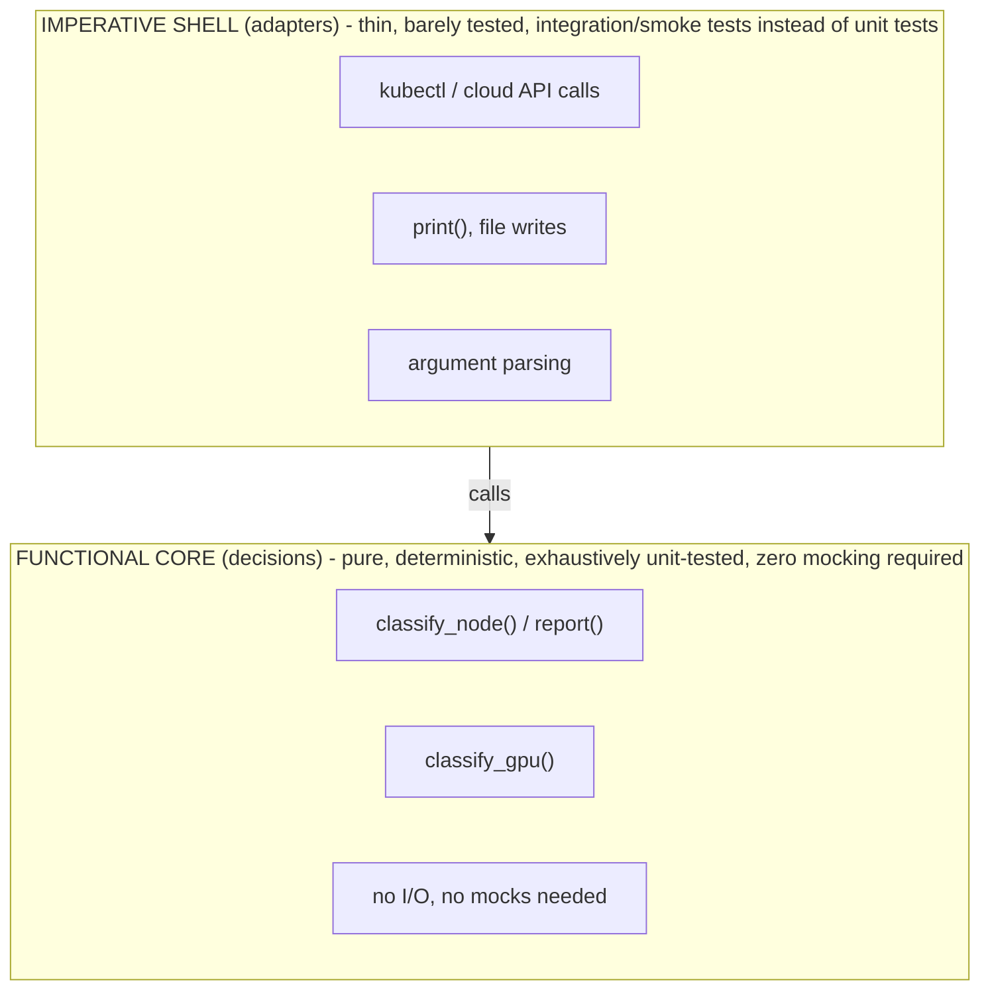
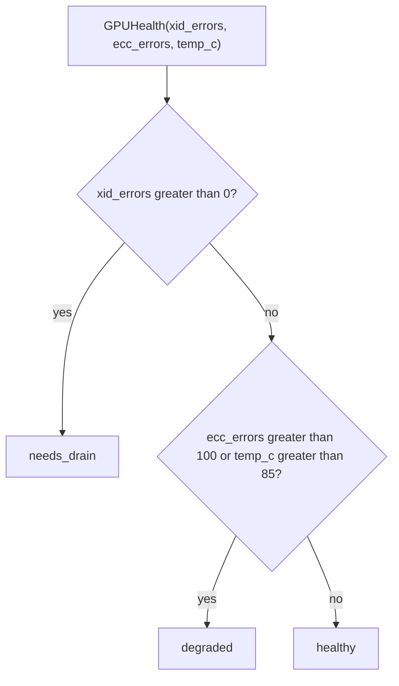

*(original text preserved in full; ➕ marks additions)*

## Foundations: start here if this is new to you

**The problem: repeating the same logic, and not being able to check it in isolation**

Imagine you've copy-pasted the same 10-line "decide if this node is healthy" logic into three different scripts. Now a threshold changes, and you have to remember to update it in three places — miss one, and you have a silent bug. Worse, to check whether that logic is even correct, you have to run an entire script end-to-end, against a real cluster, just to test one `if` statement. That's two separate problems: duplication, and the inability to check a small piece of logic on its own. Python's answer to both is the **function**: a named, reusable block of logic that takes some inputs and produces an output, defined once and called from anywhere.

**Analogy: a vending machine**

A vending machine is a good mental model for a function. You put in specific inputs (money, a button press for "B4"), and it hands back a specific output (a candy bar), following the same internal logic every time, regardless of who's standing in front of it or what day it is. You don't need to open up the machine and inspect its gears to trust the result — you just need to know: given this input, what output comes out? That's exactly the property that makes a function testable: you can check "input X produces output Y" without caring how the rest of the building (the rest of your program) is wired.

**Parameters vs. arguments — a distinction that's genuinely easy to blur**

When you *define* a function, the names you list in the parentheses are **parameters** — they're placeholders, like labeled slots on the vending machine ("coin slot", "button pad") that don't yet have anything in them.

When you *call* the function, the actual values you hand it are **arguments** — the specific quarter and the specific button press you actually provide this one time.

```python
def greet(name):        # "name" is a parameter — a placeholder
    return f"hello, {name}"

greet("priya")            # "priya" is an argument — the actual value supplied
```

Same function, different call, different argument, same parameter:

```python
greet("raj")              # "raj" is the argument this time; "name" is still the parameter
```

**What `return` actually does — and how it differs from `print`**

This is one of the most common early confusions, so it's worth being blunt about it: `print()` displays text to the screen (or terminal) for a human to look at. It does not hand any value back to the code that called the function — as far as the rest of your program is concerned, a `print()`-only function produced nothing usable. `return`, by contrast, hands a value back to the caller and immediately exits the function — execution stops at that line, and whatever comes after `return` in the function body never runs.

```python
def add_print(a, b):
    print(a + b)           # shows the number, hands nothing back
    # implicitly returns None here

def add_return(a, b):
    return a + b            # hands the number back to the caller

x = add_print(3, 4)         # prints "7" to the screen
print(x)                    # None  <- add_print gave the caller nothing to store
y = add_return(3, 4)        # prints nothing itself
print(y)                    # 7     <- add_return handed back a usable value
```

Trace it by hand: calling `add_print(3, 4)` runs `print(a + b)`, which immediately displays `7` on screen as a side effect, then the function ends without an explicit `return`, so Python automatically returns `None`. That `None` is stored in `x`. So `print(x)` afterward shows `None` — the sum itself was never captured anywhere a program could reuse it. `add_return(3, 4)` computes `7` and hands it back via `return`; that value lands in `y`, and `print(y)` shows `7`. Same math, very different usefulness to the rest of your code.

**Why this separation matters: testable decisions vs. untestable side effects**

A "side effect" is anything a function does that reaches outside itself — printing to a screen, writing a file, calling an API, mutating some remote system. Side effects are necessary (a program that never touches the outside world is useless), but they make testing painful: to check a side-effecting function, you often need a live filesystem, a live network, or a mock standing in for one.

A "pure decision" function — one that only computes and returns a value, with no side effects — can be tested with nothing but plain input/output checks: call it with sample data, check what comes back. No server, no mock, no cleanup required. That's the entire reason production code separates "decide something" (return a value) from "do something with the world" (print/write/call an API) — it's not a style preference, it's what makes automated testing possible at all.

**Check your understanding**

1. *Q: A function ends without hitting a `return` statement. What does calling it give you?*
   A: `None` — Python implicitly returns `None` from any function that doesn't explicitly `return` a value.

2. *Q: You write `result = my_function(5)` and `my_function` only calls `print(...)` internally, never `return`. What's in `result`?*
   A: `None`. Printing shows something to a human on the screen; it does not hand anything back to the variable `result`.

3. *Q: Why is a function that returns a health status ("healthy"/"warning"/"critical") easier to unit-test than one that prints the status directly?*
   A: Because the returned value can be captured and compared directly against an expected value in a test (`assert classify_node(usage) == "warning"`), with no need to intercept or parse anything printed to a screen — the test just checks input against output, exactly like checking a vending machine's output for a given input.

### The decision ladder: what should I write first?

Start with the smallest mechanism that expresses the behavior:

| Need | Start with | Why |
|---|---|---|
| One calculation used once | direct statements | no abstraction is cheaper than a needless abstraction |
| A decision used more than once or worth testing | function | input and output are visible; easy to test |
| A fixed record with named fields | dictionary, `TypedDict`, or dataclass | choose how much runtime structure and validation you need |
| Behavior that owns changing state | class | state and operations stay together |
| A set of related files | module/package | imports give each part a boundary and owner |
| A resource that must be cleaned up | `with` / context manager | cleanup runs on success and failure |
| Reusable cross-cutting behavior | decorator, sparingly | add logging/retry/measurement without copying wrapper code |

The first senior-level question is not “can I use a class?” It is “what state must survive between calls, who owns it, and how will I test it?”

### Direct code versus a function

This is understandable for a one-off probe:

```python
import shutil

free_bytes = shutil.disk_usage("/").free
print(f"free GiB: {free_bytes / 2**30:.1f}")
```

Move the decision into a function when it has a name, a contract, or a test:

```python
def disk_status(free_gib: float, minimum_gib: float = 20.0) -> str:
    return "healthy" if free_gib >= minimum_gib else "critical"


status = disk_status(free_bytes / 2**30)
```

The function is deliberately not reading the filesystem. That separation lets a test pass `5.0` or `50.0` without changing a real machine. The outer “imperative shell” collects facts; the inner “functional core” decides what they mean.

### Function parameters are an API

```python
def retry_delay(attempt: int, base_seconds: float = 1.0, cap_seconds: float = 30.0) -> float:
    return min(cap_seconds, base_seconds * 2 ** attempt)
```

`attempt` is required; the other values have defaults. A caller can use positional or named arguments, but named arguments make policy visible:

```python
retry_delay(attempt=2, cap_seconds=10.0)
```

Avoid hidden global configuration inside a decision function. Pass policy as an argument or an explicit object so a reviewer can see what controls the result.

With that model of functions as input-to-output, no-side-effects-required machines in place, here's how the chapter uses it to design functions with explicit inputs, outputs, and failure semantics.

> After this chapter you should be able to: Separate computation from side effects and design functions with explicit inputs, outputs, and failure semantics.

A production script becomes maintainable when the decision logic can be executed without the production environment. The easiest route is to separate pure computation from side effects such as reading files, calling APIs, printing, mutating remote systems, and executing subprocesses.

**Pure decision function: easy to reason about and easy to test**
```python
from dataclasses import dataclass

@dataclass(frozen=True)
class NodeUsage:
    name: str
    cpu_pct: float
    memory_pct: float

def classify_node(usage: NodeUsage) -> str:
    if usage.memory_pct >= 95:
        return "critical"
    if usage.cpu_pct >= 85 or usage.memory_pct >= 85:
        return "warning"
    return "healthy"
```
```python
def report(nodes: list[NodeUsage]) -> dict[str, list[str]]:
    result = {"healthy": [], "warning": [], "critical": []}
    for node in nodes:
        result[classify_node(node)].append(node.name)
    return result
```
Notice that report() does not call kubectl or the cloud API. Another adapter can obtain raw data, convert it to NodeUsage values, call report(), then format output. The core logic is deterministic. This design directly improves unit testing and incident confidence.

**Common production bug:** Avoid mutable default arguments such as `def add_tag(tag, tags=[])`. That list is created once when the function is defined and reused across calls. Use None and create a fresh object inside the function.
```python
def add_tag(tag: str, tags: list[str] | None = None) -> list[str]:
    if tags is None:
        tags = []
    tags.append(tag)
    return tags
```

➕ **This architecture pattern has a name — "functional core, imperative shell" — worth citing by name in an interview:** pure functions (`classify_node`, `report`) form the "core" — deterministic, trivially unit-testable, no mocks needed. The "shell" (the part that calls `kubectl`/cloud APIs, prints, writes files) wraps the core and is thin enough that it barely needs testing at all, or gets tested with integration/smoke tests instead of unit tests. This is the same idea Chapter 9 (OOP) and the testing Deep Dive will build on — worth recognizing it as one repeated architectural principle, not three unrelated chapters.

➕ **Diagram: functional core, imperative shell**


➕ **A GPU-fleet-specific version of the same pattern, to make it concrete for this role:**
```python
@dataclass(frozen=True)
class GPUHealth:
    node: str
    xid_errors: int
    ecc_errors: int
    temp_c: float

def classify_gpu(h: GPUHealth) -> str:
    if h.xid_errors > 0:
        return "needs_drain"        # Xid errors are frequently unrecoverable — pull the node
    if h.ecc_errors > 100 or h.temp_c > 85:
        return "degraded"
    return "healthy"
```
The `classify_gpu` function needs zero GPU hardware, zero `nvidia-smi` calls, and zero mocking to unit-test exhaustively — you just construct `GPUHealth` objects with the values you want to test. This is exactly the shape of function you'd be expected to write live in a coding interview for this role.

➕ **Diagram: `classify_gpu`'s three branches, one test per branch**

Practice #4 asks for one test per branch — this is the branch diagram that test suite is exhaustively covering.

## Practice before moving on
1. Refactor a function that reads a file, parses it, decides health, and prints output into three functions: read, decide, render.
2. Explain why a function returning a structured dict is often easier to test than a function that only prints.
3. Write a guard clause that rejects an empty cluster name before an API call.

➕ 4. Write `classify_gpu`'s test suite: at minimum, one test per branch (xid>0, ecc>100, temp>85, all-healthy) — this branch-coverage instinct (one test per decision branch, not one test per function) is what interviewers are actually checking for in a live coding round.

## Targeted references
[Udemy - Python for DevOps](https://www.udemy.com/course/python-devops) - Relevant lessons: Defining functions and returning values; Parameters and arguments; Guard clauses; Docstrings; Enumerate and ZIP.
