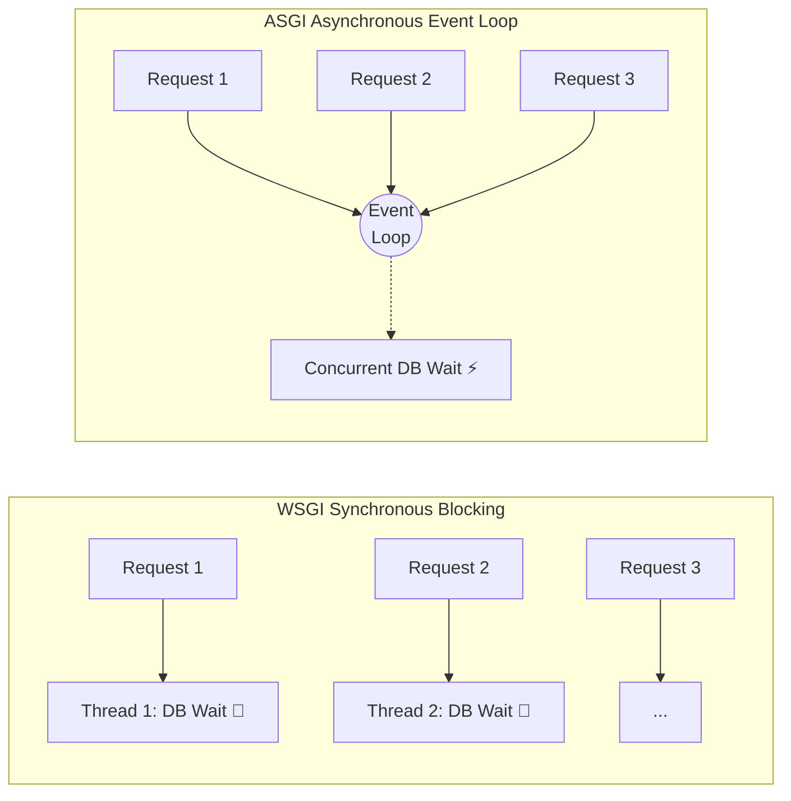

# FastAPI & Microservices Masterclass

## The Problem: Blocking AI Infrastructure APIs

You deployed a new Python backend to manage AI infrastructure state—handling job submissions, querying GPU telemetry, and provisioning cloud nodes. Initially, it ran flawlessly. But as cluster adoption grew, users started reporting random HTTP 504 Gateway Timeouts. 

Upon investigation, you discover the application is using synchronous frameworks (like standard Flask or Django) and blocking I/O calls (`requests.get`). A single slow request to a BMC (Baseboard Management Controller) or a heavy Kubernetes API query blocks an entire worker thread. With only a few dozen workers, a small burst of slow queries instantly exhausts the worker pool, queuing all subsequent requests until they time out. The infrastructure is fine, but the *gateway* to it is bottlenecked by blocked threads.

**The normal path** to solving this is horizontal scaling—spinning up hundreds of pods to handle the concurrency. But this wastes memory, bloats connection pools to backend databases, and treats the symptom rather than the cause.

The modern AI infrastructure path is asynchronous, non-blocking I/O using ASGI (Asynchronous Server Gateway Interface) frameworks, specifically **FastAPI**, backed by strict data validation using **Pydantic**. 

---

## 1. Measurable Learning Objectives

By the end of this masterclass, you will be able to:
1. Distinguish between WSGI (sync) and ASGI (async) execution models in Python.
2. Build a high-concurrency FastAPI microservice utilizing `async def` and `await` correctly.
3. Validate complex JSON payloads at the edge using Pydantic models.
4. Implement safe, non-blocking background tasks and exponential retries.
5. Harden a FastAPI application for production (Uvicorn workers, timeout limits, structured logging, and Prometheus metrics).

**Prerequisites:** Python OOP and concurrency fundamentals (Volume 2, Chapters 1 and 2).
**Difficulty:** Advanced.
**Reading Time:** 25 minutes.

---

## 2. FastAPI Basics: Routing, Paths, and Queries

Before discussing advanced async patterns, you must understand how FastAPI structures a web application. A FastAPI application maps HTTP requests (GET, POST, PUT, DELETE) to Python functions using **decorators**.

### The Minimal Application
```python
from fastapi import FastAPI

app = FastAPI(title="AI Infra API")

# The decorator binds the HTTP GET method at the root path "/" to this function.
@app.get("/")
def read_root():
    return {"status": "api_is_running", "version": "1.0.0"}
```

### Path Parameters and Query Parameters
FastAPI automatically parses and validates URL parameters based on standard Python type hints.

```python
# Path Parameter: Embedded directly in the URL route (e.g., /nodes/gpu-worker-01)
@app.get("/nodes/{node_id}")
def get_node(node_id: str):
    return {"node_id": node_id, "status": "Ready"}

# Query Parameter: Appended to the URL after a question mark (e.g., /jobs?limit=50&status=failed)
# Because 'limit' and 'status' are not in the @app.get() path string, FastAPI treats them as query parameters.
@app.get("/jobs")
def list_jobs(limit: int = 10, status: str = "running"):
    return {"fetched_limit": limit, "filter_status": status}
```

---

## 3. Architecture: WSGI vs. ASGI

In traditional Python web servers (WSGI - Web Server Gateway Interface), each request is handled by a dedicated thread or process. 
- **WSGI (Gunicorn/Flask):** 100 concurrent requests require 100 threads. If thread #1 is waiting for a database query to return, that thread does nothing else. 
- **ASGI (Uvicorn/FastAPI):** A single thread runs an Event Loop. When Request #1 hits an I/O wait (like `await db.fetch()`), the Event Loop pauses Request #1 and begins processing Request #2. When the DB replies, Request #1 resumes. 1 thread can handle 10,000 concurrent I/O-bound requests.



---

## 4. Core Components: FastAPI and Pydantic

FastAPI is not just an async web framework; it is an architectural pattern that forces strict contract definition via type hints.

### Data Validation at the Edge (Pydantic)
In AI operations, malformed data (e.g., passing a string `"8G"` instead of an integer `8000` for memory limits) can cause catastrophic failures deep in a deployment pipeline. Pydantic validates inputs *before* your logic ever runs.

```python
from pydantic import BaseModel, Field, field_validator
from typing import Optional

class GPUJobRequest(BaseModel):
    job_name: str = Field(..., min_length=3, max_length=63)
    gpu_type: str = Field(..., pattern="^(A100|H100|L40S)$")
    gpu_count: int = Field(default=1, ge=1, le=8)
    memory_limit_gb: Optional[int] = None

    @field_validator('memory_limit_gb')
    @classmethod
    def validate_memory(cls, v, info):
        gpu = info.data.get('gpu_type')
        if gpu == 'H100' and v and v > 80:
            raise ValueError("H100 memory cannot exceed 80GB")
        return v
```

### The FastAPI Router (Async Handlers)
When building endpoints, you must use `async def` for routes that perform asynchronous I/O (database, external API). If you perform heavy CPU-bound work (like processing a large tensor or running a local ML model) in an `async def`, you will block the event loop. CPU-bound routes should either be standard `def` (which FastAPI automatically runs in an external thread pool) or dispatched to a task queue (like Celery/ARQ).

```python
from fastapi import FastAPI, HTTPException
import httpx
import asyncio

app = FastAPI(title="AI Infra API")

@app.post("/jobs/submit", response_model=dict)
async def submit_job(request: GPUJobRequest):
    # This is non-blocking I/O
    async with httpx.AsyncClient() as client:
        try:
            # We await the network call, freeing the event loop for other requests
            response = await client.post("http://slurm-api:8080/submit", json=request.model_dump())
            response.raise_for_status()
        except httpx.HTTPError as e:
            raise HTTPException(status_code=502, detail=f"Upstream scheduler failed: {str(e)}")
            
    return {"status": "submitted", "job_id": response.json().get("id")}
```

---

## 5. Senior Implementation: Resilience and Background Tasks

Senior engineers do not trust the network. A robust microservice handles transient failures (retries), isolates long-running tasks, and safely reports state.

### Async Retries with Exponential Backoff
Instead of failing a request because the Kubernetes API blipped, use an async retry loop.

```python
async def fetch_gpu_state_with_retry(node_id: str, max_retries: int = 3):
    base_delay = 1.0
    async with httpx.AsyncClient() as client:
        for attempt in range(max_retries):
            try:
                resp = await client.get(f"http://{node_id}:9090/gpu/status", timeout=2.0)
                resp.raise_for_status()
                return resp.json()
            except httpx.HTTPError as e:
                if attempt == max_retries - 1:
                    raise  # Exhausted retries
                # Exponential backoff: 1s, 2s, 4s...
                await asyncio.sleep(base_delay * (2 ** attempt))
```

### Background Tasks
If a task takes 10 seconds (e.g., pulling a large container image layer), you should not keep the HTTP request open. Return `202 Accepted` immediately and process the work in the background.

```python
from fastapi import BackgroundTasks

async def async_provision_node(node_name: str):
    # Simulate a 10-second Ansible playbook execution
    await asyncio.sleep(10)
    print(f"Node {node_name} provisioned.")

@app.post("/nodes/{node_name}/provision")
async def provision_endpoint(node_name: str, background_tasks: BackgroundTasks):
    # Enqueue the task; FastAPI will run it after sending the HTTP response
    background_tasks.add_task(async_provision_node, node_name)
    return {"message": "Provisioning started in background", "status": "202 Accepted"}
```

---

## 6. Production Hardening and Deployment

A FastAPI script running via `python main.py` is not production-ready.

1. **Uvicorn + Gunicorn:** In production, use Gunicorn as a process manager to fork multiple Uvicorn ASGI workers. A common formula is `workers = (2 * CPU_CORES) + 1`.
   `gunicorn main:app -w 4 -k uvicorn.workers.UvicornWorker`
2. **Timeouts:** Uvicorn does not have a global request timeout. If an endpoint hangs indefinitely, the client will time out, but the server task remains in memory (a memory leak). Always use `timeout=` arguments on every `httpx` or DB call.
3. **Observability:** Integrate Prometheus metrics using a middleware (like `prometheus-fastapi-instrumentator`) to automatically track request counts, latency (`http_request_duration_seconds`), and error rates.

---

## 7. Interview Gauntlet: FastAPI & Async

**Q: I have a FastAPI endpoint defined with `async def`. Inside it, I call `time.sleep(5)` and `requests.get(...)`. What happens to my web server under load?**
**A:** The entire ASGI event loop will block for 5 seconds. Because it is marked `async def`, FastAPI runs it directly on the main event loop thread. No other requests can be processed during that sleep. I should either use `await asyncio.sleep(5)` and `httpx.AsyncClient().get(...)`, or change the route to a synchronous `def` so FastAPI offloads it to an external thread pool.

**Q: How do you handle a scenario where 10,000 clients simultaneously hit a FastAPI endpoint that queries a backend database?**
**A:** If the DB is standard Postgres/MySQL, 10,000 async tasks will try to open 10,000 simultaneous connections, crashing the DB (Connection pooling exhaustion). I must implement a strict async connection pool (e.g., using `asyncpg` or SQLAlchemy Async) with a maximum pool size (e.g., 50). The remaining 9,950 requests will queue in FastAPI (waiting for a pool connection) rather than overwhelming the database.

---

## 8. Summary
FastAPI converts Python from a blocking scripting language into a high-throughput microservice backbone. To use it safely at scale: validate aggressively at the edge with Pydantic, never block the event loop with synchronous I/O, enforce strict timeouts on every outgoing request, and protect downstream dependencies from connection exhaustion.