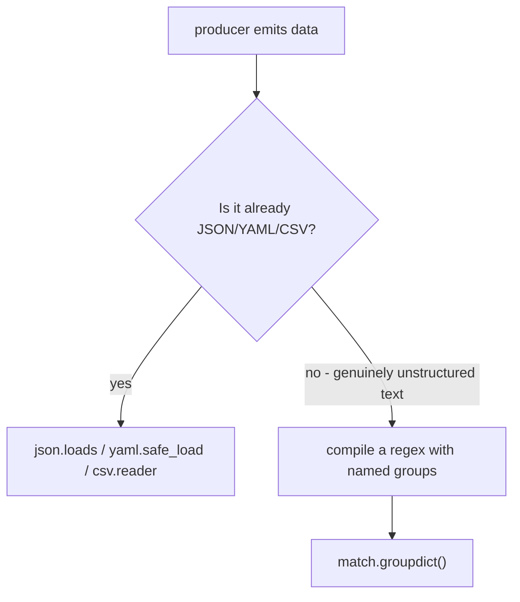
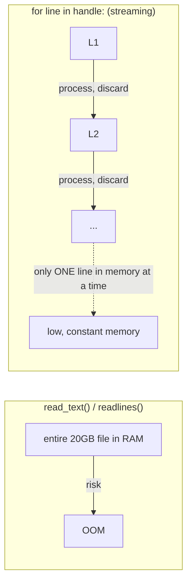

## Step 5 — read JSON as untrusted input

Create `nodes.json`:

```json
[
  {"name": "gpu-01", "gpus": 8, "temperature_c": 54},
  {"name": "gpu-02", "gpus": 7, "temperature_c": 61}
]
```

Replace the in-code list with:

```python
import json
from pathlib import Path


def load_nodes(path: Path) -> list[dict]:
    text = path.read_text(encoding="utf-8")
    data = json.loads(text)
    if not isinstance(data, list):
        raise ValueError("top-level JSON value must be a list")
    return data


nodes = load_nodes(Path("nodes.json"))
```

There are now distinct failure boundaries: file not found, permission denied, invalid JSON, wrong top-level type, or missing/wrong fields. Do not catch every exception with `except Exception: pass`; that destroys the reason the program failed.

## Files and JSON: make the boundary visible

```python
import json
from pathlib import Path


def load_nodes(path: Path) -> list[dict]:
    raw = path.read_text(encoding="utf-8")
    value = json.loads(raw)
    if not isinstance(value, list):
        raise ValueError("inventory must contain a JSON list")
    return value
```

Separate possible failures:

- `FileNotFoundError`: path does not exist;
- `PermissionError`: process cannot read it;
- `json.JSONDecodeError`: bytes were read but are not valid JSON;
- `ValueError`: JSON is valid but violates this program's expected top-level shape;
- missing/wrong fields: individual records require further validation.

Avoid `except Exception: pass`. It converts actionable failure into misleading success.

## Start with the basics

**The problem: a "path" looks like plain text, but it isn't safe to treat as plain text**

A file path — something like `/var/log/myservice/events.log` or `C:\Users\name\file.txt` — is a string that names a location in the filesystem tree (the nested folders-inside-folders structure every operating system uses to organize files). Because a path is visible as text, the tempting shortcut is to build and manipulate it with plain string operations: `folder + "/" + filename`. That shortcut quietly breaks the moment your code runs somewhere else: Windows uses backslashes (`\`) as its folder separator, macOS and Linux use forward slashes (`/`); trailing slashes, double slashes, and "does this path already end in a separator?" edge cases pile up fast. You end up hand-rolling a small, buggy imitation of what the filesystem already knows how to do correctly.

**Analogy: a mailing address vs. a structured `Address` object**

Think of a path like a street address. You *could* store `"221B Baker Street London NW1 6XE UK"` as one plain string and manually chop it apart every time you need the city or postcode — error-prone and format-dependent. Or you could store it as a structured object with a `.street`, `.city`, `.postcode` — each piece accessible without re-parsing the whole string, and the object knows how to correctly reformat itself for any context. `pathlib`'s `Path` object is the second approach applied to filesystem locations: instead of a raw string, you get an object that knows how to join folders correctly on whatever OS it's running on, gives you `.name`, `.parent`, `.suffix` directly, and never gets the separator character wrong.

```python
from pathlib import Path

p = Path("var") / "log" / "myservice" / "events.log"
print(p)               # var/log/myservice/events.log (POSIX) or var\log\myservice\events.log (Windows)
print(p.name)           # events.log
print(p.suffix)         # .log
print(p.parent)         # var/log/myservice
```

Trace it by hand: the `/` operator between `Path` objects and strings is overloaded by `pathlib` to mean "join a path segment," not division — so `Path("var") / "log" / "myservice" / "events.log"` builds up one path piece by piece, and `pathlib` inserts whichever separator character is correct for the OS actually running the code. `.name` pulls just the final segment (`events.log`), `.suffix` pulls the extension (`.log`), and `.parent` gives you everything except the last segment.

**What "reading" and "writing" a file actually involve**

Opening a file is asking the operating system for a temporary connection (a "handle") to that location on disk. While that handle is open, the OS reserves some bookkeeping for it. If your program reads or writes and then forgets to explicitly close the handle, that bookkeeping can leak — on a long-running service that opens many files, this shows up as "too many open files" errors. This is why Python has the `with open(...) as f:` pattern: `with` here is a **context manager** (a construct that guarantees a "clean up" action runs automatically when a block of code finishes, even if an error occurs partway through) — it's this chapter's on-ramp to a fuller treatment of context managers later, but the shape you need right now is: `with` guarantees the file gets closed, so you don't have to remember to do it yourself.

```python
with open("notes.txt", "w", encoding="utf-8") as f:
    f.write("hello\n")
# the file is guaranteed to be closed here, even if f.write() had raised an error
```

**Regular expressions: a tiny language for describing shapes of text**

A regular expression ("regex") is not an exact string to search for — it's a small pattern-matching language for describing the *shape* of text you're looking for, so you can match many different exact strings that all share that shape. "Digits, then a dash, then more digits" is a shape; `"a1-42"`, `"7-9"`, and `"203-1"` are all exact strings that match it, even though none of them are identical to each other.

```python
import re
pattern = re.compile(r"\d+-\d+")   # \d+ means "one or more digits"
match = pattern.search("error code a1-42 occurred")
print(match.group())                 # 1-42
```

Trace it by hand: `\d+` matches one or more digit characters, then a literal `-`, then `\d+` again. Scanning the string `"error code a1-42 occurred"`, the regex engine finds the first place this shape occurs — starting at the `1` in `a1-42` (the leading `a` isn't a digit, so the digit-run starts at `1`), giving `1-42` as the match, not the whole `a1-42`.

**JSON and YAML: two text spellings for the same underlying data**

Both JSON and YAML are just text formats for writing down structured data — the same handful of building blocks (dictionaries/objects, lists/arrays, strings, numbers, booleans) — they're two different spellings of the same underlying shapes. YAML is designed to be pleasant for a human to hand-write and read (no mandatory quote marks or braces, indentation instead of brackets); JSON is designed to be trivial and unambiguous for a machine to parse (explicit braces, brackets, and quotes leave no room for indentation mistakes). Once either is loaded into Python, they become the exact same kind of object — typically a `dict` or `list` — and your code doesn't need to know or care which format it originally came from.

```python
import json, yaml

json_text = '{"name": "gpu-1", "gpus": 8}'
yaml_text = "name: gpu-1\ngpus: 8\n"

print(json.loads(json_text))      # {'name': 'gpu-1', 'gpus': 8}
print(yaml.safe_load(yaml_text))   # {'name': 'gpu-1', 'gpus': 8}
```

Trace it by hand: both calls parse a text representation of "a record with a name and a gpu count" — `json.loads` parses the brace-and-quote JSON spelling, `yaml.safe_load` parses the indentation-based YAML spelling, and both produce an identical Python dict `{'name': 'gpu-1', 'gpus': 8}`. From this point on in your code, there is no difference between them.

**Check your understanding**

1. *Q: Why does hardcoding `folder + "/" + filename` as a plain string cause real bugs, when using `Path(folder) / filename` doesn't?*
   A: Because the separator character between folder segments differs by OS (`/` on macOS/Linux, `\` on Windows), and plain string concatenation hardcodes one choice. `Path`'s `/` operator inserts whichever separator is correct for the OS the code is actually running on.

2. *Q: What does `with open(path) as f:` guarantee that manually calling `f = open(path)` without `with` does not?*
   A: That the file handle gets closed automatically once the block ends — even if an exception is raised partway through reading or writing — because `with` is a context manager that runs its cleanup step unconditionally.

3. *Q: A teammate suggests writing one large regex to parse an API response that the API can already return as JSON. What's the plain-language reason to push back?*
   A: JSON is already structured data with an unambiguous, machine-designed format — parsing it with `json.loads` is direct and robust to whitespace/formatting changes. A regex re-derives structure from raw text by pattern-shape-matching, which is more fragile (breaks on formatting changes) and duplicates work the JSON parser already does correctly.

With that groundwork — paths as safer-than-strings objects, files as connections that must be closed, regex as shape-matching rather than exact-matching, and JSON/YAML as two spellings of the same data — here's how the chapter puts these together to read infrastructure data safely.

> After this chapter you should be able to: Read infrastructure data safely, parse only what is unstructured, and preserve clear boundaries between text and structured data.

Prefer structured data over regex whenever the source already has structure. Parse JSON with json, YAML with a safe YAML loader, CSV with csv, and use regular expressions for text that is genuinely unstructured or semi-structured. A common failure is using one giant regex to parse data that the producer could emit as JSON.
```python
from pathlib import Path
import json

def load_inventory(path: Path) -> list[dict]:
    try:
        raw = path.read_text(encoding="utf-8")
        data = json.loads(raw)
    except FileNotFoundError as exc:
        raise RuntimeError(f"inventory not found: {path}") from exc
    except json.JSONDecodeError as exc:
        raise RuntimeError(f"invalid JSON at line {exc.lineno}") from exc
    if not isinstance(data, list):
        raise ValueError("inventory root must be a list")
    return data
```
**Use named groups when regex is producing a structured record**
```python
import re
LOG = re.compile(
    r"^(?P<ts>\S+)\s+(?P<level>ERROR|CRITICAL|FATAL)\s+"
    r"service=(?P<service>[\w-]+)\s+message=(?P<message>.+)$"
)
def parse_error(line: str) -> dict[str, str] | None:
    match = LOG.search(line)
    return match.groupdict() if match else None
```
Named groups convert a cryptic regex into an extraction schema. Still, never make regex your first choice for Kubernetes API output: request JSON from the API or kubectl -o json and parse the JSON. This is more robust across spacing and formatting changes.
```python
from pathlib import Path
log = Path("/var/log/myservice/events.log")
with log.open(encoding="utf-8") as handle:
    for line in handle:  # streaming, not read-all-at-once
        if event := parse_error(line):
            print(event)
```
**Key takeaway:** Use pathlib for "where is the file?", format-specific parsers for "what data is inside?", and regex only for "what pattern is hidden in raw text?"

**Diagram: which parser, decided by what the source already is**

The chapter's warning about "one giant regex parsing data the producer could emit as JSON" is exactly this decision point skipped — regex is the fallback, not the default.

**Diagram: streaming line-by-line vs loading the whole file**


**YAML's specific footgun this chapter's title mentions but doesn't demo — never use `yaml.load()` unqualified:**
```python
import yaml
config = yaml.safe_load(open("config.yaml"))   # correct — restricted to basic types
# yaml.load(open("config.yaml"))  # DANGEROUS without Loader= — can execute arbitrary Python objects
```
`yaml.safe_load` vs bare `yaml.load` is a real, concrete security question worth having a one-sentence answer for: untrusted YAML parsed with the unsafe loader is a known code-execution vector (`!!python/object` tags), which is exactly why every linter flags bare `yaml.load()`.

**The 20GB-log streaming pattern generalized to `jq`-style JSON streaming (since K8s API output is often huge):**
```python
import ijson  # streaming JSON parser — doesn't load the whole document into memory
with open("huge_pod_list.json", "rb") as f:
    for pod in ijson.items(f, "items.item"):
        if pod["status"]["phase"] == "Failed":
            print(pod["metadata"]["name"])
```
`json.load()` on a multi-GB `kubectl get pods -A -o json` dump from a large cluster is the JSON equivalent of the chapter's log-file memory trap — `ijson` (or paginating the API call itself) is the fix.

## Work the scenario step by step
**Scenario:** A 20 GB application log must be searched for ERROR/CRITICAL events without exhausting memory.
1. Do not call read_text() or readlines() on the whole file.
2. Open the file and iterate line by line; the file object is already an iterator.
3. Compile the regex once outside the loop.
4. Yield matching events so downstream processing can remain lazy.
5. Keep output bounded or stream it to a sink rather than accumulating millions of results.

**Reasoned conclusion:** The core design is streaming I/O plus lazy transformation, not a bigger machine.

## Practice before moving on
1. Parse a Kubernetes JSON pod list and return pods whose containerStatuses contain non-zero restart counts.
2. Write a regex with named groups for timestamp, severity, request ID, and message.
3. Create a config loader that accepts a Path and validates required top-level keys.

4. Convert the log-parsing generator (`parse_error`) into one that also yields progress every 1M lines processed — this "make long-running streaming jobs observable" instinct is what separates a script from production tooling.

## Targeted references
[Python pathlib documentation](https://docs.python.org/3/library/pathlib.html) - Path-oriented filesystem operations.
[Udemy - Python for DevOps](https://www.udemy.com/course/python-devops) - Relevant lessons: The Path object; Regex: Introduction and essentials; Log Line Error Detector; JSON deserialization; Introduction to YAML operations; Log File Archiver.
