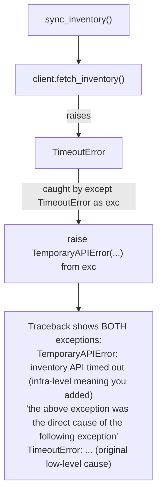
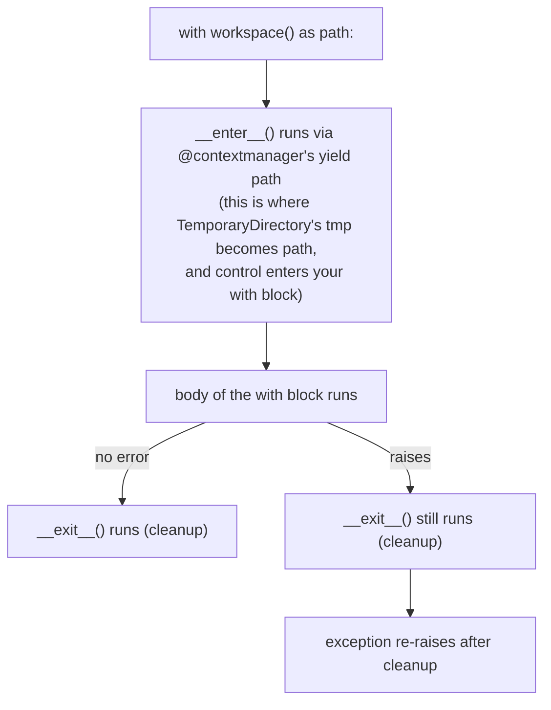

*(original text preserved in full; ➕ marks additions)*

## Foundations: start here if this is new to you

**The problem.** A function you call can fail in a way it cannot recover from itself — a network call times out, a file doesn't exist, a dictionary lookup misses a key. The function has two choices: return some special "nothing happened" value and hope the caller checks for it, or stop what it's doing right now and hand the problem to whoever called it. Python's answer is the second option, and it is built into the language rather than bolted on.

**Naming the concept: raising an exception.** When Python code hits a problem it can't handle locally, it *raises an exception*. This does **not** crash the program. It does one specific thing: normal, line-by-line execution stops immediately, and Python starts walking back up the chain of function calls (the "call stack") looking for a piece of code that said "I know how to handle this kind of problem." If it finds one, execution resumes there. If it never finds one, only then does the program actually stop, printing the traceback you're used to seeing. A raised exception is a controlled signal — "something specific went wrong, here is exactly what" — not an explosion.

**Analogy.** Think of a support ticket escalation. A junior engineer hits an issue they don't have the authority or the tools to fix. They don't silently ignore it and they don't try to guess a fix that might make things worse — they escalate the ticket up the chain until someone with the right context picks it up. If literally nobody in the whole organization picks it up, it becomes a public incident. That escalation path *is* the call stack; the incident report at the end *is* the traceback.

**Why exceptions have types.** A raised exception isn't a bare signal, it's an *object*, and that object has a specific class: `ValueError` (the value handed in was the wrong kind: `int("hello")`), `KeyError` (a dictionary lookup key doesn't exist), `TypeError` (an operation was tried on a type that doesn't support it, like adding a string to an int), and so on. Because the type is specific, the code that catches it can catch *exactly* the kind of failure it knows how to recover from, and let every other kind of failure keep escalating. Compare:

```python
try:
    value = int(user_input)
except ValueError:
    value = 0   # we specifically expected "not a number" and know the fix
```

against:

```python
try:
    value = int(user_input)
except:              # bare except — catches EVERYTHING
    value = 0
```

The second version looks similar but is far more dangerous: it will also silently swallow a `KeyboardInterrupt` (the user pressing Ctrl-C), a typo that raised `NameError`, or a bug that raised `AttributeError` — none of which have anything to do with bad user input, and none of which should be quietly discarded. Catch the specific type you actually know how to recover from.

**The basic shape: `try` / `except` / `else` / `finally`.** These four keywords form one block, and each has one job:

- `try:` — the code you're attempting, which might fail.
- `except SomeError:` — runs only if that specific exception type was raised inside `try`. Handles the failure.
- `else:` — runs only if `try` finished with **no** exception at all. Rarely used, but useful for "success-only" logic that itself shouldn't be wrapped in the try's error handling.
- `finally:` — always runs, whether `try` succeeded, failed and was caught, or failed and is still propagating. This is where cleanup goes.

A small, runnable, hand-traceable example using all four:

```python
def divide(a, b):
    print("start")
    try:
        result = a / b
    except ZeroDivisionError as e:
        print(f"except: cannot divide by zero ({e})")
        return None
    else:
        print(f"else: division succeeded, result = {result}")
        return result
    finally:
        print("finally: cleanup runs no matter what")

print("Case 1:", divide(10, 2))
print("Case 2:", divide(10, 0))
```

Expected output:

```
start
else: division succeeded, result = 5.0
finally: cleanup runs no matter what
Case 1: 5.0
start
except: cannot divide by zero (division by zero)
finally: cleanup runs no matter what
Case 2: None
```

Trace it: Case 1 hits no error, so `try` succeeds, `except` is skipped, `else` runs (prints and sets the return value), then `finally` runs before the function actually returns. Case 2 raises `ZeroDivisionError` inside `try`, so `except` catches it and sets the return value, `else` is skipped entirely (it only runs on success), and `finally` still runs before returning.

**Context managers — the problem they solve.** Cleanup code (closing a file, releasing a lock, deleting a temp directory) needs to run *even if* something in the middle raises an exception — otherwise a file handle leaks or a lock never gets released, and the next run of your program inherits a mess. Wrapping every risky operation in a manual `try/finally` works, but it's easy to forget and tedious to repeat. A **context manager** is an object that guarantees its cleanup step runs on the way out of a `with` block, no matter whether the block succeeded or raised.

**Analogy.** Borrowing a library book two different ways. Way one: you walk up to the shelf, take the book, and just... leave, trusting yourself to remember to bring it back. If something distracts you (an "exception" in your day), the book never gets returned. Way two: you check the book out at the desk — the librarian logs it (`__enter__`) — and no matter what happens while you have it, there's a guaranteed return process (`__exit__`) that runs when you're done, even if you return it late, damaged, or having read only page one. A context manager is way two, enforced by the language instead of by your memory.

```python
class LibraryBook:
    def __init__(self, title):
        self.title = title

    def __enter__(self):
        print(f"Checking out: {self.title}")
        return self

    def __exit__(self, exc_type, exc_value, traceback):
        print(f"Returning: {self.title}")
        return False   # False = don't suppress the exception, let it keep propagating

try:
    with LibraryBook("Deep Work") as book:
        print(f"Reading {book.title}")
        raise ValueError("coffee spill")
except ValueError as e:
    print(f"Caught: {e}")
```

Expected output:

```
Checking out: Deep Work
Reading Deep Work
Returning: Deep Work
Caught: coffee spill
```

Trace it: `__enter__` runs first and hands back the object as `book`. The body of the `with` block runs and raises `ValueError`. Before that exception is allowed to propagate any further, Python calls `__exit__` — that's the guaranteed "return the book" step — and only after `__exit__` finishes does the exception continue upward to be caught by the outer `except`. This is exactly the mechanism `open(...)` uses to guarantee a file gets closed, and that `TemporaryDirectory` (used later in this chapter) uses to guarantee cleanup.

**Check your understanding**

1. What specifically happens the instant Python raises an exception — does the program crash immediately?
   *Answer: No. Normal execution stops and Python starts searching up the call stack for a matching `except`. Only if no handler anywhere catches it does the program actually terminate and print a traceback.*
2. Why is `except ValueError:` safer than a bare `except:`?
   *Answer: `except ValueError:` only catches the specific failure you understood and planned for. A bare `except:` also catches unrelated bugs (`NameError`, `AttributeError`) and even `KeyboardInterrupt`, silently hiding problems you never intended to handle.*
3. In the `divide()` example above, why does `else` never run for `divide(10, 0)`?
   *Answer: `else` only runs when `try` completes with zero exceptions raised. `divide(10, 0)` raises `ZeroDivisionError` inside `try`, so control goes to `except` instead, and `else` is skipped.*

With the vocabulary in place — raise, exception type, `try`/`except`/`else`/`finally`, context manager — the rest of this chapter builds production patterns (chaining, custom hierarchies, retry policy) on top of it.

> After this chapter you should be able to: Fail deliberately, preserve diagnostic context, and guarantee cleanup of external resources.

Exceptions are not an alternative syntax for if/else. Use normal conditions for expected branches and exceptions for operations that could not fulfill their contract. A caller should be able to distinguish "resource absent," "authentication failed," "temporary timeout," and "input invalid" because the recovery policy differs for each.
```python
class InventoryError(Exception):
    """Base exception for inventory operations."""

class AuthenticationError(InventoryError):
    pass

class TemporaryAPIError(InventoryError):
    pass
```
**Exception chaining preserves the original cause**
```python
try:
    inventory = client.fetch_inventory()
except TimeoutError as exc:
    raise TemporaryAPIError("inventory API timed out") from exc
```
The "from exc" matters during troubleshooting because the traceback shows both the infrastructure-level meaning you added and the low-level cause. Do not catch Exception merely to print and continue; that often turns a real failure into silent data corruption.
```python
from contextlib import contextmanager
from tempfile import TemporaryDirectory
from pathlib import Path

@contextmanager
def workspace():
    with TemporaryDirectory(prefix="infra-") as tmp:
        path = Path(tmp)
        yield path
    # TemporaryDirectory cleans up even when the caller raises.
```

➕ **The exception hierarchy in action — this is exactly what lets a caller pick a retry policy per exception type, not per string-matching a message:**
```python
def sync_inventory(client, max_retries=3):
    for attempt in range(1, max_retries + 1):
        try:
            return client.fetch_inventory()
        except TemporaryAPIError:
            if attempt == max_retries:
                raise
            time.sleep(2 ** attempt)   # retry — this class is defined as retryable
        except AuthenticationError:
            raise   # never retry — retrying won't fix bad credentials, fail fast instead
```
**Interview line:** "the exception class *is* the retry policy — `except TemporaryAPIError: retry` vs `except AuthenticationError: fail-fast` reads as documentation, not just error handling."

➕ **Diagram: exception chaining up the call stack**

Without `from exc`, the traceback would show only the wrapped exception — during an incident, the original cause is exactly what you need and would otherwise lose.

➕ **`finally` vs context manager — when each is right (a distinction the chapter's example doesn't spell out):**
```python
# finally: fine for one-off cleanup, easy to forget, no reuse
f = open("data.txt")
try:
    process(f)
finally:
    f.close()

# context manager: reusable, composable, can't forget it — prefer this for anything used more than once
with open("data.txt") as f:
    process(f)
```

➕ **Diagram: context manager enter/exit, including the exception path**

This is why `TemporaryDirectory` cleans up "even when the caller raises," as the code comment above states — cleanup lives in `__exit__`, which Python guarantees runs whether the block succeeded or raised.

## Practice before moving on
1. Design exception classes for auth failure, retryable 503, invalid config, and remote command failure. Decide which ones should be retried.
2. Use a context manager to open a temporary workspace and prove it is removed after an exception.
3. Explain why except Exception: pass is dangerous in an automation that changes infrastructure.

➕ 4. Write `sync_inventory` above's test: assert it retries exactly `max_retries` times on `TemporaryAPIError` and re-raises immediately (zero retries) on `AuthenticationError` — this is a realistic interview coding exercise, not just a reading exercise.

## Targeted references
[Udemy - Python for DevOps](https://www.udemy.com/course/python-devops) - Relevant lessons: Thinking in exceptions; Defining custom exceptions; Adding context to custom exceptions; Context managers and the with statement; Advanced Retry Decorator with Exponential Backoff and Jitter exercise.
