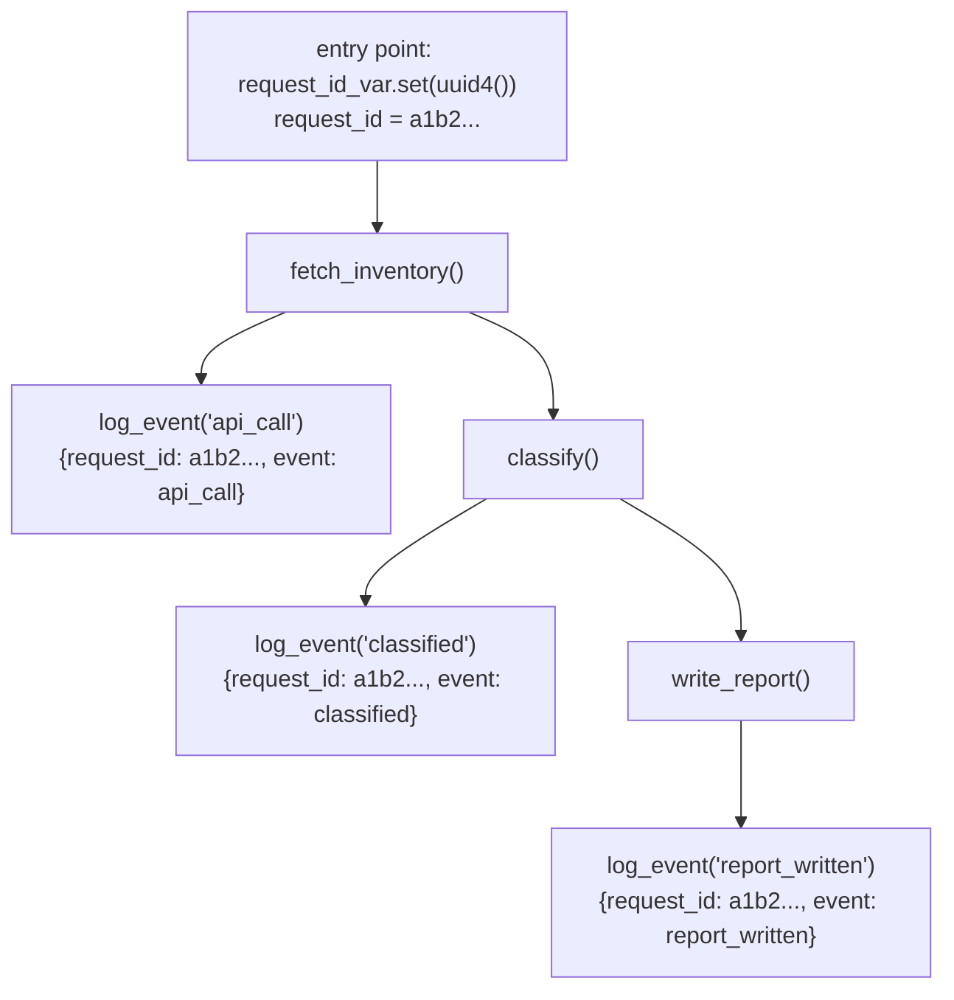
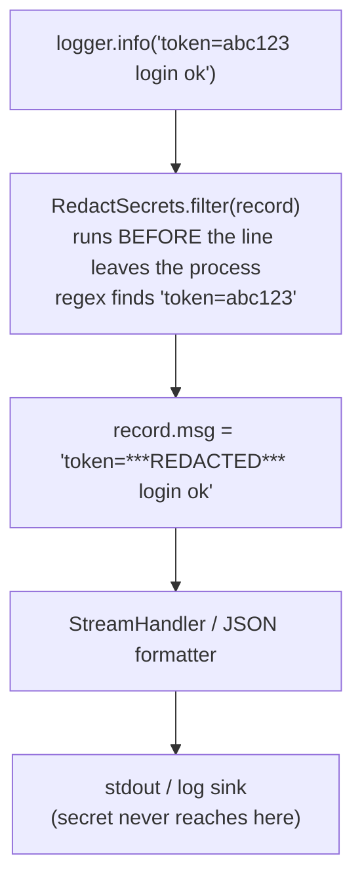

*(original text preserved in full; ➕ marks additions)*

## Foundations: start here if this is new to you

**The problem `print()` doesn't solve.** Sprinkling `print("got here")` and `print(value)` through a script is a perfectly reasonable way to debug something running on your laptop right now, in front of you. The trouble starts the moment that code becomes a *service* — something running unattended, for days, on a machine you're not watching. `print()` output has no timestamp, so you can't tell *when* a line happened relative to an incident three hours ago. It has no notion of severity, so a routine status update and a critical failure look identical. You can't turn it off for the boring lines and keep it on for the important ones without editing and redeploying code. And it just goes to standard output — there's no way to route it to a place a team can search across thousands of machines. This entire chapter exists to fix those four gaps with the standard `logging` module.

**Analogy.** `print()` is shouting into an empty room — whoever happens to be standing there right now hears it, and then it's gone forever. Logging is writing a dated, categorized entry into a shared logbook that anyone can search later, filter by importance, and cross-reference against other entries from the same time window.

**Naming the concept: log level.** A log level is an agreed-upon scale answering one question for each line you emit: *how important or urgent is this?* Python's `logging` module defines five standard levels, low to high:

- `DEBUG` — fine-grained detail, useful only while actively investigating something.
- `INFO` — normal operation, "this happened and it was expected" (a request completed, a job started).
- `WARNING` — something unexpected, but the program is still working (a retry succeeded, a config fell back to a default).
- `ERROR` — an operation failed and did not complete its job.
- `CRITICAL` — the whole program or service is in serious trouble, not just one operation.

The point of having a scale, not just one bucket, is that you can set a *threshold* ("only show me WARNING and above") and instantly silence noisy DEBUG/INFO chatter without touching a single line of code — the lines are still there in the source, just filtered at runtime. Deleting `print()` statements to reduce noise means re-adding them later when you need that detail again; changing a log level threshold does not.

A tiny, runnable example:

```python
import logging

logging.basicConfig(level=logging.WARNING, format="%(levelname)s: %(message)s")
logger = logging.getLogger("demo")

logger.debug("connecting to database")      # below threshold — suppressed
logger.info("request completed")            # below threshold — suppressed
logger.warning("retrying after timeout")    # at threshold — shown
logger.error("request failed: connection refused")  # above threshold — shown
```

Expected output (only WARNING and above appear, because the threshold is set to `WARNING`):

```
WARNING: retrying after timeout
ERROR: request failed: connection refused
```

Trace it: `basicConfig(level=logging.WARNING, ...)` sets the minimum severity that will actually be printed. `debug()` and `info()` are both below that threshold, so the logging module drops them silently — the calls still execute, but nothing is written anywhere. `warning()` and `error()` meet or exceed the threshold, so they print, each prefixed with its level name via the `format` string.

**Naming the concept: structured logging.** A plain log line like `"user 42 failed login from 10.0.0.5"` is easy for a human to read once, but hard for a machine to search reliably — finding every failed login for user 42 across a week of logs means writing a fragile regex and hoping the sentence wording never changes. Structured logging means logging a **dict of named fields** — `{"event": "login_failed", "user_id": 42, "ip": "10.0.0.5"}` — instead of a free-text sentence. A machine can then filter or aggregate on `event == "login_failed"` or `user_id == 42` directly and exactly, with no text parsing involved.

```python
import json
import logging

logging.basicConfig(level=logging.INFO, format="%(message)s")
logger = logging.getLogger("demo")

def log_event(event, **fields):
    payload = {"event": event, **fields}
    logger.info(json.dumps(payload))

log_event("login_failed", user_id=42, ip="10.0.0.5")
```

Expected output:

```
{"event": "login_failed", "user_id": 42, "ip": "10.0.0.5"}
```

Trace it: `log_event` builds one dict combining the fixed `"event"` key with whatever named fields the caller passed (here `user_id` and `ip`, collected by `**fields`), then serializes that dict to a JSON string and logs it at `INFO` level. Anything downstream that reads these logs (a log aggregator, a search index) can now query `user_id = 42` directly instead of pattern-matching a sentence — and that sentence can never accidentally change wording and break the query, because there was never a sentence to begin with.

**Check your understanding**

1. Why does a running service need timestamps and severity levels that a quick local `print()`-debugged script doesn't strictly need?
   *Answer: A local script is being watched live, so "when did this happen" and "how bad is this" are obvious from context. A service runs unattended for days; without a timestamp you can't place a line relative to an incident, and without a severity level you can't tell routine output from a real failure after the fact.*
2. What can you do with log levels that you cannot easily do by deleting `print()` calls?
   *Answer: Change the visible threshold (e.g. show WARNING and above only) at runtime/config, silencing noisy detail without removing it from the source — so the detail is still there, ready to re-enable, the next time you need to investigate something.*
3. Why is `{"event": "login_failed", "user_id": 42}` easier for a machine to query than the sentence `"user 42 failed login"`?
   *Answer: The dict has a fixed field name (`user_id`) holding an exact value (`42`) that can be matched directly. The sentence requires parsing free text with a pattern that breaks the moment the wording changes even slightly.*

With levels and structured fields in hand, the rest of this chapter builds the production version: correlation IDs threading one request through many log lines, and redaction filters that keep secrets out of what gets logged.

> After this chapter you should be able to: Create logs that answer what happened, to which resource, in which attempt, and with what outcome.

Operational logging is structured evidence. A useful record includes event type, resource identity, correlation or request ID, attempt count, duration, outcome, and exception information. Human prose alone is hard to aggregate; JSON fields can be indexed and queried.
```python
import json, logging
from datetime import datetime, timezone

logger = logging.getLogger("infra_doctor")

def log_event(event: str, **fields: object) -> None:
    payload = {"ts": datetime.now(timezone.utc).isoformat(), "event": event, **fields}
    logger.info(json.dumps(payload, default=str))
```
```python
log_event("api_request_completed", service="inventory", status=200, duration_ms=184, attempt=1)
```
In a larger system, use logging configuration and a JSON formatter instead of manually json.dumps() every message. The conceptual goal is the same: logs should be machine-queryable while remaining understandable during an incident.


Figure 2. Reliable automation makes input validation, action, observation, and failure behavior explicit.

➕ **Correlation IDs across a distributed call chain — the piece that turns per-service logs into one traceable story:**
```python
import contextvars
request_id_var = contextvars.ContextVar("request_id", default=None)

def log_event(event: str, **fields):
    payload = {"ts": ..., "event": event, "request_id": request_id_var.get(), **fields}
    logger.info(json.dumps(payload, default=str))

# at the entry point of a request:
request_id_var.set(str(uuid.uuid4()))
```
`contextvars` (not a plain global variable — that breaks under `asyncio`/threading) lets every log line inside one logical request automatically carry the same ID without threading it through every function signature manually. This is the exact mechanism behind "correlation ID" logging in real systems, and it's a natural bridge into Deep Dive 6 (structured logs/correlation IDs) later in this volume.

➕ **Diagram: one correlation ID threaded through a call chain**

Every line carries the SAME request_id without it being passed as a parameter — `contextvars` carries it implicitly through the call chain, and safely across threads/asyncio tasks.

➕ **Secret redaction — the chapter names it, here's the actual filter:**
```python
import logging, re
class RedactSecrets(logging.Filter):
    PATTERN = re.compile(r'(token|password|api[_-]?key)=([^\s&]+)', re.IGNORECASE)
    def filter(self, record):
        record.msg = self.PATTERN.sub(r'\1=***REDACTED***', str(record.msg))
        return True

logger.addFilter(RedactSecrets())
```
This is the exact `logging.Filter` the Practice section below asks you to write — worth having built once before an interview asks for it live.

➕ **Diagram: where redaction sits in the logging pipeline**


## Work the scenario step by step
**Scenario:** A script failed in CI three hours ago, but the only output is "request failed."
1. Identify what context is missing: endpoint, resource, status code, attempt number, timeout, correlation ID, exception class.
2. Add structured fields rather than concatenating one giant string.
3. Log once at the layer that owns the operational meaning; avoid logging the same exception at every layer.
4. Ensure secrets and tokens are filtered before logs leave the process.

**Reasoned conclusion:** Logging quality is part of program design because incidents happen after the original stack frame is gone.

## Practice before moving on
1. Add duration_ms to a context-manager-based operation timer.
2. Create a logging.Filter that masks a token-like field.
3. Define DEBUG/INFO/WARNING/ERROR usage for a retrying API client.

➕ 4. Add `request_id` propagation to the `sync_inventory` function from Chapter 5 so every retry attempt's log line carries the same correlation ID — this ties Ch5's retry logic to Ch6's logging in the way a real incident investigation actually needs both together.

## Targeted references
[Python logging HOWTO](https://docs.python.org/3/howto/logging.html) - Core logging concepts and configuration.
[Udemy - Python for DevOps](https://www.udemy.com/course/python-devops) - Relevant lessons: Why logging?; Log levels; Structured logging with JSON; Extra fields and exceptions in structured logging; Dynamic log configuration.
