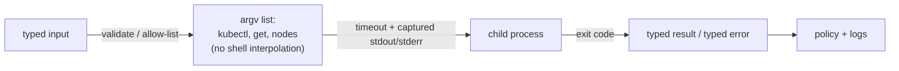

*(original text preserved in full; ➕ marks additions)*

## Foundations: start here if this is new to you

**The problem this solves.** Sometimes the tool you need already exists as a command-line program — `kubectl`, `nvidia-smi`, `git`, `ping`. Rewriting `kubectl`'s logic in Python to talk to the Kubernetes API yourself would be enormous, redundant effort when the binary is already installed and already does exactly what you need. What you actually want is a way for your Python program to *run another program*, wait for (or not wait for) it to finish, and get back whatever it printed. That capability is what the `subprocess` module provides.

**Naming the concept: spawning a child process.** When your Python program asks the operating system to start `kubectl`, the OS creates a brand-new, separate running program — a **child process** — with your Python program as its **parent**. The child runs independently with its own memory; the parent can choose to wait for it to finish (blocking) or let it run in the background and check back later. While it runs, the child produces output the same way any command-line program does: text written to two separate output streams, plus a final numeric result when it exits. Those three things — the two output streams and the final number — are exactly what `subprocess.run()` hands back to you.

**Analogy.** You (the parent process) ask a specialist contractor (the child process) to do a job you could technically do yourself but that they already have the tools and expertise for. You hand them a written work order (the command and its arguments), you wait for them to finish, and when they're done they hand you three things: a job completion slip with a number on it (0 for "done exactly as ordered," anything else for "something didn't go as planned"), a report of what they observed doing the job (standard output), and, separately, a report of any problems or diagnostics they ran into (standard error).

**Why a list of arguments, not a shell string.** There are two ways to tell `subprocess` what to run: hand it a single string that gets interpreted by a shell (`shell=True`), or hand it a list where each element is one literal argument (`shell=False`, the default when you pass a list). The list form is dramatically safer whenever any part of the command comes from outside your control — user input, a filename, a value from an API response — because a shell string is *parsed*: characters like `;`, `&&`, `|`, and `$(...)` have special meaning to a shell and can be used to chain in an entirely different command. A list is never parsed that way; each element is passed to the program as one literal piece of text, no matter what characters it contains.

Concretely, imagine a filename that legitimately (or maliciously) contains a semicolon:

```python
import subprocess

filename = "notes.txt; rm -rf /tmp/important"

# DANGEROUS: the shell sees TWO commands separated by ";" and runs both
subprocess.run(f"cat {filename}", shell=True)

# SAFE: "notes.txt; rm -rf /tmp/important" is passed as ONE literal argument to `cat`
# — there is no shell reading it, so the semicolon has no special meaning at all
subprocess.run(["cat", filename])
```

In the first call, the shell string becomes `cat notes.txt; rm -rf /tmp/important` — and a shell always treats `;` as "run the next command separately," so it runs `cat notes.txt` and then actually executes `rm -rf /tmp/important`. In the second call, `filename` is one element of a Python list handed directly to the operating system with no shell in between to interpret it, so `cat` simply gets a single (nonexistent, in this case) filename argument containing a literal semicolon, and nothing else happens.

**The basic shape of a subprocess result.** `subprocess.run()` gives back an object with three pieces of information worth knowing cold:

- **Return code** (`.returncode`) — a small integer the child process reports when it exits. `0` conventionally means "succeeded"; any nonzero value means "something the program's author considered a failure," though the exact meaning of e.g. `2` vs `127` is program-specific.
- **stdout** — the child's normal output: the data it was designed to produce (e.g. the JSON `kubectl get pods` printed).
- **stderr** — the child's error/diagnostic output: warnings, error messages, progress logs — output the program's author considered *not* to be the primary result.

These three are independent of each other. A nonzero return code does **not** guarantee `stderr` has anything in it (some programs exit nonzero silently); and `stderr` having content does **not** guarantee the return code is nonzero (some programs print warnings to `stderr` while still succeeding overall). Check both explicitly rather than assuming one implies the other.

A small, runnable example:

```python
import subprocess

result = subprocess.run(
    ["python3", "-c", "import sys; print('normal output'); print('a warning', file=sys.stderr); sys.exit(0)"],
    capture_output=True,
    text=True,
)

print("returncode:", result.returncode)
print("stdout:", repr(result.stdout))
print("stderr:", repr(result.stderr))
```

Expected output:

```
returncode: 0
stdout: 'normal output\n'
stderr: 'a warning\n'
```

Trace it: the child process (a one-off `python3 -c "..."` script) prints `'normal output'` to its standard output, prints `'a warning'` to its standard error, and then exits with code `0`. `capture_output=True` tells `subprocess.run` to collect both streams instead of letting them print straight to your terminal; `text=True` decodes them as strings instead of raw bytes. The result shows exactly the case above: a `0` return code (success) *despite* `stderr` having content — proof that "stderr had output" and "it failed" are two independent facts.

**Check your understanding**

1. Why is rewriting `kubectl`'s functionality in Python usually the wrong call when `subprocess` is available?
   *Answer: `kubectl` already exists, is already correct, and is already installed. Spawning it as a child process and reading its output is far less work and far less risk than reimplementing its logic against the Kubernetes API yourself.*
2. A filename comes from an API response and might contain unusual characters. Why is `subprocess.run(["cmd", filename])` safer than `subprocess.run(f"cmd {filename}", shell=True)`?
   *Answer: The list form passes `filename` as one literal argument with no shell parsing it, so special characters like `;` or `&&` inside it do nothing unusual. The string form is parsed by a shell, so those same characters can be interpreted as "end this command, start a new one" — letting attacker-controlled content run arbitrary extra commands.*
3. A command exits with return code `0` but printed something to `stderr`. Did it fail?
   *Answer: Not necessarily. Return code and stderr are independent signals — a program can print warnings or diagnostic notices to stderr while still succeeding overall (return code 0). Check the return code to know success/failure; check stderr separately for diagnostics, and don't assume one tells you the other.*

With child processes, the list-vs-shell distinction, and the return-code/stdout/stderr shape established, the rest of this chapter builds the production pattern on top: timeouts, typed exceptions on failure, and safe command construction with `subprocess.run()`.

> After this chapter you should be able to: Run operating-system commands safely, capture evidence, enforce timeouts, and preserve exit semantics.

Infrastructure engineers often need to call existing tools. subprocess.run() is the normal high-level API. Pass arguments as a list rather than a shell string, use check=True when non-zero should become an exception, capture_output=True when you need output, text=True for decoded strings, and timeout= when a hung child process must not hang your automation forever.
```python
import subprocess
def kubectl_json(namespace: str) -> str:
    cmd = ["kubectl", "get", "pods", "-n", namespace, "-o", "json"]
    try:
        result = subprocess.run(cmd, check=True, capture_output=True, text=True, timeout=10)
    except subprocess.TimeoutExpired as exc:
        raise RuntimeError(f"kubectl timed out after {exc.timeout}s") from exc
    except subprocess.CalledProcessError as exc:
        stderr = (exc.stderr or "").strip()
        raise RuntimeError(f"kubectl failed rc={exc.returncode}: {stderr}") from exc
    return result.stdout
```
**Security rule:** Avoid shell=True with untrusted input. A shell parses metacharacters such as ;, |, $, and redirects. Passing an argument list bypasses shell interpretation and is safer by default.

➕ **The injection this rule prevents, made concrete (a real interview follow-up):**
```python
namespace = "default; rm -rf /"        # attacker-controlled input
subprocess.run(f"kubectl get pods -n {namespace}", shell=True)   # DANGEROUS — executes the rm too
subprocess.run(["kubectl", "get", "pods", "-n", namespace])       # SAFE — namespace is one literal arg,
                                                                    # even with semicolons in it, never parsed by a shell
```
This is the exact demo to have ready if asked "show me command injection" live.

➕ **`Popen` vs `run()` — when the high-level API isn't enough (worth knowing exists, even if `run()` covers 95% of cases):**
```python
proc = subprocess.Popen(cmd, stdout=subprocess.PIPE, text=True)
for line in proc.stdout:            # stream output line-by-line as it's produced
    process(line)                    # `run()` waits for completion first — Popen lets you react live
proc.wait()
```
Reach for `Popen` when you need to stream a long-running command's output (e.g. tailing a `kubectl logs -f`) rather than wait for it to finish — `run()` blocks until the process exits.

## Work the scenario step by step
**Scenario:** A diagnostic command occasionally hangs because a kubeconfig credential plugin is blocked.
1. Add a timeout to the subprocess boundary.
2. Capture stderr because authentication/tool errors are often emitted there.
3. Return or raise a typed failure rather than returning empty output that looks valid.
4. Log command identity without logging secrets or sensitive arguments.
5. Consider using the Kubernetes API client directly when you need stronger typing and control than a CLI subprocess provides.

**Reasoned conclusion:** A subprocess is an external dependency. Treat its timeout, exit code, stdout, stderr, and environment as part of the API contract.

## Practice before moving on
1. Write a safe ping wrapper returning a dataclass with target, success, duration, and stderr.
2. Explain when you would use subprocess versus an SDK/API client.
3. Demonstrate why string interpolation plus shell=True can create command injection.

➕ 4. Convert `kubectl_json` to use `Popen` and stream-parse pod names as they're emitted (`kubectl get pods -o json --watch` never actually terminates) — this is the realistic version of "diagnostic tooling that has to run continuously," not a one-shot script.

## Targeted references
[Python subprocess documentation](https://docs.python.org/3/library/subprocess.html) - Exact semantics for run, timeouts, CompletedProcess, and exceptions.
[Udemy - Python for DevOps](https://www.udemy.com/course/python-devops) - Relevant lessons: Introduction to subprocesses; Handling subprocess errors; Handling expired timeouts; System Health Checker with ping coding exercise.

➕ **Visual model — keep the process boundary explicit:**

**Memory hook:** *"Arguments, deadline, result."* `subprocess` is a process API, not a string-to-shell shortcut; an exit code is evidence that policy must interpret.
