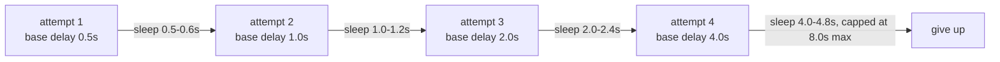
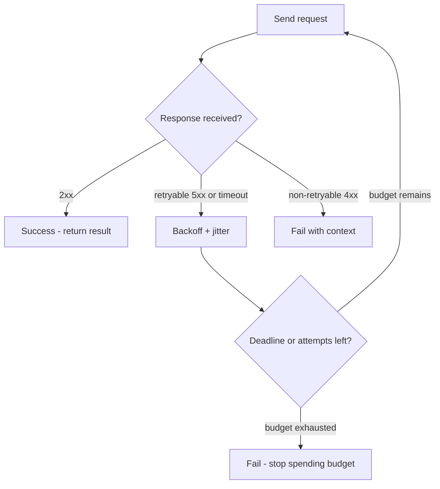

## Start with the basics

**The problem, in plain terms.** Your automation script needs data or an action from another program running somewhere else — maybe a cloud API, maybe an internal service. That other program might be slow, might be down, might reject what you sent it. You need a working model for what's actually happening on the wire before "timeout," "retry," and "status code" mean anything concrete.

**The concept: request/response.** HTTP is just a convention for one program (the *client*, your script) asking another program (the *server*) for something, and the server sending back a structured answer. Think of it like calling a company's customer-support line: you (the client) ask a specific question, the person on the other end (the server) either helps you, tells you that you asked something invalid, or tells you they're currently unable to help. Every HTTP exchange is one such call: one request out, one response back.

**Status codes: a 3-digit category, not a message.** The server's response always includes a status code — a number that coarsely categorizes what happened. You don't need to memorize all of them; you need the *families*:
- **2xx** — it worked.
- **4xx** — something about *your* request was wrong (bad URL, missing auth, invalid data). Fixing this requires *you* to change the request.
- **5xx** — something on the *server's* side went wrong. Your request might have been perfectly fine.

This 4xx-vs-5xx line is the single most important fact in this chapter, because it answers the question "should I retry?" Retrying a 4xx just sends the same broken request again — same mistake, same result, every time. Retrying a 5xx might catch the server in a healthier moment a second later, because the problem wasn't your request at all.

```python
def classify_status(status_code: int) -> str:
    if 200 <= status_code < 300:
        return "success"
    elif 400 <= status_code < 500:
        return "client error - your request was wrong"
    elif 500 <= status_code < 600:
        return "server error - retrying might help"
    else:
        return "unknown"

for code in [200, 404, 500]:
    print(code, "->", classify_status(code))
```
Expected output:
```
200 -> success
404 -> client error - your request was wrong
500 -> server error - retrying might help
```

**Timeouts: giving up on purpose.** If a server never responds, and your code waits indefinitely, one dead dependency freezes your entire program. A *timeout* is a rule you set yourself: "if I haven't heard back within N seconds, give up and move on (usually by raising an error)." There are two distinct waits bundled into what people casually call "the timeout":
- **Connect timeout** — how long you'll wait just to establish the connection (like how long you'll let the phone ring before hanging up).
- **Read timeout** — once connected, how long you'll wait for the other side to actually send data back (like being put on hold, versus getting disconnected mid-call).

A small, real example of a timeout firing:
```python
import concurrent.futures
import time

def slow_dependency():
    time.sleep(5)              # pretend this is a slow network call
    return "response data"

with concurrent.futures.ThreadPoolExecutor() as pool:
    future = pool.submit(slow_dependency)
    try:
        result = future.result(timeout=2)   # give up after 2 seconds
        print(result)
    except concurrent.futures.TimeoutError:
        print("gave up waiting after 2 seconds")
```
Expected output:
```
gave up waiting after 2 seconds
```
The dependency was still going to finish eventually (after 5 seconds), but your code decided 2 seconds was long enough to wait, and moved on.

**Why "just retry" isn't automatically safe: idempotency.** An operation is *idempotent* if doing it twice has the same end effect as doing it once. Reading a value is idempotent — reading it five times doesn't change anything. Creating a new record is usually *not* idempotent — do it twice and you get two records.

```python
inventory = {}

def set_stock(item: str, count: int) -> None:      # idempotent: sets an end state
    inventory[item] = count

def add_stock(item: str, count: int) -> None:       # NOT idempotent: repeats an effect
    inventory[item] = inventory.get(item, 0) + count

set_stock("gpu", 10)
set_stock("gpu", 10)           # calling again changes nothing further
print(inventory["gpu"])        # 10

add_stock("gpu", 5)
add_stock("gpu", 5)            # calling again adds again - duplicated effect
print(inventory["gpu"])        # 20
```
Expected output:
```
10
20
```
This is exactly why blindly retrying a POST that creates something can be dangerous: if the first attempt actually succeeded but you never saw the response (say, the connection dropped after the server processed it), retrying might create a duplicate.

**Check your understanding:**
1. *A client gets a 404 for a GET request. Should it retry the exact same request?* — No. 404 is a 4xx: the request itself was wrong (wrong URL or ID). Retrying unchanged sends the identical mistake again.
2. *What's the difference between a connect timeout and a read timeout?* — Connect timeout bounds how long you wait to establish the connection at all; read timeout bounds how long you wait for data once you're already connected.
3. *Is `DELETE /users/42` idempotent?* — Yes, in the usual sense: the first call deletes user 42, and every subsequent call still leaves the system in the state "user 42 does not exist" — even though the second call will typically return a 404 instead of a success code, the *effect on the system* is unchanged.

With request/response, status-code families, timeouts, and idempotency in place, the rest of this chapter is about turning those ideas into an actual retry policy.

> After this chapter you should be able to: Build clients that distinguish client errors, transient server errors, rate limiting, and network failure.

A reliable API client has policy. It does not retry everything. Authentication errors usually require corrected credentials, not ten more attempts. Validation errors are deterministic. A 429 may be retryable according to Retry-After. Many 5xx responses and network timeouts can be transient. The retry layer must understand idempotency: retrying GET is usually safe; retrying a POST that creates a resource may duplicate work unless the API provides an idempotency key or the operation is otherwise safe.


Figure 3. Retry is a policy branch after classification, not a loop around every exception.
```python
import random, time, requests
RETRYABLE = {429, 500, 502, 503, 504}

def get_json(url: str, token: str, attempts: int = 4) -> dict:
    headers = {"Authorization": f"Bearer {token}"}
    for attempt in range(1, attempts + 1):
        try:
            response = requests.get(url, headers=headers, timeout=(2, 8))
            if response.status_code not in RETRYABLE:
                response.raise_for_status()
                return response.json()
        except (requests.Timeout, requests.ConnectionError):
            if attempt == attempts:
                raise
        else:
            if attempt == attempts:
                response.raise_for_status()
        delay = min(8.0, 0.5 * (2 ** (attempt - 1)))
        time.sleep(delay + random.uniform(0, delay * 0.2))
    raise AssertionError("unreachable")
```
The timeout tuple above separates connect timeout from read timeout. Jitter prevents many clients from retrying in lockstep after a shared outage. In mature systems, prefer a tested retry library or HTTP adapter configuration, but first understand the policy you expect the library to implement.

**Backoff sequence, with real numbers, so "exponential with jitter" isn't just a phrase:**

Without jitter (the `random.uniform` term), every client that started retrying at the same moment (e.g. all hit the outage simultaneously) retries in perfect lockstep — turning a brief blip into a repeating thundering herd. Jitter is what actually spreads the retry storm out — worth being able to draw this timeline from memory.

**The Retry-After header — the one thing the chapter's Practice #2 asks you to add, worked out:**
```python
if response.status_code == 429 and "Retry-After" in response.headers:
    delay = float(response.headers["Retry-After"])   # server told you exactly how long — trust it
else:
    delay = min(8.0, 0.5 * (2 ** (attempt - 1))) + random.uniform(0, 0.2)   # fall back to your own backoff
```
**Interview framing:** "if the server tells you how long to wait, that's better information than your own guess — always prefer explicit server guidance over client-side backoff math when it's available."

## Work the scenario step by step
**Scenario:** A cloud API returns 503 to 500 CI jobs at the same time.
1. Do not have every job retry at the same fixed one-second interval; that creates synchronized load spikes.
2. Use exponential backoff so request rate drops while the dependency recovers.
3. Add jitter so clients spread their retries across time.
4. Respect server guidance such as Retry-After when present.
5. Cap attempts and total time; an automation that retries forever is not reliable.

**Reasoned conclusion:** Retry behavior must reduce pressure on a failing dependency, not amplify it.

## Practice before moving on
1. Classify 400, 401, 403, 404, 409, 429, 500, 503 into retry/no-retry decisions and justify each.
2. Add a Retry-After branch to the sample client.
3. Implement pagination for an API returning next-page tokens.

4. Sketch (pseudocode is fine) a circuit breaker on top of this retry client: after N consecutive failures to one host, stop even attempting requests for a cooldown window rather than retrying every single call — this is the pattern that protects a *dependency* from being hammered, one level above per-call retry/backoff, and a natural "what would you add for production" follow-up.

## Targeted references
[Requests documentation](https://requests.readthedocs.io/) - HTTP client API and exceptions.
[Udemy - Python for DevOps](https://www.udemy.com/course/python-devops) - Relevant lessons: GET requests; HTTP status codes; Token-based authentication; Handling timeouts; Retries: Simple strategy; Retries: Exponential backoff with jitter.

**Visual model — a retry is a bounded state machine, not a loop:**

**Key takeaway:** *"Retry the condition, cap the time, add randomness."* A retry budget is part of the caller's latency budget, so no attempt can be evaluated in isolation.
