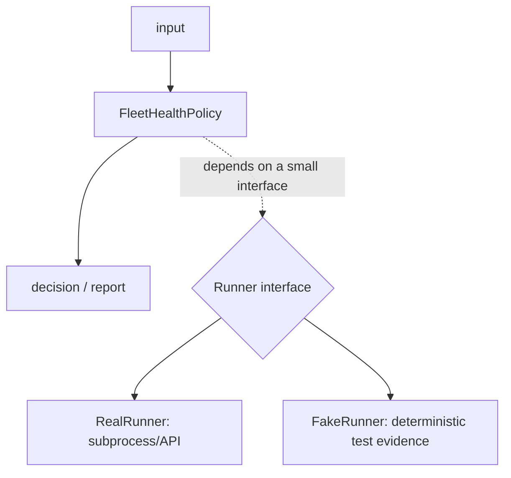

## Why a class appears in our scripts

This is enough when there is no state:

```python
def classify_gpu(memory_used_mib: int, memory_total_mib: int) -> str:
    return "warning" if memory_used_mib / memory_total_mib > 0.9 else "healthy"
```

A class becomes justified when several calls share state and the state has one owner. An API client keeps a base URL, an authenticated session, timeout policy, and perhaps a connection pool:

```python
from dataclasses import dataclass
import requests


@dataclass(frozen=True)
class RetryPolicy:
    attempts: int = 3
    timeout_seconds: float = 5.0


class InventoryClient:
    def __init__(self, base_url: str, policy: RetryPolicy) -> None:
        self.base_url = base_url.rstrip("/")
        self.policy = policy
        self.session = requests.Session()

    def get_node(self, name: str) -> dict:
        response = self.session.get(
            f"{self.base_url}/nodes/{name}",
            timeout=self.policy.timeout_seconds,
        )
        response.raise_for_status()
        return response.json()
```

`InventoryClient` is not a class because classes are “more professional.” It is a class because `base_url`, policy, and the reusable session belong together. A single stateless method would be clearer as a function. A class that only wraps one function adds ceremony and hides the real dependency.

### Class review questions

Before adding a class, answer:

1. What state does it own?
2. Must that state persist between calls?
3. Can two instances have different configuration at the same time?
4. Can a function plus explicit arguments express this more clearly?
5. How will a test replace its network, filesystem, or subprocess effect?

## Dataclass: a record with an explicit shape

A raw dictionary is flexible but typo-prone:

```python
sample = {"node": "gpu-01", "temperature_c": 65.0}
sample["temprature_c"]  # KeyError at runtime
```

Use a dataclass when the record is part of the program’s domain and you want named fields, a useful representation, and equality:

```python
from dataclasses import dataclass


@dataclass(frozen=True)
class GpuSample:
    node: str
    temperature_c: float
    healthy: bool
```

`frozen=True` prevents accidental mutation after the observation is created. It does not validate that a caller passed a float; annotations and dataclass fields are not automatic runtime validation. Validate untrusted JSON at the boundary before constructing the object.

Use a dictionary for genuinely variable keys, a `TypedDict` when JSON-shaped keys matter but a normal dictionary is desired, and a dataclass when the record has a stable domain meaning.

## Start with the basics

**The problem, in plain terms.** Infrastructure code often needs to model real things that have both data and behavior attached to them: a compute node has a hostname and a GPU count, and it also has actions like "check if I'm healthy." If you keep the data in a dict and the behavior in a separate function, you have to pass the dict into every function by hand, and nothing enforces that the dict actually has the shape those functions expect. You need a way to bundle a thing's data and its behavior together, as one unit.

**The concept: class and object.** A *class* is a blueprint — it describes what data a thing will have and what it can do, but it isn't a specific thing itself. An *object* (or *instance*) is one actual thing built from that blueprint. The analogy: a house blueprint specifies "this house has N bedrooms, a kitchen, a front door" — but the blueprint itself is just paper. You can build many actual houses from the same blueprint; each house has its own street address and its own furniture inside, even though they all share the same room layout. A class is the blueprint; each object is one house built from it.

**Attributes and methods.** An *attribute* is a piece of data an object carries (a house's address). A *method* is a function that belongs to the object and usually reads or changes its attributes (a house's "turn on the lights" action, which only affects that one house). Here is a class with both, and two independent objects built from it:

```python
class Node:
    def __init__(self, hostname: str, gpu_count: int):
        self.hostname = hostname        # attribute
        self.gpu_count = gpu_count      # attribute
        self.healthy = True             # attribute

    def mark_unhealthy(self):           # method
        self.healthy = False

node_a = Node("gpu-node-01", gpu_count=8)
node_b = Node("gpu-node-02", gpu_count=4)

node_a.mark_unhealthy()

print(node_a.hostname, node_a.healthy, node_a.gpu_count)
print(node_b.hostname, node_b.healthy, node_b.gpu_count)
```
Expected output:
```
gpu-node-01 False 8
gpu-node-02 True 4
```
`node_a` and `node_b` are two separate houses built from the same `Node` blueprint. Calling `mark_unhealthy()` on `node_a` only changes `node_a`'s own data — `node_b` never notices.

**Why this matters for infrastructure code specifically.** The point isn't "OOP is good practice" in the abstract — it's concrete: when you bundle a `Node`'s data with its own health-check method, the code that models your fleet reads like the real system ("ask each node if it's healthy") instead of a maze of loose dictionaries and separately-named functions that all have to agree, by convention, on what keys a dict contains. Objects let the data and the operations that make sense on that data travel together.

**Check your understanding:**
1. *What's the relationship between a class and an object?* — A class is the blueprint (the definition of what data and behavior a thing has); an object is one specific instance built from that blueprint, with its own independent data.
2. *In the `Node` example, why does `node_b.healthy` stay `True` after calling `node_a.mark_unhealthy()`?* — Because each object holds its own independent copy of its attributes; a method called on one object only touches that object's data.
3. *What's the difference between an attribute and a method?* — An attribute is data stored on the object; a method is a function bound to the object that typically reads or changes that object's attributes.

With classes and objects as the base unit, the rest of this chapter is about deciding *when* to relate two classes by inheritance versus by composition.

> After this chapter you should be able to: Use objects to hold cohesive state and behavior; prefer composition over inheritance when components have different responsibilities.

Object-oriented design is useful when an automation has stateful collaborators: an API client, credential provider, retry policy, renderer, and command runner. Do not create classes merely to satisfy "use OOP." A class should represent a concept that owns state and operations. Composition lets you assemble behavior by giving one object another object to collaborate with.
```python
from dataclasses import dataclass
from typing import Protocol

class CommandRunner(Protocol):
    def run(self, args: list[str]) -> str: ...

@dataclass
class PodInspector:
    runner: CommandRunner
    namespace: str
    def raw_pods(self) -> str:
        return self.runner.run(["kubectl", "get", "pods", "-n", self.namespace, "-o", "json"])
```
PodInspector does not inherit from a generic KubernetesTool. It receives a runner. In tests, you can inject a fake runner. In production, inject a subprocess-backed runner. The Protocol describes the behavior needed without forcing a rigid class hierarchy.
```python
class FakeRunner:
    def __init__(self, output: str):
        self.output = output
        self.calls: list[list[str]] = []
    def run(self, args: list[str]) -> str:
        self.calls.append(args)
        return self.output
```
**Key takeaway:** Inheritance says "is a specialized form of." Composition says "uses." Infrastructure tools are usually assemblies of clients, policies, parsers, and adapters, so "uses" is often the more natural relationship.

**The test this pattern buys you, made concrete — this is *why* Protocol-based composition matters, not just a style preference:**
```python
def test_pod_inspector_calls_kubectl_with_correct_namespace():
    fake = FakeRunner(output='{"items": []}')
    inspector = PodInspector(runner=fake, namespace="prod")
    inspector.raw_pods()
    assert fake.calls == [["kubectl", "get", "pods", "-n", "prod", "-o", "json"]]
    # zero real kubectl calls, zero real cluster, zero network — pure, fast, deterministic
```
This is the direct payoff of Chapter 3's "functional core, imperative shell" idea, applied to classes: `PodInspector` is testable without a cluster because it depends on a `Protocol`, not a concrete `subprocess` call.

**When inheritance genuinely is right (the chapter's Practice #2 asks you to explain this — here's the concrete answer):**
```python
class BaseExporter:
    def export(self, records: list[dict]) -> None:
        formatted = self._format(records)     # shared logic
        self._write(formatted)                  # shared logic
    def _format(self, records): raise NotImplementedError
    def _write(self, data): raise NotImplementedError

class JSONExporter(BaseExporter):
    def _format(self, records): return json.dumps(records)
    def _write(self, data): Path("out.json").write_text(data)
```
Inheritance fits here because `JSONExporter` genuinely **is a kind of** `Exporter` sharing a fixed algorithm shape (Template Method pattern) — different from `PodInspector`, which merely **uses** a runner. The test: "is this relationship 'is-a' with a shared invariant algorithm, or 'has-a collaborator with independent behavior'?" — the first is inheritance, the second is composition.

## Practice before moving on
1. Design an ApiClient that composes a RetryPolicy and AuthProvider.
2. Explain when inheritance would actually make sense.
3. Replace a class that only contains one stateless staticmethod with a normal function and explain why it is clearer.

4. Write the `FakeRunner`-based test above from memory, then extend `FakeRunner` to simulate a `CalledProcessError` on the second call — testing the Chapter 5 exception-handling path through a fake, without ever touching a real cluster.

## Targeted references
[Udemy - Python for DevOps](https://www.udemy.com/course/python-devops) - Relevant lessons: Introduction to classes; Class methods; Inheritance; Object-Oriented Deployment Manager coding exercise.

**Visual model — dependency injection creates the test seam:**

**Key takeaway:** *"Objects own policy; adapters own effects."* If a class both decides and runs shell commands, it has hidden dependencies and no cheap test seam.
