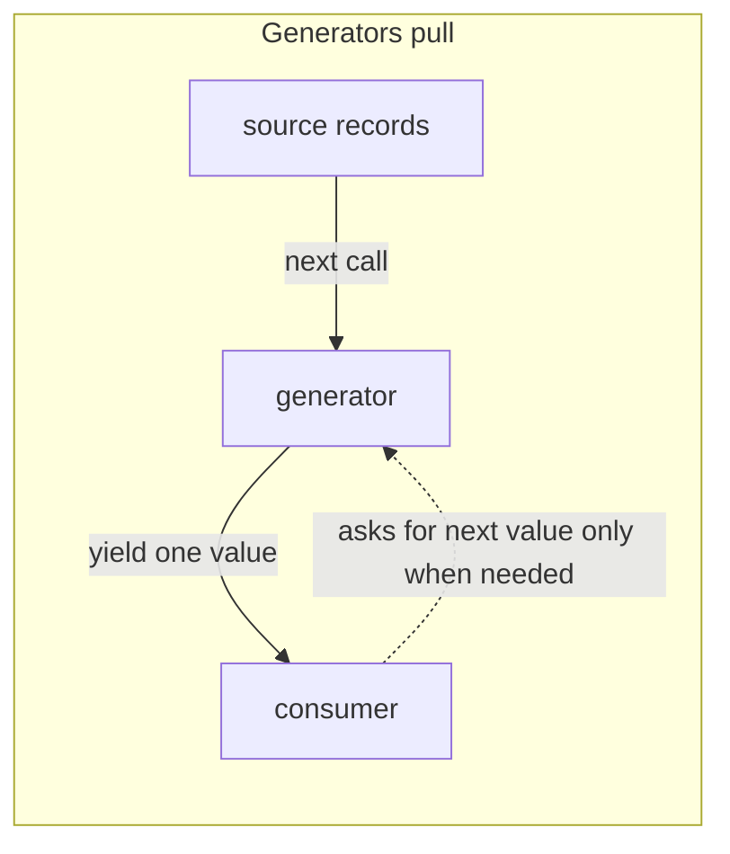
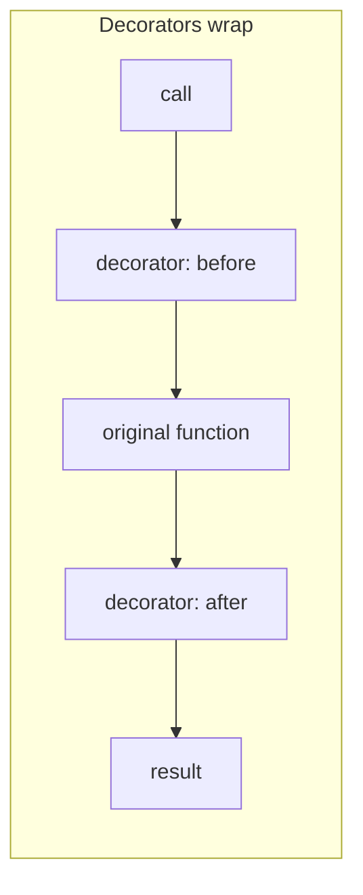

*(original text preserved in full; ➕ marks additions)*

## Foundations: start here if this is new to you

**The problem, in plain terms.** Say you need to process a log file that's 10 gigabytes on disk. If you write a function that reads the whole thing and returns a list of every line, that list has to fit in memory before you can even start looking at the first line. You want to process one item, then the next, then the next — without ever holding "all of it" in memory at once.

**The concept: a generator.** A generator is a function that produces values one at a time, on demand, instead of computing and returning them all up front. The analogy: a vending machine dispenses exactly one item when you press a button, and waits for your next button press before dispensing the next one. Compare that to someone dumping your entire order — everything you could possibly want — on the counter at once, whether you asked for it yet or not. A generator is the vending machine; a list is the whole order dumped on the counter.

**The basic shape: `yield`.** A normal function uses `return` and hands back one value, ending the function. A generator function uses `yield` instead — each time it hits `yield`, it hands back one value and *pauses*, keeping its place, until something asks for the next value.

```python
def countdown(n: int):
    while n > 0:
        yield n         # pause here, hand back one value
        n -= 1

for value in countdown(3):
    print(value)
```
Expected output:
```
3
2
1
```
Trace it by hand: `n` starts at 3. `yield n` hands back `3` and pauses. The `for` loop prints it, then asks for the next value — execution resumes right after the `yield`, `n` becomes 2, loop condition `2 > 0` is true, `yield n` hands back `2`. Same for `1`. When `n` becomes `0`, the `while` condition is false and the generator simply ends — no more values, the `for` loop stops. At no point did `countdown` build a list of `[3, 2, 1]` — each value existed only when it was asked for.

**The concept: a decorator.** A decorator is a function that wraps another function to add behavior *around* it — before it runs, after it runs, or both — without changing the original function's own code. The `@decorator_name` syntax you'll see above a function definition is not special magic; it is exactly shorthand for `function = decorator_name(function)`.

```python
def announce(func):
    def wrapper(*args, **kwargs):
        print(f"before calling {func.__name__}")
        result = func(*args, **kwargs)
        print(f"after calling {func.__name__}")
        return result
    return wrapper

@announce
def greet(name):
    print(f"hello, {name}")
    return "done"

greet("ops team")
```
Expected output:
```
before calling greet
hello, ops team
after calling greet
```
Trace it: `@announce` above `greet` means Python runs `greet = announce(greet)` immediately after defining `greet`. So the name `greet` now actually refers to `wrapper`. Calling `greet("ops team")` calls `wrapper("ops team")`: it prints "before calling greet", then calls the original `func("ops team")` (the real `greet`), which prints "hello, ops team" and returns `"done"`, then `wrapper` prints "after calling greet" and returns that same `"done"`. Nothing in the original `greet` function's code changed — the printing before and after was bolted on entirely from outside.

**Check your understanding:**
1. *What problem does a generator solve that returning a list doesn't?* — It avoids building the entire sequence in memory before you can use any of it; values are produced lazily, one at a time, which matters when the sequence is huge (like a multi-gigabyte log file) or even unbounded.
2. *In the vending-machine analogy, what plays the role of `yield`?* — Dispensing exactly one item per button press, then waiting — the machine doesn't hand you your whole order at once, and a generator doesn't compute its next value until it's asked for.
3. *What does `@announce` actually do to `greet` under the hood?* — It's shorthand for `greet = announce(greet)`. The name `greet` ends up bound to the wrapper function, which calls the original function internally while adding behavior around that call.

With `yield` and `@decorator` demystified as "pause and hand back one value" and "rebind the name to a wrapping function," the rest of this chapter builds on both for real infrastructure use cases.

> After this chapter you should be able to: Use generators for lazy streams and decorators for reusable cross-cutting behavior while preserving function semantics.

A generator is a function that can suspend its execution at yield and resume later. It is valuable when the data stream may be large or indefinite. Instead of returning one huge list of parsed log events, yield one event at a time and let the caller decide how far to consume the stream.
```python
from pathlib import Path
from collections.abc import Iterator

def error_lines(path: Path) -> Iterator[str]:
    with path.open(encoding="utf-8") as handle:
        for line in handle:
            if "ERROR" in line or "CRITICAL" in line:
                yield line.rstrip("\n")
```
**A decorator wraps a function but should preserve its metadata and return value**
```python
from functools import wraps
from time import perf_counter

def timed(func):
    @wraps(func)
    def wrapper(*args, **kwargs):
        start = perf_counter()
        try:
            return func(*args, **kwargs)
        finally:
            elapsed = perf_counter() - start
            print(f"{func.__name__} took {elapsed:.3f}s")
    return wrapper
```
functools.wraps copies important metadata such as __name__ and __doc__. Without it, tooling and debugging may report the wrapper rather than the wrapped function. A production decorator should also preserve exceptions unless it has a deliberate policy for translating or retrying them.

➕ **Prove the `@wraps` point with actual output — this is a real "what does this print and why" interview question:**
```python
@timed
def check_disk(): """Checks disk health."""; return True

print(check_disk.__name__)   # with @wraps: "check_disk"    | without @wraps: "wrapper"
print(check_disk.__doc__)    # with @wraps: "Checks disk..." | without @wraps: None
```
Without `@wraps`, every function you decorate silently loses its identity to debuggers, `help()`, and any tooling that introspects `__name__` (including some test frameworks) — a subtle bug that's invisible until something downstream breaks mysteriously.

➕ **A decorator that composes with the retry logic from Chapter 8 — turning the whole retry loop into one reusable line:**
```python
from functools import wraps
import time, random

def retry(attempts=4, retryable=(TimeoutError, ConnectionError)):
    def decorator(func):
        @wraps(func)
        def wrapper(*args, **kwargs):
            for attempt in range(1, attempts + 1):
                try:
                    return func(*args, **kwargs)
                except retryable:
                    if attempt == attempts:
                        raise
                    delay = min(8.0, 0.5 * (2 ** (attempt - 1)))
                    time.sleep(delay + random.uniform(0, delay * 0.2))
        return wrapper
    return decorator

@retry(attempts=3, retryable=(requests.Timeout,))
def fetch_inventory(): ...
```
This is the exact "why do decorators matter" answer: Chapter 8's whole retry function body becomes a one-line annotation, reusable across every API call in the codebase instead of copy-pasted.

## Practice before moving on
1. Modify error_lines() to parse and yield structured events instead of raw strings.
2. Write a decorator that rejects calls when a required environment variable is absent.
3. Explain why a generator is usually preferable to returning a 10-million-element list.

➕ 4. Write the `@wraps` before/after demo above yourself and run it — this is exactly the kind of "predict the output" question asked live in coding interviews.

## Targeted references
[Udemy - Python for DevOps](https://www.udemy.com/course/python-devops) - Relevant lessons: Generator syntax; The yield statement; State in generators; Coding lazy pipelines; Introduction to decorators; functools.wraps; RBAC Decorator Factory exercise.

➕ **Visual model — generators pull; decorators wrap:**


**Memory hook:** *"`yield` pauses production; a decorator adds a boundary."* Both preserve a small, composable unit of work instead of materializing or duplicating the whole workflow.
