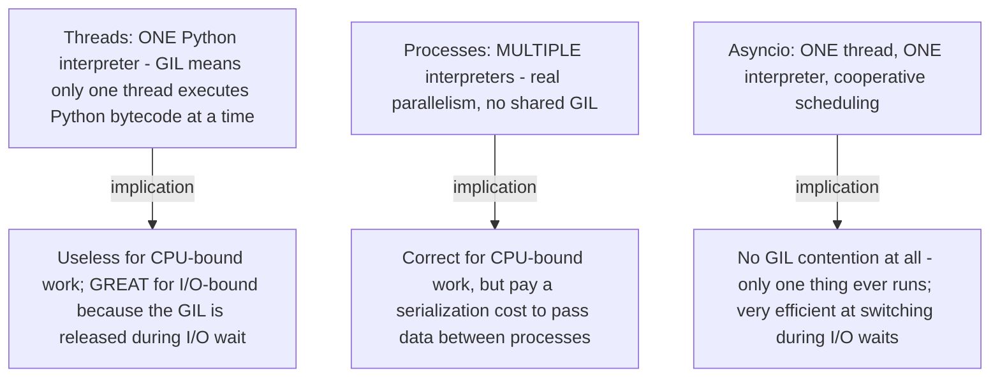
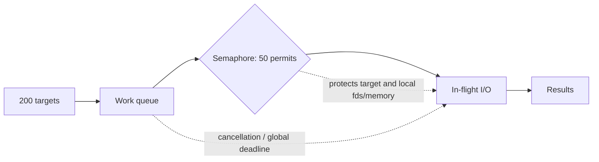

*(original text preserved in full; ➕ marks additions)*

## Foundations: start here if this is new to you

**The problem this concept solves.** Imagine you need to fetch the health status of 20 different services. If you check them one at a time — send a request, wait for the reply, then send the next request — the total time is the sum of every single wait. If ten of those services take one second each to respond, that's ten seconds spent doing essentially nothing but waiting. The question concurrency answers is: *can the waiting overlap instead of stacking up?*

**Sequential vs. concurrent, named.** Doing things **sequentially** means one thing happens, finishes completely, and only then does the next thing start — like a single cashier at a grocery store who scans one customer's items, takes their payment, hands them a receipt, and only then calls the next customer forward. Doing things **concurrently** means multiple things are in progress during overlapping periods of time — like a store that opens three checkout lanes, each with its own cashier, so three customers are being served at once. (When those cashiers are truly working at the exact same instant, that's called **parallel**; when they're taking turns so fast it looks simultaneous, that's still "concurrent" even without true parallelism — the distinction matters and shows up again below.)

**Python gives you three different tools for this, because "waiting" and "computing" are different-shaped problems:**

1. **Threading** — good when a task spends most of its time *waiting* (for a network reply, a disk read, a subprocess to finish). Python threads mostly cannot run CPU-heavy Python code in true parallel, because of something called the **GIL** (Global Interpreter Lock) — a lock built into the standard Python interpreter that allows only one thread to execute Python bytecode at any given instant, no matter how many CPU cores the machine has. Threads still help enormously for I/O, because a thread releases the GIL while it is blocked waiting on a network response — so another thread gets to run during that dead time.
2. **Multiprocessing** — good for genuinely CPU-heavy work (crunching numbers, parsing huge files, image processing). Each process gets its own separate Python interpreter and its own GIL, so multiple processes really can use multiple CPU cores at the same moment. The trade-off: processes do not share memory the way threads do, so passing data between them costs time (serializing it, copying it across).
3. **asyncio** — good for handling a *very large number* of waiting-mostly tasks (think thousands of open network connections) efficiently, inside a single thread. Instead of the operating system switching between threads for you, the code itself explicitly says "I'm waiting now, let something else run" at specific points (using `await`). This cooperative style avoids the memory overhead of spinning up thousands of OS threads.

The goal of naming these three right now is narrow: stop treating "threading," "multiprocessing," and "asyncio" as interchangeable buzzwords. They solve three different-shaped problems — waiting a little (threads), computing a lot (processes), and waiting a *lot, at scale* (asyncio).

**A tiny runnable example — sequential vs. threaded waiting.**

```python
import time
from concurrent.futures import ThreadPoolExecutor

def slow_task(n: int) -> int:
    time.sleep(1)  # stands in for "waiting on a network response"
    return n * n

start = time.time()
results_sequential = [slow_task(n) for n in range(3)]
print("sequential:", results_sequential, "took", round(time.time() - start, 1), "s")

start = time.time()
with ThreadPoolExecutor(max_workers=3) as pool:
    results_threaded = list(pool.map(slow_task, range(3)))
print("threaded:  ", results_threaded, "took", round(time.time() - start, 1), "s")
```
Expected output:
```
sequential: [0, 1, 4] took 3.0 s
threaded:   [0, 1, 4] took 1.0 s
```
Same three results, same order — but the sequential run pays for three separate one-second waits (3.0s total), while the threaded run overlaps all three waits into roughly one second, because each `time.sleep(1)` releases the GIL and lets the other threads keep waiting concurrently.

**Check your understanding.**
1. *Q: You have a function that resizes 500 large images (pure CPU work, no network calls). Which of the three tools is the right default, and why?*
   A: Multiprocessing — image resizing is CPU-bound, and only separate processes (separate interpreters, separate GILs) can actually use multiple CPU cores at once. Threads would all fight over the single GIL and give you no speedup.
2. *Q: True or false — asyncio code runs on multiple CPU cores simultaneously.*
   A: False. asyncio runs on a single thread in a single interpreter; it gets efficiency by cooperatively switching between waiting tasks, not by using multiple cores.
3. *Q: Why does a thread that's waiting on `requests.get()` not block other threads from making progress?*
   A: Because Python's I/O operations release the GIL while they wait on the operating system/network, so another thread is free to run Python bytecode during that wait.

With sequential-vs-concurrent and the three tools named, the rest of this chapter is about choosing between threads, asyncio, and processes for a specific real workload — starting with the same "which tool for which bottleneck" question, now with real code.

> After this chapter you should be able to: Choose threads, asyncio, processes, or sequential execution by the bottleneck and operational complexity.


Figure 4. Concurrency is a bottleneck decision, not an "advanced Python" badge.

Most infrastructure concurrency is I/O-bound: hundreds of HTTP calls, SSH sessions, DNS lookups, or file reads. Threads can overlap blocking I/O with familiar synchronous libraries. asyncio can scale to very high I/O concurrency when the entire call path uses async-compatible libraries. Multiprocessing is useful for CPU-heavy work because separate processes have separate Python interpreters and can execute Python bytecode in parallel.
```python
from concurrent.futures import ThreadPoolExecutor, as_completed
import requests

def health(url: str) -> tuple[str, int]:
    response = requests.get(url, timeout=3)
    return url, response.status_code

urls = [f"https://service-{i}.example/health" for i in range(20)]
with ThreadPoolExecutor(max_workers=8) as pool:
    futures = [pool.submit(health, url) for url in urls]
    for future in as_completed(futures):
        try:
            print(future.result())
        except requests.RequestException as exc:
            print("failed:", exc)
```
The max_workers limit is operational backpressure. Unbounded concurrency can overload your own machine, the dependency, DNS, ephemeral ports, or rate limits. Senior reasoning includes deciding concurrency limits and failure aggregation, not merely knowing ThreadPoolExecutor syntax.

➕ **The GIL — the concept this whole chapter's threads-vs-processes choice hinges on, stated precisely:**

**The interview one-liner:** "threads are for waiting, processes are for computing — the GIL means threads don't actually parallelize Python code, they parallelize *waiting* for I/O." This single sentence answers "why not just use threads for everything" correctly and completely.

➕ **Why multiprocessing is wrong for 2,000 HTTP requests (Practice #2, worked out):** each process has fixed startup overhead (new interpreter, re-importing modules) and the actual work (waiting on network I/O) never touches the GIL restriction in the first place — you'd pay heavy process-spawn cost to parallelize something that was never CPU-bound. `ThreadPoolExecutor` or `asyncio` both sidestep the GIL problem correctly here because it was never a GIL problem — it's an I/O-wait problem.

➕ **asyncio version of the same health-check, for comparison (Practice #1):**
```python
import asyncio, aiohttp

async def health(session, url):
    async with session.get(url, timeout=3) as resp:
        return url, resp.status

async def check_all(urls):
    async with aiohttp.ClientSession() as session:
        results = await asyncio.gather(*(health(session, u) for u in urls), return_exceptions=True)
    return results
```
Note `return_exceptions=True` — without it, one failed request cancels the entire `gather()` batch, exactly the "collect partial failures without canceling successful results" requirement from the worked scenario below.

## Work the scenario step by step
**Scenario:** You need to check 2,000 HTTP endpoints every five minutes.
1. Estimate latency and service rate limits before picking a concurrency model.
2. If using requests, a bounded thread pool is straightforward. If scaling to much higher concurrency and async clients are acceptable, asyncio may reduce thread overhead.
3. Bound concurrency. Add per-request timeouts.
4. Collect partial failures without canceling successful results.
5. Emit metrics for total, success, failure, timeout, and duration distribution.

**Reasoned conclusion:** The architecture is "bounded concurrent I/O with observable partial failure," not simply "use async."

## Practice before moving on
1. Rewrite the endpoint checker with asyncio and an async HTTP client if available in your environment.
2. Explain why multiprocessing is a poor default for 2,000 HTTP requests.
3. Design a concurrency limit when the upstream API permits 50 requests/second.

➕ 4. Add an `asyncio.Semaphore(50)` around the `health()` calls in the asyncio version above to implement the rate limit from Practice #3 — this is the concrete, working answer to "how do you actually bound async concurrency," not just the concept.

➕ **Visual model — concurrency needs a gate and a deadline:**

**Memory hook:** *"More tasks is not more throughput once the downstream system is saturated."* The semaphore is a safety control, not merely a performance setting.
