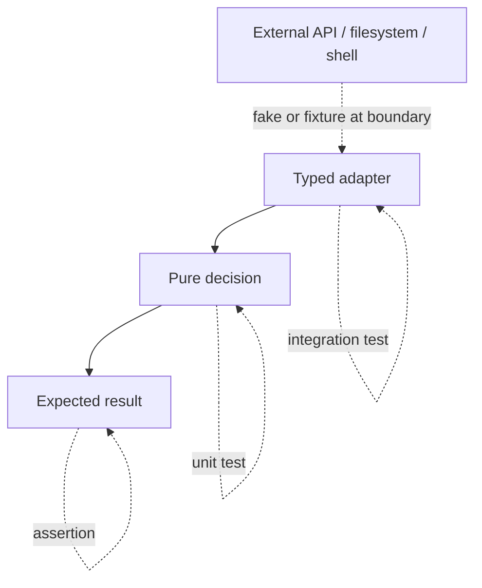

*(original text preserved in full; ➕ marks additions)*

## Foundations: start here if this is new to you

**What a type hint fundamentally is — and isn't.** A **type hint** is annotation syntax like `def greet(name: str) -> str:` that tells you (and tools) "this function expects `name` to be a string, and returns a string." Here is the misconception to clear up immediately: **Python does not enforce this at runtime by itself.** You can call `greet(42)` and Python will happily try to run the function body with `name` bound to the integer `42` — no error is raised because of the hint. The hint is documentation with a machine-readable shape, not a runtime guard.

```python
def greet(name: str) -> str:
    return "hello " + name

print(greet(42))
```
Expected output:
```
Traceback (most recent call last):
  ...
TypeError: can only concatenate str (not "int") to str
```
Notice: the error comes from the `+` operation failing on an int, at the moment the code runs — not from Python rejecting the mismatched type hint before that. If the function body never touched `name` in a type-sensitive way, `greet(42)` would have returned a nonsense-but-crash-free result with no complaint at all.

**Why hints matter anyway.** A separate tool called a **type checker** (the most common is `mypy`) reads your code *without running it* and reports type mismatches as errors — catching a whole category of bugs (passing the wrong kind of value into a function) before the code ever executes. Hints also make a function's contract obvious to the next reader — `def get_pods(namespace: str) -> list[dict]:` tells you what to pass and what you'll get back, without needing a comment explaining it.

**What a unit test fundamentally is.** A **unit test** is a small, automated piece of code that calls one function with a known input and checks that the output matches what you expect. The problem it solves: without it, you find out a change broke something when it fails in production (or a teammate reports a bug); with it, you find out in seconds, every time you run the tests.

The simplest possible unit test uses nothing but Python's built-in `assert` statement, which raises an error if the condition after it is false:

```python
def add_one(n: int) -> int:
    return n + 1

assert add_one(2) == 3
print("passed")
```
Expected output:
```
passed
```
If someone later changed `add_one` to `return n + 2`, this line would instead raise `AssertionError`, immediately, the next time it ran — instead of silently producing wrong numbers somewhere downstream.

`pytest` formalizes this exact idea: put the assertion inside a function whose name starts with `test_`, and pytest will discover and run it for you, reporting pass/fail for every such function across your whole project:

```python
def test_add_one() -> None:
    assert add_one(2) == 3
```
Running `pytest` from the command line would report something like:
```
1 passed in 0.01s
```
Same assertion, same logic — the only change is that it's now something an automated tool can find and run on every single code change, across hundreds of tests, without you remembering to run each one by hand.

**Check your understanding.**
1. *Q: You write `def f(x: int) -> int: return x`, then call `f("hello")`. Does Python raise an error immediately because of the type hint?*
   A: No — type hints aren't enforced at runtime. `f("hello")` will run and simply return `"hello"` unchanged, because `x` is never used in a way that fails.
2. *Q: What specific problem does a unit test solve that manual testing doesn't?*
   A: It re-checks the exact same known input/output every time, automatically, so a regression is caught in seconds rather than whenever someone happens to manually retest that code path (often: in production).
3. *Q: What's the minimal difference between a plain `assert` check and a pytest `test_` function containing the same assert?*
   A: Almost none in logic — the difference is discoverability and automation: pytest finds every `test_`-named function across the project and runs/reports them all together, without you calling each one by hand.

### Common annotation shapes and where to use them

Common annotations in this repository:

| Annotation | Meaning in plain language | Example use |
|---|---|---|
| `list[str]` | ordered list of strings | host names |
| `dict[str, int]` | string keys and integer values | GPU counts by node |
| `str \| None` | string or explicit absence | optional API field |
| `tuple[str, str]` | fixed two-item result | `(name, status)` |
| `Mapping[str, object]` | read-only mapping-like input | parsed configuration |
| `TypedDict` | expected dictionary keys | JSON record boundary |
| `Protocol` | required behavior, not inheritance | injectable command runner |
| `Annotated[T, metadata]` | type plus tool-specific metadata | validation frameworks |

Do not annotate every expression mechanically. Annotate public functions, boundaries, domain records, and places where a wrong type would cause an expensive incident. Treat annotations as a reviewable contract; use a checker in CI when the project is ready.

With "hints document, tests verify" in place, the rest of this chapter goes further — using both together to protect the decision logic and dependency boundaries that matter most in infrastructure code.

> After this chapter you should be able to: Use static contracts and automated tests to protect decision logic and dependency boundaries.

Type hints improve the feedback loop before runtime; tests validate behavior at runtime. For infrastructure tools, the most valuable tests target parsing, validation, policy decisions, retries, and translation of dependency failures. The most valuable mocks sit at dependency boundaries, not inside every function.


Figure 5. Keep most tests close to deterministic decision logic; use fewer real-environment tests for integration confidence.
```python
from dataclasses import dataclass

@dataclass(frozen=True)
class PodHealth:
    name: str
    restarts: int
    ready: bool

def unhealthy(pod: PodHealth) -> bool:
    return not pod.ready or pod.restarts >= 5
```
```python
import pytest

@pytest.mark.parametrize(
    ("pod", "expected"),
    [
        (PodHealth("api", 0, True), False),
        (PodHealth("worker", 7, True), True),
        (PodHealth("db", 0, False), True),
    ],
)
def test_unhealthy(pod: PodHealth, expected: bool) -> None:
    assert unhealthy(pod) is expected
```
**Mock the external HTTP boundary to test retry policy deterministically**
```python
def test_client_retries_503(mocker):
    fake_get = mocker.patch("mytool.client.requests.get")
    fake_get.side_effect = [FakeResponse(503), FakeResponse(200, {"ok": True})]
    assert get_json("https://api", "token")["ok"] is True
    assert fake_get.call_count == 2
```
Patch where the dependency is looked up by the code under test, not necessarily where the dependency was originally defined. This detail explains many "my mock did nothing" failures.

➕ **The "patch where it's looked up" rule, made concrete — this trips up almost everyone once:**
```python
# mytool/client.py
import requests
def get_json(url): return requests.get(url).json()

# WRONG in the test file:
mocker.patch("requests.get")              # patches the global requests module —
                                            # but client.py already has its OWN local reference to it

# RIGHT:
mocker.patch("mytool.client.requests.get") # patches requests.get as SEEN FROM mytool.client's namespace
```
Because `import requests` binds a name inside `mytool.client`'s namespace, patching the *original* `requests.get` doesn't affect the copy of the reference `client.py` already holds — you have to patch it where the code under test actually looks it up. This single paragraph resolves the majority of real "why isn't my mock working" confusion.

➕ **`mypy`/`pyright` in CI — closing the loop between type hints and this chapter's testing focus:**
```bash
mypy src/infra_doctor --strict
```
```
src/infra_doctor/parser.py:14: error: Argument 1 to "unhealthy" has incompatible
type "dict[str, Any]"; expected "PodHealth"  [arg-type]
```
This is the kind of error type hints catch *before* a test even runs — a caller passing a raw dict where a `PodHealth` dataclass was expected. Worth wiring `mypy --strict` into the Chapter 13 CI pipeline as a gate before tests even execute — cheaper failures fail faster.

## Practice before moving on
1. Write tests for 401 no-retry and 503 retry behavior.
2. Use a fixture to create a temporary config file.
3. Add mypy/pyright-friendly type hints to a JSON parsing function and decide where TypedDict or dataclass is appropriate.

➕ 4. Deliberately write the "wrong" patch target (`mocker.patch("requests.get")` instead of the module-qualified path) and confirm the test still calls the *real* `requests.get` — seeing the mock silently fail to intercept anything is the fastest way to make the "patch where it's looked up" rule permanent.

## Targeted references
[Python documentation: `typing`](https://docs.python.org/3/library/typing.html)

[pytest documentation](https://docs.pytest.org/) - Assertions, fixtures, parametrization, monkeypatching and plugins.
[Udemy - Python for DevOps](https://www.udemy.com/course/python-devops) - Relevant lessons: Introduction to type hints; Hands-on: Test-driven implementation; Testing exceptions; Introduction to fixtures; Parametrization; Mocking fundamentals; Patch decorator and mocker fixture.

➕ **Visual model — move uncertainty to the edges:**

**Memory hook:** *"Type the contract; test the decision; fake the effect."* Tests become fast and meaningful when they prove policy without requiring a live cluster.
