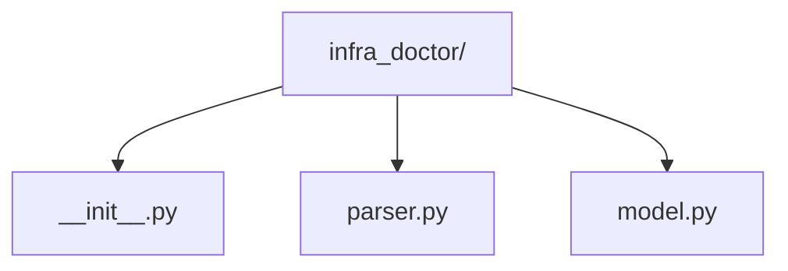
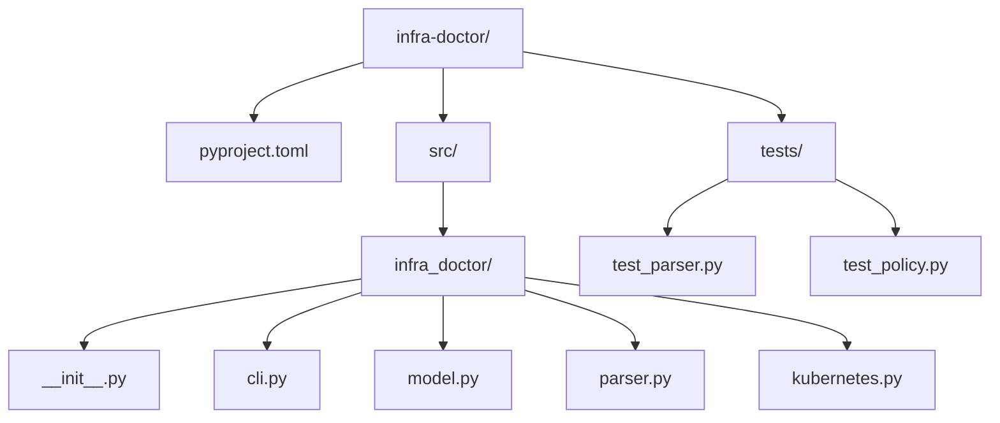

## Virtual environments and reproducibility

```bash
python3 -m venv .venv
source .venv/bin/activate
python -m pip install pytest
python -m pytest -q
```

A virtual environment isolates project packages from the base interpreter environment. It does not by itself lock exact versions; record project dependencies and use an appropriate lock/reproducible build process.

## Modules, packages, and imports

A **module** is one `.py` file with its own namespace. A **package** is a directory of related modules imported under a name. Splitting a 600-line diagnostic script makes ownership and testing visible:

```text
gpu_health/
  __init__.py       # package boundary (can be minimal)
  model.py          # GpuSample and pure classification
  collect.py        # nvidia-smi/subprocess adapter
  report.py         # text/JSON rendering
  cli.py            # argparse and exit-code boundary
```

Use imports to load a toolbox or a specific tool:

```python
import json
from pathlib import Path
from gpu_health.model import classify
```

`import json` keeps the qualified name `json.loads`, which makes the owner obvious. `from pathlib import Path` brings one name into the local module. Avoid `from package import *`: it hides where names came from and can overwrite an existing name. Use absolute imports in application entry points; use relative imports inside a package only when they make the local relationship clearer.

Imports execute module top-level initialization once per interpreter session. Therefore module scope should define constants, functions, and classes—not start a production command, make a network call, or parse command-line arguments. Put execution behind:

```python
def main() -> int:
    ...
    return 0


if __name__ == "__main__":
    raise SystemExit(main())
```

This is why the capstone has `model.py`, `kubernetes.py`, and `cli.py`: importing the model for a unit test must not invoke `kubectl`.

## The modules used repeatedly in this course

| Module | What it provides | Typical infrastructure use |
|---|---|---|
| `pathlib` | path objects and file operations | read config, enumerate logs |
| `json` / `csv` | structured text parsing | API responses, inventory exports |
| `yaml` (third-party) | YAML parsing | human-authored config; use `safe_load` for untrusted input |
| `subprocess` | start existing OS tools | `kubectl`, `nvidia-smi`, `ip`, `systemctl` |
| `argparse` | command-line interface | flags, help text, exit behavior |
| `logging` | severity, handlers, structured context | incident evidence without `print` noise |
| `datetime` / `time` | timestamps and bounded waits | deadlines, retry backoff |
| `re` | regular expressions | carefully extracting stable log patterns |
| `collections` | specialized containers | `Counter`, `defaultdict`, `deque` |
| `concurrent.futures` | bounded thread/process pools | parallel network probes with backpressure |
| `contextlib` | cleanup abstractions | temporary directories, lock/resource scopes |
| `dataclasses` | explicit data records | immutable observations and policies |
| `typing` / `collections.abc` | static contracts | readable interfaces and checker support |
| `pytest` (third-party) | test discovery and assertions | fast policy tests and controlled fakes |
| `requests`/`httpx` (third-party) | HTTP clients | APIs; always configure timeouts |

The import tells you the dependency; the call tells you the reason. When reading an unfamiliar script, build a two-column map: “import” → “effect in this script.” Remove imports that do not earn their place.

## Start with the basics

**Why one script stops being enough.** A single `.py` file is great until a project grows: you add a parser, then a policy module, then a Kubernetes client, then tests — and soon you're scrolling through hundreds of lines to find one function, copy-pasting helper code between unrelated scripts because there's no clean way to reuse it, and unsure which functions are safe to change without breaking something else. None of that is really about Python syntax — it's about organization at scale.

**What a package fundamentally is.** A **module** is just a single `.py` file that can be imported (`import config` imports `config.py`). A **package** is a *folder* containing an `__init__.py` file (even an empty one) plus other modules — the folder becomes something you can import as one unit, e.g. `import infra_doctor` or `from infra_doctor import parser`. That's the basic shape; the folder groups related modules (a parser, a model, a CLI) so they can be organized, imported, and eventually installed together, instead of being loose files that only work if you happen to run them from the right directory.


```python
# infra_doctor/model.py
def double(n: int) -> int:
    return n * 2
```
```python
# some_other_file.py, run from the directory containing infra_doctor/
from infra_doctor.model import double
print(double(5))
```
Expected output:
```
10
```
The `__init__.py` is what tells Python "this folder is a package, not just a directory of unrelated files" — without it (on older Python versions especially), `from infra_doctor.model import double` would fail to resolve.

**What a CLI fundamentally is.** A **library** is code meant to be *imported* by other code (`from infra_doctor.model import double`). A **command-line interface (CLI)** is a program meant to be *run directly from the terminal*, typically taking arguments and flags, e.g. `infra-doctor check --namespace prod --verbose`. Why do argument-parsing libraries (like `argparse`) exist instead of just splitting the raw string yourself? Because turning `"--verbose --output=file.json"` into a clean, validated set of options — handling missing arguments, wrong types, `--help` text, short vs. long flag names — is fiddly, repetitive, and easy to get subtly wrong by hand. A parsing library does that turning-text-into-structured-data work once, correctly, so you just describe what arguments exist and receive back a clean object with the values already validated.

**What CI/CD conceptually means.** **Continuous Integration (CI)** means: every time code changes (e.g., on every commit or pull request), a machine automatically runs your tests and checks — so a mistake is caught within minutes of being introduced, not weeks later when someone finally runs the full test suite by hand. **Continuous Deployment/Delivery (CD)** means: once a change passes those checks, it's automatically made available wherever it's used next (published to a package index, deployed to a server, etc.) without a person manually repeating that step every time. Neither term is about *which* tool you use (GitHub Actions, Jenkins, GitLab CI, …) — they're both about removing manual, error-prone repetition from "did this change break anything" and "is the good version actually out there now."

**Check your understanding.**
1. *Q: What's the one file that turns a plain folder of `.py` files into an importable Python package?*
   A: `__init__.py` (it can be empty — its presence is what matters).
2. *Q: A colleague says "I'll just split the input string on spaces myself instead of using argparse." What's the risk?*
   A: They'll likely have to hand-roll handling for missing arguments, `--flag=value` vs `--flag value` syntax, type conversion, and `--help` text — argument-parsing libraries already solve those edge cases correctly.
3. *Q: Your tests pass locally but you still call it "no CI" — why might that distinction matter?*
   A: CI specifically means the tests run *automatically* on every change, for everyone, not just when one person remembers to run them locally — the automation, not the test suite's existence, is the point.

With "package," "CLI," and "CI/CD" now meaning something specific instead of vague buzzwords, the rest of this chapter builds the real thing: an installable package with a console entry point and an actual CI pipeline.

> After this chapter you should be able to: Package automation so another engineer can install, test, invoke, and release it predictably.

**A small production-style src layout**

```toml
# pyproject.toml
[project]
name = "infra-doctor"
version = "0.1.0"
requires-python = ">=3.12"
dependencies = ["requests>=2.32"]

[project.scripts]
infra-doctor = "infra_doctor.cli:main"
```
An entry point makes the tool executable after installation without asking users to know its package layout. CI should run formatting/lint checks, static analysis, tests, and build verification before publishing or packaging.
```yaml
# .github/workflows/ci.yml (core idea)
jobs:
  test:
    runs-on: ubuntu-latest
    steps:
      - uses: actions/checkout@v4
      - uses: actions/setup-python@v5
        with: { python-version: "3.12" }
      - run: pip install -e . pytest
      - run: pytest -q
```

**Why `src/` layout specifically (a real interview question — "why not just put the package at the repo root?"):**
```
Without src/:  package/           WITH src/:  src/package/
               tests/                          tests/
```
Without `src/`, running `pytest` from the repo root can silently import the *local, uninstalled* copy of your package (because the current directory is on `sys.path`) even when a different (possibly stale) version is `pip install`ed — masking packaging bugs until a real install elsewhere fails. `src/` layout forces tests to run against the actually-installed package, catching packaging mistakes locally instead of in CI or production.

**The full gate, extending the CI skeleton above to match Practice #3's ask (formatting, lint, types, security scan, tests, build):**
```yaml
steps:
  - uses: actions/checkout@v4
  - uses: actions/setup-python@v5
    with: { python-version: "3.12" }
  - run: pip install -e ".[dev]"
  - run: ruff format --check .          # formatting
  - run: ruff check .                    # lint
  - run: mypy src/infra_doctor --strict  # types
  - run: pip-audit                       # dependency security scan
  - run: pytest -q --cov=infra_doctor    # tests + coverage
  - run: python -m build                 # build verification — does packaging even succeed?
```
This ordering matters: fast/cheap checks (formatting, lint) run before slow/expensive ones (tests, build) so a trivial formatting mistake fails in seconds, not after a multi-minute test suite runs — a real CI-design tradeoff worth naming if asked to design this pipeline live.

## Practice before moving on
1. Create a pyproject.toml with a console entry point.
2. Explain why imports are more predictable with a package than with a directory full of ad-hoc scripts.
3. Design a CI gate for formatting, lint, types, security scan, unit tests and build.

4. Deliberately remove `src/` (flatten the package to repo root), run `pytest` from the root, and see whether it's importing your editable-installed package or a same-named local file — reproduce the exact ambiguity `src/` layout exists to prevent.

## Targeted references
[Python Packaging User Guide](https://packaging.python.org/) - Modern packaging concepts and pyproject.toml.
[Udemy - Python for DevOps](https://www.udemy.com/course/python-devops) - Relevant lessons: Python modules; Python packages; pyproject.toml file; Adding tests to multi-file projects; CI/CD pipeline overview; Add static type and security checks; Pytest integration; Building the Python library.

**Visual model — a production change passes progressively cheaper gates first:**

**Key takeaway:** *"Fast certainty first, expensive uncertainty later."* `pyproject.toml` defines the build/test contract so the laptop and CI run the same gates.
