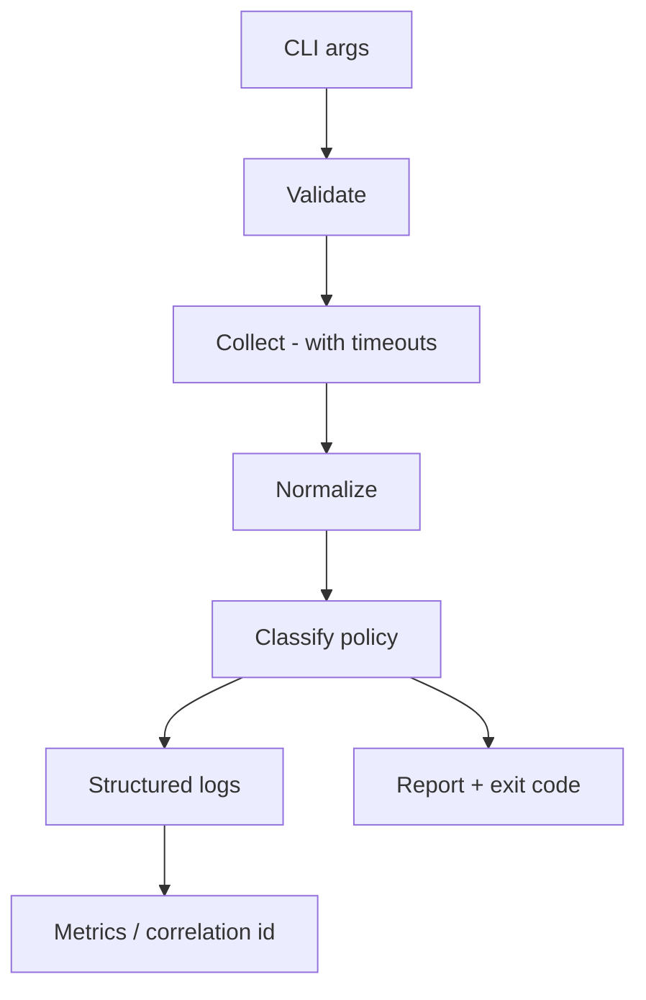

*(original text preserved in full; ➕ marks additions)*

## Before you start: what this capstone actually tests

This capstone deliberately combines concepts from across the volume rather than teaching anything new: pure decision logic as testable functions (exercised again in the `assess_pod` policy), dataclasses and other data structures for typed domain values, exceptions and typed failure translation at the subprocess/API boundary, the `subprocess` module for talking to `kubectl`, CLI argument parsing and exit-code contracts (Chapter 13), and pytest-style unit tests that exercise policy logic without touching a real cluster (Chapter 12). If you get stuck on any one piece — say, why `assess_pod` is deliberately separated from `get_pods`, or why the tests never call `kubectl` — that is a signal to go back to that chapter's Foundations section rather than pushing through here.

> After this chapter you should be able to: Combine parsing, subprocess/API boundaries, data models, logging, retries, tests, and exit semantics.

The capstone is intentionally not a single giant script. Model it as adapters around a deterministic core. Kubernetes access can come from an SDK or kubectl adapter. The parser converts raw responses into typed domain values. Policy functions classify health. A renderer produces text or JSON. The CLI maps results to exit codes.


Figure 6. Use the same pipeline for the capstone: inputs become validated domain data, decisions drive actions, and every external edge is observable.
```python
from dataclasses import dataclass

@dataclass(frozen=True)
class Finding:
    severity: str
    resource: str
    reason: str

def assess_pod(name: str, ready: bool, restarts: int) -> list[Finding]:
    findings: list[Finding] = []
    if not ready:
        findings.append(Finding("critical", name, "pod not ready"))
    if restarts >= 5:
        findings.append(Finding("warning", name, f"restarts={restarts}"))
    return findings
```

➕ **The full skeleton, wired end to end — every chapter of this volume in one small system, exactly the shape a take-home or live-coding round for this role would expect:**
```python
# model.py — Ch2/Ch3/Ch12: typed domain values, pure decisions
from dataclasses import dataclass

@dataclass(frozen=True)
class Finding:
    severity: str; resource: str; reason: str

def assess_pod(name: str, ready: bool, restarts: int) -> list[Finding]:
    out = []
    if not ready: out.append(Finding("critical", name, "pod not ready"))
    if restarts >= 5: out.append(Finding("warning", name, f"restarts={restarts}"))
    return out

# kubernetes.py — Ch7: subprocess boundary, typed failure
import subprocess, json

def get_pods(namespace: str) -> list[dict]:
    try:
        result = subprocess.run(
            ["kubectl", "get", "pods", "-n", namespace, "-o", "json"],
            check=True, capture_output=True, text=True, timeout=10,
        )
    except subprocess.TimeoutExpired as exc:
        raise RuntimeError(f"kubectl timed out: {namespace}") from exc
    return json.loads(result.stdout)["items"]

# cli.py — Ch6/Ch13: logging, exit codes, entry point
import sys, json, logging
from .model import assess_pod
from .kubernetes import get_pods

logger = logging.getLogger("diag")

def main() -> int:
    namespace = sys.argv[1] if len(sys.argv) > 1 else "default"
    try:
        pods = get_pods(namespace)
    except RuntimeError as exc:
        logger.error(json.dumps({"event": "collection_failed", "error": str(exc)}))
        return 3   # tool-failure exit code — distinct from "found problems"

    findings = [
        f for pod in pods
        for f in assess_pod(
            pod["metadata"]["name"],
            all(c.get("ready") for c in pod["status"].get("containerStatuses", [])),
            sum(c.get("restartCount", 0) for c in pod["status"].get("containerStatuses", [])),
        )
    ]
    for f in findings:
        print(f"{f.severity.upper():8} {f.resource}: {f.reason}")

    if any(f.severity == "critical" for f in findings): return 2
    if findings: return 1
    return 0

if __name__ == "__main__":
    raise SystemExit(main())
```
```
# test_policy.py — Ch12: pure logic, zero cluster needed
def test_assess_pod_flags_not_ready():
    assert assess_pod("api", ready=False, restarts=0)[0].severity == "critical"

def test_assess_pod_healthy_pod_has_no_findings():
    assert assess_pod("api", ready=True, restarts=0) == []
```
Notice the exit code contract (0=healthy, 1=warning, 2=critical, 3=tool failure) is decided *before* any code is written, per the worked scenario's step 1 — this is exactly what makes the tool safe to gate a CI pipeline on: a caller can branch on exit code without parsing output.

## Work the scenario step by step
**Scenario:** The tool must diagnose 500 pods across multiple namespaces and be safe to run in CI.
1. Define the output contract first: human table, JSON option, and exit codes for healthy/warning/critical/tool-failure.
2. Separate Kubernetes collection from health policy so policy can be tested with fixtures.
3. Use bounded concurrency only if collection latency justifies it.
4. Add timeouts and retry only retryable API failures.
5. Emit structured logs to stderr and report output to stdout so pipelines can consume JSON cleanly.
6. Test malformed data, auth failure, timeout, partial pod failures, and classification edge cases.

**Reasoned conclusion:** A production-quality infrastructure tool is a small system: clear contracts, controlled side effects, observable failure, and testable decisions.

➕ **stdout/stderr separation, made concrete (step 5, worth demonstrating not just stating):**
```bash
diag-cli prod > findings.json 2> diag.log     # a CI pipeline can safely `jq` findings.json —
                                                # log noise on stderr never contaminates it
```
This is a small detail with an outsized real-world payoff: mixing logs into stdout is one of the most common reasons "the tool worked in my terminal but broke the CI pipeline that parses its JSON output."

## Field note: practitioner perspective
**Vishakha Sadhwani: script vs system thinking**
Recent public material emphasizes that infrastructure work stops being "just a script" when retries, timeouts, observability, approvals, versioning, and failure handling become part of the design. Use that as the quality bar for this capstone: successful happy-path execution is only one requirement.
[Public source](https://www.linkedin.com/in/vsadhwani)

➕ **Interview framing for the whole capstone:** if asked to build a diagnostic CLI live, narrate the contract *before* writing code — "exit codes mean X/Y/Z, stdout is data, stderr is logs, collection is separate from policy so policy is unit-testable" — stating the design out loud before typing is itself a strong senior signal, independent of how much code you finish in the time given.

➕ **Visual model — the capstone is a bounded reconciliation loop:**

**Memory hook:** *"Collect facts, then decide."* Separating collection from policy is what makes retries, tests, exit codes and future integrations manageable.
