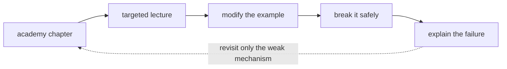

Use the Udemy course as reinforcement after reading the matching chapter. The integration does not expose stable deep links for individual enrolled lectures, so the exact lecture titles and durations are listed below; open the course and jump directly to those titles rather than watching the whole course linearly.

<!-- source-table:1 -->

| Book topic | Exact Udemy lecture / exercise | Approx. duration |
| --- | --- | --- |
| Execution / basics | Writing and running Python files; Hands-on: Disk usage calculation | 1:47; 3:33 |
| Data structures | Set operations; Dictionaries; Server Inventory Reporter | 6:01; 12:12; exercise |
| Generators | Generator syntax; The yield statement; Coding lazy pipelines | 6:15; 5:23; 18:38 |
| Exceptions | Thinking in exceptions; Adding context to custom exceptions | 4:22; 8:59 |
| Logging | Structured logging with JSON; Extra fields and exceptions in structured logging | 11:29; 4:56 |
| Files / regex | The Path object; Regex: Introduction and essentials; Log Line Error Detector | 6:03; 13:03; exercise |
| Subprocess | Introduction to subprocesses; Handling expired timeouts | 10:31; 3:27 |
| HTTP | GET requests; Handling timeouts; Retries: Exponential backoff with jitter | 7:43; 3:45; 10:48 |
| Typing | Introduction to type hints; Typed dictionaries | 10:53; 5:15 |
| Pytest | Hands-on: Test-driven implementation; Introduction to fixtures; Mocking fundamentals | 20:17; 10:44; 8:17 |
| Packaging / CI | Pyproject.toml file; CI/CD pipeline overview; Add static type and security checks | 7:31; 3:22; 10:58 |

[Open the Udemy course](https://www.udemy.com/course/python-devops) and search by the exact lecture titles above.

➕ **Visual study loop — turn the map into retained skill:**

**Memory hook:** *"Watch less; change more."* A lecture is reinforcement only after you can predict and test the mechanism locally.
