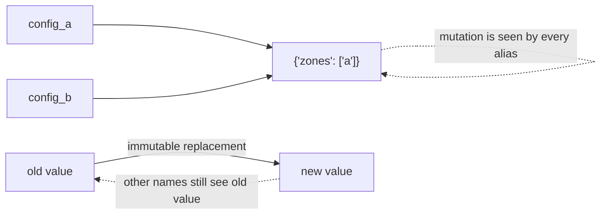

Senior Python does not mean clever syntax. It means predictable behavior under change. Names refer to objects; mutation changes an object in place; assignment changes a binding; default arguments are evaluated once; iterators are stateful; exceptions are part of the API contract. These details matter because infrastructure tools often manipulate shared configuration, cached API responses and mutable state across many functions.

**Use immutable value objects where accidental mutation would be dangerous**

```python
from dataclasses import dataclass, field
from typing import Mapping

@dataclass(frozen=True, slots=True)
class Node:
    name: str
    labels: Mapping[str, str]
    allocatable_gpus: int

@dataclass(slots=True)
class FleetReport:
    nodes: list[Node] = field(default_factory=list)

    @property
    def total_gpus(self) -> int:
        return sum(n.allocatable_gpus for n in self.nodes)
```

Dataclasses are useful when a tool has domain objects such as Node, GPU, Incident or Deployment. Composition usually produces clearer infrastructure code than deep inheritance: an ApiClient owns a RetryPolicy and AuthProvider; a ClusterInspector owns clients for Kubernetes, Prometheus and DCGM. Each piece can be replaced in a test.

## Senior addendum

➕ **`slots=True` — the detail worth being able to explain, not just copy:**
```python
@dataclass(frozen=True, slots=True)
class Node:
    name: str
    labels: Mapping[str, str]
    allocatable_gpus: int
```
Without `slots=True`, every instance carries a `__dict__` (arbitrary attribute storage) — with it, Python allocates fixed slots instead, which is both faster to access and meaningfully smaller in memory. For a `FleetReport` holding thousands of `Node` objects (a real GPU fleet), `slots=True` is a genuine memory-and-speed win, not a style preference — worth naming the *why*, not just using it because the example does.

➕ **Visual model — names point at objects; mutation travels through aliases:**

**Memory hook:** *"A variable is a label, not a box."* Copy or freeze at boundaries when a caller must not share mutable state with your policy.
