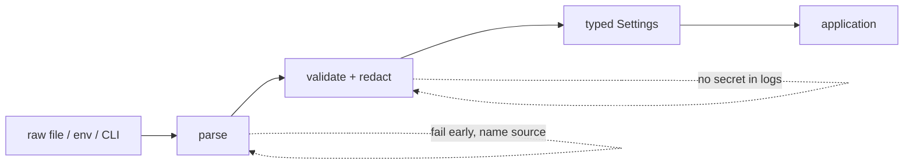

Production tools need deterministic configuration precedence. A common pattern is defaults &lt; config file &lt; environment &lt; explicit CLI flags. Fail early on malformed configuration, distinguish secret values from ordinary config, and never silently infer destructive targets. Treat configuration loading as a pure function so it is testable.

**Configuration loader with explicit validation**

from dataclasses import dataclass
from pathlib import Path
    import os, yaml

@dataclass(frozen=True)
class Settings:
    namespace: str
    timeout\_s: float
    prometheus\_url: str

    @classmethod
    def load(cls, path: Path) -> "Settings":
        raw = yaml.safe\_load(path.read\_text()) or &#123;&#125;
        namespace = os.getenv("NAMESPACE", raw.get("namespace", "default"))
        timeout\_s = float(os.getenv("TIMEOUT\_S", raw.get("timeout\_s", 5)))
        url = os.getenv("PROMETHEUS\_URL", raw.get("prometheus\_url", ""))
        if not url.startswith(("http://", "https://")):
            raise ValueError("prometheus\_url must be http(s)")
        return cls(namespace, timeout\_s, url)

## Senior addendum

➕ **The precedence chain, drawn out (the paragraph states it, this makes it checkable at a glance):**
```
defaults  <  config file  <  environment variables  <  explicit CLI flags
(lowest precedence)                                    (highest precedence)
```
`Settings.load()`'s `os.getenv("NAMESPACE", raw.get("namespace", "default"))` is this exact chain in one line, read right-to-left: try env var first, fall back to file value, fall back to hardcoded default. **Interview-ready line:** "the most specific, most recently-supplied source should always win — that's why CLI flags beat environment beats file beats code defaults, not the reverse."

➕ **Visual model — configuration crosses two boundaries:**

**Memory hook:** *"Precedence chooses; validation protects."* Treat configuration as input from an untrusted interface, even when it came from your own deployment system.
