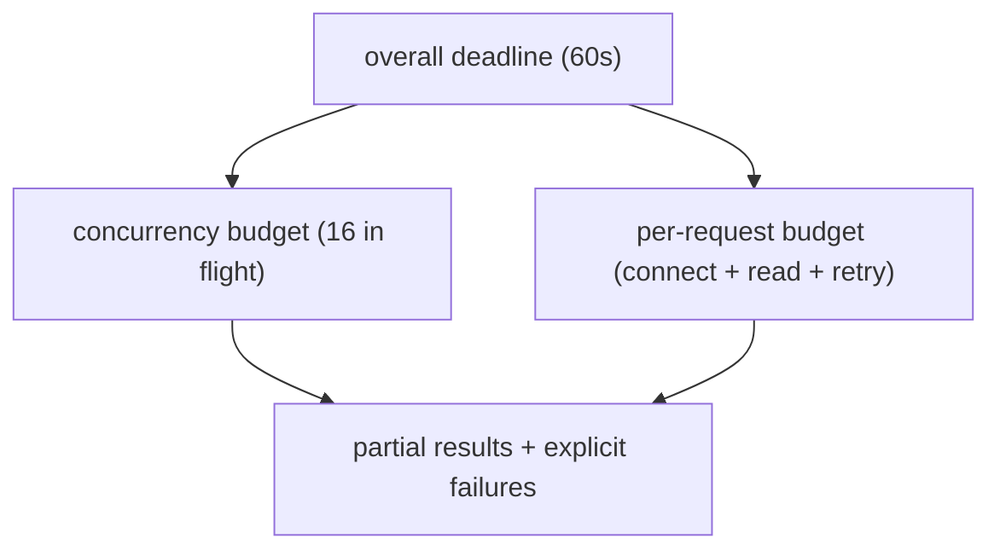

_Figure B. Concurrency is chosen by the bottleneck, not because async is fashionable._

Remote APIs fail in several distinct ways: DNS/connect timeout, TLS failure, read timeout, 4xx client error, 429 rate limit, 5xx server error, truncated response, incompatible schema and success responses containing semantically invalid data. A retry policy must classify these failures. Retrying a validation error only amplifies load; retrying a non-idempotent POST can duplicate side effects.

**Resilient GET client: bounded retries, timeout tuple and full jitter**

```python
from __future__ import annotations
import random, time
from dataclasses import dataclass
import requests

@dataclass(frozen=True)
class RetryPolicy:
    attempts: int = 4
    base_delay_s: float = 0.25
    max_delay_s: float = 4.0

class JsonApi:
    def __init__(self, base_url: str, token: str, policy: RetryPolicy):
        self.base_url = base_url.rstrip("/")
        self.policy = policy
        self.session = requests.Session()
        self.session.headers.update({"Authorization": f"Bearer {token}"})

    def get(self, path: str) -> dict:
        last_error: Exception | None = None
        for attempt in range(self.policy.attempts):
            try:
                r = self.session.get(
                    self.base_url + path,
                    timeout=(2.0, 8.0),
                )
                if r.status_code == 429 or 500 <= r.status_code < 600:
                    raise requests.HTTPError(f"retryable {r.status_code}", response=r)
                r.raise_for_status()
                payload = r.json()
                if not isinstance(payload, dict):
                    raise ValueError("expected JSON object")
                return payload
            except (requests.Timeout, requests.ConnectionError,
                    requests.HTTPError) as exc:
                last_error = exc
                if attempt == self.policy.attempts - 1:
                    break
                cap = min(self.policy.max_delay_s,
                          self.policy.base_delay_s * 2**attempt)
                time.sleep(random.uniform(0, cap))
        raise RuntimeError("API request exhausted retries") from last_error
```

A senior engineer also thinks about budgets. If a CLI checks 500 nodes and each call can wait 8 seconds with four retries, the worst-case runtime is unacceptable. Bound concurrency, set a global deadline, cache immutable responses when appropriate, and expose retry counts and latency in logs/metrics.

## Senior addendum

➕ **The budget math the paragraph mentions, worked with real numbers (this is the calculation a Senior SA is expected to do out loud):**
```text
500 nodes, worst case: 4 attempts × 8s read timeout = 32s per node if every attempt times out
Sequential: 500 × 32s = 4.4 HOURS worst case ← unacceptable, exactly as the text says
With ThreadPoolExecutor(max_workers=16): 500/16 ≈ 32 batches × 32s = ~17 minutes worst case
With a global deadline (e.g. 60s) that cancels remaining work: bounded regardless of per-node worst case
```
This is the actual arithmetic behind "senior engineers think about budgets" — being able to produce these three numbers live, from the retry policy's own parameters, is a stronger signal than reciting "use a thread pool."

➕ **Visual model — every fan-out needs two budgets:**

**Memory hook:** *"Limit width, limit time."* A client that eventually succeeds after the caller gave up is still an operational failure.
