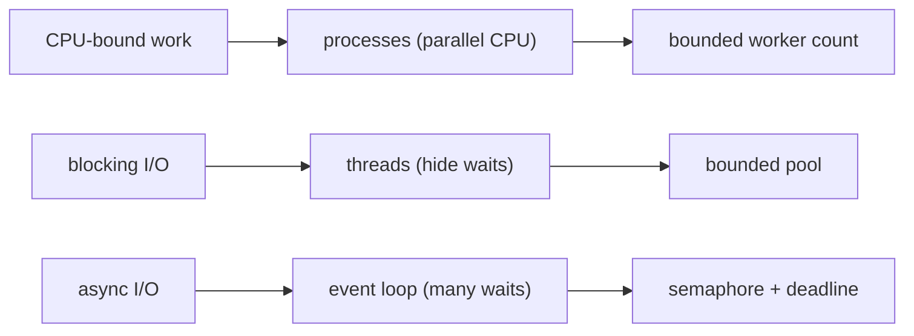

For infrastructure work, most concurrency is I/O concurrency: querying many APIs, reading many files or running remote checks. Threads are often the simplest option for blocking libraries; asyncio is powerful when the whole dependency chain is async; processes are appropriate for CPU-heavy pure Python work. The critical production feature is bounded concurrency. Launching 10,000 tasks simultaneously can exhaust file descriptors, memory or the remote service.

**Bounded fan-out for infrastructure checks**

```python
from concurrent.futures import ThreadPoolExecutor, as_completed

def inspect_node(name: str) -> tuple[str, dict]:
    # bounded network/subprocess checks live here
    return name, {"ok": True}

nodes = [f"gpu-node-{i:03d}" for i in range(200)]
results: dict[str, dict] = {}
with ThreadPoolExecutor(max_workers=16) as pool:
    futures = {pool.submit(inspect_node, n): n for n in nodes}
    for future in as_completed(futures):
        node = futures[future]
        try:
            name, report = future.result(timeout=20)
            results[name] = report
        except Exception as exc:
            results[node] = {"ok": False, "error": str(exc)}
```

## Senior addendum

➕ **Backpressure, stated as the one-sentence definition worth having ready:** "backpressure is deliberately limiting how much work is in flight so the *producer* slows down to match what the *consumer* (or the target system) can actually handle" — `max_workers=16` in the fan-out example isn't a performance knob, it's backpressure: capping in-flight requests to 16 protects both this process (fd/memory limits) and the 200 remote nodes being queried from being hit by 200 simultaneous connections at once.

➕ **Visual model — choose concurrency by the waiting shape:**

**Memory hook:** *"CPU parallelizes; I/O overlaps."* The execution model follows the bottleneck, not fashion.
