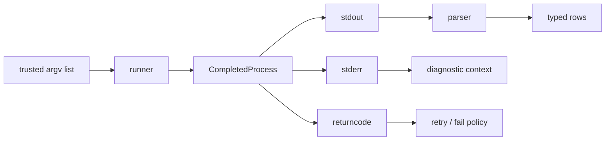

Use argument arrays, not shell strings, whenever possible. Decide whether stderr is evidence you need to preserve, enforce timeouts, capture exit status, and make command execution injectable so tests do not require real kubectl or nvidia-smi. shell=True is an explicit trust boundary because shell metacharacters become executable syntax.

**Safe external command wrapper**

```python
from dataclasses import dataclass
import subprocess

@dataclass(frozen=True)
class CmdResult:
    argv: tuple[str, ...]
    rc: int
    stdout: str
    stderr: str

def run(argv: list[str], timeout_s: float = 10) -> CmdResult:
    try:
        cp = subprocess.run(
            argv,
            text=True,
            capture_output=True,
            timeout=timeout_s,
            check=False,
        )
    except subprocess.TimeoutExpired as exc:
        raise RuntimeError(f"timeout: {argv}") from exc
    return CmdResult(tuple(argv), cp.returncode, cp.stdout, cp.stderr)

result = run([
    "nvidia-smi",
    "--query-gpu=index,uuid,temperature.gpu",
    "--format=csv,noheader,nounits",
])
if result.rc != 0:
    raise RuntimeError(result.stderr.strip())
```

`check=False` is deliberate: the wrapper returns stdout, stderr and the exit code so policy code can distinguish “GPU query failed” from “command timed out.” If every non-zero exit should become an exception at this boundary, use `check=True` and translate `CalledProcessError` into a domain-specific failure. Do not silently retry an arbitrary command; first decide whether it is read-only, idempotent and safe to repeat.

## Build from the normal path

**This is the exact `nvidia-smi` wrapper the actual job needs — worth having memorized, not just read:**
```
$ nvidia-smi --query-gpu=index,uuid,temperature.gpu --format=csv,noheader,nounits
0, GPU-a1b2c3d4-..., 62
1, GPU-e5f6g7h8-..., 58
```
```python
def parse_nvidia_smi(csv_output: str) -> list[dict]:
    rows = []
    for line in csv_output.strip().splitlines():
        idx, uuid, temp = [x.strip() for x in line.split(",")]
        rows.append({"index": int(idx), "uuid": uuid, "temp_c": int(temp)})
    return rows
```
This pairs directly with the `run()` wrapper above it — `run(["nvidia-smi", "--query-gpu=...", "--format=csv,noheader,nounits"])` then `parse_nvidia_smi(result.stdout)` is a genuinely realistic 10-minute interview coding exercise for this specific role.

**Visual model — parse after execution, never inside a command string:**

**Key takeaway:** *"Run, parse, decide."* Keeping these as three steps prevents shell injection and makes malformed output testable.

Test the runner by injecting a fake callable into the code that consumes it, rather than executing `nvidia-smi` in a unit test. Integration tests can exercise the real binary only on a labeled GPU runner and must assert the required driver/tool availability before the test starts.
