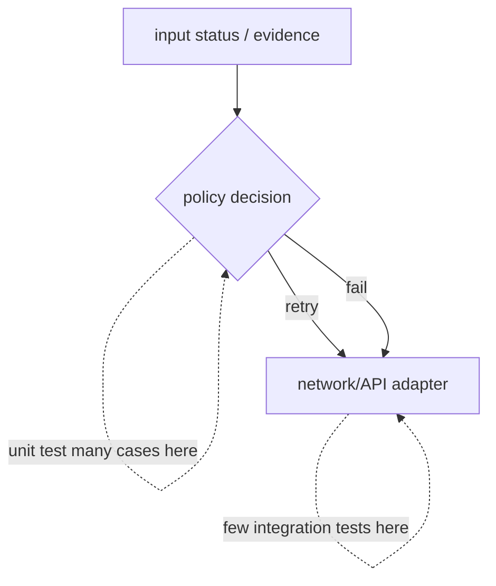

The most valuable unit tests target decisions: classification, parsing, retry behavior, diff calculation, policy evaluation and output formatting. Effects—HTTP, Kubernetes API, subprocess, filesystem—should sit behind narrow interfaces. Then a test can replace the effect and assert the decision without needing a live cluster.

**Test the policy, not requests itself**

\# retry.py
def should\_retry(status: int | None, exc: Exception | None) -> bool:
    if exc is not None:
        return isinstance(exc, (TimeoutError, ConnectionError))
    return status == 429 or (status is not None and 500 &lt;= status &lt; 600)

# test\_retry.py
    import pytest
from retry import should\_retry

@pytest.mark.parametrize("status,expected", \[
    (200, False), (400, False), (404, False),
    (429, True), (500, True), (503, True),
\])
def test\_status\_classification(status, expected):
    assert should\_retry(status, None) is expected

For a Kubernetes or NVIDIA API wrapper, test parsing with recorded small fixtures; use integration tests against a disposable kind/minikube cluster for the wire contract; reserve end-to-end tests for a few critical workflows. A large suite of tests that all mock the implementation details is fragile and provides false confidence.

## Senior addendum

➕ **Why `should_retry` is tested in complete isolation from `requests` — this is the payoff of every "functional core" pattern from earlier chapters landing in one place:**
```python
@pytest.mark.parametrize("status,expected", [
    (200, False), (400, False), (404, False), (429, True), (500, True), (503, True),
])
def test_status_classification(status, expected):
    assert should_retry(status, None) is expected
```
Zero network calls, zero mocking library needed, runs in milliseconds, and — critically — **this test would catch a bug where someone changes `500 <= status < 600` to `500 <= status <= 600` and accidentally includes 600** as retryable. That's the actual value of testing decisions instead of testing "does my mock get called" — it tests the *policy*, which is where real bugs hide.

➕ **Visual model — test the diamond, not just the arrows:**

**Memory hook:** *"Many cheap policy tests; few expensive boundary tests."*
