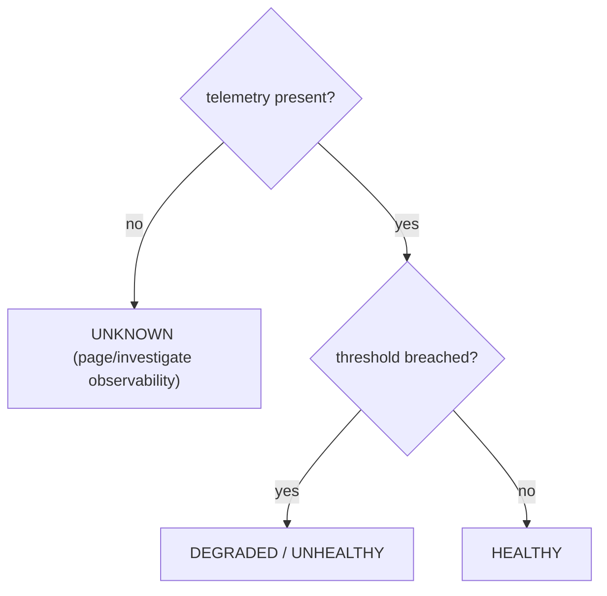

Build one tool that combines the concepts: discover GPU nodes, query Kubernetes allocatable resources, run or consume GPU health telemetry, optionally query Prometheus, classify findings and produce both human and JSON output. The architecture below separates policy from transport so the same classifier can be used in a CLI, scheduled job or API service.

**Recommended production package shape**

\# package layout
fleetcheck/
  pyproject.toml
  src/fleetcheck/
    \_\_init\_\_.py
    cli.py          # argparse/click/typer boundary
    model.py        # dataclasses / enums
    kubernetes.py   # K8s API adapter
    gpu.py          # DCGM/nvidia-smi adapter
    prometheus.py   # metrics adapter
    classify.py     # pure health decisions
    report.py       # table/json output
  tests/
    test\_classify.py
    test\_gpu\_parser.py
    test\_retry.py

**Keep health policy pure and explicit; UNKNOWN is not HEALTHY**

from dataclasses import dataclass
from enum import StrEnum

class Health(StrEnum):
    HEALTHY = "healthy"
    DEGRADED = "degraded"
    FAILED = "failed"
    UNKNOWN = "unknown"

@dataclass(frozen=True)
class GpuSample:
    uuid: str
    temperature\_c: int | None
    power\_w: float | None
    xid\_errors: int | None


def classify\_gpu(s: GpuSample) -> Health:
    if s.xid\_errors is None or s.temperature\_c is None:
        return Health.UNKNOWN
    if s.xid\_errors > 0:
        return Health.FAILED
    if s.temperature\_c >= 85:
        return Health.DEGRADED
    return Health.HEALTHY

## Senior addendum

➕ **`UNKNOWN is not HEALTHY` — this is the single most important line in this entire volume for the actual job, worth its own callout:**
```python
def classify_gpu(s: GpuSample) -> Health:
    if s.xid_errors is None or s.temperature_c is None:
        return Health.UNKNOWN     # missing telemetry — NOT the same claim as "healthy"
    if s.xid_errors > 0:
        return Health.FAILED
    if s.temperature_c >= 85:
        return Health.DEGRADED
    return Health.HEALTHY
```
A monitoring tool that defaults missing data to "healthy" (because the code just falls through an if-chain without an explicit check) will silently hide a fleet of nodes whose telemetry agent crashed — those nodes look green in every dashboard while being completely unobserved. **This exact bug class — "absence of bad news presented as good news" — is one of the most realistic production incidents to bring up unprompted in an SA interview about monitoring design**, and this code is the textbook correct pattern to defend against it: a fourth explicit state (`UNKNOWN`) that can never be silently conflated with `HEALTHY`.

➕ **Visual model — health is a state lattice, not a boolean:**

**Memory hook:** *"No evidence is unknown, never healthy."* This one rule avoids the most dangerous false-green dashboard failure.
