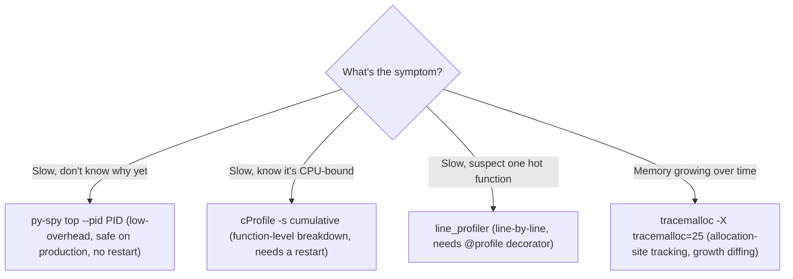
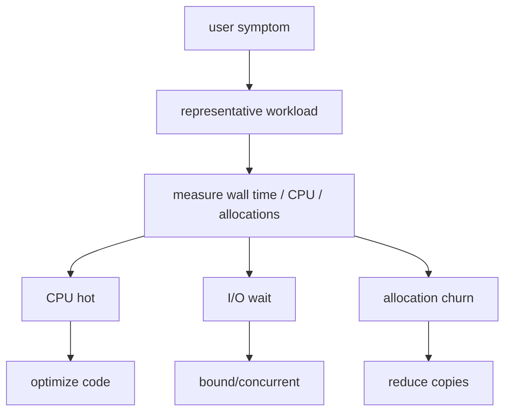

Do not optimize syntax before measuring. First identify whether time is spent in Python CPU, remote I/O, serialization, subprocess startup, regex, filesystem traversal or retries. cProfile gives function-level CPU time; tracemalloc helps find Python allocation growth; py-spy can sample a running process with low intrusion; line\_profiler is useful for CPU-heavy functions. For large log/data processing, generators and streaming parsers reduce memory footprint more reliably than micro-optimizing loops.

**Measure before optimizing**

python -m cProfile -s cumulative -m fleetcheck.cli report
python -X tracemalloc=25 -m fleetcheck.cli report
# external sampler if available:
py-spy top --pid &lt;PID>

## Build from the normal path

**The profiling decision tree, made explicit (the text names four tools — here's when to reach for each):**

**py-spy is the one worth remembering first** for this role specifically — it attaches to a running process without needing to modify code or restart anything, which is exactly the constraint you're under when triaging a live, expensive, GPU-attached production job that you cannot afford to restart just to profile it.

**Sample `cProfile` output and the one column to actually look at first:**
```
$ python -m cProfile -s cumulative -m fleetcheck.cli report
   ncalls  tottime  percall  cumtime  percall filename:lineno(function)
      500    0.012    0.000   18.240    0.036 kubernetes.py:14(get_pods)
      500   17.980    0.036   17.980    0.036 {built-in method time.sleep}
```
`cumtime` (cumulative time including calls made *by* this function) vs `tottime` (time in this function alone) is the distinction that matters: here, `get_pods` itself is fast (`tottime` 0.012s) but its `cumtime` is dominated by `time.sleep` calls nested inside it (retry backoff) — the profile is telling you the bottleneck is retry waiting, not the parsing/request logic itself. Reading `tottime` alone here would send you optimizing the wrong function entirely.

## Targeted references and reinforcement

**Udemy — Python for DevOps: Mastering Real-World Automation:** [https://www.udemy.com/course/python-devops](https://www.udemy.com/course/python-devops) — Target lectures: Coding lazy pipelines (~18m38s); Structured logging with JSON (~11m29s); Introduction to subprocesses (~10m31s); Exponential backoff with jitter (~10m48s); TDD implementation (~20m17s); Mocking fundamentals (~8m17s).

**Vishakha Sadhwani — scripts versus systems:** [https://www.linkedin.com/in/vsadhwani](https://www.linkedin.com/in/vsadhwani) — Practitioner signal: production automation needs retries, timeouts, visibility, versioning and failure handling, not only task execution.

**Python documentation:** [https://docs.python.org/3/](https://docs.python.org/3/) — Language/runtime authority for subprocess, logging, concurrency, typing, packaging and standard-library behavior.

**Visual model — profile before changing the shape of the system:**

**Key takeaway:** *"Measure the waiting, not just the work."* Optimizing a function cannot fix a remote API, lock, or storage wait that dominates elapsed time.
