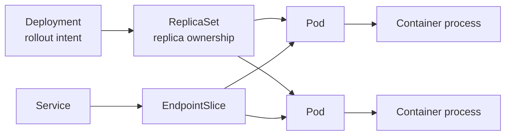
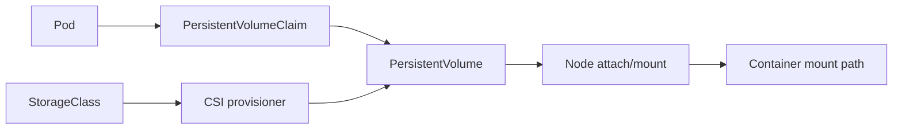
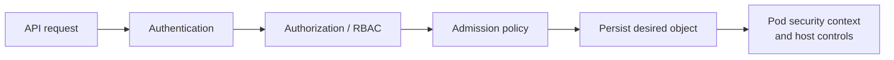

# Foundation — what Kubernetes is and what problem it solves

## What this volume is trying to teach

Kubernetes coordinates containerized workloads across a group of machines. You declare a desired state—such as three instances of an API—and Kubernetes continually compares that declaration with observed state and works to reduce the difference.

Kubernetes does not replace Linux, networking, storage or security. It coordinates those capabilities through APIs and controllers. A Pod still becomes Linux processes using namespaces, cgroups, filesystems and network interfaces on a node.

## The first mental model: desired state and reconciliation

| Step | Plain-language meaning |
|---|---|
| Declare | A user or controller submits an API object describing what should exist |
| Store | The API server validates it and persists cluster state in etcd |
| Decide | Controllers and the scheduler determine missing actions and placement |
| Execute | Kubelet and runtimes create the Pod and containers on a node |
| Observe | Status, events and metrics report what happened |
| Reconcile | Control loops keep trying until observed state matches desired state or exposes a failure |

This model is more useful than memorizing `kubectl` commands because nearly every Kubernetes feature is a specialized reconciliation loop.

## Essential language

- A **cluster** is the control plane plus worker nodes managed together.
- A **node** is a machine eligible to run workloads.
- A **Pod** is Kubernetes' basic scheduling unit containing one or more containers.
- A **container image** packages application user space; a runtime starts processes from it.
- The **API server** is the validated entry point for cluster state and operations.
- **etcd** is the strongly consistent key-value store holding Kubernetes API state.
- A **controller** observes objects and acts to make reality match their specification.
- The **scheduler** selects a suitable node for an unscheduled Pod.
- **kubelet** is the node agent responsible for the declared Pods on its node.
- A **Service** provides stable discovery/traffic distribution to changing Pod endpoints.

## What Kubernetes status does and does not prove

`Running` means a Pod has been bound to a node and at least one container is running or starting. It does not prove the application is correct, ready, fast, authorized, able to reach dependencies, or using its GPU efficiently. Each layer exposes a different kind of evidence.

## A real-life example

You request a GPU Pod. The scheduler needs a node advertising the required resource and satisfying policy/topology. Kubelet asks the runtime to start a container. GPU integration exposes assigned devices. Network and storage plugins prepare dependencies. The application loads compatible user-space libraries and uses the host driver. A failure can occur at every boundary; "Kubernetes problem" is therefore a scope, not a diagnosis.

## Kubernetes objects are API records, not running processes

A Deployment, Service or ConfigMap is a stored API object describing intent or configuration. Controllers interpret these records and create/update other objects. A Pod specification eventually becomes real processes on one node.

Common hierarchy:



The Service does not "contain" Pods. Label selection associates endpoints; the dataplane sends traffic to ready endpoints.

## Trace one Pod end to end

1. A client submits a Pod or higher-level workload through the API server.
2. Authentication proves identity; authorization checks permission; admission may validate or mutate the object.
3. The API server stores accepted desired state in etcd.
4. Controllers create dependent objects or reconcile replica count.
5. The scheduler filters/scores nodes and records a binding for an unscheduled Pod.
6. Kubelet on the selected node observes the Pod.
7. Kubelet uses CRI to ask the container runtime to prepare the Pod sandbox, pull images and start containers.
8. CNI/network and CSI/storage integrations prepare required connectivity and volumes.
9. Probes influence startup, readiness, restart and traffic behavior.
10. Status, events, logs and application metrics expose different evidence.

## Specification, status and events

- **spec** expresses desired state supplied by a user/controller.
- **status** is system-reported observed state.
- **metadata** includes name, namespace, labels, annotations and ownership information.
- **events** are time-limited records about decisions/failures; they are not a complete durable audit log.

```bash
kubectl get pod POD -o yaml
kubectl describe pod POD
kubectl get events --sort-by=.metadata.creationTimestamp
```

Read `status.conditions`, container state/reason, assigned node, resource requests and events. Avoid starting with logs for a Pod that was never scheduled or whose container never started.

## Scheduling is an eligibility decision

A node needs enough allocatable resources and must satisfy constraints such as taints/tolerations, node affinity, topology and policy. A Pending Pod is not automatically evidence of cluster shortage.

```yaml
resources:
  requests:
    cpu: "2"
    memory: 4Gi
    nvidia.com/gpu: "1"
  limits:
    nvidia.com/gpu: "1"
```

Requests drive scheduling. CPU limits can throttle. Memory limits can lead to cgroup OOM behavior. Extended GPU resources depend on device discovery/advertisement and allocation.

## Networking: four different objects/questions

| Item | Purpose |
|---|---|
| Pod IP | address for a particular Pod network interface |
| Service | stable virtual discovery/traffic abstraction |
| EndpointSlice | current backend endpoint addresses/readiness |
| Ingress/Gateway | routes external or higher-level traffic according to controller implementation |

Debug in order: DNS answer → Service definition → EndpointSlice membership/readiness → policy → node/CNI dataplane → Pod listener → application response.

## Storage: claim, volume and mount

A Pod can request storage through a PVC. A StorageClass and CSI provisioner may create or select a PV. On the selected node, the volume may require attach and mount operations before the container can start.



Pending claim, attach failure, mount failure and application permission errors are different boundaries.

## Security request path



RBAC governs Kubernetes API actions. A security context influences runtime identity/capabilities. NetworkPolicy governs supported network paths through the CNI implementation. Image policy/scanning and secrets handling are additional layers.

## Guided lab — explain a Deployment and Service

Use an authorized lab cluster:

```bash
kubectl create deployment web-demo --image=nginx:stable
kubectl expose deployment web-demo --port=80
kubectl get deployment,replicaset,pod,service,endpointslice -o wide
kubectl describe pod -l app=web-demo
kubectl delete service web-demo
kubectl delete deployment web-demo
```

Before each command, predict which API objects change. Observe owner references and labels. Deleting the Service should not delete the Deployment/Pods because ownership differs; deleting the Deployment cascades through its owned ReplicaSet/Pods according to normal controller/garbage-collection behavior.

## A disciplined troubleshooting example

**Symptom:** Service name resolves, but requests time out.

1. Verify scope: every client/Pod or only some nodes/namespaces?
2. Inspect Service ports/selectors.
3. Inspect EndpointSlices: are expected Pod IPs present and ready?
4. Confirm target process listens on the target port inside the Pod.
5. Check NetworkPolicy and CNI-specific evidence.
6. Compare a working and failing source/node path.
7. Capture packets only after selecting interfaces/points that answer a specific path question.

Restarting CoreDNS is unjustified when name resolution already succeeds.

## Common beginner mistakes

- treating Kubernetes objects as if they are processes;
- reading only Pod phase and ignoring conditions/container state/events;
- assuming a Service is a load balancer process;
- debugging logs before confirming scheduling/startup;
- confusing requests with limits;
- assuming NetworkPolicy works independently of the chosen CNI;
- changing YAML repeatedly without checking which controller owns/reverts the field.

## Official and local references

- [Kubernetes concepts](https://kubernetes.io/docs/concepts/)
- [Kubernetes cluster architecture](https://kubernetes.io/docs/concepts/architecture/)
- [Pods](https://kubernetes.io/docs/concepts/workloads/pods/)
- [Scheduling](https://kubernetes.io/docs/concepts/scheduling-eviction/)
- [Services and networking](https://kubernetes.io/docs/concepts/services-networking/)
- [Storage](https://kubernetes.io/docs/concepts/storage/)
- [Kubernetes security](https://kubernetes.io/docs/concepts/security/)
- Local Staff guide: `consolidated_guides/kubernetes-containers_consolidated.md`
- Local SRE labs: `interview-prep/hands-on-labs/kubernetes/`

## How to study this volume

Study the core chapters in control-path order: API and stored state, scheduling, node execution, network, storage, security, scaling, operators and upgrades. For every feature ask:

1. Which API object expresses intent?
2. Which controller or node component acts?
3. What external system is involved?
4. Which status/event/log proves the last successful boundary?

Use the deep dives after you can trace one Pod from submission to ready application traffic.
