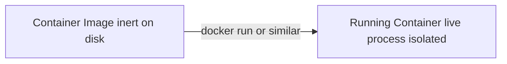
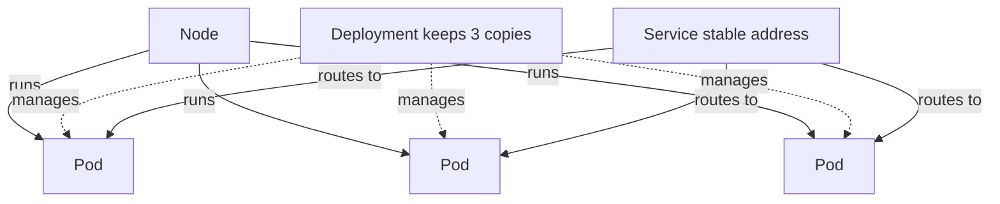
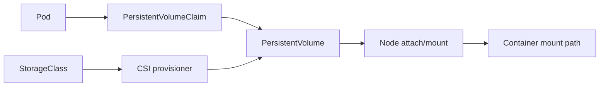
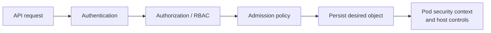
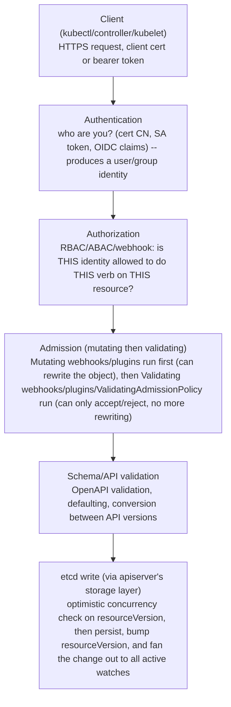
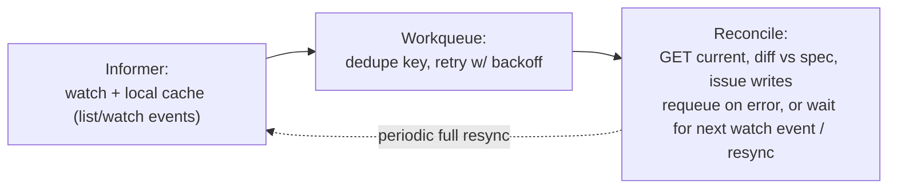
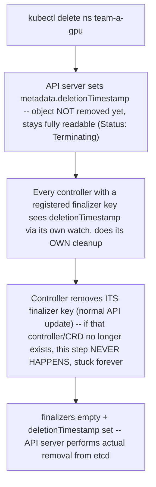

## Foundations: start here if Kubernetes concepts are new to you

### What this section is, and what it isn't

This section will not make you a Kubernetes expert. It will not cover operators, admission controllers, CNI internals, or scheduling algorithms — the rest of this chapter covers those, and it covers them at a senior, production-incident level. What this section gives you is the small set of mental models you need in place before you dive into the rest of this chapter, so that when it says "the Deployment controller reconciles desired state," you already know what a Deployment is, what a controller is, and why "reconcile" is the right word instead of pausing to look up three terms mid-sentence.

You already know how to design and run distributed software. You've deployed things before — maybe onto VMs, maybe onto bare metal, maybe with a home-grown deploy script. What's new here is not "how do computers run programs." What's new is the specific set of problems containers and Kubernetes exist to solve, and the vocabulary that's grown up around those solutions.

### The problem before the tool: "it works on my machine"

Start with a problem you've almost certainly lived through, even if you never called it this: you write a program on your laptop. It works. You hand it to a teammate, or push it to a server, and it doesn't work — because your laptop has Python 3.11 and the server has Python 3.8, or a library version differs, or an environment variable you forgot you set locally isn't set there.

The underlying issue is that a running program doesn't just depend on its own code. It depends on everything around it: the language runtime, specific library versions, configuration files, sometimes even specific OS behavior. Traditionally, all of that surrounding "everything it needs" lived on the host machine, installed by hand or by some setup script, drifting slowly out of sync between machines.

A **container** (a way of packaging a program together with everything it needs to run, so it behaves the same regardless of what else is or isn't installed on the machine it lands on) exists to solve exactly this. Note what a container is *not*, because this is the single most common wrong mental model people carry in: a container is **not** a lightweight virtual machine. A VM virtualizes hardware and runs a full separate operating system kernel on top of it. A container shares the host machine's kernel — it's really an isolated set of processes, walled off from the rest of the system, running on the same kernel as everything else on that host. The isolation is enforced by the OS (Linux namespaces and cgroups, if you want the underlying mechanism), not by simulating a whole computer. That's why containers start in milliseconds and VMs start in tens of seconds — they're doing fundamentally less work.

### Image vs. container: the same relationship as class vs. object

Once you accept "package the program with what it needs," a natural question follows: package it *into what*, exactly, and where does that package live when nothing is running?

A **container image** (a packaged, layered snapshot of a filesystem, plus instructions for how to run it) is the answer. It's a file — really a set of stacked filesystem layers — sitting in storage, doing nothing. It contains your application code, the runtime it needs, any libraries, and a instruction for what command to execute when someone runs it.

A **container** (a running instance of an image — an actual live process, isolated from other processes, executing right now) is what you get when something takes that image and actually starts it.

If you want a precise analogy from software you already know: an image is to a container what a class is to an object. The class is the definition sitting in your source code, inert. The object is a live instance of it in memory, actually doing something, with its own state. You can start many containers from the same image, just as you can create many objects from the same class — each one is independent, but they all started from the same blueprint. If you prefer a more everyday analogy: an image is a recipe, a container is the actual meal cooked from it. You can cook the same recipe many times; each meal is separate, but they all came from the same instructions.



**Check your understanding**
- Q: Why isn't a container "just a lightweight VM"? A: Because it doesn't virtualize hardware or run its own kernel — it's an isolated process (or group of processes) sharing the host's kernel, which is why it starts far faster and is fundamentally lighter-weight than a VM.
- Q: If you start five containers from the same image, do they share state? A: No — each is an independent running instance, the same way five objects created from one class each have their own separate state.

### The next problem: now you have hundreds of containers, on many machines

Suppose you've solved the "it works on my machine" problem. You now have containers running your services reliably. But real systems don't run one container on one machine — they run many containers, of many different services, and they need more machines than one to have enough capacity and to survive a machine dying.

This creates a set of problems that have nothing to do with containers themselves and everything to do with *managing many of them across many machines*:

- Something has to decide *which machine* each container should run on, given how much CPU/memory each machine has free.
- Something has to notice when a container — or the whole machine it was on — dies, and start a replacement.
- Something has to let containers find each other. If service A needs to talk to service B, and B might be restarted onto a different machine with a different IP address at any moment, A can't just hardcode B's IP.

This is the single most important idea in this whole section: **Kubernetes exists to solve the problem of running many containers reliably across many machines, when no human can realistically make those placement, restart, and discovery decisions by hand, fast enough, all the time.** Everything else Kubernetes does is in service of that one problem. The rest of this chapter will spend a lot of time on the mechanics — but if you keep this sentence in mind, the mechanics will make sense as answers to a problem you already understand, rather than as arbitrary API objects to memorize.

**Check your understanding**
- Q: Why can't service A just hardcode service B's IP address? A: Because B's underlying container can be restarted, rescheduled, or replaced at any time and may come back on a different machine with a different IP — a hardcoded IP would break.
- Q: In one sentence, what problem does Kubernetes exist to solve? A: Deciding where containers run across many machines, restarting them when they fail, and letting them find each other reliably, without a human doing it by hand.

### The four objects you need before diving deeper

The rest of this chapter will introduce many Kubernetes object types. You need exactly four of them solidly in place first, each introduced by the problem it solves.

**Pod** — problem: a container in isolation is fine, but sometimes two containers are so tightly coupled (e.g., your app plus a small helper process that ships its logs) that they genuinely need to be scheduled together, on the same machine, sharing some resources like network address. A **Pod** (one or more containers that are scheduled together and live together as a single unit) is Kubernetes's smallest deployable thing — not a container itself, but the wrapper around one or more containers that always travel as a set.

**Node** — problem: Pods have to run somewhere physical (or virtual). A **Node** (a machine — physical or virtual — that is part of the cluster and capable of running Pods) is that "somewhere." A cluster is a set of Nodes.

**Deployment** — problem: you don't want to manually notice a Pod died and manually start a new one, and you don't want to manually keep three copies running for capacity. A **Deployment** (a declared promise about how many copies of a Pod should exist, which Kubernetes continuously works to keep true) states "I want 3 copies of this Pod running, always," and Kubernetes handles making that keep being true, including replacing copies that die. This is self-healing not because anything is smart, but because something is *continuously checking and correcting*.

**Service** — problem: even with a Deployment keeping 3 Pods alive, those Pods can be replaced, and replacements get new IPs. Something else needs a stable way to reach "whichever Pods are currently the healthy ones for this Deployment," without caring which exact Pods those are right now. A **Service** (a stable name and address that always routes to whichever Pods currently match it, even as those Pods come and go) is that stable front door.



**Check your understanding**
- Q: What's the difference between a Pod and a Node? A: A Node is a machine; a Pod is a group of one or more containers that runs *on* a Node.
- Q: If a Deployment says "3 replicas" and one Pod crashes, what happens, and why is that not magic? A: Kubernetes notices the actual count (2) doesn't match the desired count (3) and starts a new Pod — it's continuous checking-and-correcting, not intelligence.
- Q: Why does a Service need to exist even though Pods already have IP addresses? A: Because individual Pod IPs change as Pods are replaced; the Service gives callers one stable address that always points at the current healthy set.

### The core mental model the rest of this chapter builds on: declare what you want, a controller makes it true

Everything above — a Deployment keeping 3 Pods alive, a Service always pointing at the current healthy Pods — is one repeated pattern, and the rest of this chapter assumes you already recognize it. The pattern is: **you declare what you want (desired state), and something else continuously compares that to what actually exists (actual state) and takes action to close the gap.** That "something else" is called a **controller** (a continuously-running process whose only job is to keep actual state matching desired state).

The clean analogy is a thermostat. You don't tell a thermostat "turn the heater on now" and "turn it off in ten minutes." You set a target temperature — the desired state. The thermostat continuously measures the actual room temperature, and independently decides, over and over, whether to turn the heater on or off to close the gap. You never issue a one-time command; you declare a goal, and correction happens continuously and automatically. Kubernetes controllers work identically: you declare "3 replicas of this Pod" once, and the Deployment controller keeps checking and correcting, forever, without you re-issuing the instruction.

This is why Kubernetes configuration is almost entirely declarative ("here's the state I want") rather than imperative ("run these steps"). The rest of this chapter will use the words "reconcile" and "reconciliation loop" constantly — that word simply means the controller's repeated act of comparing desired vs. actual state and correcting the difference.

**Check your understanding**
- Q: In the thermostat analogy, what is the "desired state" and what plays the role of the "controller"? A: The target temperature you set is the desired state; the thermostat's ongoing measure-and-adjust behavior is the controller.
- Q: Why is "reconcile" a fitting word for what a controller does? A: Because it repeatedly compares two things (desired vs. actual state) and acts to bring them into agreement — literally reconciling a difference.

### Evidence vs. proof: don't trust one command's output alone

You'll see commands like `kubectl get pods` showing `STATUS: Running` later in this chapter and in real clusters. It's worth building the right habit now: that single line of output is **evidence**, not **proof**, of health. It proves the container process started and hasn't crashed according to Kubernetes's own liveness check. It does **not** prove the application inside is actually serving correct responses, isn't stuck in a retry loop, or has enough memory headroom to survive the next traffic spike. To actually confirm "this service is healthy," you'd need corroborating evidence — application-level health checks, request success rates, resource usage over time — not just one status field. The rest of this chapter leans on this distinction constantly when reasoning about real incidents; get comfortable treating any single command's output as one data point, not a verdict.

### Trace one Pod end to end

1. A client submits a Pod or higher-level workload through the API server.
2. Authentication proves identity; authorization checks permission; admission may validate or mutate the object.
3. The API server stores accepted desired state in etcd.
4. Controllers create dependent objects or reconcile replica count.
5. The scheduler filters/scores nodes and records a binding for an unscheduled Pod.
6. Kubelet on the selected node observes the Pod.
7. Kubelet uses CRI to ask the container runtime to prepare the Pod sandbox, pull images and start containers.
8. CNI/network and CSI/storage integrations prepare required connectivity and volumes.
9. Probes influence startup, readiness, restart and traffic behavior.
10. Status, events, logs and application metrics expose different evidence.

### Specification, status and events

- **spec** expresses desired state supplied by a user/controller.
- **status** is system-reported observed state.
- **metadata** includes name, namespace, labels, annotations and ownership information.
- **events** are time-limited records about decisions/failures; they are not a complete durable audit log.

```bash
kubectl get pod POD -o yaml
kubectl describe pod POD
kubectl get events --sort-by=.metadata.creationTimestamp
```

Read `status.conditions`, container state/reason, assigned node, resource requests and events. Avoid starting with logs for a Pod that was never scheduled or whose container never started.

### Scheduling is an eligibility decision

A node needs enough allocatable resources and must satisfy constraints such as taints/tolerations, node affinity, topology and policy. A Pending Pod is not automatically evidence of cluster shortage.

```yaml
resources:
  requests:
    cpu: "2"
    memory: 4Gi
    nvidia.com/gpu: "1"
  limits:
    nvidia.com/gpu: "1"
```

Requests drive scheduling. CPU limits can throttle. Memory limits can lead to cgroup OOM behavior. Extended GPU resources depend on device discovery/advertisement and allocation.

### Networking: four different objects/questions

| Item | Purpose |
|---|---|
| Pod IP | address for a particular Pod network interface |
| Service | stable virtual discovery/traffic abstraction |
| EndpointSlice | current backend endpoint addresses/readiness |
| Ingress/Gateway | routes external or higher-level traffic according to controller implementation |

Debug in order: DNS answer → Service definition → EndpointSlice membership/readiness → policy → node/CNI dataplane → Pod listener → application response.

### Storage: claim, volume and mount

A Pod can request storage through a PVC. A StorageClass and CSI provisioner may create or select a PV. On the selected node, the volume may require attach and mount operations before the container can start.



Pending claim, attach failure, mount failure and application permission errors are different boundaries.

### Security request path



RBAC governs Kubernetes API actions. A security context influences runtime identity/capabilities. NetworkPolicy governs supported network paths through the CNI implementation. Image policy/scanning and secrets handling are additional layers.

### Guided lab — explain a Deployment and Service

Use an authorized lab cluster:

```bash
kubectl create deployment web-demo --image=nginx:stable
kubectl expose deployment web-demo --port=80
kubectl get deployment,replicaset,pod,service,endpointslice -o wide
kubectl describe pod -l app=web-demo
kubectl delete service web-demo
kubectl delete deployment web-demo
```

Before each command, predict which API objects change. Observe owner references and labels. Deleting the Service should not delete the Deployment/Pods because ownership differs; deleting the Deployment cascades through its owned ReplicaSet/Pods according to normal controller/garbage-collection behavior.

### A disciplined troubleshooting example

**Symptom:** Service name resolves, but requests time out.

1. Verify scope: every client/Pod or only some nodes/namespaces?
2. Inspect Service ports/selectors.
3. Inspect EndpointSlices: are expected Pod IPs present and ready?
4. Confirm target process listens on the target port inside the Pod.
5. Check NetworkPolicy and CNI-specific evidence.
6. Compare a working and failing source/node path.
7. Capture packets only after selecting interfaces/points that answer a specific path question.

Restarting CoreDNS is unjustified when name resolution already succeeds.

### Common beginner mistakes

- treating Kubernetes objects as if they are processes;
- reading only Pod phase and ignoring conditions/container state/events;
- assuming a Service is a load balancer process;
- debugging logs before confirming scheduling/startup;
- confusing requests with limits;
- assuming NetworkPolicy works independently of the chosen CNI;
- changing YAML repeatedly without checking which controller owns/reverts the field.

### Official and local references

- [Kubernetes concepts](https://kubernetes.io/docs/concepts/)
- [Kubernetes cluster architecture](https://kubernetes.io/docs/concepts/architecture/)
- [Pods](https://kubernetes.io/docs/concepts/workloads/pods/)
- [Scheduling](https://kubernetes.io/docs/concepts/scheduling-eviction/)
- [Services and networking](https://kubernetes.io/docs/concepts/services-networking/)
- [Storage](https://kubernetes.io/docs/concepts/storage/)
- [Kubernetes security](https://kubernetes.io/docs/concepts/security/)
- Local Staff guide: `consolidated_guides/kubernetes-containers_consolidated.md`
- Local SRE labs: `interview-prep/hands-on-labs/kubernetes/`

### How to study this volume

Study the core chapters in control-path order: API and stored state, scheduling, node execution, network, storage, security, scaling, operators and upgrades. For every feature ask:

1. Which API object expresses intent?
2. Which controller or node component acts?
3. What external system is involved?
4. Which status/event/log proves the last successful boundary?

Use the deep dives after you can trace one Pod from submission to ready application traffic.

### Check your understanding: trace ownership before acting

**Q1: A Pod is Pending. Why are application logs usually the wrong first evidence?**
A: The application process may never have started. Scheduling events, requested resources, constraints, and volume binding identify the last successful control-plane boundary.

**Q2: A Service name resolves, but requests time out. What did DNS prove?**
A: Only that name resolution returned an address. Endpoint readiness, policy, node dataplane, Pod listener, and application response still need separate evidence.

**Q3: What is the difference between an API object's spec and status?**
A: The spec expresses desired state; status reports observations made by Kubernetes components. Neither alone proves the end-user outcome.

### Glossary

- **Container** — an isolated, running process (or group of processes) packaged with everything it needs, sharing the host's kernel rather than virtualizing hardware.
- **Container image** — the inert, packaged, layered filesystem snapshot plus run instructions that a container is started from.
- **Kubernetes** — a system for deciding where containers run across many machines, restarting them on failure, and letting them find each other reliably.
- **Node** — a machine (physical or virtual) in a Kubernetes cluster that is capable of running Pods.
- **Pod** — the smallest deployable unit in Kubernetes: one or more containers scheduled and living together.
- **Deployment** — a declared desired count of Pod copies that Kubernetes continuously works to keep true, including replacing failed ones.
- **Service** — a stable name/address that routes to whichever Pods currently match it, regardless of individual Pod churn.
- **Controller** — a continuously-running process that compares actual state to desired state and acts to close the gap.
- **Reconciliation** — the repeated act of a controller comparing desired vs. actual state and correcting differences.
- **Declarative configuration** — stating the end state you want, rather than the steps to get there.
- **API server** — Kubernetes' validated entry point for reads, writes, authentication, authorization, and admission.
- **etcd** — the strongly consistent key-value store that persists Kubernetes API state.
- **Scheduler** — the control-plane component that selects a suitable node for an unscheduled Pod.
- **Kubelet** — the node agent responsible for making assigned Pod specifications real on its node.
- **Spec / status** — desired state supplied to an object versus observations reported by the system.
- **CNI / CSI** — integration boundaries for container networking and storage, respectively.
- **Event** — a time-limited record of a Kubernetes decision or failure, not a complete audit trail.

### Before you go deeper, make sure you can...

- Explain, without hedging, why a container is not "a lightweight VM," and what it actually is instead.
- Describe the difference between a container image and a running container using either the class/object or recipe/meal analogy.
- State, in one sentence, the core problem Kubernetes exists to solve.
- Name the four objects (Pod, Node, Deployment, Service) and the specific problem each one solves.
- Explain the "declare desired state, a controller reconciles it" pattern using the thermostat analogy, and recognize it every time this chapter uses the word "reconcile."
- Trace a Pod from API admission and etcd through scheduling, kubelet/runtime, CNI/CSI, probes, and application outcome.
- Separate DNS, Service, EndpointSlice, policy, dataplane, listener, and application evidence during a timeout.

With that model in place, here's how the API server and etcd actually make it real.

# Chapter 1 — API server, etcd and the object model
*(original text preserved in full below; additions marked with ➕ so you can see exactly what changed)*

**Learning outcome:** Trace reads/writes, resourceVersion, watches and declarative desired state through the API control plane.


Figure 1. Kubernetes components coordinate through API objects and watch/reconcile behavior.

## 1.1 API objects are records of desired/observed state

A Kubernetes object contains spec-like desired configuration plus metadata; controllers and node agents update status/conditions to describe observed state. The API server authenticates, authorizes, admits and validates requests before persistence. Most components interact through the API rather than directly modifying etcd.

```bash
kubectl get deploy api -o yaml
kubectl get deploy api -o jsonpath='{.metadata.resourceVersion}{"\n"}'
kubectl get events --sort-by=.lastTimestamp
```

➕ **The request pipeline, spelled out** (the source states "authenticates, authorizes, admits and validates" as a sequence — a Senior SA should be able to draw this without hesitation):


➕ **Interview-ready line:** "Nothing in Kubernetes talks to etcd directly except the API server's storage layer — every controller, kubelet, and scheduler reasons only in terms of the API, which is exactly what makes the watch/resourceVersion model the single source of truth for 'did my write actually happen.'"

➕ **Sample annotated output — resourceVersion in practice:**
```bash
$ kubectl get deploy api -o jsonpath='{.metadata.resourceVersion}{'\n'}'
482913
$ kubectl scale deploy api --replicas=4
deployment.apps/api scaled
482917 ← bumped by the write; NOT by every reconcile, only by a persisted mutation
```
resourceVersion is opaque and cluster-scoped-per-resource-type in practice (treat it as an opaque string, never parse or compare it numerically across resource types) — it exists so a client can say "give me changes after the version I last saw" via a watch, and so a conditional update (`If-Match`-style semantics under the hood) can detect a lost race: if two clients GET the same object at rv=482913 and both PUT a modified copy, the second PUT is rejected with a 409 Conflict because the object's rv on the server has already moved to 482914+.

➕ **Reproducing an actual optimistic-concurrency conflict:**
```bash
kubectl get cm settings -o yaml > /tmp/a.yaml
kubectl get cm settings -o yaml > /tmp/b.yaml
# edit /tmp/a.yaml, apply it — succeeds, resourceVersion bumps
kubectl apply -f /tmp/a.yaml
# now try to apply the stale /tmp/b.yaml which still carries the OLD resourceVersion
kubectl replace -f /tmp/b.yaml
```
```
Error from server (Conflict): Operation cannot be fulfilled on configmaps "settings":
the object has been modified; please apply your changes to the latest version and try again
```
This is the API server protecting you from a silent last-writer-wins overwrite — the fix is always "re-GET, re-apply your delta," never "force it through," which is why `kubectl apply` (three-way merge) is generally safer for automation than `kubectl replace` (whole-object overwrite) in concurrent-writer environments like GitOps controllers reconciling alongside human kubectl use.

## 1.2 Watches and reconciliation

Controllers commonly watch API changes, enqueue work, compare desired and actual state, and issue idempotent API updates. Reconciliation is level-based: the controller should make progress toward the desired state even if it misses an individual event, because the current object state remains authoritative.

➕ **Level-based vs edge-based, with the diagram that makes it click:**
```text
Edge-triggered (fragile): 'replicas went from 3
4' event MUST be received and processed,
or the controller never learns it needs to add a Pod.
Level-triggered (K8s way): controller wakes up (for ANY reason — a watch event, a resync
timer, a restart) and asks 'what does spec say NOW vs what
do I observe NOW?' — the delta is recomputed fresh every time,
so a missed event just means a slightly later reconcile, not a
permanently wrong state.
```
➕ **Why this matters concretely:** every controller has a periodic full resync (commonly every 30s–10min depending on controller) *in addition to* watch events — this is not redundancy for its own sake, it's the safety net for exactly the "watch connection dropped and a relist missed something transient" case Senior Deep Dive 1 calls out. If you're ever asked "what happens if a controller's watch connection drops for 2 minutes," the correct answer is "nothing catastrophic — it relists on reconnect and/or catches up on the next resync, because reconciliation is level-based, not a message queue that can silently lose a required event."

➕ **Watching it happen, with real output:**
```bash
kubectl get pods -w --output-watch-events -o json | jq -c '{type, name: .object.metadata.name, rv: .object.metadata.resourceVersion, phase: .object.status.phase}'
```
```text
{'type':'ADDED','name':'api-7d9f-x2k1','rv':'482920','phase':'Pending'}
{'type':'MODIFIED','name':'api-7d9f-x2k1','rv':'482924','phase':'Running'} ← same object, watch delivers the delta
{'type':'MODIFIED','name':'api-7d9f-x2k1','rv':'482930','phase':'Running'} ← e.g. a status condition changed
{'type':'DELETED','name':'api-old-9f2a','rv':'482931','phase':'Running'}
```
Note `--output-watch-events` — without it `kubectl get -w` hides the ADDED/MODIFIED/DELETED envelope and just shows you object snapshots, which is enough for humans but hides the actual wire protocol a controller's informer is consuming.

➕ **Diagram: the controller watch/reconcile loop itself** (the source describes "watch, enqueue, compare, update" in prose — this is the loop shape every controller in this volume runs):

This is the same shape whether the "reconcile" box is the Deployment controller, a GitOps controller (Chapter 8), or a custom operator — an event or a timer wakes it up, and it always recomputes the diff fresh rather than trusting that the triggering event was received correctly.

➕ **GPU/AI infra tie-in — why this matters for device plugins specifically:** the NVIDIA device plugin advertises `nvidia.com/gpu` capacity via periodic `ListAndWatch` gRPC streaming to the kubelet, and the kubelet in turn updates the Node object's `status.allocatable`. If that stream is momentarily interrupted (device plugin Pod restart, node CNI hiccup), the *level-based* recovery pattern is identical: on reconnect, the device plugin does a fresh `ListAndWatch` and re-asserts current device state rather than replaying a missed "GPU 3 became unhealthy" event — which is exactly why a device-plugin restart briefly shows `nvidia.com/gpu` capacity as absent/zero on `kubectl describe node`, then correct again seconds later, rather than a stuck/wrong count.

## Worked scenario
**Situation:** A Deployment object exists with replicas=3 but no Pods appear.

1. Check Deployment conditions and whether a ReplicaSet exists. This asks whether the Deployment controller reconciled.
2. If no ReplicaSet exists, inspect controller-manager health/events/admission and selector/template validity.
3. If a ReplicaSet exists but no Pods exist, inspect ReplicaSet status/events and admission failures.
4. If Pods exist but are Pending, move to the scheduler branch rather than continuing controller logs.

**Conclusion:** Find which controller/agent should have produced the next object/action.

➕ **Second worked scenario — a Terminating namespace that never finishes, tied to Senior Deep Dive 1's finalizer mechanism:**
> **Situation:** `kubectl delete ns team-a-gpu` has been running for 40 minutes. `kubectl get ns team-a-gpu` shows `Status: Terminating`. Nobody has force-deleted anything yet — good, because that would be the wrong move.
> 1. `kubectl get ns team-a-gpu -o json | jq '.spec.finalizers, .status.conditions'` — look for a finalizer that hasn't been cleared and a condition explaining why (commonly `NamespaceFinalizersRemaining` or a specific API group that failed to respond).
> 2. `kubectl api-resources --verbs=list --namespaced -o name | xargs -I{} kubectl -n team-a-gpu get {} 2>/dev/null` — find what's actually still in the namespace; a custom resource (e.g. a GPU ResourceClaim or an old CRD instance) whose owning controller/CRD was already deleted is the classic cause — the finalizer's owning controller no longer exists to remove the finalizer key.
> 3. If the CRD/controller is genuinely gone and will never come back, the correct fix is to patch the specific finalizer array (`kubectl patch <resource> -p '{"metadata":{"finalizers":[]}}' --type=merge`) on the *stuck object*, not to force-delete the namespace — the namespace finalizer is just reflecting the fact that a child object still has one.
> 4. Force-deleting the namespace via the apiserver's `/finalize` subresource without understanding *why* it was stuck can leave orphaned cloud resources (e.g. a PV, an LB, a cloud IAM binding created by a controller) with no controller left to clean them up — this is the exact "force-delete first" anti-pattern the original chapter's finalizer discussion is warning against.
> **Conclusion:** a stuck Terminating object is a controller-availability question first, and a "which finalizer, whose responsibility" question second — never a "just force it" question.

➕ **Diagram: the two-phase delete this scenario is walking through** (deletionTimestamp set → finalizers drain → actual removal — spelled out here inline since the scenario above depends on it; see Senior Deep Dive 1 for the fuller version with OwnerReferences GC):

➕ **Shortcut — the one-liner to triage any stuck-deleting object fast:**
```bash
kubectl get <kind> <name> -o json | jq '{finalizers: .metadata.finalizers, deletionTimestamp: .metadata.deletionTimestamp, ownerRefs: .metadata.ownerReferences}'
```
If `finalizers` is non-empty and `deletionTimestamp` is set, something registered a finalizer and hasn't finished cleanup — go find that controller's health before touching the object.

## Practice
1. Explain the request pipeline (authn → authz → admission → etcd write → watch fan-out) using a concrete `kubectl scale` example.
2. Reproduce a resourceVersion conflict deliberately using two stale local copies of the same object.
3. Trace why a Deployment with replicas=3 might show zero Pods, branching correctly between controller-manager, ReplicaSet and scheduler evidence.

➕ 4. Explain, without looking it up, why a controller's watch connection dropping for two minutes is not an outage — name the two independent recovery mechanisms (relist-on-reconnect, periodic full resync) that make reconciliation safe against missed events.
➕ 5. Deliberately create a namespace stuck in Terminating (create a CRD instance with a finalizer, delete the CRD before removing the instance, then delete the namespace) and walk through the finalizer-diagnosis one-liner above to unstick it correctly — without force-deleting.

---
## ➕ Going deeper

### etcd storage encoding and what actually gets written
The API server serializes objects (typically protobuf internally between apiserver↔etcd, JSON/YAML at the client boundary) under keys shaped like `/registry/<group>/<resource>/<namespace>/<name>`. You will rarely touch etcd directly in a healthy cluster, but knowing the key layout matters for the one time you do need `etcdctl` in a break-fix:
```bash
ETCDCTL_API=3 etcdctl --endpoints=https://127.0.0.1:2379 \
  --cert=/etc/kubernetes/pki/etcd/server.crt --key=/etc/kubernetes/pki/etcd/server.key \
  --cacert=/etc/kubernetes/pki/etcd/ca.crt \
  get /registry/deployments/default/api --prefix
```
This is a read-only diagnostic move in almost every real scenario — writing to etcd directly bypasses admission, validation and watch fan-out consistency and is essentially never the right operational answer; it's mentioned here only so you can recognize the key structure if you see it in a runbook.

### API discovery — the other thing the API server serves
```bash
kubectl api-resources | grep -i gpu     # any CRDs a GPU operator/DRA has registered
kubectl api-versions | grep resource.k8s.io   # DRA's API group, when present
```
`kubectl explain <kind>.spec` walks the same OpenAPI schema the apiserver uses for validation — worth reaching for live in an interview instead of guessing a field name.
