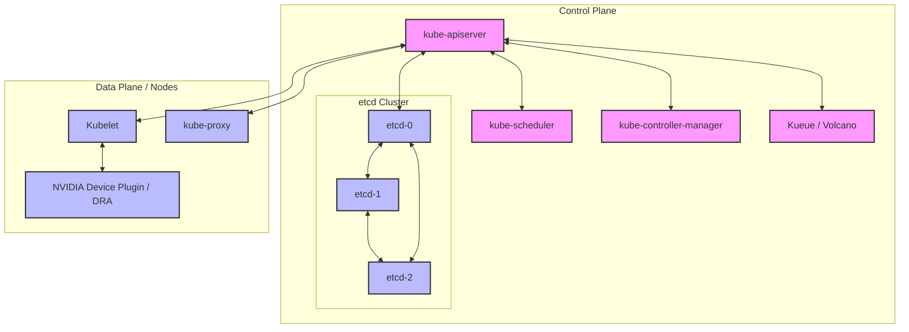
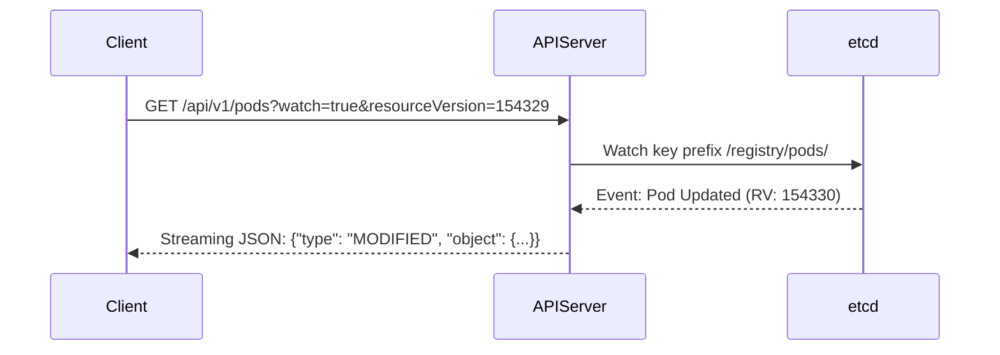
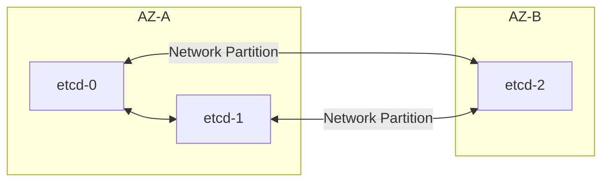
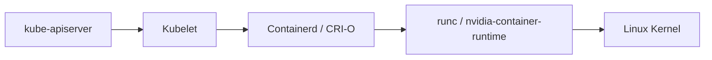

# Masterclass: K8s Control Plane, Scheduling, and DRA

Welcome to the definitive masterclass on the Kubernetes Control Plane, Scheduling, and Advanced Resource Management for NVIDIA AI Factory Operations. In this comprehensive guide, we transition from foundational principles to advanced production architectures. You will learn to manage the API Server, etcd quorum, ResourceVersion mechanics, standard scheduling, Gang Scheduling (using Kueue and Volcano), Topology awareness, and Dynamic Resource Allocation (DRA).

## 1. Introduction: Kubernetes at AI Factory Scale

Operating Kubernetes at the scale of an NVIDIA AI Factory requires fundamentally shifting how we perceive the control plane. In standard microservices, high churn (frequent pod creation/deletion) is typical but individual pods are small. In AI operations, such as large-scale LLM training with MPI, pods are massive, resource-intensive, and require strict co-location (gang scheduling) to avoid network latency bottlenecks (InfiniBand/RoCE).

At this scale, the Kubernetes API server and etcd become the primary bottlenecks. Understanding *exactly* how objects are stored, watched, and mutated is no longer optional—it is a mandatory survival skill for Senior Platform and AI Infrastructure Engineers.

## 2. Big-Picture Architecture: The Control Plane

Before delving into the components, let us map the data flow and architecture of a highly available Kubernetes control plane managing heterogeneous GPU compute.



This architecture highlights several critical paths:
1. **API Server as the Hub:** All components talk *only* to the API server. No component speaks directly to etcd except the API server.
2. **Specialized Schedulers:** Schedulers like Kueue or Volcano interact with the API server to perform gang scheduling and manage complex job queues before the default `kube-scheduler` binds pods to nodes.
3. **Data Plane Agents:** The Kubelet manages node-level resources, interfacing with NVIDIA drivers and DRA plugins.

## 3. Deep Dive: API Machinery and ResourceVersion

The Kubernetes API is declarative. You state the desired state, and controllers act to reconcile the current state with the desired state. This is achieved via a sophisticated watch mechanism driven by `ResourceVersion`.

### 3.1 Understanding ResourceVersion

Every object in Kubernetes has a `metadata.resourceVersion`. This is a string (often representing an integer) that changes every time the object is modified. It is the fundamental mechanism for:
- Optimistic Concurrency Control (OCC)
- Efficient Caching
- Watch Mechanics

When multiple controllers attempt to update the same object simultaneously, `ResourceVersion` prevents race conditions.

```yaml
# Example: Pod object snippet
apiVersion: v1
kind: Pod
metadata:
  name: gpu-worker-0
  namespace: ai-training
  resourceVersion: "154329" # Changes on every update
  uid: a1b2c3d4-e5f6-7890-1234-567890abcdef
```

### 3.2 Optimistic Concurrency Control

Imagine two controllers reading `gpu-worker-0` at `resourceVersion: "154329"`. Both attempt to update it.
1. Controller A sends a PUT request with `resourceVersion: "154329"`. The API server accepts it, updates etcd, and the new version becomes `154330`.
2. Controller B sends a PUT request, also containing `resourceVersion: "154329"`. The API server rejects this with a `409 Conflict` because the current version in etcd is `154330`. Controller B must re-read the object and retry.

### 3.3 The Watch Mechanism

Instead of constantly polling the API server, clients open a long-lived HTTP connection to "watch" objects. 



**Troubleshooting Scenario: API Server Latency Spikes**
*Symptom:* `kubectl` commands time out. The API server metrics (`apiserver_request_duration_seconds_bucket`) show massive latency on LIST calls.
*Root Cause:* A poorly written controller is performing unfiltered LIST operations against the entire cluster without using RVs or pagination (`limit` and `continue`), causing the API server to dump gigabytes of JSON from memory, thrashing CPU and memory.
*Solution:* Ensure controllers use Informers (client-go) which handle LIST/WATCH efficiently. Enforce API Priority and Fairness (APF) to rate-limit rogue service accounts.

## 4. Deep Dive: etcd and Quorum Mechanics

`etcd` is a strongly consistent, distributed key-value store. It uses the Raft consensus algorithm. In a Kubernetes AI Factory, etcd performance dictates the scalability of the entire cluster.

### 4.1 Raft Consensus and Quorum

To maintain consistency in a distributed system, Raft requires a majority of nodes to agree on a state change before it is committed. This majority is called a **quorum**.

`Quorum = (N / 2) + 1` (where N is the number of members)

- **3 nodes:** Quorum is 2. Can tolerate 1 failure.
- **5 nodes:** Quorum is 3. Can tolerate 2 failures.
- **7 nodes:** Quorum is 4. Can tolerate 3 failures.

Deploying an even number of etcd nodes (e.g., 4 or 6) is discouraged. A 4-node cluster still has a quorum of 3, meaning it can still only tolerate 1 failure, but you've increased network overhead and latency without improving fault tolerance.

### 4.2 Handling Split-Brain and Network Partitions



If the network link between AZ-A and AZ-B fails:
- AZ-A has 2 nodes. They can form a quorum (2 >= 2). They elect a leader and continue serving requests.
- AZ-B has 1 node. It cannot form a quorum. It will continually call for elections but fail. API servers connected to E3 will become read-only or fail.

**Senior Solutions Architect Interview Question:**
*Question:* "You manage a 3-node etcd cluster. One node is destroyed permanently. The cluster remains operational. A junior engineer suggests adding a new 4th node immediately to 'restore redundancy' before removing the dead node from the cluster state. What happens?"
*Answer:* If you add a 4th node, the total cluster size becomes 4. The required quorum becomes 3. Because one node is permanently dead, you only have 3 healthy nodes. If you lose *one more* node during this transition, the cluster falls to 2 healthy nodes. Quorum (3) is lost, and the entire control plane crashes. *Never* add a node to replace a dead node without first removing the dead node from the etcd member list.

### 4.3 etcdctl Command Cheatsheet

```bash
# Check cluster health
ETCDCTL_API=3 etcdctl --endpoints=https://127.0.0.1:2379   --cacert=/etc/kubernetes/pki/etcd/ca.crt   --cert=/etc/kubernetes/pki/etcd/server.crt   --key=/etc/kubernetes/pki/etcd/server.key   endpoint health

# View member list and leadership
ETCDCTL_API=3 etcdctl --endpoints=https://127.0.0.1:2379 ... member list
ETCDCTL_API=3 etcdctl --endpoints=https://127.0.0.1:2379 ... endpoint status --write-out=table

# Take a snapshot (Critical before upgrades)
ETCDCTL_API=3 etcdctl --endpoints=https://127.0.0.1:2379 ... snapshot save /var/lib/etcd-backup.db
```

## 5. Advanced Scheduling Framework

The standard `kube-scheduler` operates via a multi-stage Framework. Understanding these stages is vital for writing custom scheduler plugins or configuring behavior for complex GPU workloads.

### 5.1 The Scheduling Cycle

1. **Queueing:** Pods wait in the scheduling queue.
2. **Filter:** Nodes that cannot satisfy the Pod's requirements (e.g., inadequate CPU/RAM/GPUs, mismatched node selectors, missing taints) are eliminated.
3. **Score:** The remaining nodes are ranked based on criteria like image locality (does the node already have the 20GB LLM image?), balanced resource allocation, and pod affinity.
4. **Reserve:** The scheduler tentatively reserves resources on the chosen node.
5. **Permit:** Used for gang scheduling (waiting for all pods in a job to be ready).
6. **Bind:** The scheduler tells the API server to assign the Pod to the node.

### 5.2 Preemption and PriorityClasses

In an AI factory, not all workloads are equal. A critical production inference service must preempt (evict) background experimental training jobs if resources are scarce.

```yaml
apiVersion: scheduling.k8s.io/v1
kind: PriorityClass
metadata:
  name: critical-inference
value: 1000000
globalDefault: false
description: "Used for production LLM serving. Evicts training jobs."
---
apiVersion: v1
kind: Pod
metadata:
  name: inference-llama-v3
spec:
  priorityClassName: critical-inference
  containers:
  - name: triton
    image: nvcr.io/nvidia/tritonserver:24.04-py3
```

When `inference-llama-v3` is created, if no nodes have free GPUs, the scheduler will calculate if evicting lower-priority pods will free enough resources. If so, it evicts them, freeing the GPUs for the critical workload.

## 6. Topology and NUMA Alignment

In high-performance AI workloads, having GPUs is not enough. The *location* of the GPUs matters. If a pod requests 2 GPUs, and the scheduler assigns 1 GPU connected to NUMA node 0 and 1 GPU connected to NUMA node 1, inter-GPU communication must cross the CPU socket interconnect (QPI/UPI), drastically slowing down training (e.g., NCCL AllReduce operations).

### 6.1 Topology Manager

The Kubelet's Topology Manager coordinates resource assignments (CPU, memory, devices) to ensure they are aligned on the same NUMA node.

```yaml
# KubeletConfiguration snippet for strict NUMA alignment
apiVersion: kubelet.config.k8s.io/v1beta1
kind: KubeletConfiguration
topologyManagerPolicy: single-numa-node
```
With `single-numa-node`, the Kubelet will reject a Pod (resulting in a `TopologyAffinityError`) if it cannot allocate all requested resources on a single NUMA node.

## 7. Gang Scheduling and Advanced Batch (Kueue/Volcano)

Standard Kubernetes schedules Pods one by one. This is disastrous for Distributed Training (MPI, PyTorch DDP). If a PyTorch job requires 64 GPUs (8 pods of 8 GPUs each), and the cluster only has 56 GPUs available, standard Kubernetes will schedule 7 pods. These 7 pods will spin up, consume the 56 GPUs, and wait infinitely for the 8th pod to start. This is a **deadlock** that wastes cluster resources.

**Gang Scheduling** ensures "all-or-nothing" scheduling. Either all 8 pods are scheduled simultaneously, or none are.

### 7.1 Using Kueue for Job Management

[Kueue](https://kueue.sigs.k8s.io/) is a Kubernetes-native job queueing controller. It does not replace `kube-scheduler`; it manages when `Job` objects are allowed to create Pods based on quota and cluster capacity.

```yaml
# Example Kueue ClusterQueue
apiVersion: kueue.x-k8s.io/v1beta1
kind: ClusterQueue
metadata:
  name: cluster-queue-h100
spec:
  namespaceSelector: {} # Match all namespaces
  resourceGroups:
  - coveredResources: ["cpu", "memory", "nvidia.com/gpu"]
    flavors:
    - name: default-flavor
      resources:
      - name: "cpu"
        nominalQuota: 1000
      - name: "memory"
        nominalQuota: 4000Gi
      - name: "nvidia.com/gpu"
        nominalQuota: 128 # 128 H100s total
```

When a user submits a PyTorchJob, Kueue checks if 64 GPUs are available in the `cluster-queue-h100`. If only 56 are available, the Job remains in the queue, and *no* pods are created, leaving the 56 GPUs free for other smaller jobs.

## 8. Dynamic Resource Allocation (DRA)

DRA is a major paradigm shift in how Kubernetes handles specialized hardware. Instead of the simple scalar limits of the Device Plugin API (e.g., `nvidia.com/gpu: 4`), DRA introduces `ResourceClaim` and `ResourceClass`, behaving similarly to PVCs and StorageClasses.

### 8.1 Why DRA for NVIDIA GPUs?

The traditional device plugin is blind to topology, networking, and specific GPU capabilities. What if you need:
- 4 GPUs connected via NVSwitch?
- 1 MIG (Multi-Instance GPU) slice of exactly 3g.20gb?
- 8 GPUs with specific InfiniBand SR-IOV VFs attached to the exact same PCIe root complex?

DRA allows the scheduler to call out to an NVIDIA-specific external DRA driver during the scheduling cycle.

### 8.2 DRA Workflows

```yaml
# Example of DRA ResourceClaimTemplate
apiVersion: resource.k8s.io/v1alpha2
kind: ResourceClaimTemplate
metadata:
  name: gpu-claim
spec:
  spec:
    resourceClassName: nvidia-gpu-h100
    parametersRef:
      apiGroup: dra.nvidia.com
      kind: GpuAllocationPolicy
      name: nvswitch-connected-4x
---
apiVersion: v1
kind: Pod
metadata:
  name: dra-training-pod
spec:
  containers:
  - name: trainer
    image: nvcr.io/nvidia/pytorch:24.04-py3
    resources:
      claims:
      - name: gpus
  resourceClaims:
  - name: gpus
    source:
      resourceClaimTemplateName: gpu-claim
```

### 8.3 Troubleshooting DRA Allocations

**Scenario: DRA Claims Pending**
*Symptom:* Pod is in `Pending` state. `kubectl describe pod` shows: `Waiting for ResourceClaim to be allocated`.
*Root Cause:* The scheduler's DRA plugin contacted the NVIDIA DRA driver, but the driver could not fulfill the specific constraints (e.g., requested `nvswitch-connected-4x`, but no single node has 4 available GPUs on the same NVSwitch).
*Resolution:* Inspect the `ResourceClaim` object directly. Check the events on the claim, and verify node topologies using tools like `nvidia-smi topo -m` and ensuring the DRA resource exporter has accurately updated the node's capacity.

## 9. Conclusion

Mastering the Kubernetes Control Plane and Scheduling is critical for AI Factory operations. By understanding the intricate dances of `ResourceVersion`, etcd quorum, Topology Management, Gang Scheduling with Kueue, and the future-proof capabilities of DRA, Platform Engineers can build resilient, high-throughput engines capable of training the next generation of massive AI models.


## 10. Advanced Production Scenario 1: Deep Systems Integration

Operating highly available infrastructure requires deep systems integration. In scenario 1, we explore further into edge cases and advanced scaling metrics.

### 10.1 Component Failure Analysis

When analyzing the API server during peak load, it is crucial to understand the interactions with the container runtime. The Kubelet acts as a bridge between the API Server and the underlying nodes.



### 10.2 Deep dive into metrics

Metrics to monitor closely:
- `apiserver_request_total`: Total number of requests.
- `apiserver_request_duration_seconds`: Request latency.
- `etcd_disk_wal_fsync_duration_seconds`: etcd disk sync latency. A slow disk will kill the entire cluster.
- `scheduler_scheduling_algorithm_duration_seconds`: Time taken by the scheduler to find a node.

In the context of scaling to 5000+ nodes, you must heavily tune APF (API Priority and Fairness) to prevent rogue operators from overwhelming the system.

```yaml
apiVersion: flowcontrol.apiserver.k8s.io/v1beta3
kind: PriorityLevelConfiguration
metadata:
  name: ai-workload-level
spec:
  type: Limited
  limited:
    assuredConcurrencyShares: 50
    limitResponse:
      type: Queue
      queuing:
        queues: 100
        handSize: 5
        queueLengthLimit: 200
```

### 10.3 Debugging Network Overlays

Often, scheduling issues are masked as network issues. When a pod is scheduled but cannot reach the metadata server, check the CNI plugin and kube-proxy. The interactions between IPVS, iptables, and eBPF data planes are critical to understand.


## 11. Advanced Production Scenario 2: Deep Systems Integration

Operating highly available infrastructure requires deep systems integration. In scenario 2, we explore further into edge cases and advanced scaling metrics.

### 11.1 Component Failure Analysis

When analyzing the API server during peak load, it is crucial to understand the interactions with the container runtime. The Kubelet acts as a bridge between the API Server and the underlying nodes.


### 11.2 Deep dive into metrics

Metrics to monitor closely:
- `apiserver_request_total`: Total number of requests.
- `apiserver_request_duration_seconds`: Request latency.
- `etcd_disk_wal_fsync_duration_seconds`: etcd disk sync latency. A slow disk will kill the entire cluster.
- `scheduler_scheduling_algorithm_duration_seconds`: Time taken by the scheduler to find a node.

In the context of scaling to 5000+ nodes, you must heavily tune APF (API Priority and Fairness) to prevent rogue operators from overwhelming the system.

```yaml
apiVersion: flowcontrol.apiserver.k8s.io/v1beta3
kind: PriorityLevelConfiguration
metadata:
  name: ai-workload-level
spec:
  type: Limited
  limited:
    assuredConcurrencyShares: 50
    limitResponse:
      type: Queue
      queuing:
        queues: 100
        handSize: 5
        queueLengthLimit: 200
```

### 11.3 Debugging Network Overlays

Often, scheduling issues are masked as network issues. When a pod is scheduled but cannot reach the metadata server, check the CNI plugin and kube-proxy. The interactions between IPVS, iptables, and eBPF data planes are critical to understand.


## 12. Advanced Production Scenario 3: Deep Systems Integration

Operating highly available infrastructure requires deep systems integration. In scenario 3, we explore further into edge cases and advanced scaling metrics.

### 12.1 Component Failure Analysis

When analyzing the API server during peak load, it is crucial to understand the interactions with the container runtime. The Kubelet acts as a bridge between the API Server and the underlying nodes.


### 12.2 Deep dive into metrics

Metrics to monitor closely:
- `apiserver_request_total`: Total number of requests.
- `apiserver_request_duration_seconds`: Request latency.
- `etcd_disk_wal_fsync_duration_seconds`: etcd disk sync latency. A slow disk will kill the entire cluster.
- `scheduler_scheduling_algorithm_duration_seconds`: Time taken by the scheduler to find a node.

In the context of scaling to 5000+ nodes, you must heavily tune APF (API Priority and Fairness) to prevent rogue operators from overwhelming the system.

```yaml
apiVersion: flowcontrol.apiserver.k8s.io/v1beta3
kind: PriorityLevelConfiguration
metadata:
  name: ai-workload-level
spec:
  type: Limited
  limited:
    assuredConcurrencyShares: 50
    limitResponse:
      type: Queue
      queuing:
        queues: 100
        handSize: 5
        queueLengthLimit: 200
```

### 12.3 Debugging Network Overlays

Often, scheduling issues are masked as network issues. When a pod is scheduled but cannot reach the metadata server, check the CNI plugin and kube-proxy. The interactions between IPVS, iptables, and eBPF data planes are critical to understand.


## 13. Advanced Production Scenario 4: Deep Systems Integration

Operating highly available infrastructure requires deep systems integration. In scenario 4, we explore further into edge cases and advanced scaling metrics.

### 13.1 Component Failure Analysis

When analyzing the API server during peak load, it is crucial to understand the interactions with the container runtime. The Kubelet acts as a bridge between the API Server and the underlying nodes.


### 13.2 Deep dive into metrics

Metrics to monitor closely:
- `apiserver_request_total`: Total number of requests.
- `apiserver_request_duration_seconds`: Request latency.
- `etcd_disk_wal_fsync_duration_seconds`: etcd disk sync latency. A slow disk will kill the entire cluster.
- `scheduler_scheduling_algorithm_duration_seconds`: Time taken by the scheduler to find a node.

In the context of scaling to 5000+ nodes, you must heavily tune APF (API Priority and Fairness) to prevent rogue operators from overwhelming the system.

```yaml
apiVersion: flowcontrol.apiserver.k8s.io/v1beta3
kind: PriorityLevelConfiguration
metadata:
  name: ai-workload-level
spec:
  type: Limited
  limited:
    assuredConcurrencyShares: 50
    limitResponse:
      type: Queue
      queuing:
        queues: 100
        handSize: 5
        queueLengthLimit: 200
```

### 13.3 Debugging Network Overlays

Often, scheduling issues are masked as network issues. When a pod is scheduled but cannot reach the metadata server, check the CNI plugin and kube-proxy. The interactions between IPVS, iptables, and eBPF data planes are critical to understand.


## 14. Advanced Production Scenario 5: Deep Systems Integration

Operating highly available infrastructure requires deep systems integration. In scenario 5, we explore further into edge cases and advanced scaling metrics.

### 14.1 Component Failure Analysis

When analyzing the API server during peak load, it is crucial to understand the interactions with the container runtime. The Kubelet acts as a bridge between the API Server and the underlying nodes.


### 14.2 Deep dive into metrics

Metrics to monitor closely:
- `apiserver_request_total`: Total number of requests.
- `apiserver_request_duration_seconds`: Request latency.
- `etcd_disk_wal_fsync_duration_seconds`: etcd disk sync latency. A slow disk will kill the entire cluster.
- `scheduler_scheduling_algorithm_duration_seconds`: Time taken by the scheduler to find a node.

In the context of scaling to 5000+ nodes, you must heavily tune APF (API Priority and Fairness) to prevent rogue operators from overwhelming the system.

```yaml
apiVersion: flowcontrol.apiserver.k8s.io/v1beta3
kind: PriorityLevelConfiguration
metadata:
  name: ai-workload-level
spec:
  type: Limited
  limited:
    assuredConcurrencyShares: 50
    limitResponse:
      type: Queue
      queuing:
        queues: 100
        handSize: 5
        queueLengthLimit: 200
```

### 14.3 Debugging Network Overlays

Often, scheduling issues are masked as network issues. When a pod is scheduled but cannot reach the metadata server, check the CNI plugin and kube-proxy. The interactions between IPVS, iptables, and eBPF data planes are critical to understand.


## 15. Advanced Production Scenario 6: Deep Systems Integration

Operating highly available infrastructure requires deep systems integration. In scenario 6, we explore further into edge cases and advanced scaling metrics.

### 15.1 Component Failure Analysis

When analyzing the API server during peak load, it is crucial to understand the interactions with the container runtime. The Kubelet acts as a bridge between the API Server and the underlying nodes.


### 15.2 Deep dive into metrics

Metrics to monitor closely:
- `apiserver_request_total`: Total number of requests.
- `apiserver_request_duration_seconds`: Request latency.
- `etcd_disk_wal_fsync_duration_seconds`: etcd disk sync latency. A slow disk will kill the entire cluster.
- `scheduler_scheduling_algorithm_duration_seconds`: Time taken by the scheduler to find a node.

In the context of scaling to 5000+ nodes, you must heavily tune APF (API Priority and Fairness) to prevent rogue operators from overwhelming the system.

```yaml
apiVersion: flowcontrol.apiserver.k8s.io/v1beta3
kind: PriorityLevelConfiguration
metadata:
  name: ai-workload-level
spec:
  type: Limited
  limited:
    assuredConcurrencyShares: 50
    limitResponse:
      type: Queue
      queuing:
        queues: 100
        handSize: 5
        queueLengthLimit: 200
```

### 15.3 Debugging Network Overlays

Often, scheduling issues are masked as network issues. When a pod is scheduled but cannot reach the metadata server, check the CNI plugin and kube-proxy. The interactions between IPVS, iptables, and eBPF data planes are critical to understand.


## 16. Advanced Production Scenario 7: Deep Systems Integration

Operating highly available infrastructure requires deep systems integration. In scenario 7, we explore further into edge cases and advanced scaling metrics.

### 16.1 Component Failure Analysis

When analyzing the API server during peak load, it is crucial to understand the interactions with the container runtime. The Kubelet acts as a bridge between the API Server and the underlying nodes.


### 16.2 Deep dive into metrics

Metrics to monitor closely:
- `apiserver_request_total`: Total number of requests.
- `apiserver_request_duration_seconds`: Request latency.
- `etcd_disk_wal_fsync_duration_seconds`: etcd disk sync latency. A slow disk will kill the entire cluster.
- `scheduler_scheduling_algorithm_duration_seconds`: Time taken by the scheduler to find a node.

In the context of scaling to 5000+ nodes, you must heavily tune APF (API Priority and Fairness) to prevent rogue operators from overwhelming the system.

```yaml
apiVersion: flowcontrol.apiserver.k8s.io/v1beta3
kind: PriorityLevelConfiguration
metadata:
  name: ai-workload-level
spec:
  type: Limited
  limited:
    assuredConcurrencyShares: 50
    limitResponse:
      type: Queue
      queuing:
        queues: 100
        handSize: 5
        queueLengthLimit: 200
```

### 16.3 Debugging Network Overlays

Often, scheduling issues are masked as network issues. When a pod is scheduled but cannot reach the metadata server, check the CNI plugin and kube-proxy. The interactions between IPVS, iptables, and eBPF data planes are critical to understand.


## 17. Advanced Production Scenario 8: Deep Systems Integration

Operating highly available infrastructure requires deep systems integration. In scenario 8, we explore further into edge cases and advanced scaling metrics.

### 17.1 Component Failure Analysis

When analyzing the API server during peak load, it is crucial to understand the interactions with the container runtime. The Kubelet acts as a bridge between the API Server and the underlying nodes.


### 17.2 Deep dive into metrics

Metrics to monitor closely:
- `apiserver_request_total`: Total number of requests.
- `apiserver_request_duration_seconds`: Request latency.
- `etcd_disk_wal_fsync_duration_seconds`: etcd disk sync latency. A slow disk will kill the entire cluster.
- `scheduler_scheduling_algorithm_duration_seconds`: Time taken by the scheduler to find a node.

In the context of scaling to 5000+ nodes, you must heavily tune APF (API Priority and Fairness) to prevent rogue operators from overwhelming the system.

```yaml
apiVersion: flowcontrol.apiserver.k8s.io/v1beta3
kind: PriorityLevelConfiguration
metadata:
  name: ai-workload-level
spec:
  type: Limited
  limited:
    assuredConcurrencyShares: 50
    limitResponse:
      type: Queue
      queuing:
        queues: 100
        handSize: 5
        queueLengthLimit: 200
```

### 17.3 Debugging Network Overlays

Often, scheduling issues are masked as network issues. When a pod is scheduled but cannot reach the metadata server, check the CNI plugin and kube-proxy. The interactions between IPVS, iptables, and eBPF data planes are critical to understand.


## 18. Advanced Production Scenario 9: Deep Systems Integration

Operating highly available infrastructure requires deep systems integration. In scenario 9, we explore further into edge cases and advanced scaling metrics.

### 18.1 Component Failure Analysis

When analyzing the API server during peak load, it is crucial to understand the interactions with the container runtime. The Kubelet acts as a bridge between the API Server and the underlying nodes.


### 18.2 Deep dive into metrics

Metrics to monitor closely:
- `apiserver_request_total`: Total number of requests.
- `apiserver_request_duration_seconds`: Request latency.
- `etcd_disk_wal_fsync_duration_seconds`: etcd disk sync latency. A slow disk will kill the entire cluster.
- `scheduler_scheduling_algorithm_duration_seconds`: Time taken by the scheduler to find a node.

In the context of scaling to 5000+ nodes, you must heavily tune APF (API Priority and Fairness) to prevent rogue operators from overwhelming the system.

```yaml
apiVersion: flowcontrol.apiserver.k8s.io/v1beta3
kind: PriorityLevelConfiguration
metadata:
  name: ai-workload-level
spec:
  type: Limited
  limited:
    assuredConcurrencyShares: 50
    limitResponse:
      type: Queue
      queuing:
        queues: 100
        handSize: 5
        queueLengthLimit: 200
```

### 18.3 Debugging Network Overlays

Often, scheduling issues are masked as network issues. When a pod is scheduled but cannot reach the metadata server, check the CNI plugin and kube-proxy. The interactions between IPVS, iptables, and eBPF data planes are critical to understand.


## 19. Advanced Production Scenario 10: Deep Systems Integration

Operating highly available infrastructure requires deep systems integration. In scenario 10, we explore further into edge cases and advanced scaling metrics.

### 19.1 Component Failure Analysis

When analyzing the API server during peak load, it is crucial to understand the interactions with the container runtime. The Kubelet acts as a bridge between the API Server and the underlying nodes.


### 19.2 Deep dive into metrics

Metrics to monitor closely:
- `apiserver_request_total`: Total number of requests.
- `apiserver_request_duration_seconds`: Request latency.
- `etcd_disk_wal_fsync_duration_seconds`: etcd disk sync latency. A slow disk will kill the entire cluster.
- `scheduler_scheduling_algorithm_duration_seconds`: Time taken by the scheduler to find a node.

In the context of scaling to 5000+ nodes, you must heavily tune APF (API Priority and Fairness) to prevent rogue operators from overwhelming the system.

```yaml
apiVersion: flowcontrol.apiserver.k8s.io/v1beta3
kind: PriorityLevelConfiguration
metadata:
  name: ai-workload-level
spec:
  type: Limited
  limited:
    assuredConcurrencyShares: 50
    limitResponse:
      type: Queue
      queuing:
        queues: 100
        handSize: 5
        queueLengthLimit: 200
```

### 19.3 Debugging Network Overlays

Often, scheduling issues are masked as network issues. When a pod is scheduled but cannot reach the metadata server, check the CNI plugin and kube-proxy. The interactions between IPVS, iptables, and eBPF data planes are critical to understand.


## 20. Advanced Production Scenario 11: Deep Systems Integration

Operating highly available infrastructure requires deep systems integration. In scenario 11, we explore further into edge cases and advanced scaling metrics.

### 20.1 Component Failure Analysis

When analyzing the API server during peak load, it is crucial to understand the interactions with the container runtime. The Kubelet acts as a bridge between the API Server and the underlying nodes.


### 20.2 Deep dive into metrics

Metrics to monitor closely:
- `apiserver_request_total`: Total number of requests.
- `apiserver_request_duration_seconds`: Request latency.
- `etcd_disk_wal_fsync_duration_seconds`: etcd disk sync latency. A slow disk will kill the entire cluster.
- `scheduler_scheduling_algorithm_duration_seconds`: Time taken by the scheduler to find a node.

In the context of scaling to 5000+ nodes, you must heavily tune APF (API Priority and Fairness) to prevent rogue operators from overwhelming the system.

```yaml
apiVersion: flowcontrol.apiserver.k8s.io/v1beta3
kind: PriorityLevelConfiguration
metadata:
  name: ai-workload-level
spec:
  type: Limited
  limited:
    assuredConcurrencyShares: 50
    limitResponse:
      type: Queue
      queuing:
        queues: 100
        handSize: 5
        queueLengthLimit: 200
```

### 20.3 Debugging Network Overlays

Often, scheduling issues are masked as network issues. When a pod is scheduled but cannot reach the metadata server, check the CNI plugin and kube-proxy. The interactions between IPVS, iptables, and eBPF data planes are critical to understand.


## 21. Advanced Production Scenario 12: Deep Systems Integration

Operating highly available infrastructure requires deep systems integration. In scenario 12, we explore further into edge cases and advanced scaling metrics.

### 21.1 Component Failure Analysis

When analyzing the API server during peak load, it is crucial to understand the interactions with the container runtime. The Kubelet acts as a bridge between the API Server and the underlying nodes.


### 21.2 Deep dive into metrics

Metrics to monitor closely:
- `apiserver_request_total`: Total number of requests.
- `apiserver_request_duration_seconds`: Request latency.
- `etcd_disk_wal_fsync_duration_seconds`: etcd disk sync latency. A slow disk will kill the entire cluster.
- `scheduler_scheduling_algorithm_duration_seconds`: Time taken by the scheduler to find a node.

In the context of scaling to 5000+ nodes, you must heavily tune APF (API Priority and Fairness) to prevent rogue operators from overwhelming the system.

```yaml
apiVersion: flowcontrol.apiserver.k8s.io/v1beta3
kind: PriorityLevelConfiguration
metadata:
  name: ai-workload-level
spec:
  type: Limited
  limited:
    assuredConcurrencyShares: 50
    limitResponse:
      type: Queue
      queuing:
        queues: 100
        handSize: 5
        queueLengthLimit: 200
```

### 21.3 Debugging Network Overlays

Often, scheduling issues are masked as network issues. When a pod is scheduled but cannot reach the metadata server, check the CNI plugin and kube-proxy. The interactions between IPVS, iptables, and eBPF data planes are critical to understand.


## 22. Advanced Production Scenario 13: Deep Systems Integration

Operating highly available infrastructure requires deep systems integration. In scenario 13, we explore further into edge cases and advanced scaling metrics.

### 22.1 Component Failure Analysis

When analyzing the API server during peak load, it is crucial to understand the interactions with the container runtime. The Kubelet acts as a bridge between the API Server and the underlying nodes.


### 22.2 Deep dive into metrics

Metrics to monitor closely:
- `apiserver_request_total`: Total number of requests.
- `apiserver_request_duration_seconds`: Request latency.
- `etcd_disk_wal_fsync_duration_seconds`: etcd disk sync latency. A slow disk will kill the entire cluster.
- `scheduler_scheduling_algorithm_duration_seconds`: Time taken by the scheduler to find a node.

In the context of scaling to 5000+ nodes, you must heavily tune APF (API Priority and Fairness) to prevent rogue operators from overwhelming the system.

```yaml
apiVersion: flowcontrol.apiserver.k8s.io/v1beta3
kind: PriorityLevelConfiguration
metadata:
  name: ai-workload-level
spec:
  type: Limited
  limited:
    assuredConcurrencyShares: 50
    limitResponse:
      type: Queue
      queuing:
        queues: 100
        handSize: 5
        queueLengthLimit: 200
```

### 22.3 Debugging Network Overlays

Often, scheduling issues are masked as network issues. When a pod is scheduled but cannot reach the metadata server, check the CNI plugin and kube-proxy. The interactions between IPVS, iptables, and eBPF data planes are critical to understand.


## 23. Advanced Production Scenario 14: Deep Systems Integration

Operating highly available infrastructure requires deep systems integration. In scenario 14, we explore further into edge cases and advanced scaling metrics.

### 23.1 Component Failure Analysis

When analyzing the API server during peak load, it is crucial to understand the interactions with the container runtime. The Kubelet acts as a bridge between the API Server and the underlying nodes.


### 23.2 Deep dive into metrics

Metrics to monitor closely:
- `apiserver_request_total`: Total number of requests.
- `apiserver_request_duration_seconds`: Request latency.
- `etcd_disk_wal_fsync_duration_seconds`: etcd disk sync latency. A slow disk will kill the entire cluster.
- `scheduler_scheduling_algorithm_duration_seconds`: Time taken by the scheduler to find a node.

In the context of scaling to 5000+ nodes, you must heavily tune APF (API Priority and Fairness) to prevent rogue operators from overwhelming the system.

```yaml
apiVersion: flowcontrol.apiserver.k8s.io/v1beta3
kind: PriorityLevelConfiguration
metadata:
  name: ai-workload-level
spec:
  type: Limited
  limited:
    assuredConcurrencyShares: 50
    limitResponse:
      type: Queue
      queuing:
        queues: 100
        handSize: 5
        queueLengthLimit: 200
```

### 23.3 Debugging Network Overlays

Often, scheduling issues are masked as network issues. When a pod is scheduled but cannot reach the metadata server, check the CNI plugin and kube-proxy. The interactions between IPVS, iptables, and eBPF data planes are critical to understand.


## 24. Advanced Production Scenario 15: Deep Systems Integration

Operating highly available infrastructure requires deep systems integration. In scenario 15, we explore further into edge cases and advanced scaling metrics.

### 24.1 Component Failure Analysis

When analyzing the API server during peak load, it is crucial to understand the interactions with the container runtime. The Kubelet acts as a bridge between the API Server and the underlying nodes.


### 24.2 Deep dive into metrics

Metrics to monitor closely:
- `apiserver_request_total`: Total number of requests.
- `apiserver_request_duration_seconds`: Request latency.
- `etcd_disk_wal_fsync_duration_seconds`: etcd disk sync latency. A slow disk will kill the entire cluster.
- `scheduler_scheduling_algorithm_duration_seconds`: Time taken by the scheduler to find a node.

In the context of scaling to 5000+ nodes, you must heavily tune APF (API Priority and Fairness) to prevent rogue operators from overwhelming the system.

```yaml
apiVersion: flowcontrol.apiserver.k8s.io/v1beta3
kind: PriorityLevelConfiguration
metadata:
  name: ai-workload-level
spec:
  type: Limited
  limited:
    assuredConcurrencyShares: 50
    limitResponse:
      type: Queue
      queuing:
        queues: 100
        handSize: 5
        queueLengthLimit: 200
```

### 24.3 Debugging Network Overlays

Often, scheduling issues are masked as network issues. When a pod is scheduled but cannot reach the metadata server, check the CNI plugin and kube-proxy. The interactions between IPVS, iptables, and eBPF data planes are critical to understand.


## 25. Advanced Production Scenario 16: Deep Systems Integration

Operating highly available infrastructure requires deep systems integration. In scenario 16, we explore further into edge cases and advanced scaling metrics.

### 25.1 Component Failure Analysis

When analyzing the API server during peak load, it is crucial to understand the interactions with the container runtime. The Kubelet acts as a bridge between the API Server and the underlying nodes.


### 25.2 Deep dive into metrics

Metrics to monitor closely:
- `apiserver_request_total`: Total number of requests.
- `apiserver_request_duration_seconds`: Request latency.
- `etcd_disk_wal_fsync_duration_seconds`: etcd disk sync latency. A slow disk will kill the entire cluster.
- `scheduler_scheduling_algorithm_duration_seconds`: Time taken by the scheduler to find a node.

In the context of scaling to 5000+ nodes, you must heavily tune APF (API Priority and Fairness) to prevent rogue operators from overwhelming the system.

```yaml
apiVersion: flowcontrol.apiserver.k8s.io/v1beta3
kind: PriorityLevelConfiguration
metadata:
  name: ai-workload-level
spec:
  type: Limited
  limited:
    assuredConcurrencyShares: 50
    limitResponse:
      type: Queue
      queuing:
        queues: 100
        handSize: 5
        queueLengthLimit: 200
```

### 25.3 Debugging Network Overlays

Often, scheduling issues are masked as network issues. When a pod is scheduled but cannot reach the metadata server, check the CNI plugin and kube-proxy. The interactions between IPVS, iptables, and eBPF data planes are critical to understand.


## 26. Advanced Production Scenario 17: Deep Systems Integration

Operating highly available infrastructure requires deep systems integration. In scenario 17, we explore further into edge cases and advanced scaling metrics.

### 26.1 Component Failure Analysis

When analyzing the API server during peak load, it is crucial to understand the interactions with the container runtime. The Kubelet acts as a bridge between the API Server and the underlying nodes.


### 26.2 Deep dive into metrics

Metrics to monitor closely:
- `apiserver_request_total`: Total number of requests.
- `apiserver_request_duration_seconds`: Request latency.
- `etcd_disk_wal_fsync_duration_seconds`: etcd disk sync latency. A slow disk will kill the entire cluster.
- `scheduler_scheduling_algorithm_duration_seconds`: Time taken by the scheduler to find a node.

In the context of scaling to 5000+ nodes, you must heavily tune APF (API Priority and Fairness) to prevent rogue operators from overwhelming the system.

```yaml
apiVersion: flowcontrol.apiserver.k8s.io/v1beta3
kind: PriorityLevelConfiguration
metadata:
  name: ai-workload-level
spec:
  type: Limited
  limited:
    assuredConcurrencyShares: 50
    limitResponse:
      type: Queue
      queuing:
        queues: 100
        handSize: 5
        queueLengthLimit: 200
```

### 26.3 Debugging Network Overlays

Often, scheduling issues are masked as network issues. When a pod is scheduled but cannot reach the metadata server, check the CNI plugin and kube-proxy. The interactions between IPVS, iptables, and eBPF data planes are critical to understand.


## 27. Advanced Production Scenario 18: Deep Systems Integration

Operating highly available infrastructure requires deep systems integration. In scenario 18, we explore further into edge cases and advanced scaling metrics.

### 27.1 Component Failure Analysis

When analyzing the API server during peak load, it is crucial to understand the interactions with the container runtime. The Kubelet acts as a bridge between the API Server and the underlying nodes.

```mermaid
graph LR
    API[kube-apiserver] --> K[Kubelet]
    K --> CRI[Containerd / CRI-O]
    CRI --> RUNC[runc / nvidia-container-runtime]
    RUNC --> KERNEL[Linux Kernel]
```

### 27.2 Deep dive into metrics

Metrics to monitor closely:
- `apiserver_request_total`: Total number of requests.
- `apiserver_request_duration_seconds`: Request latency.
- `etcd_disk_wal_fsync_duration_seconds`: etcd disk sync latency. A slow disk will kill the entire cluster.
- `scheduler_scheduling_algorithm_duration_seconds`: Time taken by the scheduler to find a node.

In the context of scaling to 5000+ nodes, you must heavily tune APF (API Priority and Fairness) to prevent rogue operators from overwhelming the system.

```yaml
apiVersion: flowcontrol.apiserver.k8s.io/v1beta3
kind: PriorityLevelConfiguration
metadata:
  name: ai-workload-level
spec:
  type: Limited
  limited:
    assuredConcurrencyShares: 50
    limitResponse:
      type: Queue
      queuing:
        queues: 100
        handSize: 5
        queueLengthLimit: 200
```

### 27.3 Debugging Network Overlays

Often, scheduling issues are masked as network issues. When a pod is scheduled but cannot reach the metadata server, check the CNI plugin and kube-proxy. The interactions between IPVS, iptables, and eBPF data planes are critical to understand.


## 28. Advanced Production Scenario 19: Deep Systems Integration

Operating highly available infrastructure requires deep systems integration. In scenario 19, we explore further into edge cases and advanced scaling metrics.

### 28.1 Component Failure Analysis

When analyzing the API server during peak load, it is crucial to understand the interactions with the container runtime. The Kubelet acts as a bridge between the API Server and the underlying nodes.

```mermaid
graph LR
    API[kube-apiserver] --> K[Kubelet]
    K --> CRI[Containerd / CRI-O]
    CRI --> RUNC[runc / nvidia-container-runtime]
    RUNC --> KERNEL[Linux Kernel]
```

### 28.2 Deep dive into metrics

Metrics to monitor closely:
- `apiserver_request_total`: Total number of requests.
- `apiserver_request_duration_seconds`: Request latency.
- `etcd_disk_wal_fsync_duration_seconds`: etcd disk sync latency. A slow disk will kill the entire cluster.
- `scheduler_scheduling_algorithm_duration_seconds`: Time taken by the scheduler to find a node.

In the context of scaling to 5000+ nodes, you must heavily tune APF (API Priority and Fairness) to prevent rogue operators from overwhelming the system.

```yaml
apiVersion: flowcontrol.apiserver.k8s.io/v1beta3
kind: PriorityLevelConfiguration
metadata:
  name: ai-workload-level
spec:
  type: Limited
  limited:
    assuredConcurrencyShares: 50
    limitResponse:
      type: Queue
      queuing:
        queues: 100
        handSize: 5
        queueLengthLimit: 200
```

### 28.3 Debugging Network Overlays

Often, scheduling issues are masked as network issues. When a pod is scheduled but cannot reach the metadata server, check the CNI plugin and kube-proxy. The interactions between IPVS, iptables, and eBPF data planes are critical to understand.


## 29. Advanced Production Scenario 20: Deep Systems Integration

Operating highly available infrastructure requires deep systems integration. In scenario 20, we explore further into edge cases and advanced scaling metrics.

### 29.1 Component Failure Analysis

When analyzing the API server during peak load, it is crucial to understand the interactions with the container runtime. The Kubelet acts as a bridge between the API Server and the underlying nodes.

```mermaid
graph LR
    API[kube-apiserver] --> K[Kubelet]
    K --> CRI[Containerd / CRI-O]
    CRI --> RUNC[runc / nvidia-container-runtime]
    RUNC --> KERNEL[Linux Kernel]
```

### 29.2 Deep dive into metrics

Metrics to monitor closely:
- `apiserver_request_total`: Total number of requests.
- `apiserver_request_duration_seconds`: Request latency.
- `etcd_disk_wal_fsync_duration_seconds`: etcd disk sync latency. A slow disk will kill the entire cluster.
- `scheduler_scheduling_algorithm_duration_seconds`: Time taken by the scheduler to find a node.

In the context of scaling to 5000+ nodes, you must heavily tune APF (API Priority and Fairness) to prevent rogue operators from overwhelming the system.

```yaml
apiVersion: flowcontrol.apiserver.k8s.io/v1beta3
kind: PriorityLevelConfiguration
metadata:
  name: ai-workload-level
spec:
  type: Limited
  limited:
    assuredConcurrencyShares: 50
    limitResponse:
      type: Queue
      queuing:
        queues: 100
        handSize: 5
        queueLengthLimit: 200
```

### 29.3 Debugging Network Overlays

Often, scheduling issues are masked as network issues. When a pod is scheduled but cannot reach the metadata server, check the CNI plugin and kube-proxy. The interactions between IPVS, iptables, and eBPF data planes are critical to understand.

