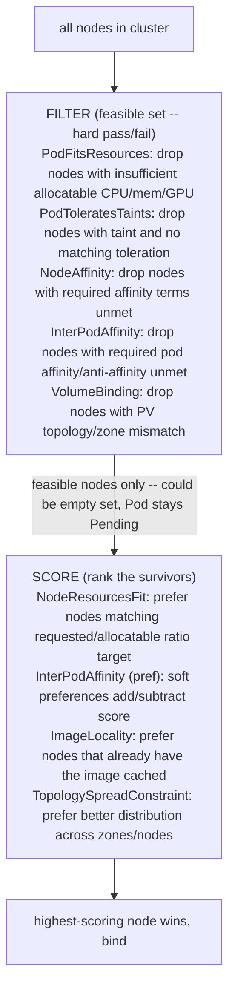
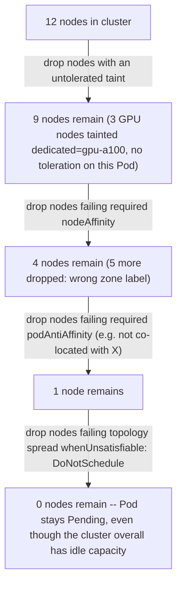
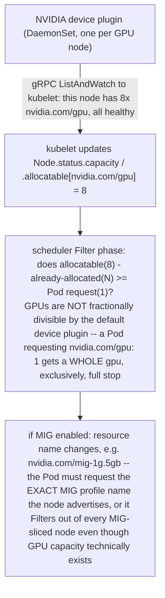

# Chapter 2 — Scheduler mechanics, resources and topology
*(original text preserved in full below; additions marked with ➕ so you can see exactly what changed)*

**Learning outcome:** Explain filter/score thinking, requests/allocatable, affinity, taints, topology and extended GPU resources.

## 2.1 Requests drive placement

The scheduler checks whether candidate nodes satisfy Pod requirements. Resource requests are reservation/accounting inputs for CPU and memory; limits primarily affect runtime enforcement. A node can be 20% utilized yet unable to fit a Pod because its unallocated requested capacity is insufficient.

```bash
kubectl describe pod <pending-pod>
kubectl get node <node> -o jsonpath='{.status.allocatable}'
kubectl describe node <node> | sed -n '/Allocated resources:/,$p'
```

➕ **The distinction that trips people up, made concrete with numbers:**
```
Node:          64 vCPU total, 60 vCPU allocatable (4 reserved for kubelet/system)
Requests sum:  55 vCPU already RESERVED by scheduled Pods (whether they're using it or not)
Actual usage:  12 vCPU currently being consumed (measured by cgroup/cAdvisor)
                            ↓
A new Pod requesting 8 vCPU is REJECTED at scheduling time — only 5 vCPU of
allocatable capacity remains unreserved — even though 48 vCPU of *actual* usage
headroom exists right now. The scheduler never looks at "actual usage"; it only
ever looks at the sum of requests already committed.
```
➕ **Sample annotated output — reading `kubectl describe node` for exactly this:**
```bash
$ kubectl describe node gpu-worker-3 | sed -n '/Allocated resources:/,$p'
Allocated resources
(Total limits may be over 100 percent, i.e., overcommitted.)
Resource Requests Limits
--------
cpu 55200m (92%) 78000m (130%) ← requests near capacity: scheduling headroom is thin
memory 210Gi (88%) 250Gi (105%)
nvidia.com/gpu 8 (100%) 8 (100%) ← GPUs are integer/discrete: 100% means the NEXT
GPU pod is Pending no matter how idle these 8 are
```
The `(130%)` on limits is normal and expected — limits are allowed to overcommit because they're enforced at runtime (CFS throttling), not reserved at scheduling time; **requests at or near 100% is the number that actually blocks new Pods**, and it's the number people conflate with "the node is full" when checking dashboards that show utilization instead.

➕ **Shortcut — one-liner to rank nodes by request pressure, not usage, across a whole cluster:**
```bash
kubectl describe nodes | awk '/^Name:/{name=$2} /cpu  /{print name, $0}' | grep -E '\([0-9]+%\)'
```
Or more robustly with `kubectl top` for actual usage side-by-side, to make the requests-vs-usage gap visible in one view:
```bash
paste <(kubectl describe nodes | grep -A2 'Allocated resources' ) <(kubectl top nodes)
```

## 2.2 Constraints: taints, affinity and topology

Taints repel Pods unless a matching toleration exists. Node affinity constrains or prefers labels. Pod affinity/anti-affinity considers co-location relative to other Pods and topology keys. Topology spread constraints express distribution. These rules can reduce the eligible node set to zero even when aggregate capacity exists.

```bash
kubectl get nodes --show-labels
kubectl describe node <node> | grep -A3 Taints
kubectl get pod <pod> -o yaml | sed -n '/affinity:/,/containers:/p'
```

➕ **Filter → Score, the two-phase model the scheduler actually runs (worth drawing from memory):**

➕ **Interview-ready line:** "Filter is pass/fail elimination — a single unmet *required* rule drops a node to zero eligibility. Score only ranks whatever survives Filter. If a Pod is Pending, the first question is always which Filter predicate emptied the set — Score never explains a Pending Pod."

➕ **Reading the actual FailedScheduling event, annotated:**
```
$ kubectl describe pod gpu-job-7f -n ml | tail -15
Events:
  Type     Reason            Age   From               Message
  ----     ------            ----  ----               -------
  Warning  FailedScheduling  2m    default-scheduler  0/12 nodes are available:
           3 Insufficient nvidia.com/gpu, 6 node(s) had untolerated taint
           {dedicated: gpu-a100}, 3 node(s) didn't match Pod's node affinity/selector.
```
Read this as three independent Filter rejections, not one combined failure — 3 nodes failed on GPU count alone (would pass if scaled), 6 failed on a taint (this Pod is missing a toleration, likely intentional isolation), 3 failed on affinity (label mismatch, possibly a typo). **The fix for each bucket is different** — this is the exact evidence a Senior SA is expected to decompose live rather than saying "not enough GPUs" as a single diagnosis.

➕ **Diagram: how constraints shrink the eligible node set to zero even with capacity to spare** (the source's key warning — "these rules can reduce the eligible node set to zero even when aggregate capacity exists" — drawn as the actual funnel):

Each layer is an independent hard filter — aggregate cluster capacity is irrelevant once any single required rule empties the set; this is why "the cluster isn't even full" is not evidence against a Pending Pod.

## 2.3 Extended resources and GPUs

GPUs are typically advertised as extended resources by a device plugin. The scheduler allocates named resources; it does not infer GPU availability from nvidia-smi utilization. MIG can expose slice-specific resource names. Therefore low hardware utilization does not imply that the requested resource exists or is unallocated.

➕ **The device-plugin → scheduler pipeline, end to end:**

➕ **Sample annotated output — proving what a node actually advertises, MIG or not:**
```bash
$ kubectl get node gpu-a100-04 -o json | jq '.status.allocatable | with_entries(select(.key | contains("nvidia")))'
{
"nvidia.com/mig-1g.5gb": "7", ← MIG-sliced: 7 slices of the 1g.5gb profile
"nvidia.com/mig-2g.10gb": "0" ← this profile is defined but exhausted/unconfigured — 0 available
}
```
A Pod manifest requesting `nvidia.com/gpu: 1` against this node will Filter out with `Insufficient nvidia.com/gpu` even though the node has physical GPU capacity — because the node isn't advertising *that* resource name at all once MIG reconfiguration has taken over the resource namespace. This single fact — **MIG changes the resource name, not just the resource quantity** — is one of the most common "why is my GPU pod Pending on an idle-looking GPU node" root causes in real fleets.

## Worked scenario
**Situation:** A GPU Pod is Pending with Insufficient nvidia.com/gpu while several GPU nodes show low utilization.

1. Inspect Pod requests and Node allocatable/allocated nvidia.com/gpu resources.
2. Check labels, taints/tolerations, affinity and topology restrictions.
3. Verify the NVIDIA device plugin is healthy and advertising the expected resource.
4. If MIG is configured, confirm the workload requests the correct advertised MIG resource name.
5. Check cluster autoscaler/NAP limits, quotas and compatible node pool availability.

**Conclusion:** Scheduling evidence is allocation + constraints. Utilization belongs to a later runtime/performance question.

➕ **Second worked scenario — device plugin restart causing a transient scheduling storm:**
> **Situation:** A GPU node's device plugin Pod was OOMKilled and restarted. For ~20 seconds, four already-Running GPU workloads on that node show no symptom, but three NEW GPU Pods that were about to be scheduled to that node suddenly get `FailedScheduling: Insufficient nvidia.com/gpu` against a node that, seconds earlier, `kubectl describe node` showed as having free GPU capacity.
> 1. `kubectl get pods -n kube-system -l app=nvidia-device-plugin -o wide` — confirm the restart timestamp lines up with the scheduling failures.
> 2. `kubectl get node gpu-a100-04 -o json | jq '.status.allocatable'` during the gap — the `nvidia.com/gpu` key is briefly *absent entirely*, not just zero, because the kubelet clears the extended resource when the device plugin's gRPC stream disconnects and hasn't yet re-registered via a fresh `ListAndWatch`.
> 3. This is expected, level-based recovery behavior (same mechanism as Chapter 1's watch-drop discussion) — the fix is not to touch the node, it's to confirm the device plugin's restart loop stabilizes and the resource re-advertises, then let the scheduler's normal retry (unschedulable Pods are re-tried on the next scheduling cycle, not abandoned) pick the Pods back up.
> 4. If device plugin restarts are *frequent* (check `kubectl get pods -n kube-system -l app=nvidia-device-plugin` restart counts across the fleet), the real problem is plugin stability (often a memory limit set too low for the plugin container itself), not scheduling.
> **Conclusion:** an extended resource disappearing briefly from `allocatable` is a device-plugin-liveness signal, not a scheduler bug — correlate timestamps before escalating.

➕ **Shortcut — GPU scheduling triage in one command chain:**
```bash
kubectl describe pod <pod> | grep -A5 Events   # what did Filter actually reject on?
kubectl get node <node> -o json | jq '.status.allocatable, .status.capacity' | grep -i gpu
kubectl -n kube-system get pods -l app=nvidia-device-plugin -o wide  # is the plugin even healthy?
kubectl get node <node> -o json | jq '.metadata.labels' | grep -i mig  # MIG profile, if any
```
➕ **Mnemonic:** *"Requests reserve, limits enforce, GPUs don't share."* — CPU/memory requests are a scheduling-time reservation against allocatable; limits are a runtime cgroup enforcement ceiling; the default NVIDIA device plugin path has no concept of a GPU "limit" softer than "whole device," unlike CPU/memory which can overcommit on limits.

## Practice
1. Given `kubectl describe node` output showing 92% CPU requests and 20% actual CPU usage, explain to a customer why new Pods still won't schedule.
2. Decompose a multi-reason FailedScheduling event into independent Filter rejections and propose a different fix for each.
3. Explain why MIG profile mismatch produces "Insufficient nvidia.com/gpu" even on an idle-looking node.

➕ 4. Simulate the device-plugin-restart scenario above in a lab GPU node (or reason through it without hardware): predict exactly what `kubectl get node -o json | jq .status.allocatable` shows during the plugin's restart window, and explain why the scheduler's behavior here is correct rather than a bug.
➕ 5. Write the one-liner that ranks all nodes in a cluster by CPU *request* percentage (not usage) — this is the single fastest way to answer "why won't this Pod schedule" across a large fleet without reading each node's full `describe` output.
