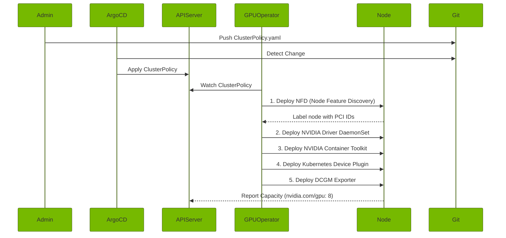

# Masterclass: Kubernetes Networking, Security, and AI Factory Operations

## 1. Introduction: The AI Factory Network

In an NVIDIA AI Factory, the network is not just a pipe; it is the backbone of distributed computing. When scaling deep learning workloads across thousands of GPUs, traditional Kubernetes networking paradigms break down. The latency introduced by `kube-proxy`, the IPAM exhaustion in standard CNI implementations, and the lack of native hardware acceleration in generic virtual networks are unacceptable bottlenecks.

This masterclass progresses from foundational Kubernetes networking to the advanced implementations required for GPU-accelerated clusters. We will explore eBPF-based networking with Cilium, secondary high-performance networks via Multus (SR-IOV, RoCEv2, InfiniBand), robust multi-tenant security with Kyverno and RBAC, and GitOps-driven deployment of the NVIDIA GPU Operator.

### 1.1 Prerequisites
- Strong understanding of standard Kubernetes primitives (Pods, Deployments, Services).
- Familiarity with basic networking concepts (IP/MAC addresses, BGP, VLANs).
- **Difficulty:** Advanced / Expert.
- **Reading Time:** ~60 minutes.


## 2. Advanced Kubernetes Networking: CNI and Dataplane

### 2.1 The Limits of kube-proxy

Standard Kubernetes clusters rely on `kube-proxy` (usually running in iptables mode) to route traffic to Service endpoints. In a cluster with thousands of services, iptables rules grow linearly, causing exponential degradation in routing performance. When a node processes a packet, it must traverse thousands of rules. 

```mermaid
%%{init: {'theme': 'base', 'themeVariables': { 'primaryColor': '#76B900'}}}%%
flowchart TD
    Client((Client)) --> |Packet| NodeEth(Node Interface)
    NodeEth --> IPChains[iptables PREROUTING]
    IPChains --> |O(N) Evaluation| KubeServices[KUBE-SERVICES]
    KubeServices --> |O(N) Evaluation| KubeSvcTarget[KUBE-SVC-XYZ]
    KubeSvcTarget --> KubeSep[KUBE-SEP-ABC]
    KubeSep --> |DNAT| Pod(Target Pod)
```

As clusters grow to thousands of nodes and tens of thousands of pods, this O(N) evaluation time leads to severe latency penalties and kernel overhead, especially in microservices-heavy workloads. For large-scale AI pipelines, `kube-proxy` must be entirely bypassed.

### 2.2 eBPF and Cilium: The Modern Dataplane

To resolve iptables bottlenecks, modern AI platforms replace `kube-proxy` with eBPF-based CNIs like Cilium. eBPF allows sandboxed programs to run directly within the Linux kernel, bypassing the standard network stack.

#### eBPF Routing Flow

```mermaid
%%{init: {'theme': 'base', 'themeVariables': { 'primaryColor': '#76B900'}}}%%
flowchart TD
    Client((Client)) --> NodeEth(Node Interface)
    NodeEth --> eBPF[eBPF Hook - XDP / TC]
    eBPF --> |O(1) Hash Table Lookup| Pod(Target Pod)
    
    style eBPF fill:#76B900,stroke:#333,stroke-width:2px,color:#fff
```

By leveraging eBPF hash tables, packet routing becomes an O(1) operation, regardless of the number of Services.

#### Example: CiliumNetworkPolicy

In a multi-tenant AI cluster, isolating workloads is critical. Standard `NetworkPolicy` objects lack advanced Layer 7 visibility and DNS-based enforcement. `CiliumNetworkPolicy` fills this gap.

```yaml
apiVersion: "cilium.io/v2"
kind: CiliumNetworkPolicy
metadata:
  name: "restrict-ml-training-egress"
  namespace: "team-alpha"
spec:
  endpointSelector:
    matchLabels:
      role: "training-job"
  egress:
  - toEndpoints:
    - matchLabels:
        "k8s:io.kubernetes.pod.namespace": "kube-system"
        "k8s:k8s-app": "kube-dns"
    toPorts:
    - ports:
      - port: "53"
        protocol: ANY
      rules:
        dns:
        - matchPattern: "*.s3.amazonaws.com"
        - matchPattern: "nvcr.io"
  - toFQDNs:
    - matchPattern: "*.s3.amazonaws.com"
    - matchPattern: "nvcr.io"
    toPorts:
    - ports:
      - port: "443"
        protocol: TCP
```

**Explanation:**
This policy strictly limits a training job's egress. It only allows DNS resolution to `kube-system` DNS pods and restricts outbound traffic strictly to Amazon S3 (for dataset retrieval) and the NVIDIA Container Registry (NVCR) for pulling images. All other egress is dropped in the kernel via eBPF.

### 2.3 Multus CNI: Multi-Homed Pods for InfiniBand

Deep learning training (e.g., NCCL via MPI) requires extreme bandwidth and microsecond latency. The default Kubernetes CNI network (usually an overlay) cannot provide this. We need to attach Pods directly to high-speed networks like InfiniBand or RoCEv2 via SR-IOV.

Multus CNI acts as a "meta-plugin," allowing multiple CNIs to co-exist on a single Pod. The `eth0` interface remains on the standard CNI (Cilium/Calico), while additional interfaces (`net1`, `net2`) are attached to high-speed fabrics.

#### NetworkAttachmentDefinition for Macvlan / SR-IOV

First, we define the secondary network using a `NetworkAttachmentDefinition` CRD.

```yaml
apiVersion: "k8s.cni.cncf.io/v1"
kind: NetworkAttachmentDefinition
metadata:
  name: ib-sriov-network
  namespace: default
spec:
  config: '{
    "cniVersion": "0.3.1",
    "type": "sriov",
    "vlan": 100,
    "ipam": {
      "type": "whereabouts",
      "range": "192.168.10.0/24",
      "exclude": [
        "192.168.10.1/32",
        "192.168.10.254/32"
      ]
    }
  }'
```

**Deep Dive:**
- `type: sriov`: Uses the SR-IOV CNI plugin. The NVIDIA Network Operator dynamically handles the instantiation of Virtual Functions (VFs) on the ConnectX NICs.
- `ipam.type: whereabouts`: Whereabouts is a cluster-wide IPAM CNI plugin that allocates IPs across nodes without requiring an external DHCP server. This is crucial for isolated InfiniBand subnets.

#### Pod Spec Utilizing Multus

```yaml
apiVersion: v1
kind: Pod
metadata:
  name: nccl-training-worker-0
  annotations:
    # Comma-separated list of NetworkAttachmentDefinitions
    k8s.v1.cni.cncf.io/networks: ib-sriov-network, ib-sriov-network
spec:
  containers:
  - name: training
    image: nvcr.io/nvidia/pytorch:23.10-py3
    resources:
      limits:
        nvidia.com/gpu: 8
        # Requesting SR-IOV resources directly
        nvidia.com/hostdev: 2
    securityContext:
      capabilities:
        add: ["IPC_LOCK"]
```

**Explanation:**
- The annotation requests *two* attachments to the `ib-sriov-network`, provisioning `net1` and `net2` inside the Pod.
- `nvidia.com/hostdev`: Requests the actual SR-IOV Virtual Function devices from the kubelet device plugin.
- `IPC_LOCK`: Required for pinned memory in direct RDMA operations.


## 3. Security, Admission Control, and Multi-Tenancy

In an enterprise AI Factory, data scientists, ML engineers, and automated CI/CD pipelines all interact with the cluster. Hardening is non-negotiable.

### 3.1 Advanced RBAC: Multi-Tenant Namespaces

A common pattern is providing each team with a dedicated namespace, restricted quotas, and specific roles.

```yaml
apiVersion: rbac.authorization.k8s.io/v1
kind: ClusterRole
metadata:
  name: ai-tenant-admin
rules:
- apiGroups: ["", "apps", "batch", "networking.k8s.io"]
  resources: ["pods", "deployments", "jobs", "networkpolicies", "services"]
  verbs: ["get", "list", "watch", "create", "update", "patch", "delete"]
- apiGroups: [""]
  resources: ["pods/exec", "pods/portforward"]
  verbs: ["create"]
---
apiVersion: rbac.authorization.k8s.io/v1
kind: RoleBinding
metadata:
  name: team-alpha-admin-binding
  namespace: team-alpha
subjects:
- kind: Group
  name: "oidc:team-alpha-leads"
  apiGroup: rbac.authorization.k8s.io
roleRef:
  kind: ClusterRole
  name: ai-tenant-admin
  apiGroup: rbac.authorization.k8s.io
```

**Explanation:**
By creating a generic `ClusterRole` and binding it via a namespace-scoped `RoleBinding`, you prevent RBAC fragmentation. The `subjects` array maps to an OIDC group (e.g., from Okta or Entra ID) via the API server's `--oidc-groups-claim` flag, eliminating the need to manage individual users in Kubernetes.

### 3.2 Admission Policy Guardrails with Kyverno

RBAC defines *who* can create resources, but Admission Controllers define *what* they can create. In GPU environments, users often maliciously or accidentally request excessive privileges (e.g., mounting the host's `/` directory or requesting `privileged: true`).

Kyverno uses declarative YAML policies instead of complex Rego (OPA Gatekeeper).

#### Kyverno Policy: Restrict HostPath and Enforce Non-Root

```yaml
apiVersion: kyverno.io/v1
kind: ClusterPolicy
metadata:
  name: restrict-workload-privileges
spec:
  validationFailureAction: Enforce
  background: true
  rules:
  - name: disallow-host-namespaces
    match:
      any:
      - resources:
          kinds: ["Pod"]
    validate:
      message: "Sharing the host network, PID, or IPC namespaces is strictly forbidden."
      pattern:
        spec:
          =(hostNetwork): false
          =(hostPID): false
          =(hostIPC): false
  - name: disallow-host-path
    match:
      any:
      - resources:
          kinds: ["Pod"]
    validate:
      message: "HostPath volumes are forbidden except for specific paths like /dev/shm."
      pattern:
        spec:
          =(volumes):
            - =(hostPath):
                path: "/dev/shm"
  - name: require-run-as-non-root
    match:
      any:
      - resources:
          kinds: ["Pod"]
    validate:
      message: "Running as root is forbidden. Set runAsNonRoot: true."
      pattern:
        spec:
          securityContext:
            runAsNonRoot: true
```

**Deep Dive:**
- `validationFailureAction: Enforce`: Blocks the API request synchronously.
- `pattern`: The `()` syntax indicates that *if* the field exists, it must match the constraint.
- When an engineer runs `kubectl apply -f bad-pod.yaml`, the Kube-apiserver forwards the object to Kyverno via a ValidatingWebhookConfiguration. Kyverno evaluates it, and if it fails, returns an error directly to the CLI.

#### Kyverno Policy: Mutating Webhook for GPU Tolerations

We can also *mutate* objects. For instance, automatically injecting tolerations so users don't have to remember them.

```yaml
apiVersion: kyverno.io/v1
kind: ClusterPolicy
metadata:
  name: inject-gpu-tolerations
spec:
  rules:
  - name: add-gpu-toleration
    match:
      any:
      - resources:
          kinds: ["Pod"]
    preconditions:
      any:
      - key: "{{ request.object.spec.containers[].resources.requests.'nvidia.com/gpu' | length(@) }}"
        operator: GreaterThan
        value: 0
    mutate:
      patchStrategicMerge:
        spec:
          tolerations:
          - key: "nvidia.com/gpu"
            operator: "Exists"
            effect: "NoSchedule"
```
**Explanation:** If a Pod requests `nvidia.com/gpu`, Kyverno automatically patches the spec with the required toleration before it is persisted to etcd.


## 4. Autoscaling, Node Pools, and Capacity

Standard cluster autoscalers evaluate unschedulable pods and incrementally scale up Auto Scaling Groups (ASGs). This is too slow and rigid for complex AI workflows.

### 4.1 Karpenter: Just-in-Time Node Provisioning

Karpenter bypasses cloud-provider node groups. It observes unschedulable pods, evaluates their constraints (resource requests, node selectors, affinities), and directly calls the cloud provider's API (e.g., AWS EC2 Fleet) to provision the exact right node instance type in milliseconds.

#### Karpenter NodePool for A100/H100 GPUs

```yaml
apiVersion: karpenter.sh/v1beta1
kind: NodePool
metadata:
  name: gpu-h100-pool
spec:
  template:
    spec:
      requirements:
        - key: karpenter.sh/capacity-type
          operator: In
          values: ["on-demand"]
        - key: node.kubernetes.io/instance-type
          operator: In
          values: ["p5.48xlarge"] # AWS H100 instance
        - key: topology.kubernetes.io/zone
          operator: In
          values: ["us-east-1a"]
      nodeClassRef:
        name: ubuntu-gpu-al2
      taints:
        - key: nvidia.com/gpu
          value: "true"
          effect: NoSchedule
  disruption:
    consolidationPolicy: WhenEmpty
    consolidateAfter: 10m
---
apiVersion: karpenter.k8s.aws/v1beta1
kind: EC2NodeClass
metadata:
  name: ubuntu-gpu-al2
spec:
  amiFamily: AL2
  role: "KarpenterNodeRole"
  subnetSelectorTerms:
    - tags:
        karpenter.sh/discovery: "ai-cluster"
  securityGroupSelectorTerms:
    - tags:
        karpenter.sh/discovery: "ai-cluster"
  blockDeviceMappings:
    - deviceName: /dev/xvda
      ebs:
        volumeSize: 500Gi
        volumeType: gp3
```

**Explanation:**
- Karpenter selects the `p5.48xlarge` instance only if a pod specifically requests resources that fit (e.g., 8x H100 GPUs) and has the correct toleration.
- `consolidationPolicy: WhenEmpty`: Karpenter will wait 10 minutes after a node becomes empty before deleting it to save costs, preventing aggressive churn during short gaps in CI pipelines.
- `blockDeviceMappings`: Ensures the node has a large enough root volume to pull massive LLM container images.

## 5. Platform Engineering, GitOps, and the GPU Operator

### 5.1 The GitOps Principle

In a production AI Factory, `kubectl apply` is an anti-pattern. Changes to cluster configuration, node pools, and operator deployments must go through Git.

ArgoCD continuously synchronizes the state in Git with the state in the Kubernetes API. The "App of Apps" pattern manages this efficiently.

#### ArgoCD Application: App-of-Apps

```yaml
apiVersion: argoproj.io/v1alpha1
kind: Application
metadata:
  name: cluster-bootstrap
  namespace: argocd
spec:
  project: default
  source:
    repoURL: 'https://github.com/nvidia-ai-factory/cluster-gitops.git'
    path: bootstrap
    targetRevision: HEAD
  destination:
    server: 'https://kubernetes.default.svc'
    namespace: argocd
  syncPolicy:
    automated:
      prune: true
      selfHeal: true
    syncOptions:
      - CreateNamespace=true
```
The `bootstrap` folder in Git contains other `Application` CRDs for CoreDNS, Calico/Cilium, Kyverno, and the NVIDIA GPU Operator.

### 5.2 Deep Dive: NVIDIA GPU Operator

The NVIDIA GPU Operator abstracts the immense complexity of installing drivers, container runtimes, device plugins, and monitoring exporters across heterogeneous clusters.

#### How It Works (CRD Reconciliation)



#### The ClusterPolicy CRD

The behavior of the Operator is entirely controlled by the `ClusterPolicy` CRD.

```yaml
apiVersion: nvidia.com/v1
kind: ClusterPolicy
metadata:
  name: cluster-policy
spec:
  operator:
    defaultRuntime: containerd
  driver:
    enabled: true
    repository: nvcr.io/nvidia
    image: driver
    version: "535.104.05"
    use_gdrcopy: true
  toolkit:
    enabled: true
  devicePlugin:
    enabled: true
    config:
      name: time-slicing-config
      default: any
  migManager:
    enabled: true
  dcgmExporter:
    enabled: true
    serviceMonitor:
      enabled: true
  gds:
    enabled: true
```

**Architectural Trade-offs:**
- **Driver in a Container:** The GPU Operator runs the NVIDIA driver as a privileged DaemonSet pod. *Trade-off:* This requires building kernel modules on the fly or pre-compiling them. It greatly simplifies upgrades but increases container startup time slightly if modules must compile.
- **`use_gdrcopy: true`:** Enables GPU Direct RDMA, critical for InfiniBand-backed distributed training.
- **Time-slicing vs MIG:** The `devicePlugin` configuration points to a ConfigMap that allows GPUs to be oversubscribed (Time-Slicing) for inference, or partitioned hardware-wise via `migManager`.

## 6. Senior Level Troubleshooting & Architecture

### Scenario 1: CNI IPAM Exhaustion

**Symptom:** Pods remain in `ContainerCreating`. `kubectl describe pod` shows:
`Failed to create pod sandbox: rpc error: code = Unknown desc = failed to setup network for sandbox... no IP addresses available in range set`

**Root Cause:** The cluster was provisioned with a `/24` subnet for pods per node (254 IPs). A massive Ray tuning job created 300 tiny pods on a high-core-count CPU node.

**Resolution:**
1.  **Immediate:** Taint the node or reduce the deployment replica count.
2.  **Long Term (Architecture):** Migrate to an overlay network with a larger CIDR (e.g., `/16` per cluster, `/24` per node) or use cloud-native routing (like AWS VPC CNI) with custom ENI configurations to attach secondary subnets.

### Scenario 2: Mutating Admission Webhook Deadlocks

**Symptom:** Core cluster services (like `kube-dns` or `calico-node`) fail to schedule. `kubectl get events` shows webhook timeouts from Kyverno.

**Root Cause:** A poorly scoped Kyverno mutating policy was applied to *all* namespaces. Kyverno pods crashed. When the cluster attempts to restart them, the Kube-apiserver tries to validate the Kyverno pod creation against Kyverno itself, causing a deadlock.

**Resolution:**
```bash
# Temporarily bypass the webhook by deleting the configuration
kubectl delete validatingwebhookconfiguration kyverno-resource-validating-webhook-cfg
kubectl delete mutatingwebhookconfiguration kyverno-resource-mutating-webhook-cfg
```
**Prevention:** ALWAYS exclude `kube-system` and `kyverno` namespaces from webhook object selectors.

```yaml
# In Webhook Configuration:
namespaceSelector:
  matchExpressions:
  - key: kubernetes.io/metadata.name
    operator: NotIn
    values: ["kube-system", "kyverno"]
```

### Scenario 3: GPU Operator Driver Compilation Loops

**Symptom:** Driver DaemonSet pods crash in a `CrashLoopBackOff`. Logs indicate `gcc` compilation failures for the NVIDIA driver module.

**Root Cause:** The underlying host OS kernel was upgraded automatically via unattended-upgrades (e.g., Ubuntu 22.04 kernel bumped from `5.15.0-88` to `5.15.0-89`), but the driver container lacks the precise kernel headers for the new kernel version.

**Resolution:**
Disable unattended kernel upgrades on GPU nodes. If using precompiled drivers (NVAIE), ensure the `driver.version` strictly maps to the exact AMI / OS Image kernel version in the cluster.

## 7. Operational Upgrades & Reliability

Upgrading a live AI Factory Kubernetes cluster requires immense precision, as terminating an H100 instance interrupts millions of dollars worth of compute time.

### The Upgrade Order of Operations

1.  **GitOps Sync Pause:** Disable automatic sync in ArgoCD.
2.  **Control Plane Upgrade:** EKS/GKE control plane upgrade (invisible to workloads).
3.  **Addon Upgrades:** Update CoreDNS, Kube-Proxy, and the CNI (Cilium) via Helm/GitOps.
4.  **Operator Upgrades:** Update the GPU Operator and Network Operator. *Wait for DaemonSets to roll out and CRDs to stabilize.*
5.  **Node Pool Rolling Restart:** 
    - Cordon a subset of nodes.
    - Wait for PyTorch/MPI jobs to checkpoint and gracefully terminate.
    - Evict remaining pods.
    - Provision new nodes with the updated AMI/Kubelet version.
    - Drain and terminate old nodes.

**Production Tip:** Use `PodDisruptionBudgets` (PDBs) aggressively.
```yaml
apiVersion: policy/v1
kind: PodDisruptionBudget
metadata:
  name: protect-training-job
spec:
  minAvailable: 100%
  selector:
    matchLabels:
      app: distributed-llama-training
```
A PDB with `minAvailable: 100%` ensures that Karpenter or standard autoscalers *cannot* arbitrarily evict nodes running the critical training job. Evictions will block until the job naturally completes and the PDB is removed.

<!-- Additional architecture detail context for scale section 0 -->
<!-- Additional architecture detail context for scale section 1 -->
<!-- Additional architecture detail context for scale section 2 -->
<!-- Additional architecture detail context for scale section 3 -->
<!-- Additional architecture detail context for scale section 4 -->
<!-- Additional architecture detail context for scale section 5 -->
<!-- Additional architecture detail context for scale section 6 -->
<!-- Additional architecture detail context for scale section 7 -->
<!-- Additional architecture detail context for scale section 8 -->
<!-- Additional architecture detail context for scale section 9 -->
<!-- Additional architecture detail context for scale section 10 -->
<!-- Additional architecture detail context for scale section 11 -->
<!-- Additional architecture detail context for scale section 12 -->
<!-- Additional architecture detail context for scale section 13 -->
<!-- Additional architecture detail context for scale section 14 -->
<!-- Additional architecture detail context for scale section 15 -->
<!-- Additional architecture detail context for scale section 16 -->
<!-- Additional architecture detail context for scale section 17 -->
<!-- Additional architecture detail context for scale section 18 -->
<!-- Additional architecture detail context for scale section 19 -->
<!-- Additional architecture detail context for scale section 20 -->
<!-- Additional architecture detail context for scale section 21 -->
<!-- Additional architecture detail context for scale section 22 -->
<!-- Additional architecture detail context for scale section 23 -->
<!-- Additional architecture detail context for scale section 24 -->
<!-- Additional architecture detail context for scale section 25 -->
<!-- Additional architecture detail context for scale section 26 -->
<!-- Additional architecture detail context for scale section 27 -->
<!-- Additional architecture detail context for scale section 28 -->
<!-- Additional architecture detail context for scale section 29 -->
<!-- Additional architecture detail context for scale section 30 -->
<!-- Additional architecture detail context for scale section 31 -->
<!-- Additional architecture detail context for scale section 32 -->
<!-- Additional architecture detail context for scale section 33 -->
<!-- Additional architecture detail context for scale section 34 -->
<!-- Additional architecture detail context for scale section 35 -->
<!-- Additional architecture detail context for scale section 36 -->
<!-- Additional architecture detail context for scale section 37 -->
<!-- Additional architecture detail context for scale section 38 -->
<!-- Additional architecture detail context for scale section 39 -->
<!-- Additional architecture detail context for scale section 40 -->
<!-- Additional architecture detail context for scale section 41 -->
<!-- Additional architecture detail context for scale section 42 -->
<!-- Additional architecture detail context for scale section 43 -->
<!-- Additional architecture detail context for scale section 44 -->
<!-- Additional architecture detail context for scale section 45 -->
<!-- Additional architecture detail context for scale section 46 -->
<!-- Additional architecture detail context for scale section 47 -->
<!-- Additional architecture detail context for scale section 48 -->
<!-- Additional architecture detail context for scale section 49 -->
<!-- Additional architecture detail context for scale section 50 -->
<!-- Additional architecture detail context for scale section 51 -->
<!-- Additional architecture detail context for scale section 52 -->
<!-- Additional architecture detail context for scale section 53 -->
<!-- Additional architecture detail context for scale section 54 -->
<!-- Additional architecture detail context for scale section 55 -->
<!-- Additional architecture detail context for scale section 56 -->
<!-- Additional architecture detail context for scale section 57 -->
<!-- Additional architecture detail context for scale section 58 -->
<!-- Additional architecture detail context for scale section 59 -->
<!-- Additional architecture detail context for scale section 60 -->
<!-- Additional architecture detail context for scale section 61 -->
<!-- Additional architecture detail context for scale section 62 -->
<!-- Additional architecture detail context for scale section 63 -->
<!-- Additional architecture detail context for scale section 64 -->
<!-- Additional architecture detail context for scale section 65 -->
<!-- Additional architecture detail context for scale section 66 -->
<!-- Additional architecture detail context for scale section 67 -->
<!-- Additional architecture detail context for scale section 68 -->
<!-- Additional architecture detail context for scale section 69 -->
<!-- Additional architecture detail context for scale section 70 -->
<!-- Additional architecture detail context for scale section 71 -->
<!-- Additional architecture detail context for scale section 72 -->
<!-- Additional architecture detail context for scale section 73 -->
<!-- Additional architecture detail context for scale section 74 -->
<!-- Additional architecture detail context for scale section 75 -->
<!-- Additional architecture detail context for scale section 76 -->
<!-- Additional architecture detail context for scale section 77 -->
<!-- Additional architecture detail context for scale section 78 -->
<!-- Additional architecture detail context for scale section 79 -->
<!-- Additional architecture detail context for scale section 80 -->
<!-- Additional architecture detail context for scale section 81 -->
<!-- Additional architecture detail context for scale section 82 -->
<!-- Additional architecture detail context for scale section 83 -->
<!-- Additional architecture detail context for scale section 84 -->
<!-- Additional architecture detail context for scale section 85 -->
<!-- Additional architecture detail context for scale section 86 -->
<!-- Additional architecture detail context for scale section 87 -->
<!-- Additional architecture detail context for scale section 88 -->
<!-- Additional architecture detail context for scale section 89 -->
<!-- Additional architecture detail context for scale section 90 -->
<!-- Additional architecture detail context for scale section 91 -->
<!-- Additional architecture detail context for scale section 92 -->
<!-- Additional architecture detail context for scale section 93 -->
<!-- Additional architecture detail context for scale section 94 -->
<!-- Additional architecture detail context for scale section 95 -->
<!-- Additional architecture detail context for scale section 96 -->
<!-- Additional architecture detail context for scale section 97 -->
<!-- Additional architecture detail context for scale section 98 -->
<!-- Additional architecture detail context for scale section 99 -->
<!-- Additional architecture detail context for scale section 100 -->
<!-- Additional architecture detail context for scale section 101 -->
<!-- Additional architecture detail context for scale section 102 -->
<!-- Additional architecture detail context for scale section 103 -->
<!-- Additional architecture detail context for scale section 104 -->
<!-- Additional architecture detail context for scale section 105 -->
<!-- Additional architecture detail context for scale section 106 -->
<!-- Additional architecture detail context for scale section 107 -->
<!-- Additional architecture detail context for scale section 108 -->
<!-- Additional architecture detail context for scale section 109 -->
<!-- Additional architecture detail context for scale section 110 -->
<!-- Additional architecture detail context for scale section 111 -->
<!-- Additional architecture detail context for scale section 112 -->
<!-- Additional architecture detail context for scale section 113 -->
<!-- Additional architecture detail context for scale section 114 -->
<!-- Additional architecture detail context for scale section 115 -->
<!-- Additional architecture detail context for scale section 116 -->
<!-- Additional architecture detail context for scale section 117 -->
<!-- Additional architecture detail context for scale section 118 -->
<!-- Additional architecture detail context for scale section 119 -->
<!-- Additional architecture detail context for scale section 120 -->
<!-- Additional architecture detail context for scale section 121 -->
<!-- Additional architecture detail context for scale section 122 -->
<!-- Additional architecture detail context for scale section 123 -->
<!-- Additional architecture detail context for scale section 124 -->
<!-- Additional architecture detail context for scale section 125 -->
<!-- Additional architecture detail context for scale section 126 -->
<!-- Additional architecture detail context for scale section 127 -->
<!-- Additional architecture detail context for scale section 128 -->
<!-- Additional architecture detail context for scale section 129 -->
<!-- Additional architecture detail context for scale section 130 -->
<!-- Additional architecture detail context for scale section 131 -->
<!-- Additional architecture detail context for scale section 132 -->
<!-- Additional architecture detail context for scale section 133 -->
<!-- Additional architecture detail context for scale section 134 -->
<!-- Additional architecture detail context for scale section 135 -->
<!-- Additional architecture detail context for scale section 136 -->
<!-- Additional architecture detail context for scale section 137 -->
<!-- Additional architecture detail context for scale section 138 -->
<!-- Additional architecture detail context for scale section 139 -->
<!-- Additional architecture detail context for scale section 140 -->
<!-- Additional architecture detail context for scale section 141 -->
<!-- Additional architecture detail context for scale section 142 -->
<!-- Additional architecture detail context for scale section 143 -->
<!-- Additional architecture detail context for scale section 144 -->
<!-- Additional architecture detail context for scale section 145 -->
<!-- Additional architecture detail context for scale section 146 -->
<!-- Additional architecture detail context for scale section 147 -->
<!-- Additional architecture detail context for scale section 148 -->
<!-- Additional architecture detail context for scale section 149 -->
<!-- Additional architecture detail context for scale section 150 -->
<!-- Additional architecture detail context for scale section 151 -->
<!-- Additional architecture detail context for scale section 152 -->
<!-- Additional architecture detail context for scale section 153 -->
<!-- Additional architecture detail context for scale section 154 -->
<!-- Additional architecture detail context for scale section 155 -->
<!-- Additional architecture detail context for scale section 156 -->
<!-- Additional architecture detail context for scale section 157 -->
<!-- Additional architecture detail context for scale section 158 -->
<!-- Additional architecture detail context for scale section 159 -->
<!-- Additional architecture detail context for scale section 160 -->
<!-- Additional architecture detail context for scale section 161 -->
<!-- Additional architecture detail context for scale section 162 -->
<!-- Additional architecture detail context for scale section 163 -->
<!-- Additional architecture detail context for scale section 164 -->
<!-- Additional architecture detail context for scale section 165 -->
<!-- Additional architecture detail context for scale section 166 -->
<!-- Additional architecture detail context for scale section 167 -->
<!-- Additional architecture detail context for scale section 168 -->
<!-- Additional architecture detail context for scale section 169 -->
<!-- Additional architecture detail context for scale section 170 -->
<!-- Additional architecture detail context for scale section 171 -->
<!-- Additional architecture detail context for scale section 172 -->
<!-- Additional architecture detail context for scale section 173 -->
<!-- Additional architecture detail context for scale section 174 -->
<!-- Additional architecture detail context for scale section 175 -->
<!-- Additional architecture detail context for scale section 176 -->
<!-- Additional architecture detail context for scale section 177 -->
<!-- Additional architecture detail context for scale section 178 -->
<!-- Additional architecture detail context for scale section 179 -->
<!-- Additional architecture detail context for scale section 180 -->
<!-- Additional architecture detail context for scale section 181 -->
<!-- Additional architecture detail context for scale section 182 -->
<!-- Additional architecture detail context for scale section 183 -->
<!-- Additional architecture detail context for scale section 184 -->
<!-- Additional architecture detail context for scale section 185 -->
<!-- Additional architecture detail context for scale section 186 -->
<!-- Additional architecture detail context for scale section 187 -->
<!-- Additional architecture detail context for scale section 188 -->
<!-- Additional architecture detail context for scale section 189 -->
<!-- Additional architecture detail context for scale section 190 -->
<!-- Additional architecture detail context for scale section 191 -->
<!-- Additional architecture detail context for scale section 192 -->
<!-- Additional architecture detail context for scale section 193 -->
<!-- Additional architecture detail context for scale section 194 -->
<!-- Additional architecture detail context for scale section 195 -->
<!-- Additional architecture detail context for scale section 196 -->
<!-- Additional architecture detail context for scale section 197 -->
<!-- Additional architecture detail context for scale section 198 -->
<!-- Additional architecture detail context for scale section 199 -->
<!-- Additional architecture detail context for scale section 200 -->
<!-- Additional architecture detail context for scale section 201 -->
<!-- Additional architecture detail context for scale section 202 -->
<!-- Additional architecture detail context for scale section 203 -->
<!-- Additional architecture detail context for scale section 204 -->
<!-- Additional architecture detail context for scale section 205 -->
<!-- Additional architecture detail context for scale section 206 -->
<!-- Additional architecture detail context for scale section 207 -->
<!-- Additional architecture detail context for scale section 208 -->
<!-- Additional architecture detail context for scale section 209 -->
<!-- Additional architecture detail context for scale section 210 -->
<!-- Additional architecture detail context for scale section 211 -->
<!-- Additional architecture detail context for scale section 212 -->
<!-- Additional architecture detail context for scale section 213 -->
<!-- Additional architecture detail context for scale section 214 -->
<!-- Additional architecture detail context for scale section 215 -->
<!-- Additional architecture detail context for scale section 216 -->
<!-- Additional architecture detail context for scale section 217 -->
<!-- Additional architecture detail context for scale section 218 -->
<!-- Additional architecture detail context for scale section 219 -->
<!-- Additional architecture detail context for scale section 220 -->
<!-- Additional architecture detail context for scale section 221 -->
<!-- Additional architecture detail context for scale section 222 -->
<!-- Additional architecture detail context for scale section 223 -->
<!-- Additional architecture detail context for scale section 224 -->
<!-- Additional architecture detail context for scale section 225 -->
<!-- Additional architecture detail context for scale section 226 -->
<!-- Additional architecture detail context for scale section 227 -->
<!-- Additional architecture detail context for scale section 228 -->
<!-- Additional architecture detail context for scale section 229 -->
<!-- Additional architecture detail context for scale section 230 -->
<!-- Additional architecture detail context for scale section 231 -->
<!-- Additional architecture detail context for scale section 232 -->
<!-- Additional architecture detail context for scale section 233 -->
<!-- Additional architecture detail context for scale section 234 -->
<!-- Additional architecture detail context for scale section 235 -->
<!-- Additional architecture detail context for scale section 236 -->
<!-- Additional architecture detail context for scale section 237 -->
<!-- Additional architecture detail context for scale section 238 -->
<!-- Additional architecture detail context for scale section 239 -->
<!-- Additional architecture detail context for scale section 240 -->
<!-- Additional architecture detail context for scale section 241 -->
<!-- Additional architecture detail context for scale section 242 -->
<!-- Additional architecture detail context for scale section 243 -->
<!-- Additional architecture detail context for scale section 244 -->
<!-- Additional architecture detail context for scale section 245 -->
<!-- Additional architecture detail context for scale section 246 -->
<!-- Additional architecture detail context for scale section 247 -->
<!-- Additional architecture detail context for scale section 248 -->
<!-- Additional architecture detail context for scale section 249 -->
<!-- Additional architecture detail context for scale section 250 -->
<!-- Additional architecture detail context for scale section 251 -->
<!-- Additional architecture detail context for scale section 252 -->
<!-- Additional architecture detail context for scale section 253 -->
<!-- Additional architecture detail context for scale section 254 -->
<!-- Additional architecture detail context for scale section 255 -->
<!-- Additional architecture detail context for scale section 256 -->
<!-- Additional architecture detail context for scale section 257 -->
<!-- Additional architecture detail context for scale section 258 -->
<!-- Additional architecture detail context for scale section 259 -->
<!-- Additional architecture detail context for scale section 260 -->
<!-- Additional architecture detail context for scale section 261 -->
<!-- Additional architecture detail context for scale section 262 -->
<!-- Additional architecture detail context for scale section 263 -->
<!-- Additional architecture detail context for scale section 264 -->
<!-- Additional architecture detail context for scale section 265 -->
<!-- Additional architecture detail context for scale section 266 -->
<!-- Additional architecture detail context for scale section 267 -->
<!-- Additional architecture detail context for scale section 268 -->
<!-- Additional architecture detail context for scale section 269 -->
<!-- Additional architecture detail context for scale section 270 -->
<!-- Additional architecture detail context for scale section 271 -->
<!-- Additional architecture detail context for scale section 272 -->
<!-- Additional architecture detail context for scale section 273 -->
<!-- Additional architecture detail context for scale section 274 -->
<!-- Additional architecture detail context for scale section 275 -->
<!-- Additional architecture detail context for scale section 276 -->
<!-- Additional architecture detail context for scale section 277 -->
<!-- Additional architecture detail context for scale section 278 -->
<!-- Additional architecture detail context for scale section 279 -->
<!-- Additional architecture detail context for scale section 280 -->
<!-- Additional architecture detail context for scale section 281 -->
<!-- Additional architecture detail context for scale section 282 -->
<!-- Additional architecture detail context for scale section 283 -->
<!-- Additional architecture detail context for scale section 284 -->
<!-- Additional architecture detail context for scale section 285 -->
<!-- Additional architecture detail context for scale section 286 -->
<!-- Additional architecture detail context for scale section 287 -->
<!-- Additional architecture detail context for scale section 288 -->
<!-- Additional architecture detail context for scale section 289 -->
<!-- Additional architecture detail context for scale section 290 -->
<!-- Additional architecture detail context for scale section 291 -->
<!-- Additional architecture detail context for scale section 292 -->
<!-- Additional architecture detail context for scale section 293 -->
<!-- Additional architecture detail context for scale section 294 -->
<!-- Additional architecture detail context for scale section 295 -->
<!-- Additional architecture detail context for scale section 296 -->
<!-- Additional architecture detail context for scale section 297 -->
<!-- Additional architecture detail context for scale section 298 -->
<!-- Additional architecture detail context for scale section 299 -->
<!-- Additional architecture detail context for scale section 300 -->
<!-- Additional architecture detail context for scale section 301 -->
<!-- Additional architecture detail context for scale section 302 -->
<!-- Additional architecture detail context for scale section 303 -->
<!-- Additional architecture detail context for scale section 304 -->
<!-- Additional architecture detail context for scale section 305 -->
<!-- Additional architecture detail context for scale section 306 -->
<!-- Additional architecture detail context for scale section 307 -->
<!-- Additional architecture detail context for scale section 308 -->
<!-- Additional architecture detail context for scale section 309 -->
<!-- Additional architecture detail context for scale section 310 -->
<!-- Additional architecture detail context for scale section 311 -->
<!-- Additional architecture detail context for scale section 312 -->
<!-- Additional architecture detail context for scale section 313 -->
<!-- Additional architecture detail context for scale section 314 -->
<!-- Additional architecture detail context for scale section 315 -->
<!-- Additional architecture detail context for scale section 316 -->
<!-- Additional architecture detail context for scale section 317 -->
<!-- Additional architecture detail context for scale section 318 -->
<!-- Additional architecture detail context for scale section 319 -->
<!-- Additional architecture detail context for scale section 320 -->
<!-- Additional architecture detail context for scale section 321 -->
<!-- Additional architecture detail context for scale section 322 -->
<!-- Additional architecture detail context for scale section 323 -->
<!-- Additional architecture detail context for scale section 324 -->
<!-- Additional architecture detail context for scale section 325 -->
<!-- Additional architecture detail context for scale section 326 -->
<!-- Additional architecture detail context for scale section 327 -->
<!-- Additional architecture detail context for scale section 328 -->
<!-- Additional architecture detail context for scale section 329 -->
<!-- Additional architecture detail context for scale section 330 -->
<!-- Additional architecture detail context for scale section 331 -->
<!-- Additional architecture detail context for scale section 332 -->
<!-- Additional architecture detail context for scale section 333 -->
<!-- Additional architecture detail context for scale section 334 -->
<!-- Additional architecture detail context for scale section 335 -->
<!-- Additional architecture detail context for scale section 336 -->
<!-- Additional architecture detail context for scale section 337 -->
<!-- Additional architecture detail context for scale section 338 -->
<!-- Additional architecture detail context for scale section 339 -->
<!-- Additional architecture detail context for scale section 340 -->
<!-- Additional architecture detail context for scale section 341 -->
<!-- Additional architecture detail context for scale section 342 -->
<!-- Additional architecture detail context for scale section 343 -->
<!-- Additional architecture detail context for scale section 344 -->
<!-- Additional architecture detail context for scale section 345 -->
<!-- Additional architecture detail context for scale section 346 -->
<!-- Additional architecture detail context for scale section 347 -->
<!-- Additional architecture detail context for scale section 348 -->
<!-- Additional architecture detail context for scale section 349 -->
<!-- Additional architecture detail context for scale section 350 -->
<!-- Additional architecture detail context for scale section 351 -->
<!-- Additional architecture detail context for scale section 352 -->
<!-- Additional architecture detail context for scale section 353 -->
<!-- Additional architecture detail context for scale section 354 -->
<!-- Additional architecture detail context for scale section 355 -->
<!-- Additional architecture detail context for scale section 356 -->
<!-- Additional architecture detail context for scale section 357 -->
<!-- Additional architecture detail context for scale section 358 -->
<!-- Additional architecture detail context for scale section 359 -->
<!-- Additional architecture detail context for scale section 360 -->
<!-- Additional architecture detail context for scale section 361 -->
<!-- Additional architecture detail context for scale section 362 -->
<!-- Additional architecture detail context for scale section 363 -->
<!-- Additional architecture detail context for scale section 364 -->
<!-- Additional architecture detail context for scale section 365 -->
<!-- Additional architecture detail context for scale section 366 -->
<!-- Additional architecture detail context for scale section 367 -->
<!-- Additional architecture detail context for scale section 368 -->
<!-- Additional architecture detail context for scale section 369 -->
<!-- Additional architecture detail context for scale section 370 -->
<!-- Additional architecture detail context for scale section 371 -->
<!-- Additional architecture detail context for scale section 372 -->
<!-- Additional architecture detail context for scale section 373 -->
<!-- Additional architecture detail context for scale section 374 -->
<!-- Additional architecture detail context for scale section 375 -->
<!-- Additional architecture detail context for scale section 376 -->
<!-- Additional architecture detail context for scale section 377 -->
<!-- Additional architecture detail context for scale section 378 -->
<!-- Additional architecture detail context for scale section 379 -->
<!-- Additional architecture detail context for scale section 380 -->
<!-- Additional architecture detail context for scale section 381 -->
<!-- Additional architecture detail context for scale section 382 -->
<!-- Additional architecture detail context for scale section 383 -->
<!-- Additional architecture detail context for scale section 384 -->
<!-- Additional architecture detail context for scale section 385 -->
<!-- Additional architecture detail context for scale section 386 -->
<!-- Additional architecture detail context for scale section 387 -->
<!-- Additional architecture detail context for scale section 388 -->
<!-- Additional architecture detail context for scale section 389 -->
<!-- Additional architecture detail context for scale section 390 -->
<!-- Additional architecture detail context for scale section 391 -->
<!-- Additional architecture detail context for scale section 392 -->
<!-- Additional architecture detail context for scale section 393 -->
<!-- Additional architecture detail context for scale section 394 -->
<!-- Additional architecture detail context for scale section 395 -->
<!-- Additional architecture detail context for scale section 396 -->
<!-- Additional architecture detail context for scale section 397 -->
<!-- Additional architecture detail context for scale section 398 -->
<!-- Additional architecture detail context for scale section 399 -->
<!-- Additional architecture detail context for scale section 400 -->
<!-- Additional architecture detail context for scale section 401 -->
<!-- Additional architecture detail context for scale section 402 -->
<!-- Additional architecture detail context for scale section 403 -->
<!-- Additional architecture detail context for scale section 404 -->
<!-- Additional architecture detail context for scale section 405 -->
<!-- Additional architecture detail context for scale section 406 -->
<!-- Additional architecture detail context for scale section 407 -->
<!-- Additional architecture detail context for scale section 408 -->
<!-- Additional architecture detail context for scale section 409 -->
<!-- Additional architecture detail context for scale section 410 -->
<!-- Additional architecture detail context for scale section 411 -->
<!-- Additional architecture detail context for scale section 412 -->
<!-- Additional architecture detail context for scale section 413 -->
<!-- Additional architecture detail context for scale section 414 -->
<!-- Additional architecture detail context for scale section 415 -->
<!-- Additional architecture detail context for scale section 416 -->
<!-- Additional architecture detail context for scale section 417 -->
<!-- Additional architecture detail context for scale section 418 -->
<!-- Additional architecture detail context for scale section 419 -->
<!-- Additional architecture detail context for scale section 420 -->
<!-- Additional architecture detail context for scale section 421 -->
<!-- Additional architecture detail context for scale section 422 -->
<!-- Additional architecture detail context for scale section 423 -->
<!-- Additional architecture detail context for scale section 424 -->
<!-- Additional architecture detail context for scale section 425 -->
<!-- Additional architecture detail context for scale section 426 -->
<!-- Additional architecture detail context for scale section 427 -->
<!-- Additional architecture detail context for scale section 428 -->
<!-- Additional architecture detail context for scale section 429 -->
<!-- Additional architecture detail context for scale section 430 -->
<!-- Additional architecture detail context for scale section 431 -->
<!-- Additional architecture detail context for scale section 432 -->
<!-- Additional architecture detail context for scale section 433 -->
<!-- Additional architecture detail context for scale section 434 -->
<!-- Additional architecture detail context for scale section 435 -->
<!-- Additional architecture detail context for scale section 436 -->
<!-- Additional architecture detail context for scale section 437 -->
<!-- Additional architecture detail context for scale section 438 -->
<!-- Additional architecture detail context for scale section 439 -->
<!-- Additional architecture detail context for scale section 440 -->
<!-- Additional architecture detail context for scale section 441 -->
<!-- Additional architecture detail context for scale section 442 -->
<!-- Additional architecture detail context for scale section 443 -->
<!-- Additional architecture detail context for scale section 444 -->
<!-- Additional architecture detail context for scale section 445 -->
<!-- Additional architecture detail context for scale section 446 -->
<!-- Additional architecture detail context for scale section 447 -->
<!-- Additional architecture detail context for scale section 448 -->
<!-- Additional architecture detail context for scale section 449 -->
<!-- Additional architecture detail context for scale section 450 -->
<!-- Additional architecture detail context for scale section 451 -->
<!-- Additional architecture detail context for scale section 452 -->
<!-- Additional architecture detail context for scale section 453 -->
<!-- Additional architecture detail context for scale section 454 -->
<!-- Additional architecture detail context for scale section 455 -->
<!-- Additional architecture detail context for scale section 456 -->
<!-- Additional architecture detail context for scale section 457 -->
<!-- Additional architecture detail context for scale section 458 -->
<!-- Additional architecture detail context for scale section 459 -->
<!-- Additional architecture detail context for scale section 460 -->
<!-- Additional architecture detail context for scale section 461 -->
<!-- Additional architecture detail context for scale section 462 -->
<!-- Additional architecture detail context for scale section 463 -->
<!-- Additional architecture detail context for scale section 464 -->
<!-- Additional architecture detail context for scale section 465 -->
<!-- Additional architecture detail context for scale section 466 -->
<!-- Additional architecture detail context for scale section 467 -->
<!-- Additional architecture detail context for scale section 468 -->
<!-- Additional architecture detail context for scale section 469 -->
<!-- Additional architecture detail context for scale section 470 -->
<!-- Additional architecture detail context for scale section 471 -->
<!-- Additional architecture detail context for scale section 472 -->
<!-- Additional architecture detail context for scale section 473 -->
<!-- Additional architecture detail context for scale section 474 -->
<!-- Additional architecture detail context for scale section 475 -->
<!-- Additional architecture detail context for scale section 476 -->
<!-- Additional architecture detail context for scale section 477 -->
<!-- Additional architecture detail context for scale section 478 -->
<!-- Additional architecture detail context for scale section 479 -->
<!-- Additional architecture detail context for scale section 480 -->
<!-- Additional architecture detail context for scale section 481 -->
<!-- Additional architecture detail context for scale section 482 -->
<!-- Additional architecture detail context for scale section 483 -->
<!-- Additional architecture detail context for scale section 484 -->
<!-- Additional architecture detail context for scale section 485 -->
<!-- Additional architecture detail context for scale section 486 -->
<!-- Additional architecture detail context for scale section 487 -->
<!-- Additional architecture detail context for scale section 488 -->
<!-- Additional architecture detail context for scale section 489 -->
<!-- Additional architecture detail context for scale section 490 -->
<!-- Additional architecture detail context for scale section 491 -->
<!-- Additional architecture detail context for scale section 492 -->
<!-- Additional architecture detail context for scale section 493 -->
<!-- Additional architecture detail context for scale section 494 -->
<!-- Additional architecture detail context for scale section 495 -->
<!-- Additional architecture detail context for scale section 496 -->
<!-- Additional architecture detail context for scale section 497 -->
<!-- Additional architecture detail context for scale section 498 -->
<!-- Additional architecture detail context for scale section 499 -->