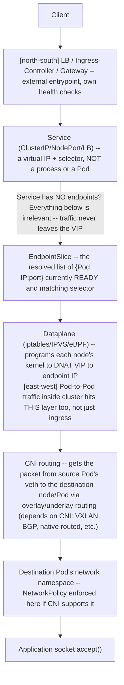
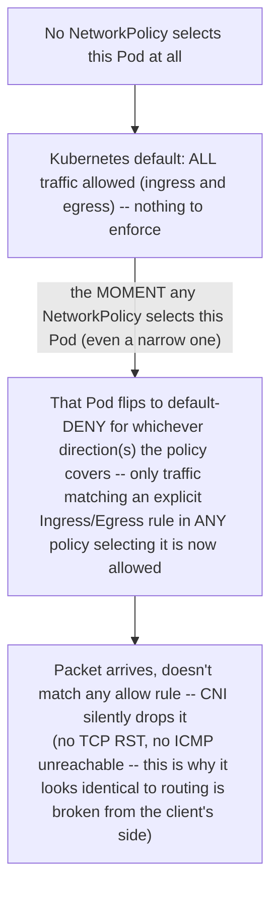

# Chapter 4 — Kubernetes networking from Service to CNI
*(original text preserved in full below; additions marked with ➕ so you can see exactly what changed)*

**Learning outcome:** Trace DNS, Service selection, data plane implementation, CNI routing and NetworkPolicy.


Figure 2. North-south traffic crosses distinct components; prove each stage rather than restarting random Pods.

## 4.1 Service and EndpointSlice

A Service selects backend endpoints, typically represented through EndpointSlices. If a Service has no endpoints, kube-proxy/eBPF rules cannot send traffic to healthy Pods. Check selectors and readiness before debugging lower networking layers.

```
kubectl get svc api -o yaml
kubectl get endpointslice -l kubernetes.io/service-name=api -o wide
kubectl get pods -l app=api -o wide --show-labels
```

➕ **Full traffic path, all layers, drawn once so every later branch has a home:**

➕ **Interview-ready line:** "A Service with zero endpoints is invisible to the dataplane — no packet ever leaves the virtual IP, so checking iptables/eBPF rules before checking `kubectl get endpointslice` is debugging the wrong layer first."

➕ **Sample annotated output — the single most common Service failure mode:**
```bash
$ kubectl get svc api -o yaml | grep -A3 selector
selector
app: api
version: v2 ← Service selects app=api AND version=v2
$ kubectl get pods -l app=api --show-labels
NAME READY STATUS LABELS
api-7d9f-abc 1/1 Running app=api,version=v1 ← v1, doesn't match selector
api-7d9f-def 1/1 Running app=api,version=v1 ← same
$ kubectl get endpointslice -l kubernetes.io/service-name=api -o wide
NAME ADDRESSTYPE PORTS ENDPOINTS
api-x7k2p IPv4 8080 <none> ← ZERO endpoints. Selector matched nothing.
```
A rolling update that changed the `version` label without updating the Service selector (or vice versa) is a classic self-inflicted outage — everything looks "Running," nothing looks "wrong" per-Pod, and the Service is simply talking to an empty set.

➕ **Shortcut — one command that proves selector/endpoint mismatch immediately:**
```bash
kubectl get svc api -o jsonpath='{.spec.selector}' ; echo
kubectl get pods -o jsonpath='{range .items[*]}{.metadata.name}{" "}{.metadata.labels}{"\n"}{end}' -l app=api
```
Diff the Service's selector map against what's actually on the Pods — this catches typos and drift faster than staring at YAML.

## 4.2 Data plane implementation

Depending on the cluster, Service forwarding may be implemented with iptables, IPVS or eBPF. The conceptual contract is stable: virtual Service address maps to eligible endpoints. Your troubleshooting commands should match the implementation rather than memorizing iptables for every environment.

➕ **Match the tool to the dataplane — don't run iptables commands on an eBPF (Cilium) cluster and conclude "no rules exist":**
| Dataplane | Where the mapping lives | How to inspect it |
|---|---|---|
| iptables (legacy kube-proxy) | `iptables -t nat -L KUBE-SERVICES` chains, one DNAT rule per endpoint | `iptables-save \| grep <service-ip>` |
| IPVS | kernel IPVS virtual server table | `ipvsadm -L -n \| grep <service-ip>` |
| eBPF (Cilium, Calico eBPF, kube-proxy replacement) | eBPF maps, not iptables at all | `cilium service list` / `cilium bpf lb list` (tool-specific) |

➕ **Sample annotated output — IPVS, showing the actual weighting/scheduling that iptables' random-jump chains only approximate:**
```bash
$ ipvsadm -L -n | grep -A3 10.96.0.55
TCP 10.96.0.55:8080 rr
> 10.244.1.12:8080 Masq 1 0 142 ← 0 active, 142 inactive (recently closed)
> 10.244.2.9:8080 Masq 1 3 98 ← 3 ACTIVE connections right now
```
`rr` = round-robin scheduler; the per-endpoint weight/active/inactive columns are the actual live load distribution — this is strictly better evidence than iptables counters for "is traffic actually balanced across my Pods," which is a genuinely common customer question for a Solutions Architect to be asked live.

➕ **GPU/AI infra tie-in — why dataplane choice matters more for inference serving than typical web workloads:** long-lived streaming/gRPC connections (common in LLM inference serving with token streaming) sit on a single endpoint for the connection's full duration — round-robin *new-connection* balancing (which is all any of these dataplanes do) means uneven load if connection lifetimes vary wildly, which they do when some requests generate 20 tokens and others generate 4000. This is precisely the gap the Gateway API Inference Extension (referenced later in this volume's Deep Dives) exists to close — ordinary Service load balancing has no concept of "this backend is mid-generation and should not receive a new long request."

## 4.3 DNS, CNI and policy

CoreDNS resolves cluster/service names; the CNI provides Pod interfaces/IP allocation/routing; NetworkPolicy is enforced by capable CNIs. For east-west timeouts, verify name resolution, EndpointSlice, routing and policy independently.

```
kubectl exec -it <pod> -- getent hosts api.default.svc.cluster.local
kubectl exec -it <pod> -- curl -sv http://api:8080/health
kubectl get networkpolicy -A
kubectl -n kube-system get pods -l k8s-app=kube-dns
```

➕ **The independence point matters — DNS success proves less than people assume:**
```text
getent hosts api.default.svc.cluster.local
resolves to a ClusterIP. This ONLY proves CoreDNS answered — it says
NOTHING about whether that ClusterIP has healthy endpoints, whether
the dataplane rule exists, or whether NetworkPolicy allows the packet.
```
➕ **Sample annotated output — DNS resolves, connection still times out (the exact trap the chapter is warning against):**
```bash
$ kubectl exec -it client -- getent hosts api.default.svc.cluster.local
10.96.0.55 api.default.svc.cluster.local ← DNS: fine.
$ kubectl exec -it client -- curl -sv --max-time 3 http://api.default.svc.cluster.local:8080/health
* Trying 10.96.0.55:8080...
* connect to 10.96.0.55 port 8080 failed: Connection timed out ← packet never got a response
```
DNS worked because CoreDNS only needs the Service *object* to exist — it does not check endpoints. The timeout is downstream: either no endpoints (4.1), a dataplane rule problem, or NetworkPolicy silently dropping the packet (silent drop, not a TCP RST, is the normal NetworkPolicy behavior — that's *why* it looks identical to a routing problem from the client side).

➕ **Distinguishing "no endpoints" from "NetworkPolicy dropped it" from "routing is broken" — three commands, three different pictures:**
```bash
kubectl get endpointslice -l kubernetes.io/service-name=api -o wide   # empty list? stop here, it's 4.1.
kubectl get networkpolicy -n default -o yaml                           # a default-deny with no matching allow?
kubectl exec -it client -- curl -sv --max-time 3 http://<pod-ip-direct>:8080/health   # bypass Service entirely
```
If direct Pod-IP curl also times out, NetworkPolicy or CNI routing is implicated, not the Service layer at all — this single substitution (VIP → direct Pod IP) is the fastest way to rule the Service/dataplane layer in or out.

➕ **Diagram: NetworkPolicy's default-allow → default-deny flip, and why the packet just vanishes instead of erroring:**

The trap worth stating explicitly: adding *one* narrow NetworkPolicy to a Pod that previously had none can silently break traffic that used to work, because the Pod just lost its implicit allow-all — this is a much more common self-inflicted outage than a policy being "wrong."

## Practitioner lens
**Vishakha Sadhwani: understand the traffic path**
Her public networking breakdown follows client -> LB -> Gateway/Ingress -> Service -> node rules/eBPF -> CNI -> Pod and an east-west path with CoreDNS and NetworkPolicy. This chapter uses the same path, then teaches what each component contributes and how to prove it.

[Public source](https://www.linkedin.com/in/vsadhwani)

## Worked scenario
**Situation:** Service DNS resolves, but requests from one namespace time out while another namespace works.

1. Compare EndpointSlices: the backend set is common, so namespace-specific failure points toward source policy/path.
2. Inspect NetworkPolicies affecting source and destination namespaces and confirm CNI enforcement semantics.
3. From both namespaces, compare route/connect behavior to Service and direct Pod IP if policy permits testing.
4. Inspect service mesh/sidecar policy if present because mTLS/authz can introduce namespace-specific behavior.
5. Use packet/eBPF observability on nodes only after object-level policy and endpoint evidence is collected.

**Conclusion:** The differential clue—one namespace works—narrows the search toward source identity/policy rather than backend availability.

➕ **Second worked scenario — RDMA/NCCL-relevant networking failure for multi-node GPU training:**
> **Situation:** A multi-node distributed training job (PyTorch DDP, NCCL backend) hangs at initialization. All Pods are `Running`, standard Service/DNS checks (as above) all pass — this traffic doesn't even go through a Service, it's direct Pod-to-Pod.
> 1. NCCL collective operations (allreduce, etc.) establish direct connections between worker Pods using Pod IPs, often over a dedicated high-speed fabric (RoCE/InfiniBand) via SR-IOV or Multus secondary interfaces — **standard cluster-CNI NetworkPolicy and even standard CNI routing may not apply to this secondary interface at all**, which is a very different failure surface than the primary CNI path this chapter covers.
> 2. `NCCL_DEBUG=INFO` on a hung worker's logs — look for `NCCL INFO NET/IB` or `NCCL INFO NET/Socket` lines indicating which transport it actually negotiated; if it silently fell back from InfiniBand to plain TCP sockets over the primary CNI interface, that's a fabric-configuration problem, not a hang.
> 3. Check whether a default-deny NetworkPolicy exists in the training namespace and, critically, whether it accounts for the secondary RDMA/Multus interface at all — many CNI NetworkPolicy implementations only enforce on the primary interface, so this is sometimes a false lead, but must be ruled out explicitly rather than assumed.
> 4. `ibstat` / `rdma link show` on the node (not the Pod) to confirm the fabric device is actually up at the host level before assuming it's a Kubernetes-layer problem at all.
> **Conclusion:** for GPU multi-node training traffic specifically, "check the Service/CNI path" (this chapter's default playbook) is necessary but not sufficient — always ask which physical/virtual interface the collective communication library actually negotiated before assuming the standard K8s networking stack is even in the path.

➕ **Shortcut — the fastest 4-command triage for any "namespace A works, namespace B doesn't" report:**
```bash
kubectl get endpointslice -l kubernetes.io/service-name=<svc> -A -o wide   # same backend set?
kubectl get netpol -n <src-ns> -n <dst-ns> -o yaml                          # any policy scoped to one ns?
kubectl exec -n <ns-that-fails> -it <pod> -- curl -sv --max-time 3 <direct-pod-ip>:<port>
kubectl exec -n <ns-that-works> -it <pod> -- curl -sv --max-time 3 <direct-pod-ip>:<port>
```
➕ **Mnemonic:** *"DNS proves the name. Endpoints prove the backend. Direct-IP proves the path. Policy proves the permission."* — four independent claims, each needing its own evidence; never let one substitute for another.

## Practice
1. Trace a Service request end to end and name one artifact/evidence at each step (Service, EndpointSlice, dataplane rule, CNI route, NetworkPolicy).
2. Explain why a successful DNS resolution provides almost no evidence about connectivity.
3. Given DNS resolving but connections timing out from only one namespace, write the branching diagnosis in order.

➕ 4. Explain why a distributed training job's NCCL/RDMA traffic may bypass the entire Service→CNI→NetworkPolicy stack described in this chapter, and name the node-level (not Pod-level) commands you'd use to verify the fabric independently of Kubernetes networking evidence.
➕ 5. Using the selector/label diff shortcut in 4.1, deliberately break a Service by rolling a Deployment's Pod template labels without updating the Service selector, and confirm you can detect and explain the resulting empty EndpointSlice in under a minute.
