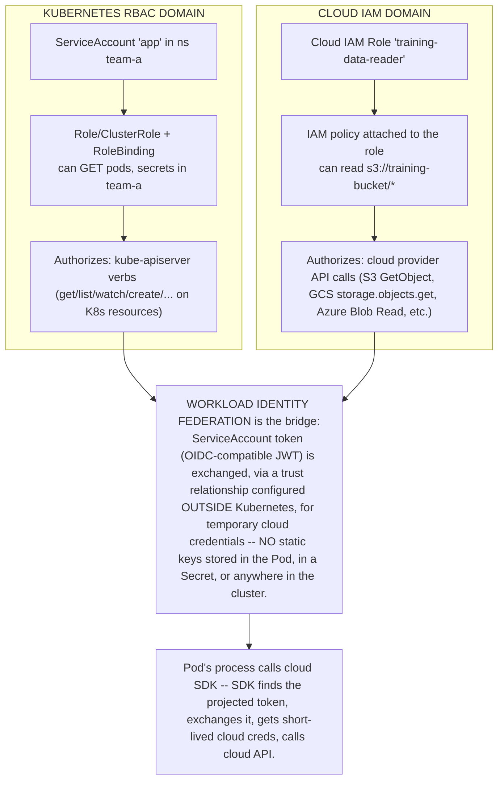
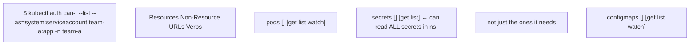
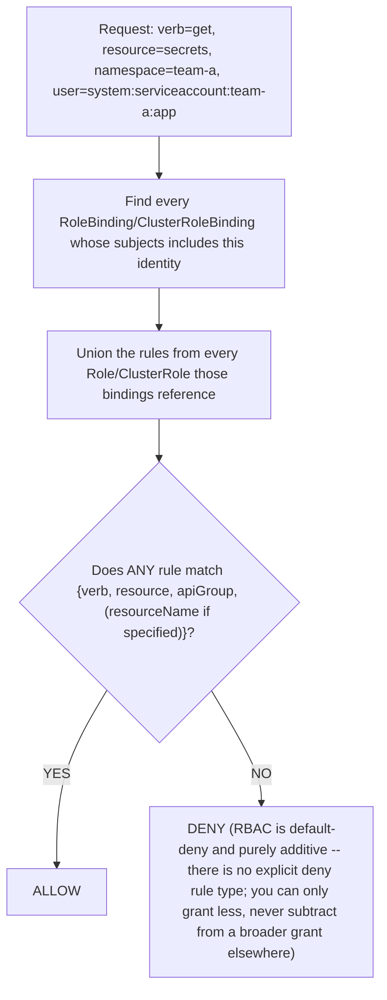
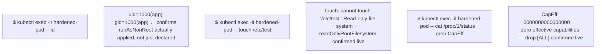

# Chapter 6 — Security: authentication, RBAC, workload identity and Pod hardening
*(original text preserved in full below; additions marked with ➕ so you can see exactly what changed)*

**Learning outcome:** Reason about who can call the API, what they can do, how workloads obtain cloud identity and how container privileges change risk.

## 6.1 RBAC is authorization over API verbs/resources

```
kubectl auth can-i get secrets --as=system:serviceaccount:team-a:app -n team-a
kubectl auth can-i --list --as=system:serviceaccount:team-a:app -n team-a
```

A ServiceAccount identifies a Kubernetes workload to the API. Cloud workload identity mechanisms can map workload identity to cloud IAM without static keys. Keep these trust domains conceptually separate: Kubernetes RBAC authorizes Kubernetes API actions; cloud IAM authorizes cloud APIs.

➕ **The two trust domains, drawn side by side — this diagram is the single highest-value thing to have ready for a security question in this interview:**

➕ **Interview-ready line:** "RBAC and cloud IAM are two separate authorization systems that happen to share an identity via workload identity federation — a ServiceAccount having `cluster-admin` tells you nothing about its cloud permissions, and a wide-open IAM role tells you nothing about its Kubernetes RBAC. Auditing one without the other is an incomplete security review, and it's a common gap I'd specifically call out to a customer."

➕ **Sample annotated output — auditing what a ServiceAccount can actually do, both domains:**

`secrets: [get list]` at namespace scope, not scoped to specific named secrets, is the thing to flag — RBAC has no field-level or name-based secret restriction by default (only via naming patterns encoded into more granular Roles, or an admission policy), so "this ServiceAccount can read secrets" usually means *every* secret in that namespace, including ones unrelated to the workload's actual job. This is the most common RBAC over-grant pattern to catch in a review.

➕ **Shortcut — the fastest way to audit blast radius of a compromised ServiceAccount:**
```bash
kubectl auth can-i --list --as=system:serviceaccount:<ns>:<sa> -A 2>/dev/null | grep -v '^Resources' | awk '{print $NF, $1}' | sort -u
# then check cloud side (example AWS IRSA / EKS pod identity):
kubectl get sa <sa> -n <ns> -o jsonpath='{.metadata.annotations}' | grep -i role-arn
aws iam get-role-policy --role-name <role-from-above> --policy-name <policy>
```
Running both halves together is exactly the "what could an attacker who compromises this one Pod actually do" question a Senior SA is expected to answer end-to-end, not just the Kubernetes half.

➕ **Diagram: the RBAC allow/deny decision itself, from request to verdict:**

The purely-additive property is the thing to state unprompted in a review: if a ServiceAccount is over-granted by one RoleBinding, no *other* RoleBinding can claw that access back — the fix is always to narrow or remove the over-broad grant itself.

## 6.2 Pod security context

```
securityContext:
  runAsNonRoot: true
  allowPrivilegeEscalation: false
  readOnlyRootFilesystem: true
  capabilities:
    drop: ["ALL"]
```

Security settings should derive from workload need. Privileged mode, hostPath, hostNetwork and broad capabilities collapse isolation boundaries. In GPU/HPC environments, device and network access requirements make explicit privilege design especially important.

➕ **Each of these four settings, what it actually blocks, and the failure mode of skipping it:**
| Setting | Blocks | Concrete attack it prevents |
|---|---|---|
| `runAsNonRoot: true` | container process running as UID 0 | root-in-container + any container-breakout bug = root-on-host |
| `allowPrivilegeEscalation: false` | setuid binaries / `no_new_privs` bypass | a compromised process calling a setuid binary to regain root even if it started non-root |
| `readOnlyRootFilesystem: true` | writes to the container's own filesystem | dropping a malicious binary/persisting a backdoor inside the container layer |
| `capabilities: drop: ["ALL"]` | every Linux capability not explicitly re-added | `CAP_SYS_ADMIN`/`CAP_NET_RAW`/etc. abuse — most container escapes need a specific capability, not just root |

➕ **Sample annotated output — proving hardening actually took effect, not just that the YAML exists:**

Declaring `securityContext` in YAML and *verifying* it took effect are different claims — admission policy, a mutating webhook, or a runtime class override can all silently negate a securityContext setting, so the exec-in-and-check pattern above is the actual evidence, not the manifest.

➕ **The GPU/HPC tension the source calls out, made concrete — this is a real, common design conflict:**
```
GPU workload needs:
  - /dev/nvidia0, /dev/nvidiactl, /dev/nvidia-uvm device access (via device
    plugin — does NOT require privileged mode, this part is fine by default)
  - sometimes hostNetwork or hostIPC for NCCL/RDMA multi-node collectives
    (shared memory segments, high-perf interconnect) — THIS is where teams
    are tempted to reach for `privileged: true` as a shortcut
  - sometimes hostPath for driver/library bind-mounts if not using the
    GPU Operator's managed driver container approach
```
➕ **The actual senior answer, not the shortcut:** `privileged: true` grants *all* capabilities and disables most kernel isolation — it is almost never actually required for GPU workloads; the NVIDIA device plugin's device cgroup allocation covers device access, and `hostIPC`/specific added capabilities (e.g. `IPC_LOCK` for RDMA memory pinning) cover the narrower interconnect need without the blanket grant. **Interview-ready line:** "If someone reaches for `privileged: true` to make a GPU or RDMA workload work, that's almost always a sign they haven't identified the actual specific capability or device access needed — the fix is to name the exact capability (`IPC_LOCK`, `SYS_NICE` for some scheduling cases) and add only that, not disable isolation wholesale."

## Worked scenario
➕ **Worked scenario (added — the source didn't include one for this chapter, so this fills the gap the pattern requires):**
> **Situation:** A security review flags a namespace where every Pod runs with `privileged: true`, justified as "needed for GPU access." You have one meeting to either defend or fix this before a customer audit.
> 1. `kubectl get pods -n <ns> -o json | jq '.items[].spec.containers[].securityContext'` — confirm scope: is it every container in every Pod, or did a shared base manifest/Helm chart apply it blanket-wide even to sidecars that don't touch the GPU at all (very common root cause — a values.yaml default, not a deliberate per-workload decision)?
> 2. `kubectl auth can-i --list --as=system:serviceaccount:<ns>:<sa>` for each affected ServiceAccount — privileged Pods often compound with over-broad RBAC, compounding blast radius rather than just isolation failure.
> 3. Test whether the actual GPU access requirement is satisfiable with the device-plugin path (device cgroup, no privileged) plus a narrow capability list instead — reproduce the workload with `capabilities: add: ["IPC_LOCK"]` (for RDMA) and `runAsNonRoot: true`, confirm it still functions.
> 4. Present the fix as a namespace-wide Pod Security Admission label change (`pod-security.kubernetes.io/enforce=restricted` or at minimum `baseline`) plus the narrowed securityContext, not a one-off patch — the audit finding is a pattern, the fix should close the pattern, not one Pod.
> **Conclusion:** "needed for GPU access" is a claim to verify against the actual device-plugin/capability model, not a justification to accept at face value — this is a genuinely realistic customer-facing security conversation for this role.

➕ **Shortcut — namespace-wide Pod Security Admission audit before enforcing anything:**
```bash
kubectl label ns team-a pod-security.kubernetes.io/audit=restricted --dry-run=server
kubectl get events -n team-a --field-selector reason=FailedCreate | grep -i "violates PodSecurity"
```
`audit=` (not `enforce=`) lets you see *what would break* under a stricter policy without actually blocking anything — always run audit before enforce on an existing namespace.

## Practice
1. Explain why a ServiceAccount with broad Kubernetes RBAC could still have zero cloud permissions, and vice versa.
2. Given `securityContext` YAML, write the three `kubectl exec` commands that prove each setting took effect at runtime rather than just existing in the manifest.
3. Argue against `privileged: true` for a GPU workload and name the specific alternative (device plugin + narrow capability) that replaces it.

➕ 4. Audit a real or lab ServiceAccount using the combined RBAC + cloud IAM one-liner above, and write a one-paragraph summary of its actual blast radius if the Pod using it were compromised.
➕ 5. Design the namespace-wide Pod Security Admission rollout plan (audit → warn → enforce) for a namespace currently running `privileged: true` everywhere, including how you'd sequence it to avoid breaking currently-running GPU workloads mid-rollout.
