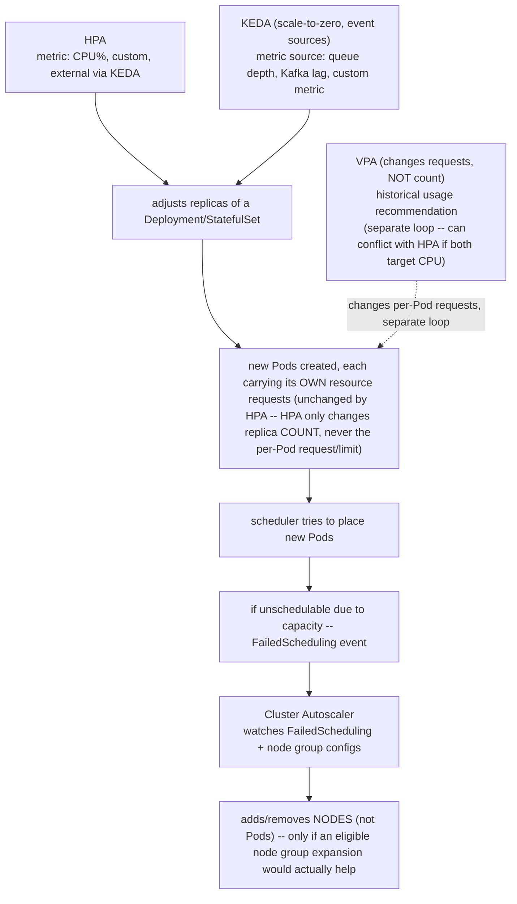
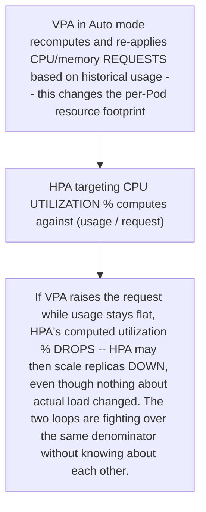
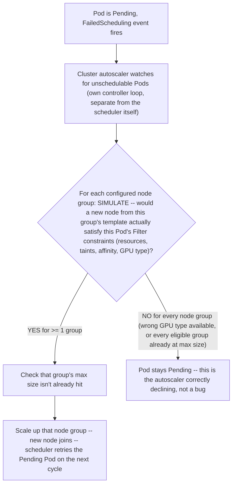

# Chapter 7 — Autoscaling and capacity
*(original text preserved in full below; additions marked with ➕ so you can see exactly what changed)*

**Learning outcome:** Understand HPA/VPA/KEDA signals, cluster autoscaler constraints and why application scaling and node scaling are different loops.

HPA adjusts workload replicas based on metrics; KEDA can translate event/external metrics; VPA recommends or adjusts resource requests depending on mode; cluster autoscaler changes node count when Pods are unschedulable due to capacity and an eligible node group can help. These loops interact through requests and scheduling.

```
kubectl get hpa -A
kubectl describe hpa <name>
kubectl get events --field-selector reason=FailedScheduling
```

➕ **Four independent control loops, drawn together — this is the diagram to reproduce cold in an interview:**

➕ **Interview-ready line:** "There are four loops here, not one — HPA changes replica count, VPA changes per-Pod requests, KEDA changes what triggers HPA, and cluster autoscaler changes node count. They only *look* like one system because they're chained through the scheduler; debugging any one of them by looking at another's metrics is the most common mistake I see."

➕ **The VPA/HPA conflict, made concrete — a known landmine worth naming unprompted:**

Mitigation named in K8s docs and worth stating directly: don't run VPA in `Auto`/`Recreate` update mode on CPU/memory simultaneously with HPA targeting CPU/memory utilization on the *same* workload — either let VPA drive requests and HPA target a custom/external metric instead, or pick one loop per resource dimension.

➕ **Sample annotated output — reading an HPA's actual decision math, not just its output replica count:**
```bash
$ kubectl describe hpa api -n prod
Reference: Deployment/api
Metrics: ( current / target )
resource cpu on pods (as a percentage of request): 78% (390m) / 70%
Min replicas: 5
Max replicas: 30
Current replicas: 12
Desired replicas: 14 ← 12 * (78/70) ≈ 13.4
rounds to 14
Conditions
Type Status Reason
AbleToScale True ReadyForNewScale
ScalingActive True ValidMetricFound
ScalingLimited False (would be True if pinned at Min or Max replicas)
```
The `Desired replicas` math is always `ceil(currentReplicas * currentMetric/targetMetric)`, clamped by a stabilization window (default 0s scale-up, 5 min scale-down in modern versions) to prevent flapping — worth being able to do this arithmetic live, since "why did it scale from 12 to 14 and not straight to 30" is a real question customers ask.

➕ **Diagram: cluster autoscaler's own decision loop, the piece that explains "why didn't it just add a node":**


## Worked scenario
**Situation:** HPA increases replicas from 5 to 20, but 12 Pods remain Pending and cluster autoscaler does not add nodes.

1. Read FailedScheduling reasons. Autoscaler only helps if a node group expansion could make the Pod schedulable.
2. Check node-group max size and cluster resource limits/quotas.
3. Check affinity/taints/topology/PVC/GPU constraints that a new generic node would not solve.
4. Check autoscaler logs/events for "max limit reached" or "no expansion options."
5. Review whether the HPA metric and resource requests produce a feasible scaling model.

**Conclusion:** Application autoscaling can create desired Pods that capacity/autoscaler constraints cannot satisfy.

➕ **Sample annotated output — the specific autoscaler log line that answers step 4 definitively:**
```
$ kubectl -n kube-system logs deploy/cluster-autoscaler --tail=50 | grep -i "api-gpu"
I0130 status: node group gpu-pool-a100 already at max size (8), cannot scale up
I0130 pod api-gpu-7f9x is unschedulable and cannot be helped by scale-up of any
      existing node group: no node group can accommodate the pod's GPU request
      (nvidia.com/gpu: 1) — no GPU node group has available headroom under max size
```
This is the definitive "the autoscaler looked, and correctly declined" evidence — the fix is either raising `gpu-pool-a100`'s max size (a capacity/cost decision, escalate it as such, not as a bug) or admitting the workload genuinely can't scale further on current hardware allocation.

➕ **Second worked scenario — GPU-specific autoscaling deadlock (a very common real pattern in AI infra):**
> **Situation:** An inference service's HPA is configured on a custom metric (GPU utilization via DCGM exporter + Prometheus adapter). Under load, GPU utilization per Pod is pinned at 95%+, but HPA isn't scaling up at all.
> 1. `kubectl describe hpa` shows `metric.status: unknown` or a stale value — the first thing to check with any *custom* metric HPA is whether the metrics pipeline (DCGM exporter → Prometheus → prometheus-adapter → custom metrics API) is actually delivering fresh values, because unlike built-in CPU/memory metrics (always available from the metrics-server), a custom metric pipeline has multiple independent points of failure.
> 2. `kubectl get --raw "/apis/custom.metrics.k8s.io/v1beta1/namespaces/prod/pods/*/gpu_utilization"` — query the custom metrics API directly, bypassing the HPA controller, to isolate whether the pipeline itself is broken vs. the HPA object's configuration.
> 3. Even once metrics flow correctly, if new replicas need `nvidia.com/gpu: 1` and every GPU node group is already at its configured max, the HPA doing its job correctly (desired replicas: 20) simply produces more Pending Pods — the actual bottleneck is capacity, exactly as in the first scenario, just reached via a GPU-native metric instead of CPU.
> 4. The genuinely hard, senior-level part of this conversation: GPU nodes are expensive and slow to provision (driver install, GPU Operator reconciliation, sometimes minutes) compared to CPU nodes — recommend pre-warming a small buffer of idle GPU capacity or using node overprovisioning patterns (e.g. low-priority placeholder Pods that get preempted) rather than relying on reactive scale-up alone for latency-sensitive inference.
> **Conclusion:** GPU-metric HPA has an extra failure surface (the custom metrics pipeline itself) on top of every constraint from the first scenario — verify the metric pipeline independently before assuming the autoscaling logic is at fault.

➕ **Shortcut — the fast triage for "HPA scaled but Pods are stuck":**
```bash
kubectl get hpa <name> -n <ns> -o json | jq '.status.conditions'
kubectl get events -n <ns> --field-selector reason=FailedScheduling --sort-by=.lastTimestamp | tail -5
kubectl -n kube-system logs deploy/cluster-autoscaler --tail=30 | grep -i "$(kubectl get hpa <name> -o jsonpath='{.spec.scaleTargetRef.name}')"
```
➕ **Mnemonic:** *"HPA asks, scheduler judges, autoscaler only helps if judgment can change."* — a scale-up request is a wish; the scheduler's Filter phase (Chapter 2) is the actual arbiter of whether more replicas or more nodes solves anything.

## Practice
1. Explain HPA vs cluster autoscaler to a customer using two separate control loops.
2. Given an HPA's `Metrics` block showing current/target percentages, compute the desired replica count by hand.
3. Explain the VPA/HPA conflict when both target CPU on the same workload, and name the two ways to avoid it.

➕ 4. Diagnose a stuck custom-metric HPA (GPU utilization via DCGM/Prometheus) by querying the custom metrics API directly, independent of the HPA object — explain why this isolates "metrics pipeline broken" from "HPA logic broken."
➕ 5. Propose a concrete node-overprovisioning or pre-warming strategy for a latency-sensitive GPU inference service where reactive cluster-autoscaler scale-up (minutes, due to driver/GPU-Operator readiness) is too slow for the traffic pattern — name the tradeoff (idle GPU cost vs. latency risk) explicitly.
