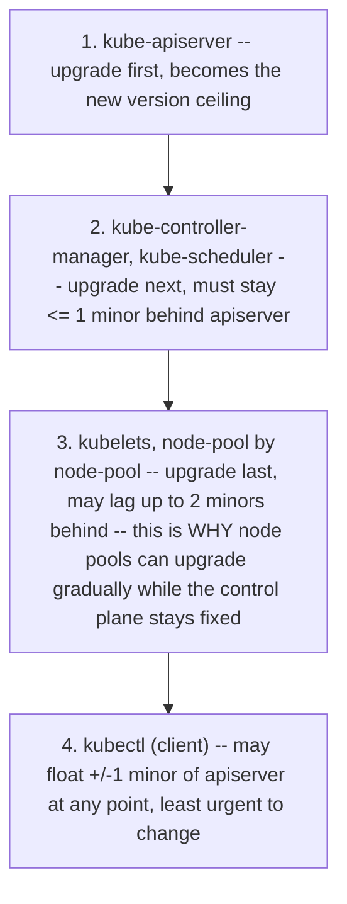
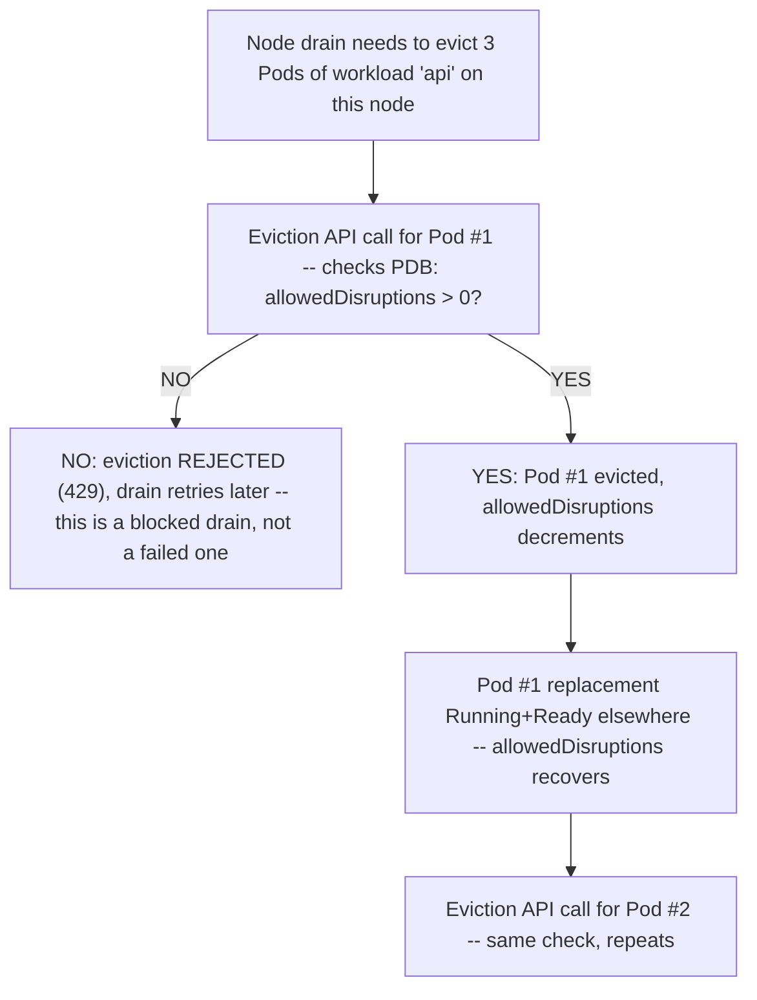
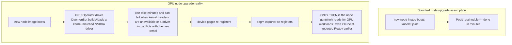

# Chapter 9 — Upgrades, reliability and cluster operations
*(original text preserved in full below; additions marked with ➕ so you can see exactly what changed)*

**Learning outcome:** Plan control-plane/node changes around skew, disruption budgets, workload topology and rollback evidence.

Kubernetes upgrades are distributed-system changes. Managed services hide some control-plane work but not workload disruption, node image/driver compatibility, admission changes, deprecated APIs or GPU/operator compatibility. Inventory versions and APIs before change, define surge/drain strategy, and measure workload health during rollout.

```
kubectl get pdb -A
kubectl get nodes -o wide
kubectl api-resources
kubectl get --raw /readyz?verbose
```

➕ **The version-skew rules, spelled out** (the source says "inventory versions" — this is exactly what that inventory needs to prove compliant):
```
kube-apiserver:          the version ceiling — nothing else may exceed it
kube-controller-manager,
kube-scheduler:          may be up to 1 minor version BEHIND apiserver
kubelet:                 may be up to 2 minor versions BEHIND apiserver (older skew
                         policies allowed up to 3 — always check the policy for the
                         specific release you're on, it has changed over time)
kubectl (client):        may be one minor version behind OR ahead of apiserver
```
➕ **Why this matters beyond trivia:** upgrading kube-apiserver first, then working outward (controller-manager/scheduler, then kubelets, roughly node-pool by node-pool) is the only direction that keeps every component within its allowed skew window throughout the rollout — upgrading kubelets ahead of the control plane is the version-skew mistake that actually breaks things, and it's an easy one to make if node images auto-update independently of the control plane in a managed service.

➕ **Sample annotated output — reading `/readyz?verbose` for what it actually tells you before starting a change:**
```bash
$ kubectl get --raw /readyz?verbose
[+]ping ok
[+]log ok
[+]etcd ok
[+]poststarthook/start-kube-apiserver-admission-initializer ok
[+]poststarthook/generic-apiserver-start-informers ok
[-]poststarthook/rbac/bootstrap-roles failed: reason withheld ← FAILING check, named specifically
[+]shutdown ok
readyz check failed
```
Every line is an independent internal health check, not a single boolean — `readyz check failed` alone tells you nothing; the specific `[-]` line does. This is the same "decompose the aggregate signal into independent evidence" instinct as Chapter 2's multi-reason FailedScheduling event — worth explicitly connecting the two if asked, it's the same interview move applied twice in this volume.

➕ **Diagram: the only safe upgrade order, drawn as a sequence (this is what the version-skew rules above actually force):**

Reversing steps 1 and 3 — upgrading kubelets before the control plane — is the one ordering mistake that actually breaks the skew contract, not a stylistic preference.

➕ **Diagram: PDB gating a drain, the state machine version of the arithmetic below:**

➕ **PodDisruptionBudget, the piece that actually protects workloads during node drains — with the arithmetic that catches teams out:**
```
$ kubectl get pdb -n prod
NAME       MIN AVAILABLE   MAX UNAVAILABLE   ALLOWED DISRUPTIONS   AGE
api-pdb    2                <none>            1                     30d
```
`ALLOWED DISRUPTIONS: 1` means the eviction API will only permit draining **one** matching Pod at a time system-wide right now — if a node drain during an upgrade needs to evict 3 Pods of this workload simultaneously (e.g. 3 Pods happen to land on the same node being upgraded), the drain **blocks** on the 2nd and 3rd until the 1st is Running-and-Ready elsewhere and the PDB's allowed-disruptions count recovers. This is a *feature*, not a stuck drain — but it means "how many replicas, how are they spread across nodes, and what's the PDB" jointly determine your actual upgrade wall-clock time, not just node count.

➕ **GPU-specific upgrade tie-in — why the source explicitly calls out "node image/driver compatibility" and "GPU/operator compatibility":**

➕ **Interview-ready line:** "On a GPU node, `kubectl get nodes` showing `Ready` is necessary but not sufficient — I'd validate with a known-good CUDA smoke-test workload and confirm `nvidia.com/gpu` is actually advertised in allocatable before releasing that node back into a rotation, exactly as Senior Deep Dive 8 recommends. Kubelet readiness and GPU readiness are different claims."

## Practice
1. For a Pending Pod, write a decision tree that starts from Events and ends at the exact violated constraint.
2. Trace a Service request and name one artifact/evidence at each step.
3. Explain HPA vs cluster autoscaler to a customer using two separate control loops.
4. Design a GitOps rollback that preserves audit trail and explain when an emergency imperative change may still be justified.

➕ 5. Given a cluster on version N about to upgrade to N+2 directly, explain why this violates safe practice regardless of managed-service tooling allowing it, and name the version-skew rule it risks breaking for kubelets specifically if the control plane and node pools don't upgrade in lockstep.
➕ 6. Design a GPU-node upgrade validation gate: list the exact sequence of checks (kubelet Ready → driver DaemonSet Ready → device plugin registered → `nvidia.com/gpu` in allocatable → smoke-test workload passes) you'd require before a newly-upgraded GPU node is uncordoned back into the scheduling pool, and explain what could go wrong if any single check is skipped.

## Targeted references

[Kubernetes documentation](https://kubernetes.io/docs/) - Primary API, scheduling, networking, storage, security and operations reference.

[NVIDIA Kubernetes technical blog](https://developer.nvidia.com/blog/tag/kubernetes/) - Current GPU Kubernetes operations, Slurm integration, observability and inference patterns.

[Vishakha Sadhwani public profile/posts](https://www.linkedin.com/in/vsadhwani) - Practitioner signals for platform/networking/GitOps/AI-infra learning paths.

---
## ➕ Going deeper

### Rollback evidence — what to actually capture before you need it
```bash
kubectl rollout history deploy/api -n prod
kubectl get deploy api -n prod -o jsonpath='{.metadata.annotations}' | jq
flux get kustomizations -A -o wide     # if GitOps-managed: the revision SHA is your rollback target
```
➕ **The emergency-imperative-change tension, addressed directly (the last original Practice question, worth a real answer):** a GitOps system's whole value proposition is "Git is authoritative, live edits get reverted" — but during a genuine active incident, waiting for a PR review cycle before mitigating customer impact can be the wrong tradeoff. The senior answer isn't "never break GitOps discipline" or "always break it" — it's: make the emergency change imperatively if speed genuinely matters more than process in that moment, **immediately** open the matching PR to bring Git back in sync with reality (so the GitOps controller doesn't fight your fix on its next reconcile), and treat the gap between the two as a tracked incident-review item, not a silent exception. Naming this tradeoff explicitly, rather than picking a dogmatic absolute, is what the question is actually testing.

### Mnemonic for this whole chapter
*"Skew, budget, topology, evidence — in that order, before you touch anything."* Check version skew rules, check PDBs, check workload topology/spread, and know what `/readyz` and rollout history actually say — all four, before starting any control-plane or node-pool change.
