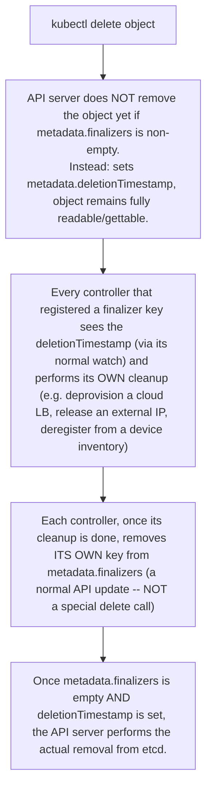

The API server is not only a REST endpoint. It provides optimistic concurrency, versioned storage, watch streams and admission. Controllers list objects, establish a resourceVersion, watch changes and reconcile. Clients must expect watch closure, relist, retries and conflicts. This is why a reliable controller is idempotent and why “event received” is not equivalent to “state changed successfully”.

Finalizers turn deletion into a two-phase operation. A delete request sets deletionTimestamp; controllers that own finalizers perform cleanup and remove their keys; only then can the object disappear. OwnerReferences drive garbage collection. When a namespace or custom resource is stuck Terminating, inspect finalizers and the controller responsible rather than force-deleting first.

**Inspect API state before guessing**

```bash
kubectl get pod mypod -o json | jq '.metadata.resourceVersion,.metadata.finalizers,.metadata.ownerReferences'
kubectl get --raw '/apis/apps/v1/namespaces/default/deployments?limit=5'
kubectl get events --sort-by=.lastTimestamp
```

```text
"223491"
["example.com/cleanup-protection"]
null
```

The three lines of output line up with the three `jq` fields requested: `resourceVersion` is `"223491"` — an opaque string (not a counter you can do arithmetic on) that the API server bumps on every write to that object; clients use it to detect "I read the object at version X, has it changed since?" without a full re-fetch. `finalizers` shows one key, `example.com/cleanup-protection` — if this Pod were deleted, the object would stay visible with `deletionTimestamp` set until whatever controller registered that key removes it (see the two-phase-delete diagram below). `ownerReferences` is `null` here, meaning this specific Pod was created directly rather than by a ReplicaSet/Job/etc. — a Pod owned by a ReplicaSet would show an entry with `controller: true` instead.

`kubectl get --raw` bypasses `kubectl`'s usual object formatting and hits the API path directly — `?limit=5` demonstrates server-side pagination: the response includes a `metadata.continue` token, and a client that ignores it (just reading the first page) will silently miss objects on a large cluster. `kubectl get events --sort-by=.lastTimestamp` orders events chronologically so the most recent state-machine transition (schedule, pull, start, kill, evict) is easy to spot instead of scanning creation order.

## Senior addendum

### Original section preamble *(preserved verbatim)*

**FOURTH EDITION — SENIOR ENGINEERING EXPANSION · VOLUME 3**

**Kubernetes internals, production operations and GPU-aware platform engineering**

This expansion keeps the Fourth Edition teaching flow and adds the depth expected from a senior infrastructure engineer and customer-facing Solutions Architect. The emphasis is mechanism first: understand what the system is doing, observe it with concrete tools, then reason about failure, scale, reliability, performance and trade-offs.

The practitioner material used to shape the scope is a signal, not an authority. Technical behavior is anchored in official documentation and first-principles systems reasoning. Your Staff Engineer study guide contributes useful patterns around Kubernetes, observability, distributed systems, platform design and failure isolation; the NVIDIA material adds GPU systems, AI workloads, accelerated networking and customer architecture.


_Figure A. Most Kubernetes behavior is an API-state transition followed by one or more reconcilers._

➕ **Why Figure A is worth restating as a one-liner before every Deep Dive below:** each of the eight Deep Dives that follows is, mechanically, the same claim applied to a different subsystem — an API-state transition (a write, a delete, a scheduling decision, a device claim) followed by one or more reconcilers (a controller, the scheduler, the kubelet, an operator) making progress toward it. Recognizing that repetition is more valuable than memorizing eight unrelated topics.

### Quick cross-reference (use both halves together, not as duplicates)

| Deep Dive | Extends chapter | What's genuinely new in the Deep Dive vs the chapter |
|---|---|---|
| 1 — API machinery: resourceVersion, watches, finalizers, ownership | Ch1 | finalizer two-phase-delete + OwnerReferences GC mechanics — Ch1 covers resourceVersion/watches in depth already, see below for the finalizer diagram it's missing |
| 2 — etcd quorum, control-plane failure/recovery | new ground | quorum math and the "workloads keep running, nothing new gets scheduled" split — genuinely new, expanded below |
| 3 — Scheduling framework, preemption, gang/topology, DRA | Ch2 | DRA specifically — Ch2 covers Filter/Score/device-plugin/MIG in depth; DRA is newer ground, expanded below |
| 4 — Kubelet, CRI, sandbox, node pressure | Ch3 | node-pressure eviction mechanics specifically — Ch3 covers the CRI pipeline in depth; eviction vs preemption distinction expanded below |
| 5 — Networking: Service, CNI dataplane, DNS, Gateway API | Ch4 | Gateway API Inference Extension — Ch4 covers Service/EndpointSlice/dataplane/DNS in depth; this is genuinely new, expanded below |
| 6 — Admission, policy, multi-tenant guardrails | Ch6 (RBAC) | admission chain position (mutating→validating) + ValidatingAdmissionPolicy vs webhooks tradeoff — new ground, expanded below |
| 7 — Platform patterns from the Staff Engineer guide | Ch8 (Operators/GitOps) | the pattern-to-platform-question table is the valuable content already; see cross-reference note below |
| 8 — GPU platform operations: node pools, operators, isolation | Ch9 (Upgrades) touches this; new ground otherwise | pre-flight/return-to-service checklist — see Ch9's "Going deeper" section, which already builds this out; cross-referenced below |

### Deep Dive 1 — API machinery
➕ **Finalizer two-phase delete, diagrammed** (Chapter 1 already covers this with a worked scenario on a stuck Terminating namespace — see `Volume_03_Chapter_01`; this diagram is the piece that chapter's prose doesn't draw):

➕ **OwnerReferences GC — the companion mechanism, easily confused with finalizers but doing the opposite direction of work:** finalizers **block** deletion of the object that owns them until cleanup finishes; OwnerReferences **cascade** deletion from a parent to its children once the parent is actually gone (garbage-collector controller watches for objects whose owner no longer exists, then deletes them — this is why deleting a Deployment deletes its ReplicaSets deletes its Pods, with no finalizer involved at all in the common case). `kubectl delete deploy api --cascade=orphan` disables exactly this mechanism, for the rare case where you want to keep the children.

Cross-reference: Chapter 1's worked scenario #2 already walks a full stuck-Terminating-namespace diagnosis using this exact mechanism — this diagram is the missing visual, not a new scenario.

➕ **Diagram: OwnerReferences cascading GC — the opposite-direction mechanism, drawn so it's never confused with finalizers again:**
```text
kubectl delete deploy api
Deployment 'api' is deleted from etcd (no finalizer on it blocking this)
Garbage-collector controller's watch notices: ReplicaSet 'api-7d9f' has
an ownerReference pointing at a Deployment that NO LONGER EXISTS
GC controller deletes the orphaned ReplicaSet
Same check cascades: Pods owned by that ReplicaSet are now orphaned too
GC controller deletes the Pods
```
Finalizers block deletion of the object that holds them until cleanup finishes; OwnerReferences GC deletes children only *after* the parent is already gone — two mechanisms running in opposite temporal order, which is exactly why `--cascade=orphan` (skip this diagram's flow entirely) and a stuck finalizer (block the flow above this diagram) are easy to conflate under pressure but are different failures.
