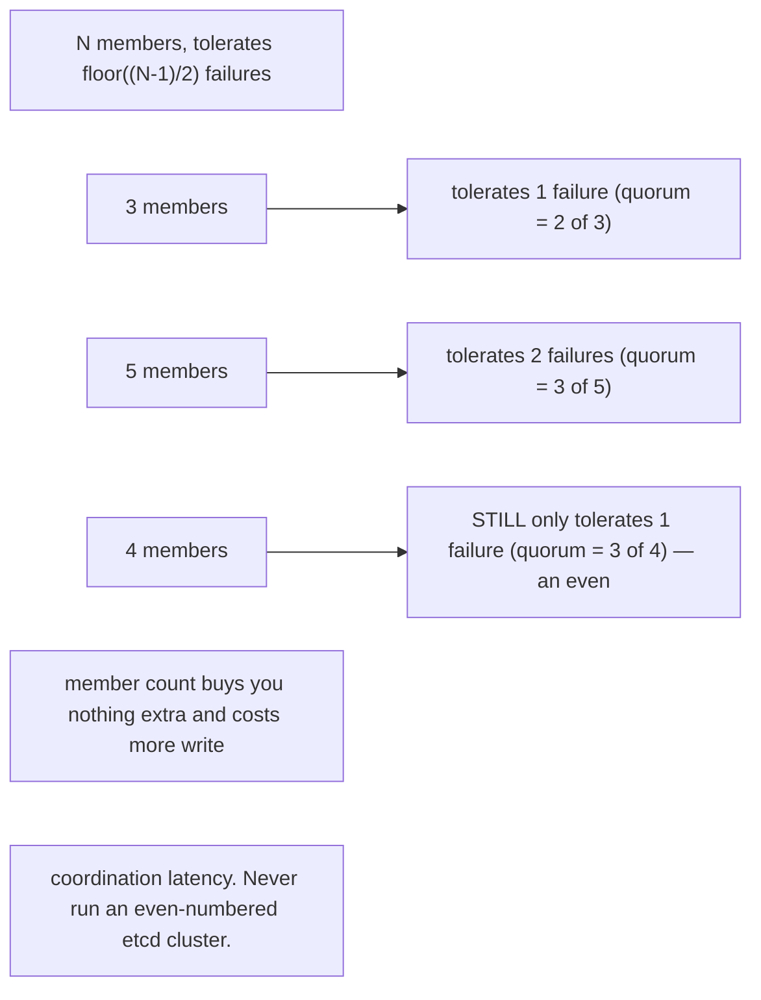
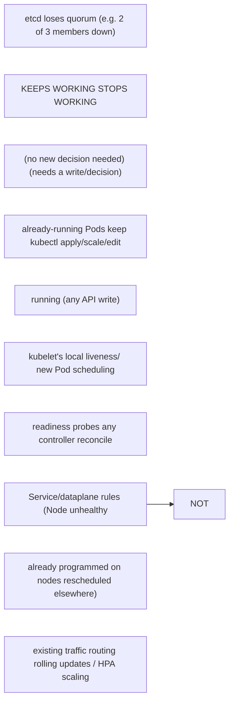

etcd provides strongly consistent storage using quorum. A three-member cluster tolerates one member failure; a five-member cluster tolerates two, at greater write coordination cost. Losing quorum is different from losing one API server. Running workloads can continue when the control plane is unavailable, but new scheduling, reconciliation and API-driven changes stop progressing.

<!-- source-table:1 -->

| Symptom | Control-plane hypothesis | Evidence |
| --- | --- | --- |
| kubectl times out, Pods keep serving | API/LB/control plane unavailable | API health, apiserver logs, LB endpoints |
| Reads work, writes stall | etcd latency/quorum or admission dependency | etcd metrics, apiserver request latency |
| Objects revert or controllers flap | multiple reconcilers or bad desired state | managedFields, events, GitOps/controller logs |
| Namespace stuck deleting | finalizer/controller unavailable | namespace conditions, finalizers, APIService health |

## Senior addendum

### Deep Dive 2 — etcd quorum and control-plane failure boundaries
➕ **Quorum math, made concrete (the table already given is good; this is the arithmetic behind it):**

➕ **The split that matters most in this Deep Dive, worth stating as its own sentence:** "control plane unavailable" and "workloads unavailable" are different failure domains — a kubelet that's already been told to run a Pod keeps running it, keeps executing liveness/readiness probes locally, and keeps serving traffic through existing Service endpoint rules with zero apiserver involvement, for as long as the node itself is healthy. What actually stops the moment etcd loses quorum: new scheduling, any object write (so `kubectl apply`/`scale`/rolling updates all fail), reconciliation of every controller (so a Node going unhealthy right now would NOT get its Pods rescheduled elsewhere — that decision itself requires a write). This is the single most valuable "sounds like a paradox but isn't" fact in this Deep Dive: total control-plane outage + healthy running workloads simultaneously is completely consistent behavior, not a contradiction.

➕ **Interview-ready line:** "Losing etcd quorum doesn't turn the cluster off — it turns the cluster's ability to *change* off. Already-running Pods on healthy nodes keep serving traffic; what stops is anything that requires a new decision: scheduling, reconciliation, or any API write."

➕ **Diagram: the split, drawn as two columns so "paradox" stops feeling like one:**

