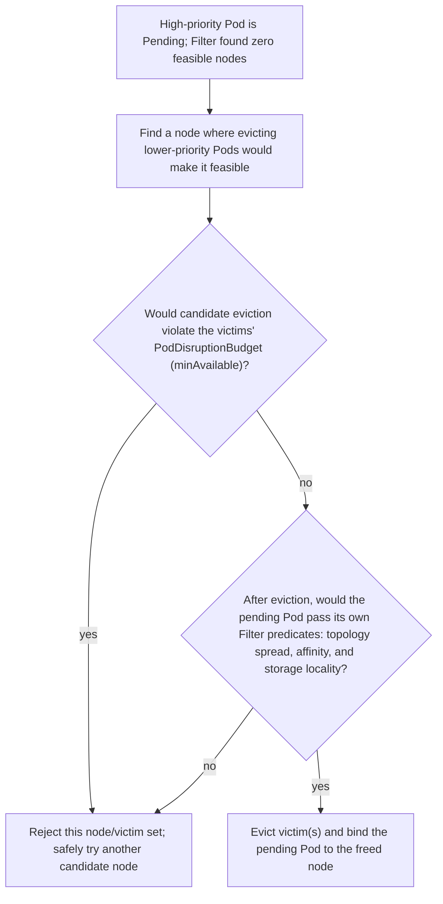

_Figure B. Specialized hardware placement is a multi-stage scheduling and allocation problem._

The scheduler first establishes feasible nodes, then scores them. Requests, node selectors/affinity, taints, topology spread, inter-pod affinity, storage constraints and plugin-specific resources all participate. Priority affects queue order and can trigger preemption, but preemption is not a general capacity-management strategy; PodDisruptionBudgets and topology constraints can prevent the expected victim set from making the Pod schedulable.

Dynamic Resource Allocation (DRA) is now a key concept for accelerators. Core DRA APIs graduated to GA in Kubernetes 1.34. Instead of expressing only an integer extended resource, workloads can request devices through structured resource claims and device classes, enabling richer matching and allocation semantics for GPUs and other hardware. A senior GPU-platform engineer should understand both the traditional device-plugin path and DRA because clusters will contain both during transition periods.

**Scheduling: prove which constraint eliminates nodes**

\# Scheduling evidence for a Pending Pod
kubectl describe pod &lt;pod>
kubectl get pod &lt;pod> -o json | jq '.status.conditions,.spec.priorityClassName'
kubectl get nodes -o custom-columns=NAME:.metadata.name,GPU:.status.allocatable.nvidia\\.com/gpu
kubectl get events --field-selector involvedObject.name=&lt;pod> --sort-by=.lastTimestamp

# DRA resources on clusters that support them
kubectl api-resources | grep -Ei 'resourceclaim|deviceclass'

## Senior addendum

### Deep Dive 3 — Scheduling framework, preemption, gang/topology and DRA
*(Filter/Score mechanics, taints/affinity, and the traditional device-plugin/MIG path are covered in depth in Chapter 2 — this section focuses on what's genuinely new: preemption's actual limits, and DRA.)*

➕ **Preemption is not a capacity strategy — why, concretely:** a higher-priority Pending Pod triggers the scheduler to look for lower-priority victim Pods it could evict to make room. But eviction still has to satisfy the victim's own PDB (won't evict below `minAvailable`), and the resulting empty capacity still has to pass the *same* Filter predicates (topology spread, affinity, storage locality) the original Pod would have needed anyway. If the cluster is full of Pods that are themselves protected by tight PDBs, or the only "victims" are on nodes with the wrong topology label, priority alone accomplishes nothing — this is why the original Deep Dive text explicitly separates "priority affects queue order and can trigger preemption" from "preemption is not a general capacity-management strategy." **Interview-ready line:** "Priority gets you to the front of the queue; it doesn't manufacture capacity that respects every other constraint already on the cluster."

➕ **Diagram: preemption's actual decision sequence — every gate it has to clear before a victim is actually evicted:**

If every candidate node fails one of these two gates, preemption accomplishes nothing regardless of how high the Pod's priority is — priority only affects which Pod gets to *attempt* this sequence, not whether the sequence succeeds.

➕ **DRA (Dynamic Resource Allocation) — the concept genuinely new to this volume, worth building out since it's GA as of 1.34 and squarely in the "advanced" bar of the JD:**
```text
TRADITIONAL DEVICE PLUGIN PATH (Chapter 2)
Pod requests an INTEGER extended resource: nvidia.com/gpu: 1
Scheduler does simple arithmetic: allocatable - allocated >= requested?
No expressiveness beyond 'give me N of resource X' — MIG works by
inventing new resource NAMES (nvidia.com/mig-1g.5gb) as a workaround.
DRA PATH (newer, GA in 1.34)
ResourceClaim — a namespaced object: 'I need a device matching these
structured selectors' (e.g. specific GPU model, min
memory, specific interconnect topology, MIG profile,
or even a whole-node exclusive claim)
DeviceClass — cluster-scoped: defines a category/pool of devices
and the driver responsible for satisfying claims
against it (analogous to StorageClass, but for
arbitrary hardware, not just storage)
ResourceClaimTemplate — lets a Pod template generate a fresh
ResourceClaim per replica, instead of every replica
needing a hand-authored claim
A DRA-aware driver (vendor-supplied, e.g. an NVIDIA DRA driver)
performs the actual allocation decision — richer matching logic
than the scheduler's simple integer arithmetic, e.g. 'give me 2 GPUs
with NVLink between them' as an explicit, structured request instead
of hoping topology spread constraints happen to produce that.
```
➕ **Why this matters for an interview about this specific job:** DRA exists because the device-plugin model's expressiveness ceiling was reached first and hardest by GPUs — needing topology-aware multi-GPU allocation (NVLink-connected pairs, specific MIG profiles, exclusive vs shared access modes) is exactly the kind of requirement that motivated DRA's design. Expect clusters in the field to run *both* models during a multi-year transition — `kubectl api-resources | grep -Ei 'resourceclaim|deviceclass'` is the one-line check for whether a given cluster has DRA resources registered at all before assuming either model.

➕ **Sample check — telling the two paths apart on a real cluster:**
```bash
$ kubectl api-resources | grep -Ei 'resourceclaim|deviceclass'
resourceclaims                 resource.k8s.io/v1beta1               true         ResourceClaim
deviceclasses                  resource.k8s.io/v1beta1               false        DeviceClass
```
Presence of these types doesn't mean every GPU workload uses DRA — check whether Pods actually reference a `resourceClaims:` field in `spec` vs the classic `resources.limits."nvidia.com/gpu"` to know which path a specific workload is on.
