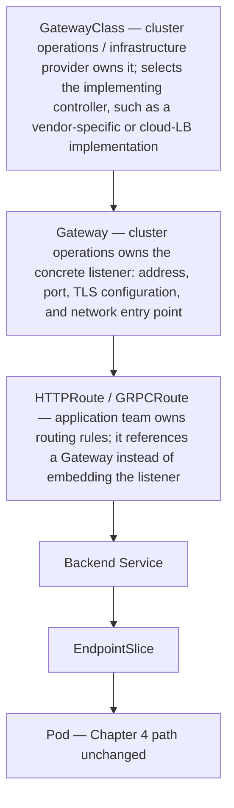

Trace north-south and east-west traffic explicitly. A Service is an API abstraction over endpoints; implementation may use iptables, IPVS or eBPF depending on the dataplane. CNI configures Pod interfaces and routing; CoreDNS implements service discovery; NetworkPolicy is enforced by the chosen network plugin. A service-mesh proxy adds another hop and another failure domain.

**Network triage follows the actual packet path**

```bash
# Service -> EndpointSlice -> Pod
kubectl get svc mysvc -o yaml
kubectl get endpointslice -l kubernetes.io/service-name=mysvc -o yaml
kubectl get pod -l app=myapp -o wide

# DNS from inside the workload namespace
kubectl exec deploy/client -- cat /etc/resolv.conf
kubectl exec deploy/client -- getent hosts mysvc.default.svc.cluster.local

# Node dataplane - varies by CNI/proxy implementation
ip route
ip neigh
nft list ruleset | head -100
```

```text
$ kubectl get endpointslice -l kubernetes.io/service-name=mysvc -o yaml
endpoints:
- addresses: ["10.244.1.7"]
  conditions: {ready: true, serving: true, terminating: false}
  targetRef: {kind: Pod, name: myapp-7d9f-abcde}

$ kubectl exec deploy/client -- getent hosts mysvc.default.svc.cluster.local
10.96.11.4      mysvc.default.svc.cluster.local
```

The EndpointSlice is the ground truth for "does the Service actually have somewhere to send traffic" — a Service with correct selectors but zero `ready: true` addresses here means the problem is upstream (Pod not passing readiness), not in the Service/networking layer at all; `terminating: false` matters because a draining Pod stays listed briefly with `terminating: true` so in-flight connections finish. `ip route` / `ip neigh` show the node's own routing table and ARP/neighbor cache — useful for confirming a Pod's overlay/underlay route actually exists on this specific node, since CNI misconfiguration is often per-node, not cluster-wide. `nft list ruleset | head -100` dumps the nftables rules a kube-proxy (or eBPF equivalent) has programmed for Service DNAT; `head -100` caps the output since a cluster with many Services can generate thousands of rule lines. `getent hosts` resolves the same way the application inside the container would, confirming CoreDNS is both reachable and returning the expected ClusterIP — if this fails but `kubectl get svc` shows a ClusterIP, the fault is in DNS, not the Service object itself.

Gateway API is replacing many ad-hoc Ingress patterns with a more expressive role-oriented model. AI inference adds model-aware routing concerns such as cache locality, request criticality and token-aware metrics; the Gateway API Inference Extension exists because ordinary HTTP round-robin is often insufficient for long-running, stateful-ish LLM serving requests.

## Senior addendum

### Deep Dive 5 — Networking: Service, CNI dataplane, DNS, Gateway API
*(Service→EndpointSlice→dataplane→CNI→NetworkPolicy tracing is covered in depth, with worked scenarios, in Chapter 4. This section is Gateway API + the Inference Extension, which is genuinely new and squarely relevant to the job.)*

➕ **Why Gateway API exists, in one sentence:** Ingress's API was a lowest-common-denominator design (a handful of annotations carrying most of the real configuration, vendor-specific and non-portable); Gateway API splits the role into `GatewayClass` (infra provider config), `Gateway` (a listener/address, owned by cluster-ops), and `HTTPRoute`/`GRPCRoute`/etc. (routing rules, owned by app teams) — a deliberate role separation matching how platform teams and app teams actually divide responsibility, which Ingress's flat object never modeled.

➕ **Diagram: Gateway API's role split, and who owns each layer:**

This role split is the actual improvement over Ingress: an app team can ship an `HTTPRoute` change without touching the `Gateway` object cluster-ops owns, whereas Ingress's flat object made "which annotation does what" a single shared surface everyone had to coordinate on.

➕ **Gateway API Inference Extension — why plain HTTP load balancing is insufficient for LLM serving (the concrete mechanism, since the original text names the problem but not the mechanism):**
```
Ordinary Service/Ingress load balancing: round-robin or least-connection
over NEW connections/requests. Every request treated as equal-cost.

LLM inference reality:
  - request cost is wildly variable: 20-token completion vs 4000-token
    completion can differ by 100x+ in GPU-time cost
  - KV-cache locality: a request that's a continuation/related to a
    prior request may be MUCH cheaper if routed to a backend that
    already has relevant cache state warm (prefix caching)
  - a backend "at 50% CPU" tells you nothing about whether it has
    headroom to accept another long-generation request — the actual
    scarce resource is GPU memory/KV-cache slots, not CPU
```
The Inference Extension adds inference-aware routing signals (e.g. queue depth/criticality-aware scheduling, endpoint picker extensibility for cache-aware routing) at the Gateway layer specifically so routing decisions can account for these AI-specific costs instead of treating every HTTP request as fungible — directly connects to this volume's Chapter 4 aside about NCCL/streaming connections, but at the ingress/request-routing layer rather than the collective-communication layer.

➕ **Interview-ready line:** "Standard Kubernetes load balancing was designed for stateless, roughly-equal-cost HTTP requests. LLM inference violates both assumptions — request cost varies by orders of magnitude and cache locality matters — which is exactly the gap Gateway API's Inference Extension is closing at the routing layer."
